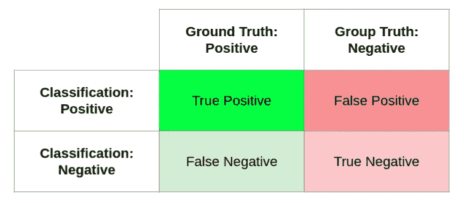
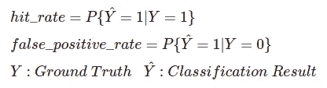
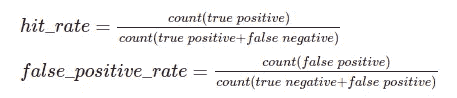
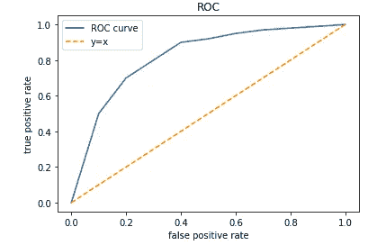
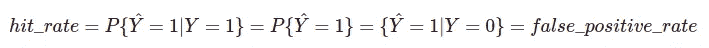
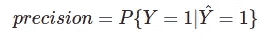
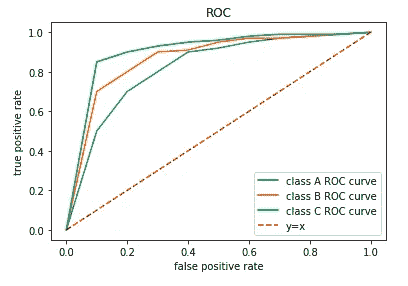

# 在机器学习中你需要知道的关于接收机工作特性(ROC)曲线的一切

> 原文：<https://levelup.gitconnected.com/everything-you-need-to-know-about-receiver-operating-characteristic-roc-curve-in-machine-learning-5191aecde751>

关于 ROC 曲线的定义、解释、限制、计算复杂性和多类扩展的深入讨论。

> **背景**

受试者操作特性曲线，简称 ROC 曲线，是一种衡量和可视化分类器性能的机制。我们希望分类器识别尽可能多的相关例子。但同时，我们也不希望它产生太多的误报。ROC 曲线描绘了命中率和假阳性率之间的关系以揭示折衷。我们将在这篇博文中详细探讨这个问题。术语插曲:命中率有其他的名字:真正的肯定率，回忆，和敏感性。但在这篇博文中，我们将坚持使用点击率。

> **了解 ROC 曲线的成分**

分类结果和基础事实的可能组合可以用下面的混淆矩阵(或列联表)来表示。



混淆矩阵

命中率由所有真实阳性中的真实阳性的比率来定义。换句话说，在所有真正相关的例子中，分类器成功识别了多少？假阳性率被定义为基于真阴性的错误比率。换句话说，在所有真正不相关的例子中，分类器错误地击中了多少个。在数学上，它们可以表示为条件概率:



条件概率中的定义

我们可以通过计算落入混淆矩阵的四个单元中的例子来估计概率。



估计公式

条件概率形式的定义为理解命中率和假阳性率提供了许多有用的视角。

例如，由于命中率和假阳性率取决于各自的基本事实标签，因此它们对于数据集中的类分布变化是不变的。因此，它们是反映分类器内在质量的良好度量。你可以通过随机抽样各种真实标签分布组合的测试数据集来测试。所得的命中率和假阳性率在所有那些采样的测试数据集中是相同的，只有由随机采样引入的微小差异。

此外，从条件概率公式中也可以清楚地看出，命中率和误报率加起来不等于 1。由于公式中的基本事实分母，将它们相乘或相除并不能提供任何直接有用的见解。

> **绘制 ROC 曲线**

为了绘制 ROC 曲线，我们需要理解分类是如何工作的。对于大多数分类器，通常有一个阈值，我们可以调整决策边界。例如，在逻辑回归中，分类器将产生一个介于 0 和 1 之间的值。阈值(在逻辑回归中通常为 0.5)是分类器划线的地方。生产值高于阈值的示例将被分类为正，否则为负。改变阈值会影响命中率和假阳性率。因为分类器越积极地尝试找到所有相关的例子，假阳性的风险就越高。相反，分类者越是试图避免说出相关的例子，错误分类负面例子的机会就越低。

给定一个数据集，有一个阈值范围，我们将使用上面的估计公式得到一组相应的命中率和假阳性率对。然后我们可以绘制 ROC 图，x 轴为假阳性率，y 轴为命中率。请参见下图。



ROC 曲线图解

为了清楚起见，ROC 曲线上的每个点都是具有不同阈值的相同分类器。

> **了解 ROC 曲线**

让我们仔细看看，了解图表上的内容。`y=x`线是分类器只是随机猜测的时候。要了解为什么会出现这种情况，请考虑命中率和假阳性率的条件概率定义。随机猜测意味着分类结果独立于基本事实标签。在这种情况下，命中率等于假阳性率。



y=x 证明

点`(0,0)`是分类器永远不会有任何假阳性的地方，因为它无论如何也不会调出任何阳性的例子。这就像是一个完全无声的分类器。相反地，点`(1,1)`是分类器为所有的例子点火的地方，达到 100%的命中率，但是也得到 100%的假阳性率，因为它把所有的负面例子误分类为正面。

现在，直觉上，我们希望我们的分类器的 ROC 曲线在`y=x`线之上。这意味着在相同的假阳性率下，分类器具有良好的命中率。或者对称地，在相同的命中率下，分类器具有更少的假阳性。显然，`(0,1)`是理论理想之所在。

另一方面，ROC 曲线低于`y=x`的分类器可能看起来比随机猜测差。但是我们实际上可以把它翻转过来——把它的分类正面视为负面，反之亦然——使它比随机猜测更好。当然，在这种情况下，更重要的是调查为什么分类器会得出与基本事实相反的结论。这通常是由于代码中的错误造成的。

为了比较分类器的性能，我们通常使用曲线下面积(AUC)作为单一指标。AUC 越大，性能越好。然而，当把它应用到现实世界的场景中时，我们需要考虑错误的代价。在某些情况下，低命中率的代价要高得多，例如在疾病检测中。在其他情况下，高假阳性率可能更具破坏性。我们应该根据具体的用例来选择最大化期望回报的阈值。

> **ROC 曲线的限制**

在许多情况下，ROC 曲线是一个很好的性能指标。但是它不一定揭示分类器的精度。精确度被定义为在所有分类的阳性中，有多少是真正的阳性。就条件概率而言，其公式如下



精度定义

在遗漏一些相关的例子没什么问题，但是我们希望对分类的阳性结果有很高的置信度的情况下，精度是有用的。

要了解为什么 ROC 在这种情况下不是首选，请考虑一个基本事实很少的数据集。一个分类器可以通过将基础真值阳性的超集分类为阳性来实现高命中率和低假阳性率(接近理想的`(0,1)`点)——假设超集的基数是基础真值阳性的两倍。命中率是 100%，因为它成功地识别了所有的地面真相阳性。尽管存在过多的假阳性，但由于数据集中压倒性数量的地面真阴性(假阳性率的分母)，假阳性率仍然很低。然而，这种情况下的精度只有 50%。

> **计算复杂度**

ROC 曲线是具有不同阈值的相同分类器。您可能认为，为了获得命中率和假阳性率对来绘制曲线，我们必须对测试数据运行多次分类器，每次都使用不同的阈值。在那种情况下，计算复杂度将是`m*n*O(classifier)`。`m`是门槛的数量。`n`是例数。`O(classifier)`是对一个例子进行分类的复杂性，这在许多基于现代深度神经网络的模型中是非常昂贵的。

实际上有一种更有效的方法。请注意，分类器在应用阈值之前生成的值不会改变。所以没有必要对例子重新进行分类。只需对所有示例运行一次分类器，并按降序对输出值进行排序。其计算复杂度为`n*O(classifier)+nlog(n)`。然后，我们只需要一次线性扫描来绘制 ROC 曲线。在扫描过程中，我们跟踪命中率和假阳性率。让我们用逻辑回归作为说明的例子。输出值将全部在[0，1]范围内。如果阈值大于或等于输出值，则分类器将示例分类为肯定的。有关线性扫描算法，请参见以下 Python 代码片段:

```
hit = 0.
false_positive = 0.
n = len(output_values)
roc = []# output_values is sorted in descending order.
for i, v in enumerate(output_values):
    # Assuming threshold == v, then the ith example will be 
    # classified as positive, because the example is classifier
    # positive when threshold >= v.
    if label(i) == POSITIVE:
        hit += 1
    else:
        false_positive += 1
    roc.append((false_positive/n, hit/n))
```

这里的关键见解是，由于输出值按降序排序，从左向右移动阈值不会改变之前遇到的示例的分类-当一个示例被分类为肯定时，当我们降低阈值时，它仍然是肯定的分类。因此，我们可以简单地在线性扫描中不断累积命中和假阳性计数。整体综合体是`n*O(classifier)+nlog(n)+n`。当`O(classifier)`是重的部分时，这个算法更有效。

> **扩展到多个类**

到目前为止，我们一直假设标签中只有两个类。实际上，ROC 曲线主要是为二元分类设计的。当我们有两个以上的类时，我们通常为每个类构建一个 vs 其余的对，并绘制相应的 ROC 曲线。举一个具体的例子，多类分类器通常使用 softmax 来生成概率数组。数组中的`ith`值对应于`ith`类的概率。对于任何类别`i`，我们可以通过改变`ith`值的阈值来绘制其 ROC 曲线。如果`ith`值大于或等于阈值，则该示例被分类为类别`i`(正)。否则归类为其他(负面)。有了这样的结构，我们回到我们的二元分类，在这里可以创建 ROC 曲线。请参见下图进行说明。



多级 ROC 曲线

我们还需要发展 AUC 指标，因为我们不再只处理一条 ROC 曲线。有[项研究](http://citeseerx.ist.psu.edu/viewdoc/download?doi=10.1.1.108.3250&rep=rep1&type=pdf)被用来评估地表下的体积(VUS)和一些在计算上更易处理的近似值。我们没有时间讨论细节。我个人的观点是，如果一个指标变得难以计算和理解，那么它可能不再是解决问题的好指标。我们应该寻找替代方案。例如， [ImageNet](https://www.image-net.org/) 正在评估前 1 名和前 5 名准确度的分类器，尽管它的类别分布是不平衡的——有许多类别只有很少的例子。

> **总结**

今天就到此为止。我计划在不久的将来写一些与 ML 相关的博客文章。所以，希望下次能见到你。