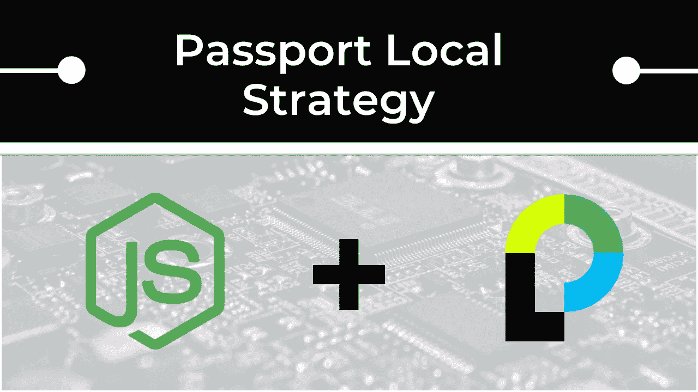
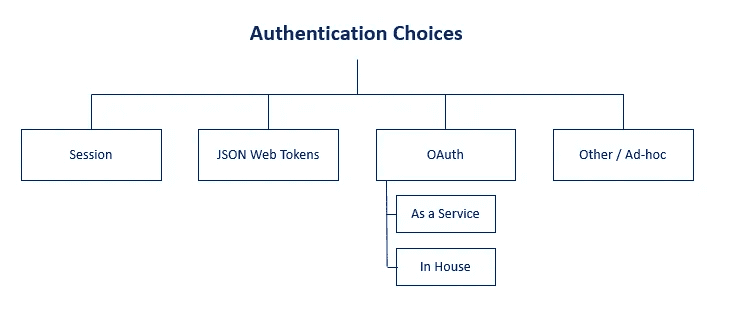

# 关于“护照-当地”护照 JS 策略，您需要了解的一切

> 原文：<https://levelup.gitconnected.com/everything-you-need-to-know-about-the-passport-local-passport-js-strategy-633bbab6195>



在这篇文章中，我将介绍为什么对于实施 Node/Express web 应用程序的小型团队和初创公司来说,`passport-local`身份验证策略是一个简单、安全的解决方案。

这篇文章与我关于`passport-jwt`策略和[的文章紧密相关，你可以在这里找到。](https://medium.com/@zach.gollwitzer/everything-you-need-to-know-about-the-passport-jwt-passport-js-strategy-8b69f39014b0)

为了帮助你完成这篇文章，我用这里的所有代码创建了一个 Github Repo:[基于会话的授权报告](https://github.com/zachgoll/express-session-authentication-starter)

# 目录

*   [认证选择](#4e42)
*   [什么是基于会话的认证？](#9732)
*   [HTTP 头](#7948)
*   [cookie 的工作原理](#76f6)
*   [现实中的这种情况](#0558)
*   [会话如何工作](#bfbd)
*   [快速复习快速中间件](#9406)
*   [快速会话中间件如何工作](#1334)
*   [Passport JS 本地策略如何工作](#ded8)
*   [基于会话的认证的概念概述](#d9fe)
*   [基于会话的认证实现](#aff2)
*   [回顾和预览](#c0b8)

# 认证选择



您的身份验证选择

以上是对当今开发人员可用的主要身份验证选择的高级概述。以下是对每一项的快速概述:

*   基于会话的身份验证—利用浏览器 Cookies 和后端“会话”来管理登录和注销的用户。
*   JWT 认证——一种无状态认证方法，其中 JSON Web 令牌(JWT)存储在浏览器中(通常是`localStorage`)。该 JWT 具有关于用户的断言，并且只能使用存储在服务器上的秘密来解码。
*   OAuth 和 OpenID 连接身份验证—一种现代身份验证方法，其中应用程序使用其他应用程序生成的“声明”来验证自己的用户。换句话说，这是联合身份验证，其中现有的服务(如 Google)处理用户的身份验证和存储，而您的应用程序利用这个流程来验证用户。

我要注意的一点是——Oauth 很快就会变得令人困惑，因此在这篇文章中没有对它进行全面的探讨。对于一个小团队/初创公司来说，不仅没有必要开发一个应用程序，而且根据你使用的服务(如谷歌、脸书、Github 等)的不同，它也会略有不同。).

最后，您可能会注意到 OAuth 被列为“作为服务”和“内部”。这是一个特别的注释，用来强调这样一个事实:实际上有一家名为“OAuth”的公司将 OAuth 协议实现为一项服务。不使用 OAuth 公司的服务也可以实现 OAuth 协议！

# 什么是基于会话的身份验证？

如果我们要为这些身份验证方法创建一个谱系，基于会话的身份验证将是其中最古老的，但肯定不会过时。基于会话的身份验证是`passport-local`策略的基础。这种身份验证方法是“服务器端的”，这意味着我们的 Express 应用程序和数据库协同工作，以保持访问我们应用程序的每个用户的当前身份验证状态。

要理解基于会话的身份验证的基本原则，您需要理解几个概念:

*   基本 HTTP 报头协议
*   什么是饼干
*   什么是会话
*   会话(服务器)和 cookie(浏览器)如何交互来验证用户

# HTTP 标题

有许多方法可以在浏览器中发出 HTTP 请求。HTTP 客户端可以是 web 应用程序、物联网设备、命令行(curl)或许多其他东西。每个客户端都连接到互联网并发出 HTTP 请求，这些请求要么获取数据(GET)，要么修改数据(POST、PUT、DELETE 等)。).

出于解释的目的，我们假设:

服务器=[www.google.com](http://www.google.com/)

当咖啡店里的那个随机的人在他们的 Google Chrome 浏览器中输入`www.google.com`时，这个请求将会以“HTTP 头”的形式发送。这些 HTTP 头是键:值对，为浏览器提供额外的数据来帮助完成请求。该请求将有两种类型的报头:

1.  常规标题
2.  请求标题

为了让这个互动，打开谷歌浏览器，打开你的开发者工具(右击“Inspect”)，点击“网络”标签。现在，在地址栏中输入`www.google.com`,观察网络选项卡从服务器加载几个资源。您应该会看到几列，如名称、状态、类型、启动器、大小、时间和瀑布。找到“文档”作为“类型”值的请求，并单击它。您应该会看到这个请求和响应交互的所有头。

您(作为客户端)发出的请求将具有类似于(但不完全是)以下内容的一般和请求标头:

```
General Headers
  Request URL: https://www.google.com/
  Request Method: GET
  Status Code: 200Request Headers
  Accept: text/html
  Accept-Language: en-US
  Connection: keep-alive
```

当您在地址栏中键入`www.google.com`并按回车键时，您的 HTTP 请求就与这些头(可能还有其他几个)一起发送了。虽然这些头相对来说是不言自明的，但是我想通过几个来更好地了解 HTTP 头的用途。在 MDN 上随意查找任何你不知道的。

`General`头可以是请求和响应数据的混合。显然，`Request URL`和`Request Method`是请求对象的一部分，它们告诉 Google Chrome 浏览器将你的请求路由到哪里。`Status Code`显然是响应的一部分，因为它表明您的 GET 请求是成功的，并且在`www.google.com`的网页加载正常。

`Request Headers`只包含请求对象本身包含的头。您可以将请求头视为“服务器的指令”。在这种情况下，我的请求告诉 Google 服务器以下内容:

*   嘿谷歌服务器，请给我发送 HTML 或文本数据。我现在要么没有能力，要么没有兴趣阅读其他任何东西！
*   嘿谷歌服务器，请只给我发英文单词
*   嘿谷歌服务器，请不要在请求结束后关闭我与你的连接

您可以设置更多的请求头，但这些只是您可能会在所有 HTTP 请求中看到的一些常见的请求头。

因此，当您搜索`www.google.com`时，您将您的请求和标题发送到 Google 服务器(为了简单起见，我们假设它是一个大型服务器)。Google 服务器接受您的请求，通读“指令”(标题)，并创建一个*响应*。回应包括:

*   HTML 数据(您在浏览器中看到的内容)
*   HTTP 标题

正如你可能已经猜到的，“响应头”是由谷歌服务器设置的。这里有一些你可能会看到的:

```
Response Headers
  Content-Length: 41485
  Content-Type: text/html; charset=UTF-8
  Set-Cookie: made_up_cookie_name=some value; expires=Thu, 28-Dec-2020 20:44:50 GMT;
```

除了`Set-Cookie`头之外，这些响应头相当简单。

我包含了`Set-Cookie`头，因为这正是我们为了学习基于会话的认证所需要理解的(并且将帮助我们理解本文后面的其他认证方法)。

# Cookies 的工作原理

浏览器中没有 Cookies，我们就有问题了。

如果我们有一个受保护的网页，我们希望我们的用户登录访问，没有 cookies，这些用户将不得不登录每次他们刷新页面！这是因为 HTTP 协议默认是“无状态”的。

Cookies 引入了“持久状态”的概念，并允许浏览器“记住”服务器先前告诉它的一些东西。

谷歌服务器可以告诉我的谷歌 Chrome 浏览器让我访问受保护的页面，但当我刷新页面时，我的浏览器会“忘记”这一点，并让我再次验证。

这就是 Cookies 的用武之地，它解释了`Set-Cookie`头的目的是什么。在上面的请求中，我们在浏览器中键入`www.google.com`并按下 enter，我们的客户端发送了一个带有一些头的请求，Google 服务器用一个响应和一些头来响应。其中一个回复标题是`Set-Cookie: made_up_cookie_name=some value; expires=Thu, 28-Dec-2020 20:44:50 GMT;`。这种互动是这样进行的:

服务器:“嗨客户端！我希望您设置一个名为`made_up_cookie_name`的 cookie，并将其设置为等于`some value`。

客户:“嘿，服务器，我会把这个设置在我对这个域的所有请求的`Cookie`头上，直到 2020 年 12 月 28 日！”

我们可以验证这确实发生在谷歌 Chrome 开发者工具中。进入“应用”->“存储”，点击“Cookies”。现在点击你正在访问的网站，你会看到所有为这个网站设置的 cookies。在我们虚构的示例中，您可能会看到如下内容:

示例 cookie

现在，在 cookie 上设置的到期日之前，该 cookie 将被设置为对`www.google.com`发出的所有请求的`Cookie` **请求头**。

正如您可能得出的结论，如果我们设置某种“auth”cookie，这对于身份验证非常有用。这种工作方式的一个过于简化的过程是:

1.  从咖啡店随机抽取一个人在浏览器中输入`www.example-site.com/login/`
2.  咖啡店里的一个随机的人在这个页面上填写一个用户名和密码
3.  随机人的 Google Chrome 浏览器向运行`[www.example-site.com](http://www.example-site.com.)` [的服务器提交一个 POST 请求，请求中包含登录数据(用户名，密码)。](http://www.example-site.com.)
4.  运行`www.example-site.com`的服务器接收登录信息，检查数据库中的登录信息，验证登录信息，如果成功，就创建一个带有标题`Set-Cookie: user_is_authenticated=true; expires=Thu, 1-Jan-2020 20:00:00 GMT`的响应。
5.  这个随机的人的 Google Chrome 浏览器接收到这个响应并设置一个浏览器 cookie:

示例 cookie

6.随机的人现在访问`[www.example-site.com/protected-route/](http://www.example-site.com/protected-route/)`

7.这个随机的人的浏览器创建了一个 HTTP 请求，并在请求中附加了标题`Cookie: user_is_authenticated=true; expires=Thu, 1-Jan-2020 20:00:00 GMT`。

8.服务器收到这个请求，看到请求中有一个 cookie，“记得”几秒钟前它已经验证了这个用户，并允许用户访问这个页面。

# 这种情况的现实

显然，我刚才描述的是一种非常不安全的用户认证方式。实际上，服务器会根据用户提供的密码创建某种散列，并使用服务器上的某个加密库来验证该散列。

也就是说，这个高级概念是有效的，它允许我们在讨论身份验证时理解 cookies 的价值。

在我们阅读这篇文章的剩余部分时，请记住这个例子。

# 会议

会话和 cookies 实际上非常相似，可能会混淆，因为它们实际上可以无缝地一起使用。两者的*主要区别*是它们存放的**位置**。

换句话说，Cookie 是由服务器设置的，但是存储在浏览器中。如果服务器想用这个 cookie 来存储关于用户“状态”的数据，它必须想出一个精心设计的方案来持续跟踪浏览器中 Cookie 的样子。它可能是这样的:

*   服务器:嘿，浏览器，我刚刚验证了这个用户，所以你应该存储一个 cookie 来提醒我(`Set-Cookie: user_auth=true; expires=Thu, 1-Jan-2020 20:00:00 GMT`)下次你向我请求什么的时候
*   浏览器:谢谢，服务器！我将把这个 cookie 附加到我的`Cookie`请求头中
*   浏览器:嘿，服务器，我能在`www.domain.com/protected`看到内容吗？这是你上次请求时发给我的饼干。
*   服务员:当然，我可以做到。这里是页面数据。我还包含了另一个`Set-Cookie`标题(`Set-Cookie: marketing_page_visit_count=1; user_ip=192.1.234.21`)，因为拥有我的公司喜欢跟踪有多少人访问了这个特定的页面，以及出于营销目的从哪台计算机访问的。
*   浏览器:好的，我会把这个 cookie 添加到我的`Cookie`请求头中
*   浏览器:嘿服务器，你能把`www.domain.com/protected/special-offer`的内容发给我吗？这是到目前为止你给我做的所有饼干。(`Cookie: user_auth=true; expires=Thu, 1-Jan-2020 20:00:00 GMT; marketing_page_visit_count=1; user_ip=192.1.234.21`)

如您所见，浏览器访问的页面越多，服务器设置的 cookie 就越多，浏览器必须在每个请求头中附加的 cookie 也就越多。

服务器可能有某种功能来解析附加到请求的所有 cookie，并根据特定 cookie 的存在与否来执行某些操作。对我来说，这自然引出了一个问题…为什么服务器不在数据库中保存这些信息的记录，并使用单一的“会话 ID”来识别用户正在进行的事件？

这正是会议的目的。正如我提到的，cookie 和会话之间的主要区别在于它们存储在哪里。会话存储在某个数据存储区(数据库的一个时髦术语)，而 Cookie 存储在浏览器中。由于会话存储在服务器上，它可能存储敏感信息。将敏感信息存储在 cookie 中是非常不安全的。

现在，当我们谈到一起使用 cookies 和会话*时，这一切变得有点混乱。*

由于 cookie 是客户端和服务器传递元数据(以及其他 HTTP 头)的方法，会话仍然必须利用 cookie。观察这种交互的最简单方法是在 Node + Express + MongoDB 中实际构建一个简单的身份验证应用程序。我假设你对在 Express 中构建应用程序有一个基本的了解，但是我会在我们进行的过程中尝试解释每一部分。

设置基本应用程序:

```
mkdir session-auth-app
cd session-auth-app
npm init -y
npm install --save express mongoose dotenv connect-mongo express-session passport passport-local
```

这里是`app.js`。在继续之前，通读评论以了解更多关于正在发生的事情。

app.js

我们需要做的第一件事是理解`express-session`模块在这个应用程序中是如何工作的。这是一个“中间件”，这是一种奇特的说法，它是一个在我们的应用程序中修改某些东西的功能。

# 快速复习快速中间件

假设我们有以下代码:

中间件. js

正如你所看到的，这是一个非常简单的 Express 应用程序，它定义了两个中间件，并且只有一条路线，你可以在`http://localhost:3000`的浏览器中访问。如果您启动该应用程序并访问该路径，它会显示“自定义属性值:未定义”,因为仅仅定义中间件功能是不够的。

我们需要告诉 Express 应用程序实际使用这些中间件。我们可以用几种方法做到这一点。首先，我们可以在一条路线内完成。

```
app.get('/', myMiddleware1, (req, res, next) => {
    res.send(`<h1>Custom Property Value: ${req.newProperty}`);
});
```

如果您将第一个中间件函数作为参数添加到路由中，您现在将会看到“Custom Property Value:my Custom Property”出现在浏览器中。这里到底发生了什么:

1.  应用程序已初始化
2.  一个用户在浏览器中访问了`http://localhost:3000/`，触发了`app.get()`功能。
3.  Express 应用程序首先检查路由器上是否安装了任何“全局”中间件，但是没有找到。
4.  快速应用程序查看了`app.get()`函数，注意到在回调之前安装了一个中间件函数。应用程序运行中间件，并将`req`对象、`res`对象和`next()`回调传递给中间件。
5.  `myMiddleware1`中间件先设置`req.newProperty`，然后调用`next()`，告知 Express 应用“转到下一个中间件”。如果中间件没有调用`next()`，浏览器将被“卡住”并且不返回任何东西。
6.  Express 应用程序没有看到更多的中间件，所以它继续请求并发送结果。

这只是使用中间件的一种方式，也正是`passport.authenticate()`功能的工作方式(稍后会有更多介绍，请记住)。

我们使用中间件的另一种方式是“全局”设置它。看一看我们的应用程序在此之后的变化:

中间件. js

有了这个 app 结构，你会注意到在浏览器*中访问`http://localhost:3000/`仍然*返回和以前一样的值。这是因为中间件`app.use(myMiddleware2)`发生在和`app.get('/', myMiddleware1)`之前*。如果我们从路由中删除了中间件，您将在浏览器中看到更新后的值。*

```
app.use(myMiddleware2);app.get('/', (req, res, next) => {
    // Sends "Custom Property Value: updated value
    res.send(`<h1>Custom Property Value: ${req.newProperty}`);
});
```

我们也可以通过将第二个中间件放在路由中的第一个中间件之后来获得这个结果。

```
app.get('/', myMiddleware1, myMiddleware2, (req, res, next) => {
    // Sends "Custom Property Value: updated value
    res.send(`<h1>Custom Property Value: ${req.newProperty}`);
});
```

尽管这是对 Express 中中间件的快速和高层次的概述，但它将帮助我们理解`express-session`中间件是怎么回事。

# 快速会话中间件如何工作

正如我之前提到的，`express-session`模块为我们提供了可以在应用程序中使用的中间件。中间件的定义如下:

```
// Again, here is the documentation for this - [https://www.npmjs.com/package/express-session](https://www.npmjs.com/package/express-session)app.use(session({
    secret: process.env.SECRET,
    resave: false,
    saveUninitialized: true,
    store: sessionStore 
}));
```

以下是快速会话中间件功能的简要概述:

1.  当加载一个路由时，中间件检查是否在会话存储中建立了一个会话(在我们的例子中是 MongoDB 数据库，因为我们使用的是`connect-mongo`自定义会话存储)。
2.  如果有会话，中间件会用密码验证它，然后告诉浏览器会话是否有效。如果有效，浏览器会自动将`connect.sid` Cookie 附加到 HTTP 请求上。
3.  如果没有会话，中间件会创建一个新的会话，获取该会话的加密哈希，并将该值存储在一个名为`connect.sid`的 Cookie 中。然后，它用散列值(`Set-Cookie: connect.sid=hashed value`)将`Set-Cookie` HTTP 头附加到`res`对象上。

您可能想知道这到底为什么有用，以及所有这些实际上是如何工作的。

如果您还记得快速中间件的快速复习，我说过中间件有能力改变从一个中间件传递到下一个中间件的`req`和`res`对象，直到它到达 HTTP 请求的末尾。就像我们在`req`对象上设置自定义属性一样，我们也可以设置更复杂的东西，比如具有属性、方法等的`session`对象。

这正是`express-session`中间件所做的。创建新会话时，以下属性会添加到`req`对象中:

*   `req.sessionID` -随机生成的 UUID。通过设置`genid`选项，您可以定义一个自定义函数来生成该 ID。如果不设置此选项，默认是使用`uid-safe` [模块](https://www.npmjs.com/package/uid-safe)。

```
app.use(session({
  genid: function (req) {
    // Put your UUID implementation here
  }
}));
```

*   `req.session` -会话对象。这包含有关会话的信息，可用于设置要使用的自定义属性。例如，您可能想要跟踪特定页面在单个会话中被加载的次数:

```
app.get('/tracking-route', (req, res, next) => {

  if (req.session.viewCount) {
    req.session.viewCount = req.session.viewCount + 1;
  } else {
    req.session.viewCount = 1;
  } res.send("<p>View count is: " + req.session.viewCount + "</p>");

});
```

*   `req.session.cookie`-Cookie 对象。这定义了在浏览器中存储哈希会话 ID 的 cookie 的行为。记住，一旦设置了 cookie，浏览器会自动将它附加到每个 HTTP 请求上，直到它过期。

# Passport JS 本地策略如何工作

为了完全理解基于会话的身份验证，我们还需要学习最后一件事——Passport JS。

Passport JS 拥有 500 多种可在 Node/Express 应用程序中使用的身份验证“策略”。这些策略中的许多都非常具体(例如，`passport-amazon`允许您通过 Amazon 凭证认证进入您的应用程序)，但它们在您的 Express 应用程序中的工作方式都是相似的。

在我看来，护照模块可以使用文档部门的一些工作。Passport 不仅由两个模块组成(Passport base + Specific Strategy)，而且它还是一个中间件，正如我们所看到的，这本身就有点令人困惑。更令人困惑的是，我们将要经历的策略(`passport-local`)是一个修改由另一个中间件(`express-session`)创建的对象的中间件。由于护照文档对这一切是如何工作的几乎没有说明，我将在这篇文章中尽我所能解释它。

让我们首先浏览一下模块的设置。

如果您一直在学习本教程，那么您已经拥有了所需的模块。如果没有，您将需要安装 Passport 和一个策略到您的项目。

```
npm install --save passport passport-local
```

一旦您完成了这些，您将需要在您的应用程序中实现 Passport。下面，我已经添加了所有你需要的`passport-local`策略。为了简化，我删除了注释。快速浏览代码，然后我们将浏览所有的`// NEW`代码。

app.js

是的，我知道这里有很多东西要接受。让我们从简单的部分开始——助手函数。在上面的代码中，我有两个助手函数，它们将帮助创建和验证密码。

passwordUtils.js

除了注释之外，我会注意到这些函数需要 NodeJS 内置的`crypto`库。有些人会争论一个更好的加密库，但是除非你的应用程序需要高度的安全性，否则这个库已经足够了！

接下来，我们来看看`passport.use()`法。

Passport JS 配置

我知道上面的函数有很多要看，所以让我们来探究它的一些关键组件。首先，我要提到的是，对于所有的**Passport JS 认证策略(不仅仅是我们使用的本地策略)，您需要为它提供一个回调，当您调用`passport.authenticate()`方法时，这个回调将被执行。例如，您的应用程序中可能有一个登录路径:**

```
app.post('/login', passport.authenticate('local', { failureRedirect: '/login' }), (err, req, res, next) => {
    if (err) next(err);
    console.log('You are logged in!');
});
```

您的用户将通过登录表单输入他们的用户名和密码，这将创建一个到`/login`路由的 HTTP POST 请求。假设您的发布请求包含以下数据:

```
{
  "email": "sample@email.com",
  "pw": "sample password"
}
```

这样不行。原因？因为`passport.use()`方法*期望*您的 POST 请求具有以下字段:

```
{
  "username": "sample@email.com",
  "password": "sample password"
}
```

它寻找`username`和`password`字段。如果您想让第一个 json 请求体工作，您需要为`passport.use()`函数提供字段定义:

```
passport.use( {
    usernameField: 'email',
    passwordField: 'pw'
  },
  function (email, password, callback) { // Implement your callback function here });
```

通过定义`usernameField`和`passwordField`，您可以指定一个定制的 POST 请求主体对象。

撇开这个不谈，让我们回到帖子要求的`/login`路线:

```
app.post('/login', passport.authenticate('local', { failureRedirect: '/login' }), (err, req, res, next) => {
    if (err) next(err);
    console.log('You are logged in!');
});
```

当用户提交他/她的登录凭证时，`passport.authenticate()`方法(这里用作中间件)将执行您已经定义的回调，并从 POST 请求体向它提供`username`和`password`。`passport.authenticate()`方法有两个参数——策略的名称和选项。这里默认的策略名称是`local`，但是您可以这样修改它:

```
// Supply a name string as the first argument to the passport.use() functionpassport.use('custom-name', new Strategy());// Use the same name as above
app.post('/login', passport.authenticate('custom-name', { failureRedirect: '/login' }), (err, req, res, next) => {
    if (err) next(err);
    console.log('You are logged in!');
});
```

我用过的方式`passport.authenticate()`策略会先执行我们在`new LocalStrategy()`里面定义的回调函数，如果认证成功，它会调用`next()`函数，我们就进入路由。如果认证不成功(用户名或密码无效)，应用程序将再次重定向到`/login`路线。

现在我们已经了解了它的用法，让我们回到我们之前定义的回调函数，也就是`passport.authenticate()`正在使用的函数。

Passport 配置

我已经非常详细地评论了上面的内容，所以请务必在继续之前通读一遍。

正如您可能注意到的，回调函数与数据库和验证无关。换句话说，我们不需要使用 MongoDB，也不需要以同样的方式验证我们的密码。PassportJS 把这个交给我们了！这可能会令人困惑，但也非常强大，这也是 PassportJS 被广泛采用的原因。

接下来，您将看到两个相关的函数:

```
passport.serializeUser(function(user, cb) {
    cb(null, user.id);
});passport.deserializeUser(function(id, cb) {
    User.findById(id, function (err, user) {
        if (err) { return cb(err); }
        cb(null, user);
    });
});
```

就我个人而言，我发现这两个函数是最令人困惑的，因为没有很多关于它们的文档。当我们谈到 PassportJS 和 Express Session 中间件如何交互时，我们将进一步探讨这些函数在做什么，但简而言之，这两个函数负责将用户“序列化”到当前会话对象和从当前会话对象“反序列化”用户。

我们不需要在会话中存储整个`user`对象，只需要存储用户的数据库 ID。当我们需要在当前会话中获得关于用户的更多信息时，我们可以使用反序列化函数，使用存储在会话中的 ID 在数据库中查找用户。同样，我们很快会对此有更多的理解。

最后，对于 Passport 实现，您将看到两行代码:

```
app.use(passport.initialize());
app.use(passport.session());
```

如果你还记得早先关于中间件如何工作的文章，通过调用`app.use()`，我们告诉 Express 在括号**内执行函数，以便**对**的每个请求**。

换句话说，对于我们的 Express 应用程序发出的每个 HTTP 请求，它将执行`passport.initialize()`和`passport.session()`。

这里有什么奇怪的吗？？

如果`app.use()` **执行**内包含的函数，那么上面的语法就像是在说:

```
passport.initialize()();
passport.session()();
```

这样做的原因是因为这两个函数实际上会返回另一个函数！有点像这样:

```
Passport.prototype.initialize = function () {
  // Does something   return function () {
    // This is what is called by `app.use()`
  }
}
```

使用 Passport 不需要知道这一点，但是如果您对语法有疑问，这肯定会消除一些困惑。

不管怎样…

这两个中间件功能是将 PassportJS 与`express-session`中间件集成所必需的。这就是为什么这两个功能**必须在`app.use(session({}))`中间件**之后！就像`passport.serializeUser()`和`passport.deserializeUser()`一样，这些中间件很快就会变得更有意义。

# 基于会话的身份验证的概念概述

既然我们已经了解了 HTTP 头、Cookies、中间件、Express Session 中间件和 Passport JS 中间件，现在终于到了学习如何使用它们来验证用户进入我们的应用程序的时候了。我想先用这一节来回顾和解释概念流程，然后在下一节深入研究实现。

这是我们应用程序的基本流程:

1.  Express app 在`http://www.expressapp.com`启动并监听(为了示例起见，假设这是真的)。
2.  用户在浏览器中访问`http://www.expressapp.com/login`
3.  `express-session`中间件意识到有一个用户连接到 Express 服务器。它检查`req`对象上的`Cookie` HTTP 头。由于该用户是第一次访问，`Cookie`头中没有值。因为没有`Cookie`值，所以 Express 服务器返回`/login` HTML 并调用`Set-Cookie` HTTP 头。`Set-Cookie`值是由`express-session`中间件根据开发人员设置的选项生成的 cookie 字符串(在本例中假设 maxAge 值为 10 天)。
4.  用户意识到他现在不想登录，而是想出去走走。他关闭了浏览器。
5.  用户散步回来，打开浏览器，再次返回到`http://www.expressapp.com/login`。
6.  再次，`express-session`中间件运行 GET 请求，检查`Cookie` HTTP 头，但是这一次，发现一个值！这是因为用户在当天早些时候已经创建了一个会话。由于在`express-session`中间件上`maxAge`选项被设置为 10 天，关闭浏览器不会破坏 cookie。
7.  `express-session`中间件现在从`Cookie` HTTP 头中获取`connect.sid`值，在`MongoStore`中查找它(有趣的说法是，它在数据库中的`sessions`集合中查找 id)，并找到它。由于会话存在，`express-session`中间件不做任何事情，并且`Cookie` HTTP 头值和`sessions`集合中的`MongoStore`数据库条目保持不变。
8.  现在，用户输入他的用户名和密码，然后点击“登录”按钮。
9.  通过按“登录”按钮，用户向使用`passport.authenticate()`中间件的`/login`路由发送 POST 请求。
10.  到目前为止，对于每个请求，`passport.initialize()`和`passport.session()`中间件一直在运行。对于每个请求，这些中间件检查`req.session`对象(由`express-session`中间件创建)是否有一个名为`passport.user`(即`req.session.passport.user`)的属性。因为还没有调用`passport.authenticate()`方法，所以`req.session`对象没有`passport`属性。现在已经通过对`/login`的 POST 请求调用了`passport.authenticate()`方法，Passport 将使用用户输入并提交的用户名和密码执行用户定义的身份验证回调。
11.  我们假设用户已经在数据库中注册并输入了正确的凭证。Passport 回调成功验证了用户。
12.  `passport.authenticate()`方法现在返回经过验证的`user`对象。此外，它将`req.session.passport`属性附加到`req.session`对象，通过`passport.serializeUser()`序列化用户，并将序列化的用户(即用户的 ID)附加到`req.session.passport.user`属性。最后，它将完整的用户对象附加到`req.user`。
13.  用户关掉他的电脑，去散步，因为我们的应用程序很无聊。
14.  用户第二天打开他的计算机，在我们的应用程序上访问一条**受保护的路线**。
15.  `express-session`中间件检查`req`上的`Cookie` HTTP 头，找到昨天的会话(仍然有效，因为我们的`maxAge`被设置为 10 天)，在`MongoStore`中查找，找到它，并且对`Cookie`不做任何事情，因为会话仍然有效。中间件重新初始化`req.session`对象，并设置为从`MongoStore`返回的值。
16.  `passport.initialize()`中间件检查`req.session.passport`属性，发现那里仍然有一个`user`值。`passport.session()`中间件使用在`req.session.passport.user`上找到的`user`属性来重新初始化`req.user`对象，以等同于通过`passport.deserializeUser()`函数连接到会话的用户。
17.  受保护的路线查看`req.session.passport.user`是否存在。因为 Passport 中间件刚刚重新初始化了它，所以它确实初始化了，并且受保护的路由允许用户访问。
18.  用户离开他的计算机 2 个月。
19.  用户返回并访问相同的受保护路由(提示:会话已过期！)
20.  `express-session`中间件运行，意识到`Cookie` HTTP 头的值有一个**过期的** cookie 值，并通过附加到`res`对象的`Set-Cookie` HTTP 头用一个新的会话替换`Cookie`值。
21.  `passport.initialize()`和`passport.session()`中间件运行，但是这一次，因为`express-session`中间件必须创建一个新的会话，所以不再有`req.session.passport`对象！
22.  由于用户没有登录并试图访问受保护的路由，该路由将检查`req.session.passport.user`是否存在。因为它不存在，所以拒绝访问！
23.  一旦用户再次登录并触发`passport.authenticate()`中间件，将重新建立`req.session.passport`对象，用户将再次能够访问受保护的路线。

呜呜呜…

明白了吗？

# 基于会话的认证实现

最困难的部分已经过去了。

将所有东西放在一起，下面是您的全功能基于会话的认证快速应用程序。下面是包含在单个文件中的应用程序，但我也重构了这个应用程序，使其更接近您在真实世界中使用的[这个库](https://github.com/zachgoll/express-session-authentication-starter)中的应用程序。

app.js

# 回顾和预览

我们的`passport-local`认证教程到此结束，但是我有一个与`passport-jwt`策略密切相关的教程，它将帮助您获得对不同用户认证流程的广泛理解。

当我们从基于会话的身份验证过渡到基于 JWT 的身份验证时，保持身份验证流程清晰非常重要。快速回顾一下，基于会话的身份验证应用程序的基本身份验证流程如下:

1.  用户访问您的 Express 应用程序，并使用其用户名和密码登录
2.  用户名和密码通过 POST 请求发送到 Express 应用服务器上的`/login`路由
3.  Express application server 将从数据库中检索用户(哈希和 salt 存储在用户配置文件中)，使用附加到数据库用户对象的 salt 获取用户几秒钟前提供的密码的哈希，并验证获取的哈希与存储在数据库用户对象上的哈希相匹配。
4.  如果散列匹配，我们得出结论，用户提供了正确的凭证，我们的`passport-local`中间件将把用户附加到当前会话。
5.  对于用户在前端发出的每个新请求，他们的会话 Cookie 将被附加到请求上，随后将由 Passport 中间件进行验证。如果 Passport 中间件成功验证了会话 cookie，服务器将返回请求的路由数据，我们的认证流程就完成了。

关于这个流程，我想让你注意的是，用户只需要输入他的用户名和密码**一次**，在接下来的会话中，他可以访问受保护的路由。会话 cookie**会自动**附加到他的所有请求上，因为这是 web 浏览器的默认行为，也是 cookie 的工作方式！此外，每次发出请求时，Passport 中间件和 Express 会话中间件都会查询我们的数据库，以检索会话信息。换句话说，**要认证一个用户，需要一个数据库**。

现在向前跳，您将开始注意到，使用 JWTs，在每个请求上绝对不需要数据库来验证用户。是的，我们将需要发出一个数据库请求来最初验证一个用户并生成一个 JWT，但是在那之后，JWT 将被附加在`Authorization` HTTP 头中(与`Cookie`头相反)，并且不需要数据库。

如果这没有意义，那也没关系。点击此链接，通过[进入我关于`passport-jwt`战略的帖子。](https://medium.com/@zach.gollwitzer/everything-you-need-to-know-about-the-passport-jwt-passport-js-strategy-8b69f39014b0)