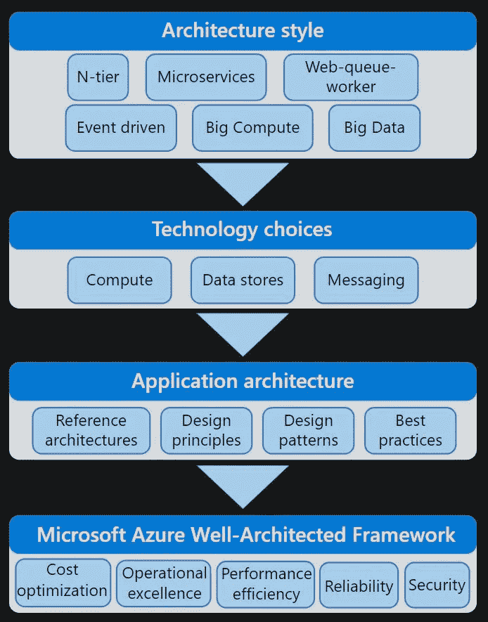
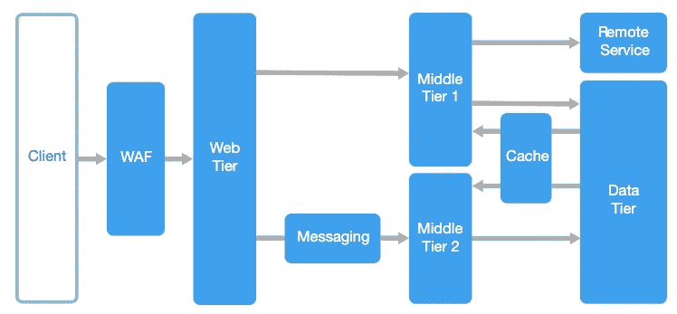
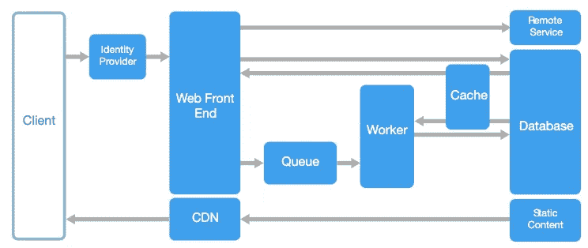
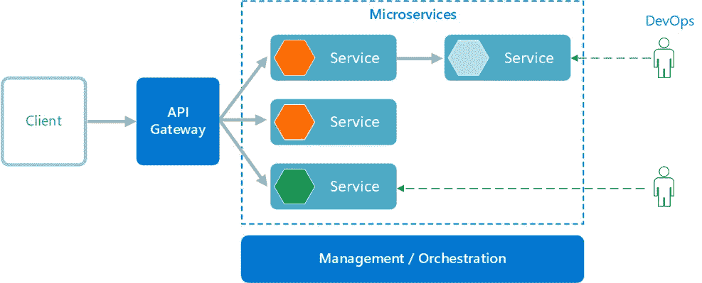
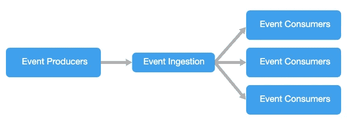
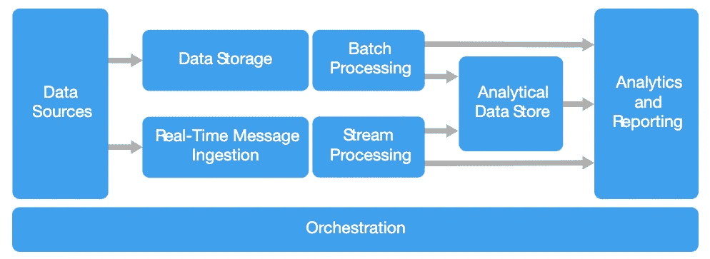
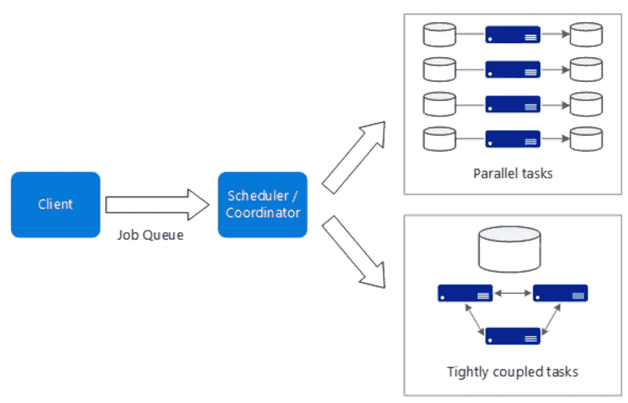
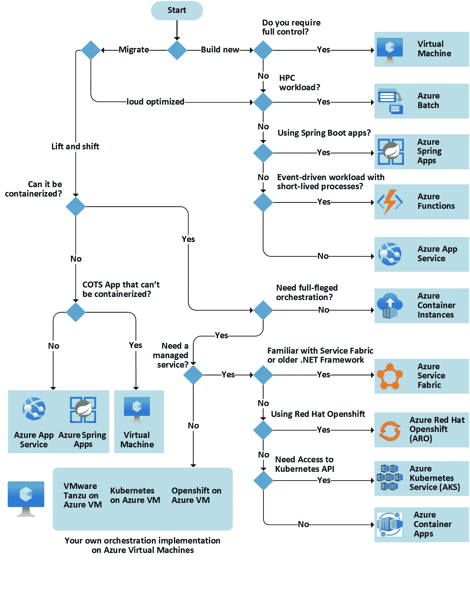

# 使用 Microsoft Azure Cloud 开发云原生应用程序所需的一切！

> 原文：<https://levelup.gitconnected.com/everything-you-need-to-know-to-develop-cloud-native-apps-with-microsoft-azure-cloud-5208be88c732>

如果你正在开发你的云原生应用，我强烈推荐你查看来自Azure 架构中心的**应用架构指南**。⬇️⬇️⬇️

# 👉 𝐀𝐫𝐜𝐡𝐢𝐭𝐞𝐜𝐭𝐮𝐫𝐞 𝐬𝐭𝐲𝐥𝐞𝐬

✅ **N 层**:将应用分为逻辑层和物理层。

 [## n 层架构风格- Azure 架构中心

### N 层架构将应用程序分为逻辑层和物理层。层是一种分离的方式…

docs.microsoft.com](https://docs.microsoft.com/en-us/azure/architecture/guide/architecture-styles/n-tier?WT.mc_id=DT-MVP-5001664) 

✅ **网络队列工作者**:前端和后端作业，通过异步消息传递分离。

 [## Web-Queue-Worker 架构风格- Azure 架构中心

### 该体系结构的核心组件是一个服务于客户端请求的 web 前端，以及一个执行…

docs.microsoft.com](https://docs.microsoft.com/en-us/azure/architecture/guide/architecture-styles/web-queue-worker?WT.mc_id=DT-MVP-5001664) 

✅ **微服务**:通过 API 相互调用的功能分解的服务。

 [## 微服务架构风格——Azure 架构中心

### 微服务架构由一组小型自治服务组成。每个服务都是独立的，并且…

docs.microsoft.com](https://docs.microsoft.com/en-us/azure/architecture/guide/architecture-styles/microservices?WT.mc_id=DT-MVP-5001664) 

✅ **事件驱动架构**:生产者/消费者。每个子系统的独立视图。

 [## 事件驱动的架构风格——Azure 架构中心

### 事件驱动架构由生成事件流的事件生产者和…

docs.microsoft.com](https://docs.microsoft.com/en-us/azure/architecture/guide/architecture-styles/event-driven?WT.mc_id=DT-MVP-5001664) 

✅ **大数据**:将一个庞大的数据集分成小块。本地数据集上的并行处理。

 [## 大数据架构风格- Azure 架构中心

### 大数据架构旨在处理过大或过大的数据的接收、处理和分析

docs.microsoft.com](https://docs.microsoft.com/en-us/azure/architecture/guide/architecture-styles/big-data?WT.mc_id=DT-MVP-5001664) 

✅ **大计算**:将数据分配给数千个内核。

 [## 大计算架构风格——Azure 架构中心

### 术语“大计算”描述需要大量内核的大规模工作负载，通常数量在…

docs.microsoft.com](https://docs.microsoft.com/en-us/azure/architecture/guide/architecture-styles/big-compute?WT.mc_id=DT-MVP-5001664) 

# 👉 𝐓𝐞𝐜𝐡𝐧𝐨𝐥𝐨𝐠𝐲 𝐜𝐡𝐨𝐢𝐜𝐞𝐬

✅选择了一个**计算**服务

 [## 选择 Azure 计算服务- Azure 架构中心

### Azure 提供了多种托管应用程序代码的方式。术语“计算”指的是…

docs.microsoft.com](https://docs.microsoft.com/en-us/azure/architecture/guide/technology-choices/compute-decision-tree?WT.mc_id=DT-MVP-5001664) 

✅选择一家**数据**店

 [## 了解数据存储模型- Azure 应用程序架构指南

### 现代业务系统管理着越来越多的异构数据。这种异质性意味着单一的…

docs.microsoft.com](https://docs.microsoft.com/en-us/azure/architecture/guide/technology-choices/data-store-overview?WT.mc_id=DT-MVP-5001664)  [## 数据存储决策树- Azure 应用程序架构指南

### 为您的应用程序选择 Azure 数据存储。查看选择数据存储的图形表示。

docs.microsoft.com](https://docs.microsoft.com/azure/architecture/guide/technology-choices/data-store-decision-tree?WT.mc_id=DT-MVP-5001664) 

✅选择了一个**消息传递**服务

 [## 异步消息选项- Azure 架构中心

### 本文描述了不同类型的消息和参与消息传递基础结构的实体…

docs.microsoft.com](https://docs.microsoft.com/en-us/azure/architecture/guide/technology-choices/messaging?WT.mc_id=DT-MVP-5001664) 

# 👉 𝐃𝐞𝐬𝐢𝐠𝐧 𝐭𝐡𝐞 𝐚𝐫𝐜𝐡𝐢𝐭𝐞𝐜𝐭𝐮𝐫𝐞

✅ **参考架构**:每个参考架构都包括推荐的实践，以及对可伸缩性、可用性、安全性、弹性和设计的其他方面的考虑。

 [## 浏览 Azure 架构- Azure 架构中心

### 查找参考体系结构的体系结构图和技术描述、真实世界的云示例…

docs.microsoft.com](https://docs.microsoft.com/en-us/azure/architecture/browse/?filter=reference-architecture&WT.mc_id=DT-MVP-5001664) 

✅ **设计原则** : 10 个高层次的设计原则，它们将使你的应用程序更具可伸缩性、弹性和可管理性。

 [## Azure 应用程序的设计原则- Azure 架构中心

### 遵循这些设计原则，使您的 Azure 应用程序更具可伸缩性、弹性和可管理性。

docs.microsoft.com](https://docs.microsoft.com/en-us/azure/architecture/guide/design-principles/?WT.mc_id=DT-MVP-5001664) 

✅ **设计模式**:这些设计模式对于在云中构建可靠、可伸缩、安全的应用程序非常有用。

 [## 云设计模式- Azure 架构中心

### 通过了解以下内容，了解在云中构建可靠、可伸缩、安全的应用程序的设计模式…

docs.microsoft.com](https://docs.microsoft.com/en-gb/azure/architecture/patterns/?WT.mc_id=DT-MVP-5001664) 

✅ **最佳实践**:涵盖各种设计考虑，包括 API 设计、自动伸缩、数据分区、缓存等等。

 [## Web API 设计最佳实践- Azure 架构中心

### 大多数现代 web 应用程序公开了客户端可以用来与应用程序交互的 API。一个设计良好的 web API…

docs.microsoft.com](https://docs.microsoft.com/en-us/azure/architecture/best-practices/api-design?WT.mc_id=DT-MVP-5001664) 

✅ **安全最佳实践**:描述如何确保你的应用程序的机密性、完整性和可用性不被恶意行为者破坏。

 [## Azure 中的应用程序安全性

### 应用程序和与之相关的数据最终充当云上商业价值的主要存储…

docs.microsoft.com](https://docs.microsoft.com/en-us/security/compass/applications-services?WT.mc_id=DT-MVP-5001664) 

# 👉 𝐐𝐮𝐚𝐥𝐢𝐭𝐲 𝐩𝐢𝐥𝐥𝐚𝐫𝐬

✅ **微软 Azure 架构良好的框架**

 [## 微软 Azure 架构良好的框架——Azure 架构中心

### Azure 架构良好的框架是一套指导原则，可用于提高工作负载的质量。

docs.microsoft.com](https://docs.microsoft.com/en-us/azure/architecture/framework/?WT.mc_id=DT-MVP-5001664) 

**🔥阅读更多⬇️**

 [## Azure 应用架构基础——Azure 架构中心

### 这个内容库提供了一种结构化的方法，用于在 Azure 上设计可伸缩的、安全的…

lnkd.in](https://lnkd.in/gZgT8raH) 

感谢阅读，希望对您有所帮助！

在聊天

 [## 陈家东——高级软件开发人员——X 公司| LinkedIn

### 陈家东是国际上公认的 3000 名微软最有价值职业(MVP)获奖者之一

www.linkedin.com](https://www.linkedin.com/in/chenjd/)