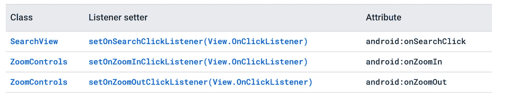

# 关于 Android 绑定你应该知道的一切

> 原文：<https://levelup.gitconnected.com/everything-you-should-know-about-binding-in-android-a8a70bc882f0>


Aleks Dorohovich 在 [Unsplash](https://unsplash.com/s/photos/data-binding?utm_source=unsplash&utm_medium=referral&utm_content=creditCopyText) 上拍摄的照片

你好朋友们。我希望你喜欢我的写作，如果你有任何建议让我知道。所以本周，我们将讨论绑定，包括视图和数据绑定。为什么要用，怎么用？ **Empecemos！**

# 视图绑定

视图绑定基本上是一个 Jetpack 组件。它帮助您简化 XML 文件和 java 或 kotlin 文件之间的关系。

所以不再使用`findViewById.`

**这是怎么回事？**

步骤 1:在模块中启用 viewBinding。

现在，IDE 将为您编写的每个 XML 文件自动创建一个绑定文件。嘣！

例如，给定一个名为`result_profile.xml`的布局文件:

生成的绑定类名将是`ResultProfileBinding.`,因此命名工作就像，它转换骆驼大小写的文件名，然后添加绑定作为后缀。

现在，您可以直接访问所有视图 id，而无需使用 findViewById。

步骤 2:在活动中使用 ViewBinding:

现在您需要做的就是访问视图:

`binding.name.text = “BOOM”
binding.button.setOnClickListener{
………..
}`

**但是** `**viewBinding**` **和** `**dataBinding**` **有什么不同呢？**

视图绑定和[数据绑定](https://developer.android.com/topic/libraries/data-binding)都生成绑定类，您可以使用它们直接引用视图。但是，视图绑定旨在处理更简单的用例，并提供了优于数据绑定的以下优势:

*   更快的编译
*   使用方便

相反，与数据绑定相比，视图绑定有以下限制:

*   视图绑定不支持布局变量或布局表达式，因此不能用于直接从 XML 布局文件中声明动态 UI 内容。
*   视图绑定不支持双向数据绑定。

我知道你不熟悉这些术语，继续吧，我会帮助你理解的。

# 数据绑定

Android 数据绑定提供了一种将 UI 与业务逻辑联系起来的方法，允许 UI 值自动更新，无需人工干预。这将从您的文件中删除大量的锅炉板代码，使其更加整洁。

它是如何工作的？

步骤 1:在 build.gradle 文件中启用数据绑定。

步骤 2:布局和绑定表达式。如何编写支持数据绑定的布局文件？

数据文件略有不同，它开始将布局标签和一些数据变量，您可以使用这些变量来配置您的视图对象中的值。

下面是一个例子:

这里 user 是一个变量名，它是用户类的类型。

要在视图中访问这些数据，我们需要使用@ following，后跟花括号和里面的值。例如，在文本视图中，为了显示用户的名字，我们在属性文本中使用了`@{user.firstName}` 。

```
data class User(val firstName: String, val lastName: String)
```

**其他变量:**

```
<data>
    <variable name="user" type="com.example.User"/>
    <variable name="image" type="Drawable"/>
    <variable name="note" type="String"/>
    <variable name="selected" type="Boolean"/>
    <variable name="age" type="int"/>
    <variable name="list" type="List&lt;String>"/>
    <variable name="sparse" type="SparseArray&lt;String>"/>
    <variable name="map" type="Map&lt;String, String>"/>
</data>
```

您可以访问 XML 中的任何类型的数据，并使用@{}在布局属性中访问它们。

**导入:**
导入允许我们访问布局文件中的类。例如，在条件的基础上利用视图的可见性。我们将 fo 这样:
`android:visibility="@{age > 13 ? View.GONE : View.VISIBLE}"`

如果年龄大于 13，隐藏视图，否则显示它。要访问这个视图类，我们需要将它导入到数据中。

```
<data>
    <import type="android.view.View"/>
</data>
```

你也可以导入你的其他类，例如，不要通过完整的路径访问它们，首先导入它们。

```
<data>
    <import type="com.example.User"/>
    <import type="java.util.List"/>
    <variable name="user" type="User"/>
    <variable name="userList" type="List&lt;User>"/>
</data>
```

如果你想访问任何类的方法，在方法中传递一些变量，并在文本视图中显示结果。您也可以通过导入该类来实现这一点。

`{MyStringUtils.capitalize(user.lastName)}”`是大写的字符串和设置内部视图。

**零合并运算符** 零合并运算符(`??`)选择左操作数(如果它不是`null`)或右操作数(如果前者是`null`)。

```
android:text="@{user.displayName ?? user.lastName}"
```

这在功能上相当于:

```
android:text="@{user.displayName != null ? user.displayName : user.lastName}"
```

# 在活动或片段中绑定数据

一旦在 XML 文件中添加布局标记，就会为每个布局生成一个绑定类。命名约定就像骆驼大小写字母后跟绑定后缀。

activity _ main . XML-> ActivityMainBinding

还有另一种定义 bindind 的方法，您可以使用

<variable name="“isUserAvailable”" type="“Boolean”"></variable>

要从活动中设置 XML 文件的数据值，请调用`binding.setIsUserAvailable(true)`。它将设置您的变量值。

# **事件处理**

*   **Methopd 参考**

除了少数例外，事件属性名由侦听器方法的名称决定。

例如:`View.OnClickListener`有一个方法`onClick()`，所以这个事件的属性是`android:onClick`。



侦听器绑定将在@{handlers::onClickFriend}中完成，其中 handlers 是一个带有 onClickFriend 方法的类对象。记住名字应该是相同的。

> 如果 listener 方法不存在，它将给出一个编译时错误。

*   **监听器绑定**

```
android:onClick="@{(view) -> presenter.onSaveClick(task)}"
```

# 示例代码:

到目前为止，我们已经了解了如何启用视图绑定和数据绑定。两者是如何相互有利和相互比较的。如何创建支持数据绑定的 XML 文件？如何导入类以及如何创建数据变量。

绑定通过去除模板代码，减少活动和片段中的数据表示部分，使布局文件与活动绑定变得容易。

我希望你喜欢这篇文章。在下一篇文章中，我们将深入讨论数据绑定。

**再见了，朋友们！**