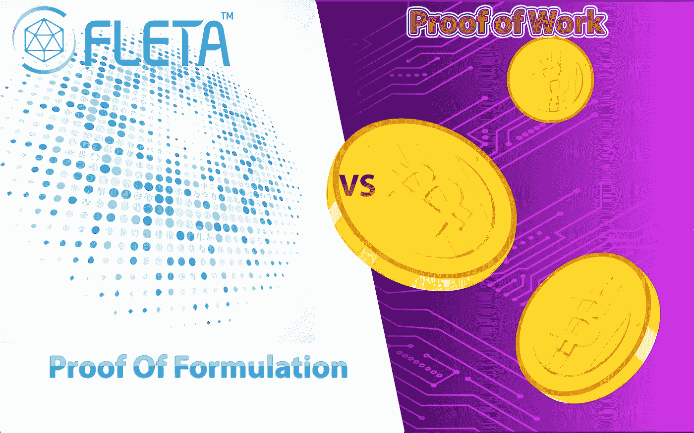
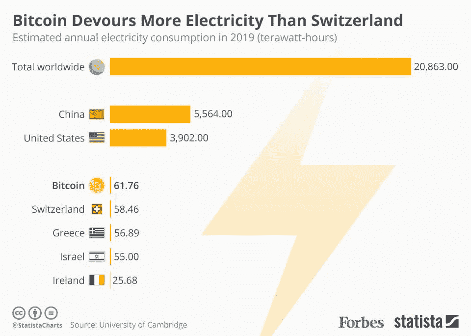
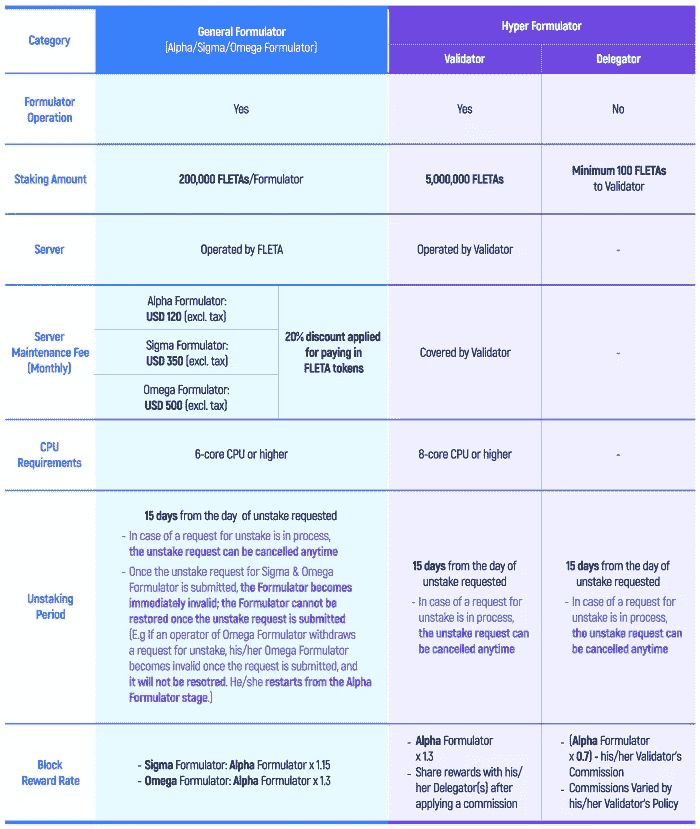
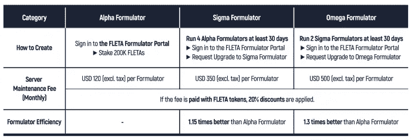
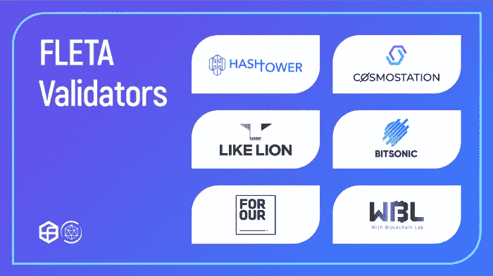
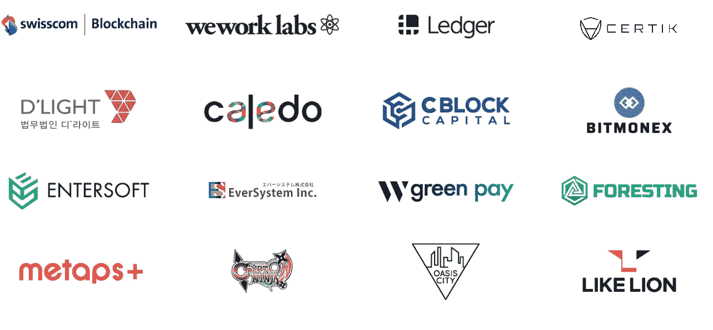

# 加密货币挖掘的发展和目前可用的最新技术

> 原文：<https://levelup.gitconnected.com/evolution-of-cryptocurrency-mining-and-the-latest-technology-now-available-7e6378263519>

根据最近的一份报告，比特币揭示了挖掘的真实成本。根据报告[，花费在比特币开采上的能源比它在大多数非洲国家消耗的能源还多。其中一个主要原因是比特币挖矿成本非常高。由于比特币共识是基于旧的商业证据，因此它非常昂贵，因为它消耗大量的电力和维持这种挖掘所需的设备。](https://cointelegraph.com/news/bitcoin-mining-uses-more-power-than-most-african-countries)

**为什么比特币挖矿要用这么多能源？**

比特币是一个基于区块链的分散节点集体工作系统。这些节点中的一些是矿工，它们的责任是向区块链添加新的区块。为此，矿工必须尝试猜测一个伪随机数(称为 nonce)。当此数字与块中的信息组合并通过哈希函数传递时，它必须产生与指定条件匹配的结果(例如，以四个零开始的哈希)。当找到匹配结果时，其他节点验证该结果，并且矿工被奖励节点块奖励。

第一号图表

因此，我们有越来越多的矿商在解决一个越来越难的难题，以确认相对较少的交易。[结果是相当大的浪费。](https://cointelegraph.com/news/bitcoin-mining-uses-more-power-than-most-african-countries)不可否认，矿工参与比特币挖矿所消耗的能量越来越大，尤其是累积起来考虑的话。

因此，大多数新开发的项目都有不同的共识算法，如利害关系证明或公式证明。由于新开发的共识算法，我们已经将能耗降至最低。此外，与旧的共识算法相比，这些不需要大量投资的算法更安全且更节能。

**正如我上面试图解释的那样，比特币挖矿或其他加密货币挖矿是非常有害的传统挖矿业务。因为，考虑到它对环境的负面影响和它对你的成本，很明显它绝不是有利可图的。**

**比特币挖矿是一种非常古老过时的挖矿类型。**

**这正是我们需要关注能耗更低、利润更高的挖掘算法的原因。**

**PoF(公式证明):弗莱塔自己的共识算法**

有了 Fleta 的公式化共识证明，你不需要把一笔财富去挖掘。有了 [Fleta](https://medium.com/fleta-first-chain/fleta-ecosystem-enhanced-validators-and-delegators-45be2a4ef16c) ，你可以使用云系统和节点在互联网上进行不同的挖掘。由于这种挖掘算法，只使用简单的计算机而不需要强大的处理器和显卡就可以进行有利可图的投资。

**它是如何工作的？**

配方师是 [FLETA](https://medium.com/fleta-first-chain/fleta-ecosystem-enhanced-validators-and-delegators-45be2a4ef16c) 的一个挖掘节点。所有配方师根据指定的等级在每个阶段参与一次开采。一旦所有的配方设计师都参与了挖掘，一个新的阶段就开始了。也就是说，在阶段-1 首先创建块的配方设计师可以是阶段-2 的第一个或最后一个。排名是通过一定的数学公式，把每个公式制定者的哈希值变成一个数字，随机设置的。秩的设定没有规律，每个阶段公式都有变化，所以实际上无法预测秩。

所有配方设计师都参与挖掘似乎是低效的。但是 FLETA 的格挡时间只有 0.5 秒，每次挖矿创造 8 个格挡。所以，每次挖掘只需要四秒钟。假设有 1000 个配方师。如果这 1000 个配方师参与挖矿，大概需要 4000 秒或者 66 分钟——1000 个配方师 x 4 秒(8 块 x 0.5 秒)。此外，在 FLETA 的采矿生态系统中，通过观察节点即时确认区块。在五个观察节点中，其中三个应该在生成块之后立即验证块，这使得块能够被快速传播。

但是，系统中有 2 个不同的配方。**普通**和**超级**。一般分为 3 个不同的组——*α*、*β、*和*ω*。

Hyper 也分为两个不同的组，即*验证者*和*委托者*。

您可以是系统中这 5 个不同公式中的一个。但是他们都有不同的要求，报酬和佣金。你可以在下面的图表中看到细节。

第 2 号图表

通过这种方式，Fleta 希望通过为每个人开发不同的算法，为所有加密货币爱好者提供不同的可能性。

**重要提示**:如果你是系统中的*总配方师*，你必须向 Fleta 提供的服务器支付一定的费用。图表中显示了这些佣金数字。然而，如果你用 Fleta 代币支付这些佣金，你应该得到 20%的折扣。

**担任总配方师**

第 3 号图表

如果你想成为系统内的*总配方师*，首先要访问 FLETA 的配方师门户网站。你必须有 20 万弗莱塔代币。上图详细描述了一般配方师的要求。

**阿尔法、贝塔和欧米茄配方设计师之间到底有什么区别？**

正如我们上面提到的，通用公式可以根据每个类别的表现分为三个级别。首先，你可以从 Alpha Formulator 开始，这是一个锁定 20 万个 FLETA 令牌后创建的基础级 Formulator。

在系统中锁定您的 Fleta 代币后，您将获得月收入。但首先，你要以阿尔法配方师的身份进入系统。一个月末，你将成为 Beta，下个月末，你将成为 Omega Formulator。

不同的是，贝塔的奖池比阿尔法高 1.15 倍。欧米茄的奖池比贝塔多 1.3 倍。所以你在系统中越是一个验证者，你将获得越多的等级和奖励。

*阿尔法、贝塔、欧米茄的月佣金分别是 120 美元、350 美元、500 美元。但是你应该记住，当你用 FLETA 代币而不是美元支付佣金时，你会得到 20%的折扣。*

综上所述，你可能锁定了相同数量的弗莱塔代币，但是适马和欧米茄配方师根据他们的等级以更低的成本获得了更高的效率。您可以在 FLETA 配方师门户网站上升级您的配方师。

**成为超级配方师**

**General** Formulator 和 **Hyper** Formulator 的主要区别在于，General 使用 Fleta 的服务器时，Hyper 使用自己的服务器。

与普通配方师不同，超级配方师应该将 5，000，000 个 FLETA 令牌锁定到系统中，如图 2 所示。此外，Hyper Formulators 应该在至少 8 核 CPU(mainnet 级别)上设置和运行。

FLETA 通过筛选过程邀请验证者。假设一个阿尔法公式表示 1 个挖掘效率，一个超级公式表示 1.3 个更高的挖掘效率，这与一个欧米伽公式相同。

*下图显示了 Fleta 的超级配方师。*

*让我们简单熟悉一下上面的 6 个超级配方师*:

1)**hash tower**:hash tower 是韩国加密货币交易所 GDAC 的验证器品牌。作为宇宙(原子)的主要验证者之一。

2)**cosmo station**:cosmo station 是 Cosmos(ATOM)十大验证器之一。它也是基于 Tendermint 的区块链(如 IRISnet 和 Terra)的验证器。

3) **Bitsonic** : Bitsonic 是由韩国领先的移动应用公司 Skoop Media 创立的加密货币交易所。

4) **Like Lion** : Like Lion 是一家专门从事计算机编程的教育机构，由又名“天才开发者”杜希利(Du Hee Lee)领导。

5) **Forour** : FOROUR 致力于在区块链、虚拟现实和/或人工智能初创公司和企业之间搭建一座桥梁，以促进第四次工业革命时代的数字创新

6) **WBL** : WBL 是专业从事加密货币投资的教育实验室。旨在创建一个价值驱动的加密投资生态系统，它向公众提供定期课程和教育计划。

任何想要在 Fleta 展示和绘制的范围内的人都可以成为超级配方师。

**但是，如果您没有必要的投资，您可以作为超级配方师的代理人加入该系统。**

事实上，上面简单提到的非常强大的公司是 Fleta 的制定者，这表明他们是多么信任和支持 FLETA。

此外，Fleta 的商业合作伙伴不仅限于这些公司。在下面的图表中，您还可以看到 Fleta 的其他合作伙伴没有配方师，但与不同类型的合作。

**成为委托人**

作为委托人加入相对容易。要作为委托者加入，您需要做的就是将至少 100 个 FLETA 令牌委托给您最信任的验证者。委托代币后，您可以获得验证者承诺的奖励，验证者的佣金除外。

**结论**

因此，比特币和旧加密货币的开采系统相当古老，不是有利可图的投资。随后的股权证明制度更有效，也更有利可图，但没有达到理想的水平。

**公式化证明**是由 [Fleta](https://www.fleta.io/) 开发的新的一致性算法，尽管其结构非常复杂，但它是一种易于理解和易于使用的算法。

由于项目即将转移到 Mainnet，早期投资在短期和长期内都将非常有利可图。因为项目背后都是技术高超、可靠的软件开发者和运营者。

通过尽早参与这个项目，你可以进行非常有利可图的投资，并对区块链世界做出贡献，这要归功于新的共识算法，而不是旧的方法。

> ***法律免责声明*** *:本文仅供一般性指导，不构成法律投资建议。*
> 
> ***披露*** *:我不是任何加密货币或 Fleta 的一部分。我也没有被 Fleta 雇佣。投资时所有的风险都是你的责任。*

 [## 学习坚固性-最佳坚固性教程(2019) | gitconnected

### 14 大坚实教程-免费学习坚实。课程由开发人员提交和投票，使您能够…

gitconnected.com](https://gitconnected.com/learn/solidity) 

# **来源**

[https://coin telegraph . com/news/bit coin-mining-used-more-power-than-most-African-countries](https://cointelegraph.com/news/bitcoin-mining-uses-more-power-than-most-african-countries)

[https://hacker noon . com/proof-of-of-work-or-proof-of-waste-9c 1710 b7f 025](https://hackernoon.com/proof-of-work-or-proof-of-waste-9c1710b7f025)

[https://www . binance . vision/tr/区块链/工作证明-解释](https://www.binance.vision/tr/blockchain/proof-of-work-explained)

[https://medium . com/fleta-first-chain/fleta-ecosystem-enhanced-validators-and-delegators-45be 2a 4 ef 16c](https://medium.com/fleta-first-chain/fleta-ecosystem-enhanced-validators-and-delegators-45be2a4ef16c)

[https://medium . com/fleta-first-chain/announcing-fletas-validators-for-enhanced-credential-and-stability-bfb 04d 8d 897 c](https://medium.com/fleta-first-chain/announcing-fletas-validators-for-enhanced-credibility-and-stability-bfb04d8d897c)

[https://medium . com/fleta-first-chain/POF-and-formulator-how-fleta-mining-ecosystem-works-6184 e 23 e 69 Fe](https://medium.com/fleta-first-chain/pof-and-formulator-how-fleta-mining-ecosystem-works-6184e23e69fe)

[https://www.fleta.io/](https://www.fleta.io/)