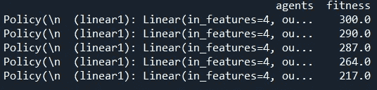
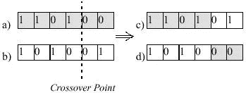
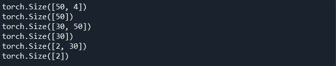
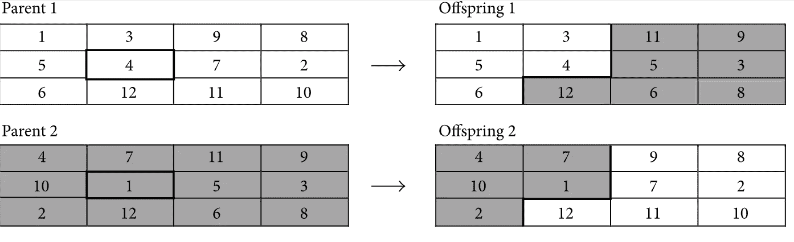
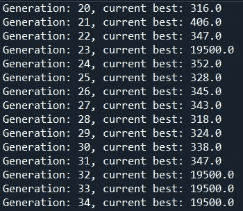
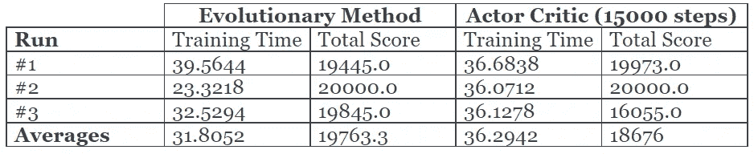

# 用遗传算法进化强化学习代理

> 原文：<https://levelup.gitconnected.com/evolving-reinforcement-learning-agents-using-genetic-algorithms-409e213562a5>

利用进化方法来进化能够超越 Python 中最先进的强化学习算法的代理。

# 介绍

我开始这个项目的目的是将遗传算法应用于预测或分类神经网络。经过一些测试后，我注意到遗传算法能够快速最小化损失函数，但当我在测试数据上运行它时，它失败了。我可能会花更多的时间尝试不同的技术和方法来改善它，但这个问题激发了应用相同概念的想法，但对于强化学习环境，这个问题根本不存在。

在我完成这个项目后，我做了一些关于这个主题的研究，并意识到已经有一篇 [**的论文在优步人工智能实验室**](https://arxiv.org/pdf/1712.06567.pdf) 发表，如果你想对它进行更全面的报道。在这篇文章中，我将分享我个人的实现，它能够在解决[**car pole 环境**](https://gym.openai.com/envs/CartPole-v0/) 中超越最先进的强化学习算法，如 Actor Critic。

我假设你已经熟悉基本的神经网络概念。随着遗传算法越来越不受欢迎，我决定提供一个快速的总结，但无论如何，你总能找到大量的在线资源来讨论任何提到的概念。

这里的 [**github 资源库有完整的**](https://github.com/mohdabdin/Evolving-RL-Agents) 代码，如果你遇到任何错误，有疑问或者只是想连接请 [**联系我！**](mailto:mohd_abdin@hotmail.co.uk) :)

# 遗传算法快速总结

遗传算法是受生物进化概念启发的算法类型。为了更好地理解生物学概念如何转化为数学表达，我发现最好先单独检查每个部分:

*   基因:一个基因或一个“个体”只是对每个问题任意编码的解决方案。对于我们的问题，基因编码是我们的策略网络的权重矩阵。
*   群体:群体是一个基因列表，我们的算法将尝试使用每个基因和进化算子的计算适应度来进化。
*   适应度:适应度是针对每个个体(基因)进行评估的，并且也取决于手头的问题。在我们的例子中，适应度是智能体从环境中得到的回报。
*   进化算子:在我们的进化策略中，我们可以使用许多技术和算子。最常见的是变异和交叉；突变是基因部分的随机变化(如果基因是一串比特，突变可以是其中一个比特的翻转)。杂交是将两个基因结合形成一个新的基因。

# 履行

为了便于阅读，我将这个项目分成了三个文件:

*   [**evolution _ functions . py**](https://github.com/mohdabdin/Evolving-RL-Agents/blob/main/evolution_functions.py):包含应用选择、交叉、变异和评估代理所需的所有函数。
*   [**policy _ network . py**](https://github.com/mohdabdin/Evolving-RL-Agents/blob/main/policy_network.py):包含 PyTorch 神经网络模型，它是我们代理的框架。网络接收环境的当前状态作为输入，并输出动作。
*   [**evolve.py**](https://github.com/mohdabdin/Evolving-RL-Agents/blob/main/evolve.py) :这集合了所有的东西来进化我们的代理并实现下一节描述的伪代码。

# 伪代码

1.  初始化代理群体(策略网络)。
2.  根据他们的总剧集奖励评估每个代理的表现，更新相应的健康列表，并根据健康对列进行排序。
3.  对于每个训练/进化迭代:
    1。初始化一个空列表*‘evolved _ agents’*来填充下一代的后代
    2。实行精英主义(即表现最好的前 10%的代理立即加入新一代)。
    3。而 *'evolved_agents'* 列表的大小小于种群大小；应用选择、交叉、变异，并不断将后代添加到列表中。
    4。将*‘evolved _ agents’*列表分配给旧代理列表，重新评估代理性能，重新更新相应的适应性列表，并按适应性排序
4.  返回群体中的第一个代理(适应性最高的一个)

# 创建政策网络

在[**policy _ network . py**](https://github.com/mohdabdin/Evolving-RL-Agents/blob/main/policy_network.py)中，我们定义了一个策略网络，它接收环境状态，并输出一个大小与动作数量相等的张量。在横竿环境中，动作空间的大小为 2，可以向右或向左移动。

这里没有什么花哨的，只是三个线性层。肯定有更好的方法来做这件事，但是我们现在就坚持这样做。

# 定义我们的进化算子

在[**evolution _ functions . py**](https://github.com/mohdabdin/Evolving-RL-Agents/blob/main/evolution_functions.py)上，我们将为我们的问题定义所有必要的进化算子。

# 人口数据结构

在深入研究进化算子之前，有必要回顾一下我们将用于代理群体的数据结构。每个代理必须有一个相应的健康分数，所以我决定用一个熊猫数据框架结构，它有两列:“代理”和“健康”来实现这个功能。

# 估价

回头看前面描述的伪代码，评估过程最初是在所有代理都被初始化到一个列表中之后，以及在新的进化代理列表的每次训练迭代之后进行的。因此，我们的评估函数将采用一个代理列表，并返回一个适合度列表，以分配给我们的人口数据框架中的“适合度”列

我们还将传递环境作为参数来测试每个代理。cartpole 环境的解决标准是在连续 100 集内获得 195+(每个时间步长+1)的奖励分数，因此理想情况下，我们希望计算每个代理在 100 集内的总奖励，但是这将导致训练过程非常缓慢。取而代之的是，我将对每个停止条件为 1 的代理进行一次循环。如果环境结束(即代理失败)或 2。如果它跑了 19500 步。请注意,“CartPole-v0”环境在到达 200 步时返回 done，但是我们将更改此设置。

这是一个更强大的解决方案，因为进入下一代的顶级表演代理将重新评估他们的适合度，给出更可靠的评估，并消除连续播放剧集的需要。

# 选择

我选择使用轮盘赌选择，在这里我们把整个群体都考虑进去，然后得出一个概率分布，基于这个概率分布我们选择两个代理人进行交叉。

概率分布的定义是取拟合度并除以它们的和，使得概率等于 1。然后，使用循环来确保选取的索引不相同。

# 交叉

交叉功能可能是我们进化过程中最重要的部分。这里，我们接收由选择函数返回的两个父代，并将它们交叉返回两个新的子代。通常在具有简单基因组编码的遗传算法中，如一维数组，交叉的应用如下图所示。

相反，我们使用权重矩阵，不只是一个矩阵，而是每个层一个(除了偏置层)。为了更好地了解我们的基因组编码，运行以下代码:

对于这些层中的每一层，我将与相应的父层进行独立的矩阵交叉。矩阵交叉与一维交叉没有太大区别，如下所示:

在上面的函数中，我们循环遍历我们双亲的每一层，运行如下所示的矩阵交叉函数，并返回后代代理。请注意，我们需要使用 *copy.deepcopy()* 将代理对象复制到新的变量中，以避免更改父代理层，这些层可能仍会在同一个训练迭代中使用。

我发现应用矩阵交叉的最简单的方法是将矩阵的形状存储在变量 *mat_shape* 中，将其展平，随机选择一个交叉点，应用交叉，然后将其重塑为原始形状。

# 变化

变异算子在结构上类似于交叉函数，但是我们只需要一个代理，而不是使用两个父代。这里我也使用了两个函数，第一个是应用实际的功能，在层上循环，改变它们，并返回突变的基因组。

下面的函数应用突变到一个单一的层，类似交叉，我平坦的层，抽样了一些随机指数，并改变值为一个新的随机值的基础上，高斯分布。我们也有我们的*突变率*超参数在这里发挥作用，突变率表示基因组中某个项目将被调整的机会。这与选择 N 个随机索引成比例，其中 N 是突变率乘以数组的长度。

# 把所有的放在一起

现在我们已经有了开始应用我们的伪代码和进化代理所需的所有组件，我们将创建我们的最后一个文件' [**evolve.py**](https://github.com/mohdabdin/Evolving-RL-Agents/blob/main/evolve.py) '来把所有的东西放在一起。

# 进口和超参数

在导入必要的包、策略网络和我们刚刚定义的进化操作符之后，我为 GA 算法定义了超参数:

*   代数:我们的算法在停止之前将经历的代数，我们也可以定义一个停止标准，例如，如果表现最好的代理在连续 3 代中得分为 19500。
*   人口规模，每一代有多少个代理人
*   突变率:如前所述，这是我们在突变操作中调整基因组值的速率
*   ELISTISM_RATE:这描述了将立即转移到下一代的那部分人口。如果人口规模是 100，我们的省略率是 0.1，那么前 10 名执行代理将移动到新一代。

最后，我们初始化环境，并使用属性“unwrapped”来删除环境最初设置的 200 个最大步骤的限制。我们还定义了我们的动作规范和观察规范，其中动作规范是(2)，在左边或右边，观察规范是(4)，小车的位置，小车的速度，磁极的角度，磁极的旋转速率。

# 初始化

这基本上是我们伪代码中的步骤 1 和 2，我们填充一个代理列表，对它们进行评估，并以包含每个代理对象及其相应适合度的数据帧结束。

# 训练循环

最后，在这个项目的最后一步，我们执行训练过程，这是伪代码的第 3 步。

# 将结果与基线 3 的 A2C 进行比较

我想看看我们的模型与传统的强化学习模型(即演员批评家模型)相比表现如何。为此，我首先实现了一个 Baseline3 模型:

我还在进化过程中加入了计时器功能。结果如下:

由于我们进化方法的随机性，结果变化很大，所以对这些结果要有所保留，但这绝对不是可以忽略的。

# 结论和最终想法

开始这个项目时，我没有看到它如此成功，因为它是一个简单的随机搜索算法，背后没有花哨的数学方程或微积分。但这是数据科学的魅力之一，或者说，实际上是什么使它成为一种“科学”直觉，可以导致一些有趣的算法和技术。总的来说，我们的模型在训练速度和奖励分数方面都表现得非常好。

为了进一步推进这一点，我想浏览一下优步人工智能实验室发表的 的 [**论文，看看他们做了什么不同，如果有什么我可以做的来改进这一点。我还认为另一个有趣的话题是**](https://arxiv.org/pdf/1712.06567.pdf) **[**用于强化学习的遗传编程**](https://en.wikipedia.org/wiki/Genetic_programming) ，也许在我的下一篇文章中！**

谢谢你阅读这篇文章，我希望你能从中找到有用的东西。 [**这里是完整的代码**](https://github.com/mohdabdin/Evolving-RL-Agents) 所以请随意使用它，测试不同的东西，让我知道它是如何进行的！😊