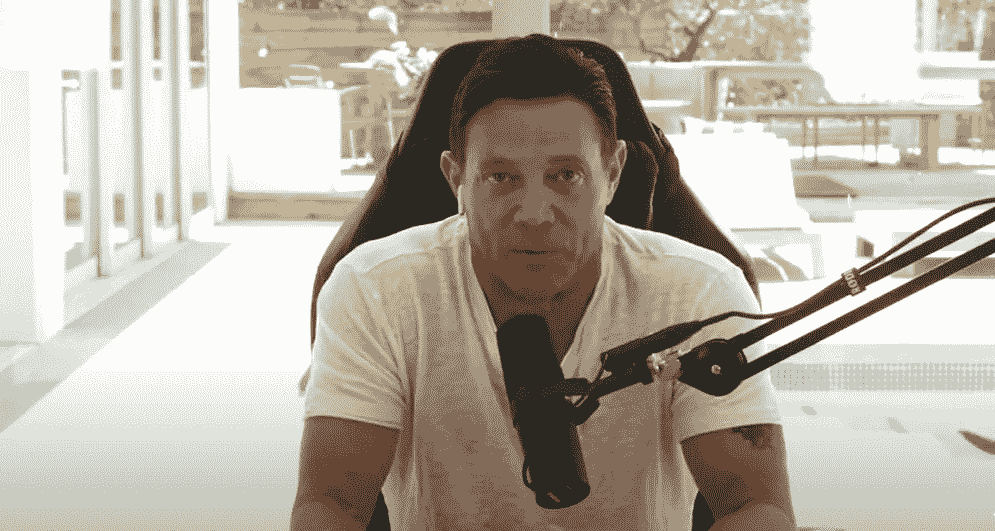

# 前骗子掉头称比特币是一个骗局——当你停止改变主意的那一天就是你停止呼吸的时候。

> 原文：<https://levelup.gitconnected.com/ex-conman-u-turned-on-calling-bitcoin-a-fraud-the-day-you-stop-changing-your-mind-is-when-you-576c88b4a16d>

如果你忽略他冷酷的语气，他给你上了宝贵的一课。

来源— [YouTube 截图(华尔街之狼)](https://www.youtube.com/watch?v=v-f2FOtZKzQ)

乔丹·贝尔福特是一个不需要介绍的人。

具有讽刺意味的是，莱昂纳多·迪卡普里奥在电影《T2:华尔街之狼》中扮演的前股票经纪人和金融罪犯对比特币大加挞伐，最初称这种数字货币是庞氏骗局。

贝尔福特之前对加密货币持怀疑态度，他称之为[比特币](https://en.wikipedia.org/wiki/Bitcoin):

> “他妈的疯狂”
> 
> “大众错觉。”

在了解了更多关于加密货币的信息以及加密货币价格飙升之后，贝尔福特改变了主意。

贝尔福特承认犯有欺诈罪，他经营一个对外呼叫中心，通过电话销售可疑的投资。

他的呼叫中心和一群训练有素的销售人员使用不公平、不诚实的销售策略，以虚高的价格向公司或不存在的公司出售廉价股票。

贝尔福特在监狱度过了 22 个月，作为协议的一部分，他告发了参与其欺诈计划的商业伙伴和雇员。

调查人员估计，贝尔福特的抽油泵和转储计划可能让他的投资者损失了高达 2 亿美元。贝尔福特必须偿还受害者 1.1 亿美元作为赔偿，但在撰写本文时，他只偿还了 1400 万美元。

大多数受害者都是普通人。

# **比特币评论家转信徒。**

你可能不在乎他对比特币的立场，因为当你听到贝尔福特谈论他的罪行的受害者时，没有一丝悔意。

虽然我不知道全部细节，但你可以从他迄今为止为其犯罪活动偿还的金额中推断出，这说明了你需要知道的一切，尤其是当你将其与他目前的净资产进行比较时。

据报道，当他目前的净资产超过 1 亿美元时，他向受害者支付了 1400 万美元，他经常吹嘘自己能够启动一个 NFT 项目，让他多赚数百万美元。

对我来说就是不合理。

我会小心翼翼地听这个推销员的建议。

我发推文给乔丹·贝尔福特，指出他在加密货币问题上立场的矛盾，他回复如下:

# 贝尔福特解释了他的想法。

改变自己的想法，尤其是面对批评的时候，是一种相当大的力量。

贝尔福特也有一些非常有效的理由来解释为什么他认为比特币永远不会起作用。主要是因为他认为政府永远不会允许像比特币那样匿名的跨境转移。

> 乔丹·贝尔福特:
> 
> “我认为比特币永远不会从 2017 年的崩盘中回来，当时的理由相当充分。
> 
> 我仍然不知道它为什么会回来，但我很高兴它还在这里。"
> 
> 对我来说，这完全是主权风险。
> 
> 我喜欢区块链技术的想法。我正在投资它，并参与了整个加密货币运动。
> 
> 但是我很清楚政府不会允许这种事情继续下去，因为你知道，我被判了洗钱罪。
> 
> 我知道政府会竭尽全力阻止任何人在全球范围内转移超过 10 000 美元的资金。

贝尔福特认为，在那段时间投资比特币感觉违反直觉，因为政府禁止数字货币的风险。

他以为 2017 年 ICO 崩盘后，比特币就再也回不来了，股神巴菲特这样的人也同意。

> 乔丹·贝尔福特:
> 
> “可以说，它没有按人头收费的事实意义重大，因为我热爱区块链技术。
> 
> 我仍然对此感到有点震惊，但现在有足够多的更知名的参与者参与进来，这将要求政府立即将其监管出局。
> 
> 首先发生的是，在任何长期的事情之前，它会更高，可能会达到 10 万美元或更多。

贝尔福特认为，长期来看会发生什么仍然是一个开放的问题，但短期来看，他非常喜欢比特币技术。

他说，没有人知道它会走向哪里，但如果他不得不猜测并做出价格预测，他认为基于比特币固定的供应动态和潜在的全球需求，它会大幅上涨。

> 乔丹·贝尔福特:
> 
> “比特币的价格可能会高得多，除非你从供求关系的角度来看，否则这种价格是没有意义的。
> 
> 它作为数字黄金和去中心化金融的支付机制，在金融体系中占有一席之地。这就是我认为比特币的未来所在。"

# 比特币将继续存在。

贝尔福特声称拥有一些比特币，但只有少量投资。

他相信它会继续存在，因为拥有它的私人和机构的人们会广泛采用它。它的采用率也在快速增长，这对未来是一个积极的信号。

贝尔福特也很高兴在他对数字货币的彻底转变中吃点谦卑的馅饼。

> 乔丹·贝尔福特:
> 
> “比特币现在已经存在。我很乐观，我喜欢我被证明是错的。
> 
> 我不在乎。人们总是改变主意。
> 
> 我停止改变主意的那一天，可能就是我停止呼吸的时候。
> 
> 所以我接受新的信息，现在我很乐观。"

# **最后的想法。**

从一个渴求金钱的罪犯那里接受金融建议有点牵强，他的言下之意是，他对自己遭受经济损失的受害者没有丝毫悔意。

抛开他的历史不谈，贝尔福特在这里给我们上了宝贵的一课，那就是即使面对批评也可以改变你的想法，反正批评似乎永远不会粘住他。

目前，他认为比特币是数字黄金，其最重要的用途是作为价值储存手段。贝尔福特以典型的推销员形式说道

> “购买比特币的时机就是现在。”

> 如果你想在网上阅读更多我的观点，请考虑成为会员。你的会员费直接支持你读的作家。如果你用我的链接 [*注册，我会赚一小笔佣金。点击这里*](https://medium.com/@jayden_levitt/membership) *。*

*本文仅供参考；不应将其视为财务、税务或法律建议。在做出任何重大的财务决定之前，你可以咨询财务专家。*