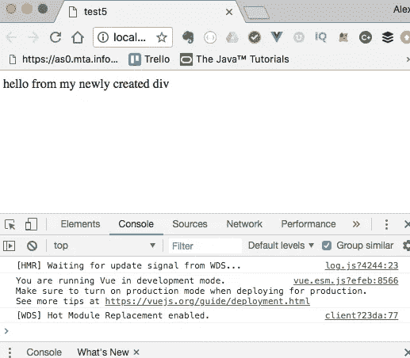

# 检查 Vue 渲染功能

> 原文：<https://levelup.gitconnected.com/examining-the-vue-render-function-ee725ca9e64a>


照片由[通讯社跟随](https://unsplash.com/@olloweb?utm_source=medium&utm_medium=referral)于 [Unsplash](https://unsplash.com?utm_source=medium&utm_medium=referral)

如果您正在使用 [Vue CLI](https://cli.vuejs.org/) 来搭建您的 VueJS 项目(如果您不是，您应该是),您可能已经注意到当您创建一个新项目时，它会为您生成许多文件。其中之一就是`main.js` *。*

如果你打开`main.js`，你会发现这样的东西:

打开并仔细阅读该文件后，你可能会想…*`*render*`*到底在做什么？…那那个* `*h*` *呢？**

*让我们把它拆开，好吗？*

*在第 1 行和第 2 行，我们导入了`Vue`库和`App`组件。在第 4 行，我们有了一个新的`Vue`实例，并向它传递了一个对象文本。*

*对象文字的一部分是一个名为`render`的函数。上面写的是 ES6 箭头函数，但我们也可以写成:*

*我们向 render 函数传递一个参数:`h`*

*`h`是 ***HyperScript*** 中`createElement()`函数的简称。HyperScript 是一种创建 HTML 的语言。([在这里阅读更多关于 HyperScript 的内容)](https://github.com/hyperhype/hyperscript)。因此，如果我们进一步扩展上面的例子，我们会得到:*

*如果你已经使用 web 一段时间了，这个`createElement()`方法应该看起来很熟悉。如果您想查看其功能，[请点击此处查看 MDN 文档。](https://developer.mozilla.org/en-US/docs/Web/API/Document/createElement)*

*对于`createElement()`函数，我们传递一个对我们在第 1 行导入的`App`组件的引用:*

```
*1\. import App from './app/App.vue';*
```

> *扩展名为. vue 的文件被称为 **SFC** 或**单文件组件**。浏览器不知道这个文件是什么，但没关系，因为在构建过程中，文件是用 [vue-loader 插件解析的。然后使用暴露在根 Vue 实例上的`*$mount()*`函数将其插入到 DOM 中。](https://github.com/vuejs/vue-loader)[你可以在这里阅读更多关于 mount()函数的内容。](https://vuejs.org/v2/api/#vm-mount)*

*将我们的注意力转回渲染函数，在这个例子中，*我们将一个单独的文件组件传递给它进行渲染，但是 ***我们不必这样做*** *。*如果我们只想创建一个简单的`div`并将其插入到 DOM 中会怎么样？我们可以这样做:**

**这就给了我:**

****

**现在，当然，这不是一个你可以用`render`函数做什么的真实例子，但是它确实向你展示了它可以提供的能力。**

**大多数时候，内联模板和 SFC 足以满足我们的应用程序开发需求。然而，有时我们可能需要更多的灵活性和能力。很高兴知道我们可以下降到`render()`函数，并使用 Vue 和 JavaScript 的力量进行完全控制。**

**感谢阅读。**

***原载于*[*http://ritzcovan.com*](http://ritzcovan.com/index.php/2018/09/26/vue-render-function-basics/)*。***