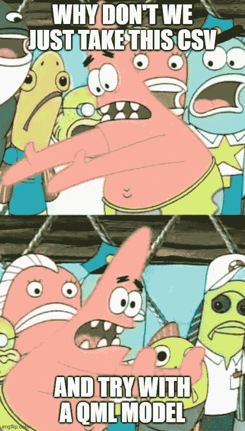
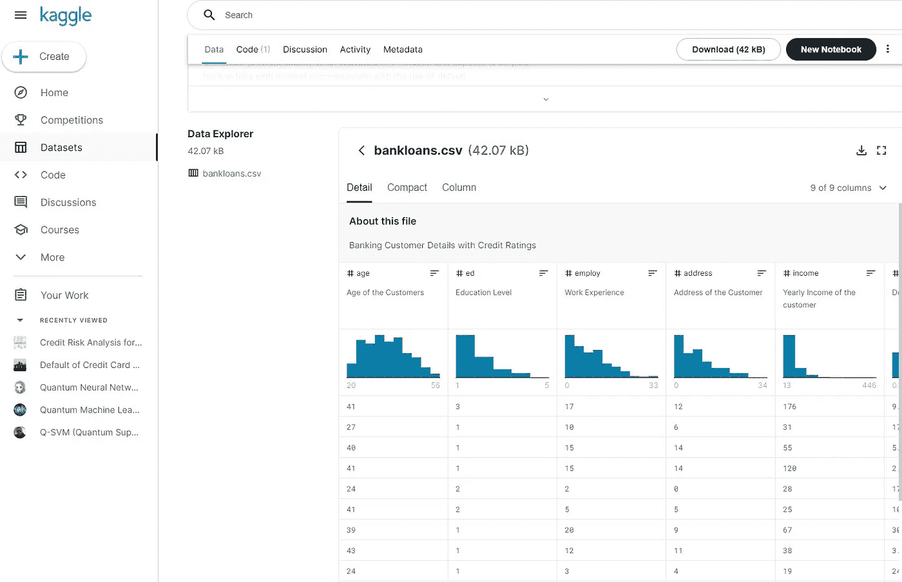

# 例子与现实。如何使用 CSV 中的数据训练量子机器学习模型？

> 原文：<https://levelup.gitconnected.com/example-vs-reality-how-can-i-start-a-quantum-machine-learning-model-from-a-csv-389f98d3ad36>



如果你已经决定从 Qiskit 开始，并一头扎进量子领域的机器学习应用的探索中，你可能很快就会碰壁。你可能浏览了所有的 Qiskit 教科书示例、GitHub 中的一些存储库以及其他一些来源，如 Kaggle、YouTube 教程或量子计算堆栈交换，试图对你的数据做些什么。

在分析了 QSVM、VQC 和/或 QSVC 的一些初步演示后，你会发现几乎所有的都使用了特定的“演示”阵列、内置数据帧或专门准备的虚拟“量子就绪”变量。一个典型的例子是“葡萄酒”数据集。在代码中，您会看到类似这样的内容:

```
**from** qiskit.ml.datasets **import** wine
```

虽然这对于初始测试和熟悉代码很有用，但它缺少所有数据编码、准备(EDA)、降维以及其他几个必要步骤，以便能够在量子电路中使用真实数据。

另一个挑战是使用更多的维度和数据点。几乎所有官方和非官方的 Qiskit 公共代码都使用最小数量的维度和样本进行训练和测试。例如:

```
n **=** 2  *# dimension of each data point*
sample_Total, training_input, test_input, class_labels **=** wine(training_size**=**24,                                                         test_size**=**6, n**=**n, plot_data**=True**)
```

这里的问题是，我们在没有任何深入的“数据工作”的情况下，使用一种非常简单的方法，使用已经准备好作为“好例子”的数据框架，快速地进入特征图、后端、实例和模型定义。然后，过一会儿，当你看到这样的结果时，你会说“找到了”:

```
testing_accuracy : 1.0
test_success_ratio : 1.0
predicted_labels : [0 1 2 2 2 2]
predicted_classes : ['A', 'B', 'C', 'C', 'C', 'C']
```

我很抱歉地通知你，这不是真实世界的结果，但你可能已经知道了。那么我们能做些什么来继续探索但现在使用数据呢？以下是一些步骤和建议:

您可以使用与金融、零售、医疗保健或任何对您有意义的主题相关的 Kaggle 数据集。



要探索的公共数据集

让我们假设您有一个带有基本 EDA、编码和整数目标变量的数据帧。在这种情况下，您可以进行两个简单但重要的步骤:标准化(StandardScaler)，去除平均值并缩放到单位方差，以及降维(PCA)。

```
scaler = StandardScaler()
scaler.fit(df)
df_scaler = scaler.transform(df)n_dim = 3
pca = PCA(n_dim)
pca.fit(df)
df_pca = pca.transform(df_scaler)
```

PCA 中使用的维数必须等于你以后要用来运行量子模型的量子位。

最后，您可以拆分数据集，为 quantum 或混合 quantum 模型创建训练和测试输入，并为算法、特征映射、后端和其他几个需要选择的变量设置您的配置。在这个例子中，你可以看到一个 VQC(变分量子分类器):

```
feature_map = ZZFeatureMap(feature_dimension=feature_dim, reps=2)optimizer = SPSA(maxiter=40, c0=4.0, skip_calibration=True)var_form = TwoLocal(feature_dim, ['ry', 'rz'], 'cz', reps=3)vqc = VQC(optimizer, feature_map, var_form, training_input, test_input, datapoints[0])backend = BasicAer.get_backend('qasm_simulator')quantum_instance = QuantumInstance(backend, shots=1024, seed_simulator=seed, seed_transpiler=seed)result = vqc.run(quantum_instance)
```

关于您将获得的结果，以及使用更多量子位/维度生成这些结果所需的时间，以及使用模拟器和真实量子机器的更多数量的数据点，还有很多问题需要讨论。此外，你将需要经历许多不同的设置和执行几个测试，直到你可以证明一些优势。为此，您有两种选择。

1.  只要跳进 Jupyter 笔记本，开始您的探索。
2.  尝试与 Qiskit 社区和他们的倡导者建立更深入的联系，以增加您的知识并找到一些答案。
3.  联系一些 QML 的专家来指导你完成这个过程，或者向像 Quanvia 这样的公司寻求培训或咨询。

如果你想阅读更多类似的建议和内容，你可以在 Linkedin 上关注我[这里](https://www.linkedin.com/in/mancillamontero/)。

# 分级编码

感谢您成为我们社区的一员！更多内容请参见[升级编码出版物](https://levelup.gitconnected.com/)。
跟随: [Twitter](https://twitter.com/gitconnected) ， [LinkedIn](https://www.linkedin.com/company/gitconnected) ，[时事通讯](https://newsletter.levelup.dev/)
**升一级就是转型科技招聘**👉 [**加入我们的人才集体**](https://jobs.levelup.dev/talent/welcome?referral=true)