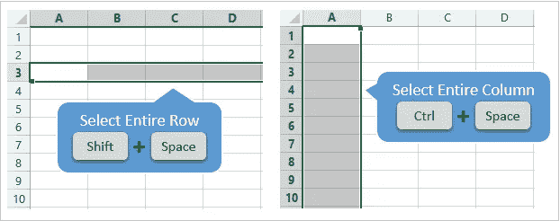
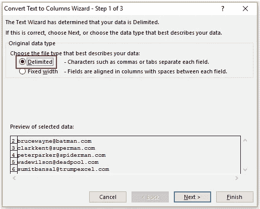
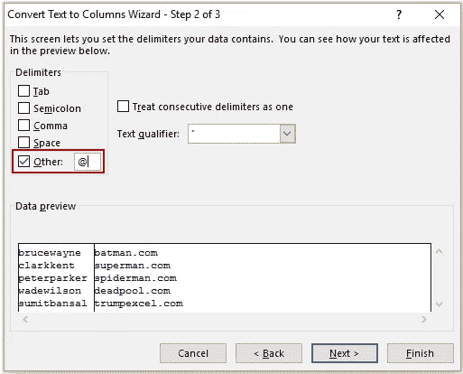
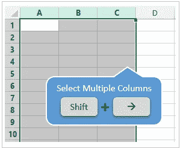

# 每个数据科学初学者都应该学习的 Excel 快捷方式

> 原文：<https://levelup.gitconnected.com/excel-shortcuts-if-mastered-will-help-you-in-your-data-science-career-387340deed87>

## 这些技能永远不会让你失望

图片由 [**安德里亚·皮亚卡迪奥**](https://www.pexels.com/@olly?utm_content=attributionCopyText&utm_medium=referral&utm_source=pexels) 来自 [**像素**](https://www.pexels.com/photo/bearded-man-fixing-motorcycle-in-workshop-3822843/?utm_content=attributionCopyText&utm_medium=referral&utm_source=pexels)

Excel 仍有需求，并将永远有需求。如果你打算从事数据科学领域的职业，你必须很好地掌握 excel。拥有良好的知识并不意味着—你应该知道 excel 是如何工作的。但是，您应该能够快速处理 excel 表格。

现在你会觉得我为什么要让你这个数据科学家学习 excel。当我开始我的数据科学之旅时，我可以感受到我经历过的相同情况。

当我们在数据科学行业工作时，每个项目都会有很多阶段。而且，在每一步，我们都需要与我们的经理或客户联系，以展示进展。他们不会在 Jupyter 笔记本或任何代码编辑器中寻找你的代码；首选的方法是使用 excel 表格来显示结果。

在大多数情况下，模型构建是一个简单的游戏——大多数时候，您将发送 excel 表格来处理结果。

在这里，我分享几个常用的 excel 快捷键，对你的数据科学事业有帮助。

# 1.选择整行或整列

这是最常用的 excel 快捷方式。如果您想要应用任何列或行的任何操作，那么第一步是选择行或相应的列。

选择行快捷键:**Shift+空格**选择列快捷键:**Ctrl+空格**

# 2.在工作表中添加新行或新列

如果您想引入任何新的行或列，那么这个快捷方式会很方便。要首先应用此快捷方式，您需要使用 1 号快捷方式选择行或列。

选择行或列后，可以使用下面的快捷键添加任意数量的行或列。

快捷键**:**Ctrl**+**Shift**+**+****

# **3.删除工作表中的新行或新列**

**要删除任何行或列，请使用 1 号快捷键选择要选择的行或列，然后使用下面的快捷键。**

**如果您想删除多行或多列，则选择任何所需的行或列，然后使用 9 号快捷键选择多行或多列，最后使用下面的快捷键删除它们。**

**快捷键: **Ctrl** + **-****

# **4.删除列中的重复项**

**假设您有一列或一行有重复值，您想去掉这些重复值，那么首先使用 1 号快捷键选择所需的行或列，然后使用下面的快捷键获得没有重复值的数据。**

**快捷键: **Alt** + **A** + **M****

# **5.分隔列值**

**假设您的列中有一个字符串或日期，并且您想使用任何值(分隔符)来分隔它们。在这种情况下，选择所需的列，然后使用提到的快捷方式。将出现如下所示的窗口:**

****

**按下一步按钮。您将看到如下所示的另一个窗口:**

****

**您可以在此定义分隔符值，然后单击“下一步”和“完成”。**

**快捷键**:Alt**+**A**+**E****

# **6.自动调整列宽**

**有时，您的列值无法正常显示。要清楚地查看它们，请使用 Ctrl + A 选择所有数据，然后使用下面的快捷方式。**

**快捷键:**Alt**+**H**+**O**+**I****

# **7.隐藏或取消隐藏行**

**选择要隐藏的行，然后使用下面的快捷方式将其隐藏。您可以使用快捷键 1 和 9 来选择多行。**

**隐藏行快捷键 **: Ctrl** + **9****

**您需要选择隐藏行的相邻行，然后使用下面的快捷方式取消隐藏它们。**

**取消隐藏行的快捷键**:Ctrl**+**Shift**+**(****

# **8.隐藏或取消隐藏列**

**选择要隐藏的列，然后使用下面的快捷方式将其隐藏。您可以使用快捷键 1 和 9 来选择多列。**

**隐藏列的快捷键 **: Ctrl** + **0(零)****

**您需要选择隐藏列的相邻列，然后使用下面的快捷方式取消隐藏它们。**

**取消隐藏列**的快捷键:Alt**+**O**+**C**+**U****

# **9.选择多行和多列**

**使用快捷键 1 选择行或列后，您可以使用下面的快捷键来扩展选择。**

****

**快捷键:**Shift+箭头键****

# **10.将数据粘贴为值**

**有时候，我们不希望公式被复制。在这种情况下，复制相应的行或列，然后使用下面的快捷方式将它们作为值粘贴。**

**快捷键**:Ctrl**+**Alt**+**V****

# **结论**

**本文到此为止。我们已经讨论了每个数据科学爱好者都应该知道的 excel 工作的十个键盘快捷键。这些快捷方式非常方便，每个人都应该使用它们来更好地掌握 excel 工作表。**

**我希望你喜欢这篇文章。更多精彩文章敬请期待。**

**谢谢你的阅读！**

**觉得这个故事有趣？如果你想向我咨询私人问题，请通过 Linkedin 联系我。如果你想直接通过邮件获得更多关于数据科学和技术的令人兴奋的文章，那么这里有我的免费简讯: [Pranjal 的简讯](https://mailchi.mp/4d33914bb328/pranjals-newsletter)。**