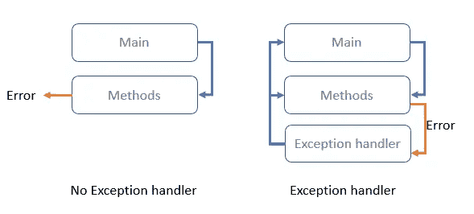
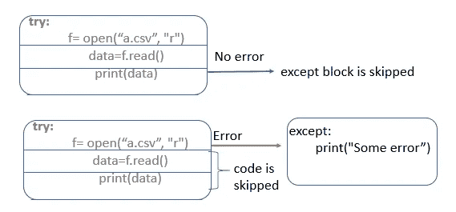
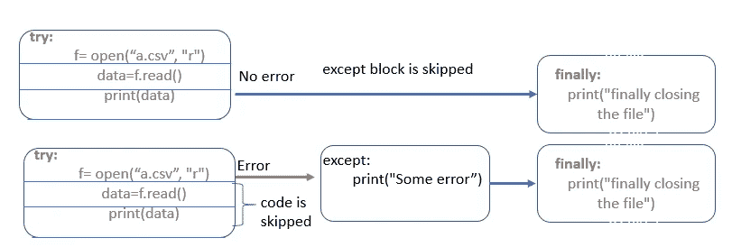
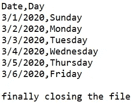
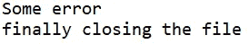
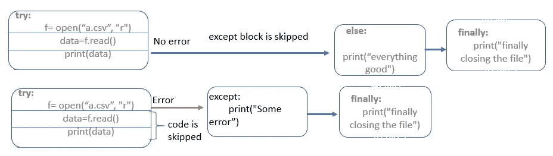
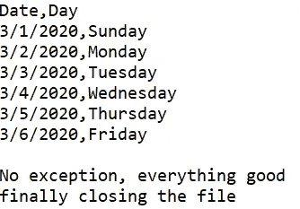

# Python 中的异常处理

> 原文：<https://levelup.gitconnected.com/exception-handling-in-python-1d685b29129c>

## python 中异常处理的简单解释

在本文中，我们将了解:

*   什么是异常，如何在 python 中处理异常？
*   如何处理多个内置异常？
*   如何创建自定义异常？


简·根格在 [Unsplash](https://unsplash.com/s/photos/exceptions?utm_source=unsplash&utm_medium=referral&utm_content=creditCopyText) 上的照片

**异常是程序执行**时出现的错误。当异常发生在运行时，它会寻找一个异常处理程序；如果异常处理程序不存在，那么你的程序会突然停止。如果存在异常处理程序，则执行异常处理程序中的代码。



没有异常处理程序的代码和有异常处理程序的代码

为了处理异常，我们使用了 try、except 和 finally 块。

## **异常处理程序**中的 Try and Except 块

首先，执行 try 块内的代码；如果没有错误，那么 except 块将被跳过。

如果 try 块中有错误，那么 try 块中的其余代码将被跳过。控制被传递到 except 块以处理异常



```
**try:**
    f= open("a.csv", "r") 
    data=f.read()
    print(data)
**except:**
    print("Some error")
```

如果文件 a.csv 存在，那么我们得到文件 a.csv 的内容


输出，当文件 a.csv 存在并且代码中没有错误时，将显示文件的内容

如果文件 a.csv 不存在，那么我们得到消息"*有些错误。*"来自异常处理程序。


当文件 a.csv 不存在时，输出存在

## 异常处理程序中的 finally 块

finally 块是异常处理程序中的可选子句。它用于任何情况下需要执行的任何清理操作。

在两种情况下都会执行 finally 块:成功执行 try 块中的所有语句，以及在 try 块执行期间出现异常。



```
**try:**
    f= open("a.csv", "r") 
    data=f.read()
    print(data)
**except:**
    print("Some error")
**finally:**
    print("finally closing the file")
    f.close()
```

如果文件 a.csv 存在，那么我们得到文件 a.csv 的内容，后跟消息“*最终关闭文件*”，并关闭 finally 块中提到的文件



当代码中没有出现异常时，输出

如果文件 a.csv 不存在，那么我们得到消息“*有些错误*”，后跟消息“*最终关闭文件*”。执行 except 块和 finally 块中的代码



当文件 a.csv 不存在、存在且发生异常时的输出

## 异常处理程序的 Else 块

Else 和 finally 一样也是可选块，但后面必须跟 except 块。当 try 块中没有异常发生时，该块在提供的 try 块之后执行。

如果 try 块中存在异常，则不执行该块



```
**try:**
    f= open("b.csv", "r") 
    data=f.read()
    print(data)
**except:**
    print("Some error")
**else:**
    print("No exception, everything good")    
**finally:**
    print("finally closing the file")
    f.close()
```

如果文件 a.csv 存在，那么我们得到文件 a.csv 的内容，后跟来自 else 块的消息*“无异常，一切正常】，*后跟消息*“最终关闭文件”*，并关闭 finally 块中提到的文件



当代码中没有出现异常时，输出

如果文件 a.csv 不存在，那么我们得到消息“*有些错误*”，接着是消息“*最终关闭文件*”。这不会执行 else 块的代码


当 a.csv 文件不存在时，输出存在并发生异常

## 处理多个内置异常

在下一段代码中，您将学习在 try-except 块中处理多个内置异常。

您将通过在 except 块中指定不同的内置异常来处理这个问题。在下面的例子中，我们正在处理多个内置异常:找不到文件、文件不存在以及 except 块中的权限错误

为了处理除内置异常以外的任何其他异常，我们只指定 except 子句 only

```
**import sys
try:**
    f= open("a.csv", "r") 
    data=f.read()
    print(data)
**except (FileNotFoundError, FileExistsError, PermissionError ) as fnf:**
    print(" Buit-in exception",fnf)
**except:**
    print("Some error in opening and reading file", sys.exc_info())
**finally:**
    f.close()
```

当文件 a.csv 不存在时，我们会得到以下消息。对于任何其他错误，我们会得到堆栈跟踪


## 创建用户定义的异常

为了创建用户定义的异常，我们创建一个直接或间接从**异常**类派生的类，

在下面的例子中，我们创建了一个从 Exception 类派生的类 MyError

```
**class MyError(Exception):
    def __init__(self, col_names):
        self. col_names = col_names
    def getColNames(self):
        return self.col_names**
```

引发用户定义的异常的代码

```
**import pandas as pd
def check_if_column_present(column_name, filename):**
    **try:**
        data=pd.read_csv(filename)
        if column_name in data.columns:
            return True
        else:
            **raise MyError(data.columns)**
   ** except(FileNotFoundError)as fnf:**
        print(fnf)
    **except MyError as error:
        print( " My error", error.col_names)**
    except:
        print(" error in function ", sys.exc_info())**check_if_column_present("a", "a.csv")**
```


用户定义的异常消息

## 结论:

任何编码语言中的异常处理对于优雅地处理运行时可能发生的异常都很重要。在 python 中，您可以使用 **try-except -finally，**块来实现。您还可以创建从 Exception 类派生的用户定义的异常。

## 参考:

[https://docs.python.org/3/tutorial/errors.html](https://docs.python.org/3/tutorial/errors.html)