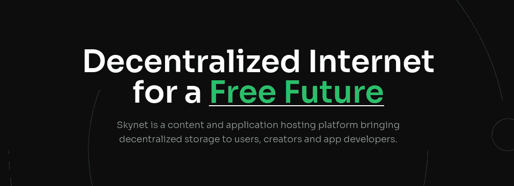

# 卓越的区块链项目

> 原文：<https://levelup.gitconnected.com/exceptional-blockchain-projects-7a1836d549af>

## 只是技术上比其他的更有趣

对于那些刚刚开始关注不同“altcoin”项目的人，我将尝试总结一下我认为技术上更有趣的项目。虽然基本面确实重要，但我绝不暗示这些项目中的任何一个是“好投资”或不是。因此，如果你是一个密码交易者，希望获得未来 2 个月内下一个 100 倍替代硬币的提示，你可能读错了帖子。然而，如果你有兴趣获得我认为在这个领域技术上令人兴奋的悬崖笔记，或者寻找一个可以让你进一步研究具有强大基本面的长期投资的帖子，这篇帖子可能就是为你准备的。

在我开始之前，我首先要指出的是，我跳过了那些已经非常知名的趋势和技术上有趣的项目，如[以太坊](https://ethereum.org/en/)、[卡尔达诺](https://cardano.org/)和[波尔卡多特](https://polkadot.network/)，以保持我的列表在可控的范围内。闲话少说，这里是我最喜欢的 12 个:

## 宇宙网络

Cosmos 对于构建你自己的区块链/dapp 来说简直太棒了。要开始使用一个完整的区块链模板，并为您准备好令牌、帐户和钱包，您只需在安装 Starport 后执行 2 个命令:

瞧啊。一切都准备就绪，您可以检查它显示的 localhost 链接，看看那里已经有了什么:

很神奇吧？难怪一些最大的项目都是用 [Cosmos](https://cosmos.network) 建造的。它搭建了一切，否则将重新发明车轮，让您专注于项目的真正创新。您还会注意到，事务处理速度非常快，并且 [IBC](https://ibcprotocol.org/) 将允许健壮的跨链兼容性，这对于构建成功的 dapps 极其重要。

对于要求“掉名”的人来说，用[宇宙](https://cosmos.network)打造的[币安链](https://docs.binance.org/)和[币安智能链](https://www.binance.org/en/smartChain)。你也可以在这里看到基于 Cosmos 的其他项目。

关于 [Cosmos](https://cosmos.network) 有太多的东西会让这篇文章变得太长，所以我建议你从他们的[网站](https://cosmos.network)和文档开始，看看关于你自己的炒作是什么。

## 阿卡什网络

说到在 Cosmos 上的构建， [Akash Network](https://akash.network) ，一个抗审查、无权限、自主的开源云也是在 Cosmos 上构建的！如果你在工作或娱乐中使用 Kubernetes 或 containers，你会爱上这个项目。它本质上允许您在世界各地一些最强大的数据中心和计算资源上托管您的容器，而成本只是我们现有云服务(如 AWS、Google 和 Azure)的一小部分。你可以从我以前的一篇文章[这里](https://medium.datadriveninvestor.com/dramatically-reducing-cloud-costs-120e7937ad4)了解更多关于这个项目的信息，或者访问他们的[网站](https://akash.network)。

## 天网

天网[又名 SiaSky 是一个非常酷的构建 dapps 的解决方案，但它最出名的可能是它的存储能力和内容交付的速度。它甚至有一个 dapp 商店，你可以通过他们轻松地将你的应用货币化。似乎 Akash 社区对使用 Akash 进行计算和使用 Skynet 进行存储很感兴趣。](https://siasky.net/)

## 斯托尔杰

您是否正在利用 S3 或其他云提供商的数据块存储服务在 AWS 上积累的丰富经验来构建 dapp？嗯， [Storj](https://www.storj.io/) 大概就是你的答案了。这是一个分散的对象存储解决方案，向后兼容 S3。

## IPFS + Filecoin

IPFS 和 T2 的组合是建立去中心化互联网的最早领导者之一。这也是存储/归档文件的绝佳解决方案。虽然随着时间的推移，出现了许多其他类似的解决方案，但这个与斯坦福大学有着密切联系的项目一直保持着强大的优势，并克服了所有困难。

## 索拉纳

[索拉纳](https://solana.com/)最近成为人们谈论最多的小盘股之一。我的一些加密投资者联系人都全力支持索拉纳的承诺，即成为交易速度超快、成本低的区块链。从概念上来说， [Solana](https://solana.com) 可以[每秒处理高达 65，000 次交易](https://www.gemini.com/cryptopedia/solana-blockchain#section-a-new-blockchain-architecture-proof-of-stake-and-proof-of-history)。它甚至可以实时更新 chain 上已经发生的交易数量，并在主页上不断更新。[阿卡什还选择索拉纳作为处理智能合同的技术人员](https://solana.com/ecosystem/akash)，因为阿卡什的首席执行官认为[索拉纳](https://solana.com/)是现有的最佳解决方案。

以低成本进行超快速交易的副作用是，索拉纳的区块链规模极其庞大。了解到这种衰落， [Solana 决定与 Arweave 合作来处理永久数据存储](https://solana.com/ecosystem/arweave)，这对他们来说似乎是一个伟大的举动。

## 希腊字母的第八字

Theta 希望用区块链颠覆视频交付领域，就像 Youtube 和 Twitch 在 web2.0 时代所做的那样。它已经有了一个工作产品，很多事情都做对了。顾问团队中也有一些重量级人物，比如陈士骏(YouTube)、贾斯汀坎(Justin Kan)和张帆(红杉资本)。

## 核菲尔

对于普通人来说，安全和加密似乎总是一个无聊的话题，但是，它却是现实世界中使用的所有技术中如此相关的一部分。正如过去所证明的那样，虽然区块链的概念比它的前辈们更安全，但它并不是不可战胜的。NuCypher 正在寻求提供额外的加密基础设施([秘密管理](https://www.nucypher.com/secrets-management)和[动态访问控制](https://www.nucypher.com/dynamic-access-control))，以便为用户提供更加安全且隐私友好的 dapps。

## 勇敢的奖励

我能说什么… [勇敢](https://brave.com)是我最喜欢的浏览器。除了一开始是一个很棒的浏览器之外，它还带有一个基于隐私的区块链广告机制，名为[勇敢奖励](https://brave.com/brave-rewards/)。你可以通过使用你的浏览器赚钱。真的没有其他东西能与之媲美。

## 神秘物质

Mysterium 并不是 dVPN 领域唯一的玩家。然而，这是我尝试时唯一有效的跨平台解决方案。最棒的是，在你开始购买 myst 币来支付他们的 VPN 服务之前，你可以免费试用。

## 图表

[图](https://thegraph.com/)为开发者提供了一种创建子图(自定义 API)的方式，以访问以太坊和 IPFS 索引的开放数据。还需要我多说吗？这绝对是 dapp 方程式的关键部分。

## 互联网计算机

由于部分闭源的性质和治理的某些方面(允许并需要标准化的硬件)，我对这个项目有复杂的感觉，但仍然值得一提。这个项目是由瑞士的一个非营利组织发起的，它已经存在了一段时间，因此它作为一个合法的项目赢得了散户投资者和机构的信任。最近，它在比特币基地和币安上市，在短短的 24-48 小时内，它从 0 美元涨到了 750 美元。这是多么疯狂的牛市啊，或者我的其他一些朋友可能会称之为“抽水和倾倒”。

那么什么是[互联网电脑](https://dfinity.org/)？想想以太坊，它不仅覆盖应用层，还计划取代整个互联网体系，包括网络，以取代我们现有的互联网。过去，他们运行的 Linkedin 的分散版本和集中版本一样快。

他们过去曾因其网络神经系统(NNS)成分而受到批评。有人说，这一部分对隐私有负面影响，而不是解决现有互联网的问题，即少数暴君统治一切，它将有一个新的巩固的暴君。这是否给了一个组织太多的权力？我让你来判断。

不用说，由于这个项目的范围如此之大，我建议你自己去看看他们的[网站](https://dfinity.org/)来了解更多，因为如果我不得不分享关于[互联网计算机](https://dfinity.org)的所有基本概念，这篇帖子会变成一本书。

## 就是这样！

希望这 12 个技术上更有趣的项目将成为你研究下一个大型 dapp 项目或长期投资的良好垫脚石。

## 更新:2021 年 9 月 23 日

如果你觉得这篇文章很有趣，你可能也会对我最近关于区块链项目的文章感兴趣，这些项目可能会定义云计算的未来:

 [## 深入了解 Web3 计算空间

### 利用区块链实现分散计算的项目

hkdb.medium.com](https://hkdb.medium.com/a-look-into-the-web3-compute-space-b599c4c22b71)