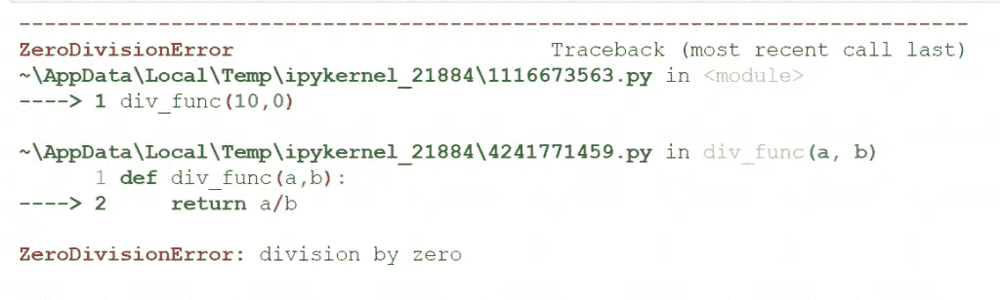

# Python 中的异常

> 原文：<https://levelup.gitconnected.com/exceptions-in-python-3eacaa894e4c>

## 关于 Python 中异常的实践教程


由[阿尔伯特·斯托伊诺夫](https://unsplash.com/@albertshere?utm_source=medium&utm_medium=referral)在 [Unsplash](https://unsplash.com?utm_source=medium&utm_medium=referral) 拍摄的照片

[](https://jorgepit-14189.medium.com/membership) [## 用我的推荐链接加入媒体-乔治皮皮斯

### 阅读乔治·皮皮斯(以及媒体上成千上万的其他作家)的每一个故事。您的会员费直接支持…

jorgepit-14189.medium.com](https://jorgepit-14189.medium.com/membership) 

在本教程中，我们将为您提供一个 Python 中异常处理的示例。为简单起见，我们将使用除法函数。先说一个简单的版本。

```
def div_func(a,b):
    return a/bprint(div_func(10,2))5.0
```

该功能似乎工作正常。但是让我们看看当我们要求除以 0 时会得到什么。

```
print(div_func(10,0))
```



正如我们所看到的，我们得到了上面的错误。使用`try-except`语句，我们可以处理这些错误。假设我们想返回消息“你不能被 0 除”。

```
def div_func(a,b):
    try:
        return a/b
    except:
        return "You cannot divide by 0"print(div_func(10,0))You cannot divide by 0print(div_func(7,2))3.5
```

正如我们所看到的，我们设法“处理了这个错误”，但我们理所当然地认为错误是被零除。好消息是，我们可以使用基类**异常**，它用于 Python 中编写的所有异常。我们可以通过在异常后使用“**as e”**返回异常消息，作为异常的别名。

```
def div_func(a,b):
    try:
        return a/b
    except Exception as e:
        return eprint(div_func(10,0))division by zero
```

正如我们所看到的，我们返回了由类“Exception”检测到的错误。我们还可以使用`e.__class__`来访问错误类型。

```
def div_func(a,b):
    try:
        return a/b
    except Exception as e:
        return e.__class__print(div_func(10,0))<class 'ZeroDivisionError'>
```

让我们看看另一个例子，我们要求除以字符串，在这种情况下，与“**两个**”。

```
def div_func(a,b):
    try:
        return a/b
    except Exception as e:
        return eprint(div_func(10,"two"))unsupported operand type(s) for /: 'int' and 'str'
```

如果我们知道预期误差，我们可以在`except`语句中定义它。例如:

```
def div_func(a,b):
    try:
        return a/b
    except ZeroDivisionError as e:
        return eprint(div_func(10,0))division by zero
```

最后，重要的是要知道，我们可以处理不止一个异常。例如:

```
def div_func(a,b):
    try:
        return a/b
    except ZeroDivisionError as e:
        return e
    except Exception as e:
        return eprint(div_func(10,"5"))unsupported operand type(s) for /: 'int' and 'str'
```

# 引发异常

如果条件发生，我们可以引发一个异常。例如:

```
x = 101if x >= 100:
  raise Exception("All numbers must be less than 100")
```

这个异常将停止程序。

最初由[预测黑客](https://predictivehacks.com/exceptions-in-python/)发布

# 分级编码

感谢您成为我们社区的一员！在你离开之前:

*   👏为故事鼓掌，跟着作者走👉
*   📰查看[升级编码出版物](https://levelup.gitconnected.com/?utm_source=pub&utm_medium=post)中的更多内容
*   🔔关注我们:[Twitter](https://twitter.com/gitconnected)|[LinkedIn](https://www.linkedin.com/company/gitconnected)|[时事通讯](https://newsletter.levelup.dev)

🚀👉 [**加入升级人才集体，找到一份神奇的工作**](https://jobs.levelup.dev/talent/welcome?referral=true)