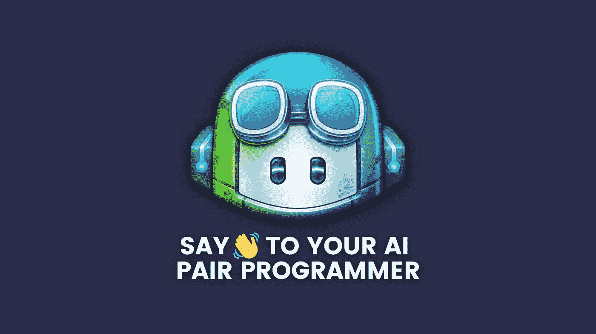
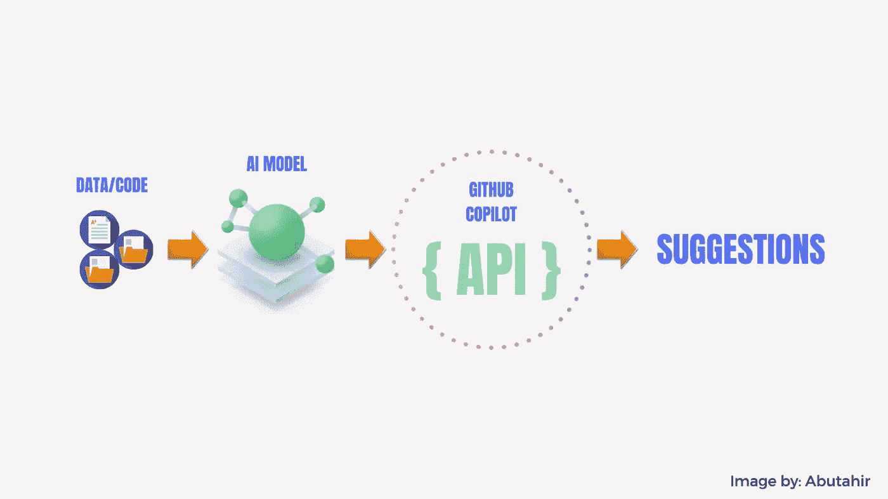

# 对 GitHub Copilot 感到兴奋？使用风险自担！

> 原文：<https://levelup.gitconnected.com/excited-about-github-copilot-use-it-at-your-own-risk-9ee692cafec8>

## GitHub copilot 工作原理的全面分析

由 Canva Design 创建

> *本文*与[*穆罕默德·阿布塔希尔*](https://medium.com/u/2d93514313d?source=post_page-----f7b2578c44af--------------------------------) *合著，你可以在*[*LinkedIn*](https://www.linkedin.com/in/abu-tahir-bb05741a2/)*和*[*insta gram*](https://www.instagram.com/learn_ai_stack_/)*上找到他。*

最近我在网上冲浪时，在 GitHub copilot 上看到了一个 YouTube 视频。看到人工智能如何改变全球程序员的生活，我感到很惊讶。但是感觉有些不对劲。这个人对它吹嘘得太多了，它似乎不适合软件的测试版本，所以我想深入研究一下这个系统，看看它是如何工作的。

如果你不知道 GitHub copilot 是什么，那么让我告诉你，GitHub copilot 是 GitHub 和 OpenAI 组织发布的一个智能 AI 系统，它可以为你的代码提供适当的建议，并可以根据你提供的评论生成完整的功能！这给了它另一个名字叫人工智能配对程序员。

这样想，我们可能会写一些代码，当遇到困难时，我们会上网搜索一些关于堆栈溢出的代码，然后粘贴或作为一个建议，对吗？但是这种痛苦大大减少了，因为我们写了一个整洁的注释，我们得到了一个出色的代码！

> 那么，公司的下一轮招聘会是什么样的呢？好的评论作家？只是开玩笑！

## GitHub copilot 是如何工作的？

好了，要理解这一点，我们先来了解 OpenAI 开发的一个类似的系统。

正如我之前提到的，它是由 GitHub 和 OpenAI 组织发布的，OpenAI Systems 也开发了一个类似的人工智能系统，称为 **Codex** ，Codex 是一个将自然语言转换为简洁编程代码的系统，它基于 GPT 模型，即迁移学习模型。

它预先训练了数十亿行文本，并通过使用深度学习技术给你一种人类形式的文本。Codex 是一个系统，它使用公开可用的 GitHub 代码作为输入数据，使用 GPT 模型，这是一个转换器模型，并为您提供一个编程代码，您可以将其用作建议或直接使用。

*查看*[*Codex*](https://youtu.be/SGUCcjHTmGY)*现场演示。*

Codex 最初是为了检查人工智能编写 Python 代码的能力而设计的，它表现得非常好，但它的准确性很低，当输入作为评论提供时，它解决了 28.8%的问题，这是在一个名为 [Human-Eval](https://github.com/openai/human-eval) 的程序上评估的，但这没什么，因为生成一个不是由任何人编写的代码是一件非常独特的事情。但是，通过重复采样，结果得到了改善，每个问题取 100 个样本，真的有效！结果有 70%的准确率。

# 和 GitHub copilot 有什么关系？

codex 的惊人技术为 GitHub copilot 提供了地下基础。然而，这里使用的是不同版本的 OpenAI codex，不像以前为 Python 设计的 codex，copilot 可以理解几乎所有的编程语言，这使它非常强大。

它可以给出 10 条左右的建议供你选择，你可以用它作为建议代码，也可以直接使用它，并根据你的需要进行修改！

作者 [Muhammad Abutahir](https://www.linkedin.com/in/abu-tahir-bb05741a2/) 创作的图片:展示 GitHub 副驾驶的高级系统

让我们以一种详细的方式来理解图像，抽象地说，我们可以说公共代码作为输入被发送到模型，模型处理信息并将结果路由到中间 API，在我们的例子中是返回建议的 GitHub 服务。

一件很酷的事情是，如果你是接受建议的代码或拒绝它的基础上，它学习的副驾驶记录。

用一种简单的方式来解释它，我会说它遵循任何基本聊天机器人的策略，即理解意图，给出模式。

向前推进一步，像上下文记忆技术一样跟踪您提供的评论的上下文，但是，在这种情况下，只有一部分代码被 GitHub copilot 服务处理，而不是整个代码，所以它是安全的，您不必太担心。

## 但是有什么风险呢？

GitHub Copilot 由 OpenAI codex 在后台运行，它使用的输入是互联网上各种来源的公共代码，也来自公共 GitHub Repos，这些代码可能充满错误，也可能是敏感的，Copilot 可能会给出意想不到的结果，也可能不总是工作。然而，作为一名程序员，接受还是拒绝取决于你。

你提供的评论必须非常具体，以便从我们的结对程序员那里得到更多，否则，它可能会给出不希望的结果。

根据 copilot 团队最近的官方结果，该模型的准确率约为 43%，经过多次尝试后，准确率为 57%，所以你可以看到它仍处于学习阶段。

生成的代码基于提供的数据。它可能是错误的代码，也可能是最好的代码，它没有经过系统的实际测试，所以使用它要自担风险！使用前仔细检查。此外，因为它使用了数十亿行代码，所以代码语法或库或任何 API 可能会被否决，直到现在。所以我们必须非常小心。这就是为什么它是一名副驾驶员，而你是真正的 T2 飞行员，负责接受或拒绝代码。

我个人认为人工智能在本世纪蓬勃发展。我们可以在任何地方看到人工智能驱动的系统，整个世界正在变成人工智能的游乐场。

在这篇文章中，我们看到了人工智能的一个奇妙的用例。GitHub copilot 是一个巨大的作品，我相信它会改进到我们甚至无法想象的阶段，但是现在，从初学者的角度来看，在编写人工智能生成的代码时，必须更加小心。

说完这些，感谢您的阅读，**编码快乐！**