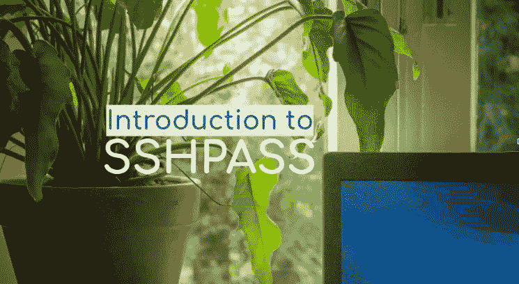

# 使用 sshpass 在远程机器上执行命令

> 原文：<https://levelup.gitconnected.com/execute-commands-on-remote-machines-using-sshpass-1f9bc4452e15>



在这篇博客中，我将解释 **sshpass** 如何帮助我们提高日常系统管理工作的效率。虽然这不是连接到远程机器的安全方式，但是我们仍然可以使用 **sshpass** 来连接内部网机器，运行不同的命令来快速获得结果，例如检查远程机器的正常运行时间，检查远程机器的磁盘使用情况，或者检查机器的软件版本等。

通常我们会运行`ssh`命令，通过基于密钥的登录或使用用户名和密码登录到远程机器。在这个过程中，我们必须登录到远程机器，然后运行命令以获得期望的结果，但是如果我们可以从我们自己的机器在远程机器上运行命令，并且可以在同一台机器上而不是在远程机器上获得结果，那么…:)为此，我们有 **sshpass** 来启用这个功能。

使用 **sshpass** ，我们可以直接从我们的机器上执行远程机器上的命令，并且可以从远程机器上获得结果。这就是对 **sshpass** 的介绍，现在让我们继续前进，开始实现它，但在此之前，我们需要安装 **sshpass** 。

**安装 sshpass:**
我将解释如何在基于 CentOS 的发行版和基于 Ubuntu 的发行版上安装 sshpass。
1)基于百分位的分布

```
yum -y install sshpass
```

2)基于 Ubuntu 的发行版

```
apt-get install sshpass
```

通过执行上面的命令，我们可以在我们的机器上安装 **sshpass** 。安装 **sshpass** 后，我们可以通过输入以下命令看到与 **sshpass** 相关的帮助:

```
sshpass -h
```

这给了我们以下的回应:

```
Usage: sshpass [-f|-d|-p|-e] [-hV] command parameters
 -f filename Take password to use from file
 -d number Use number as file descriptor for getting password
 -p password Provide password as argument (security unwise)
 -e Password is passed as env-var "SSHPASS"
 With no parameters - password will be taken from stdin -h Show help (this screen)
 -V Print version information
```

通过查看 help 命令响应，您可能会知道如何执行该命令。现在让我们执行命令，在远程服务器上执行命令。

要获得远程机器的正常运行时间的详细信息，我们可以执行以下命令:

```
sshpass -p 'yourpassword' ssh user@192.168.12.xx 'uptime'
```

如果我们想查看机器的详细信息，我们可以执行以下命令:

```
sshpass -p 'yourpassword' ssh user@192.168.12.xx 'uname -a'
```

要检查磁盘使用情况，我们需要运行以下命令:

```
sshpass -p 'yourpassword' ssh user@192.168.12.xx 'df -h'
```

通过这种方式，我们可以直接在远程机器上执行任何 Linux 命令，并且可以在我们的机器上得到结果。这些命令将在屏幕上显示结果，但如果我们想将结果写入文件，只需提供大于号符号将输出重定向到文件即可:

```
sshpass -p 'yourpassword' ssh user@192.168.12.xx 'df -h' > /var/tmp/disk_usage
```

我们还可以通过使用分号添加命令来一次执行多个命令:

```
sshpass -p 'yourpassword' ssh user@192.168.12.xx 'uptime;uname -a;df -h'
```

这样，使用 **sshpass** ，我们可以从不同的远程服务器获取详细信息，并将它们写入文件，这样我们就不需要登录不同的机器来获取所需的详细信息。通过在 cron 中添加这些命令，我们可以自动化日常活动。不建议在生产机器上使用此命令。

如果您有任何疑问，请留下您的评论。如果你喜欢这个博客，请鼓掌并分享。你也可以在推特上关注我:【https://twitter.com/anu4udilse】T2

【https://bqstack.com】最初发表于[](https://bqstack.com/b/detail/79/Execute-Commands-on-Remote-Machines-using-sshpass)**。**