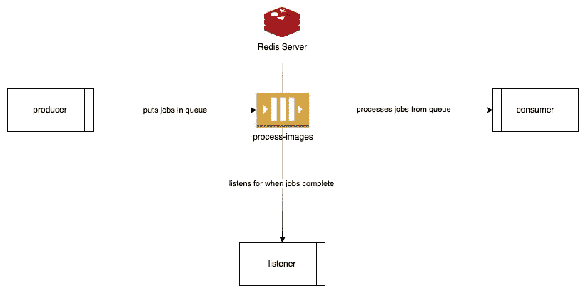

# 在后台执行长时间运行的作业[Node.js]

> 原文：<https://levelup.gitconnected.com/execute-long-running-jobs-in-the-background-node-js-e74e12163fef>

使用 Bull —快速教程


图片来自 [Pixabay](https://pixabay.com/?utm_source=link-attribution&amp;utm_medium=referral&amp;utm_campaign=image&amp;utm_content=6948569) 的 [Pafka Zorg](https://pixabay.com/users/pafka_zorg-14533931/?utm_source=link-attribution&amp;utm_medium=referral&amp;utm_campaign=image&amp;utm_content=6948569)

这是我在 Node.js 世界中第一次遇到长时间运行的作业。不过，我在 Ruby 和 Python 世界中已经做过多次了。因此，我也将在 Node.js 中使用类似的工具。

我已经决定使用 [Bull](https://github.com/OptimalBits/bull) ，这是一个非常流行的在后台异步执行长时间运行的作业/任务的包。

我是这样做的:

[ [源代码在此处](https://github.com/pmatsinopoulos/try_bull)

# 初始化演示项目

创建一个文件夹来处理您的演示项目。示例:

```
$ mkdir try_bull
```

假设您已经安装了`node`和`yarn`，运行:

```
$ yarn init
```

回答问题，你就可以安装`bull`了。

# 安装公牛

如下使用`yarn`:

```
$ yarn add bull
```

# Redis 服务器

确保您已经在本地机器上安装并运行了 [Redis 服务器](https://redis.io/)。

Bull 使用 Redis 来存储用于后台处理的作业。我们的小演示需要您运行 Redis 并监听默认端口 6379 上的连接。

# 演示架构

这是我们将要做的:



演示架构

## 队列

我们需要一个队列来注册异步处理的作业。这个队列将驻留在 Redis db 中。

## 生产者

我们需要一个能把工作放到队列中的制片人。这将是`./src/producer.js`。

## 消费者

我们需要一个工人或消费者从队列中取出作业并执行它们。这将是`./scr/consumer.js`。

## 听众

这不是必须的，但是通过引入第三个监听作业完成的进程，将结果的处理从消费者进程中分离出来是很好的。这是监听器，在`./src/listener.js`中实现。

# 代码

让我们来看看上述每个组件的代码部分:

## 生产者

*   第 4 行:我们通过名称(`processing-image`)来访问队列。如果 Redis db 中不存在该队列，将会创建它。
*   第 9 行和第 11 行:我们在队列中添加了两个作业。`#add()`方法可以达到这个目的。您可以将任何可以序列化为字符串的 JavaScript 对象作为参数传递。然后，该对象将在消费者/工作者端被自动反序列化，以便消费者能够访问完全相同的数据。
*   第 15 行:我们只是解雇生产者，让他把作业放到队列中。

## 消费者

*   第 5 行:我们通过名称(`processing-image`)访问队列。
*   第 7–14 行:我们定义处理逻辑。这在一个内联定义的`async`函数中实现，并作为参数传递给`#process()`方法。
*   第 8 行:看看我们如何访问生产者传递的数据。它是`job.data`的对象。
*   第 10 行:我调用我的长时间运行的作业。
*   第 12 行:我返回一个对象作为结果。这将由收听者访问。
*   第 16 行:我只是启动消费者。它将等待作业排队。

## 听众

*   第 4 行:监听器访问命名队列(`processing-image`)。
*   第 6–8 行:我们注册了一个全局事件处理程序来处理特定队列上作业的完成。
*   第 7 行:监听器作业完成处理程序可以访问消费者返回的结果。
*   第 11 行:我们启动监听器。

# 启动脚本

启动脚本在`package.json`文件中定义:

```
"scripts": {
  "producer": "node src/producer.js",
  "consumer": "node src/consumer.js",
  "listener": "node src/listener.js"
},
```

打开终端并启动消费者:

```
npm run consumer
```

打开另一个终端并启动监听器:

```
npm run listener
```

打开第三个终端来启动生成器

```
npm run producer
```

您将看到消费者消费和侦听器响应完成事件。

# 结束语

这是一个测试 Bull 的快速教程，Bull 是 Node.js 的一个非常强大的后台作业框架。

我从你身上学到的总是比你从我身上学到的多。因此，我们非常欢迎您的评论。