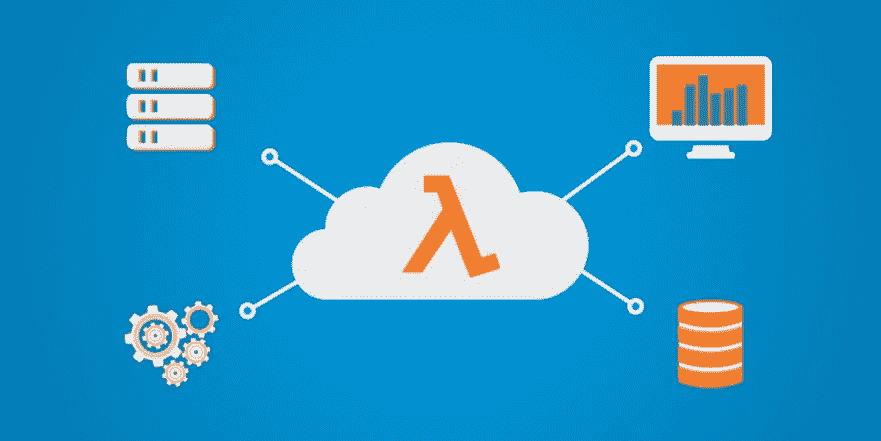
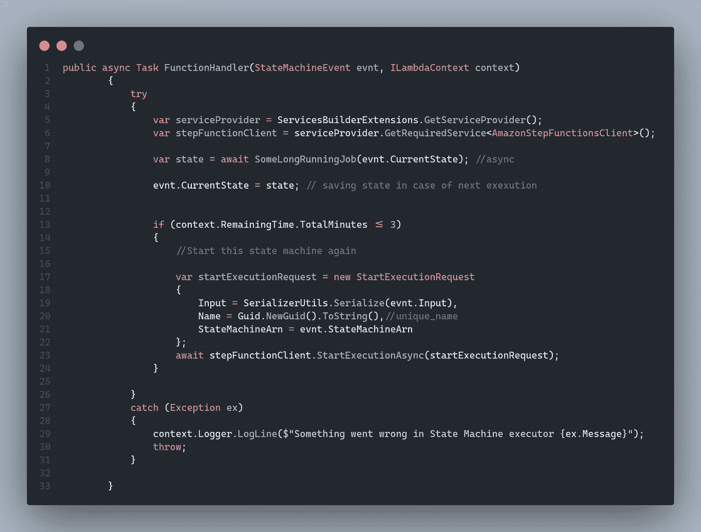

# 在 AWS Lambda 中执行长期运行的任务/流程

> 原文：<https://levelup.gitconnected.com/executing-long-running-tasks-in-aws-lambda-de983c0df0b>

[**AWS**](https://aws.amazon.com/lambda/) Lambda 是一个事件驱动、 [**无服务器**](https://aws.amazon.com/serverless/) 的计算平台，它执行你的代码来响应事件。无服务器或多或少支持几乎所有的用例，但是有一件事仍然需要思考和寻找方法，那就是使用 lambda 来执行长时间运行的任务。

为此，我们有许多其他选项，但它们并不经济高效，而且其他选项需要更多的工作，从使用案例的角度来看，这有点昂贵。例如，我们想将旧数据从 s3 迁移到其他数据源，如 Elasticsearch 或 DynamoDB。

为此，如果我们启动一个 EC2 实例并运行一个系统或 windows 服务来进行数据迁移，这将浪费大量资源，而且不是一个好的工程实践，因为我们可以使用无服务器，这在开发、工作和资金方面更具成本效益。

现在阻止我们的是 AWS Lambda 执行超时，这是有限的
为此，我们有许多方法，其中一种方法是通过在[状态机](https://docs.aws.amazon.com/step-functions/latest/dg/amazon-states-language-state-machine-structure.html)中执行 Lambda，并跟踪您的当前状态。

这是 C#中的代码示例，我们通过跟踪 lambda 执行的剩余时间来重新启动我们的状态机，最重要的是记住我们的当前状态以备下次执行，因为我们不想一次又一次地执行相同的逻辑，陷入无限循环。

希望你得到了，并享受阅读。如果你有任何疑问，请在评论区告诉我。