# 零停机扩展 AWS EBS

> 原文：<https://levelup.gitconnected.com/expand-aws-ebs-with-zero-downtime-197469b34cf7>

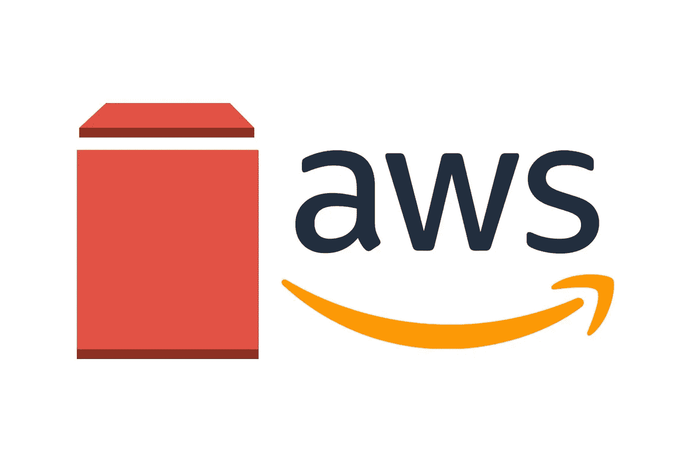

每当您需要扩展 EBS 卷大小时，都可以应用这种方法，以避免停止实例和分离卷。

让我们开始吧。

SSH 到您的实例，并查看可用的存储

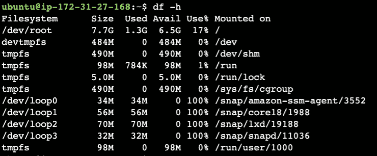

可以看到，存储是 8G aprx。

您可以通过以下方式查看您的

```
df -h
```

现在让我们展开它。

# 步骤:-

从服务列表中选择“EC2 ”,然后选择要扩展的实例

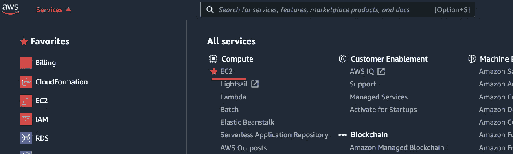

单击 EC2 描述下的卷 ID

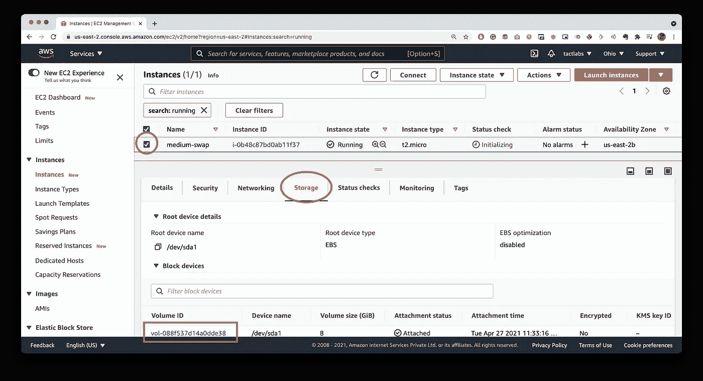

选择要调整大小的卷，右键单击“修改卷”

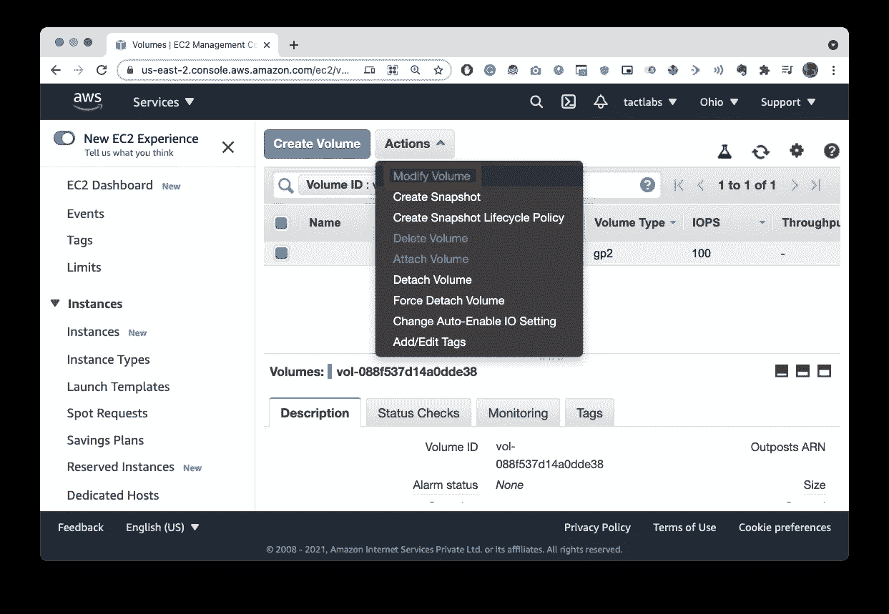

为您的 EBS 卷设置新的大小(在本例中，我将 8GB 卷扩展到 16GB)

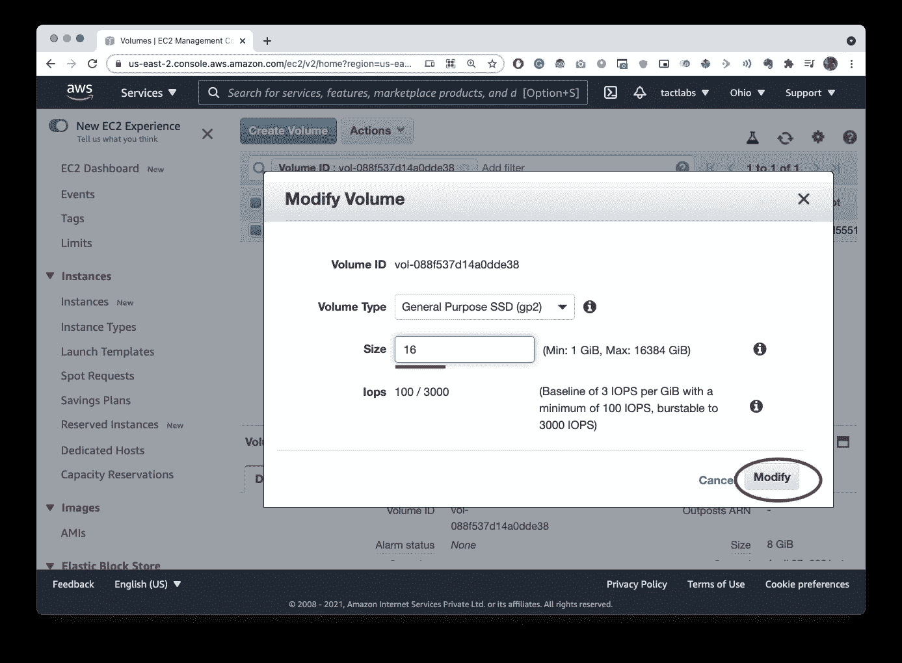

点击是

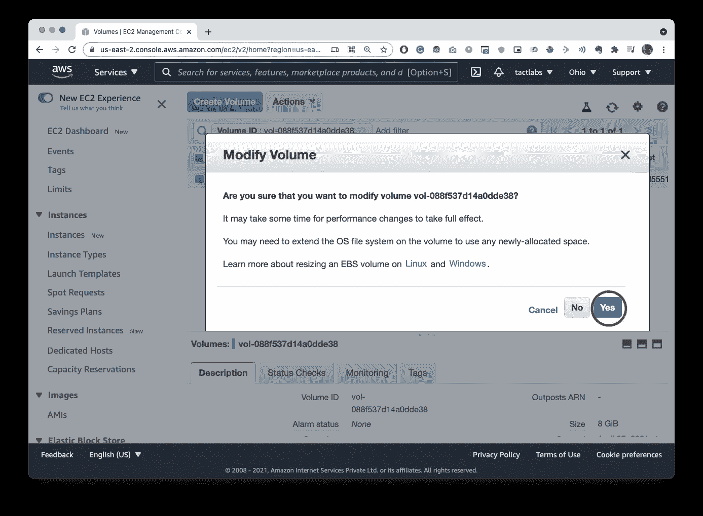

检查附加到 EC2 实例的大小

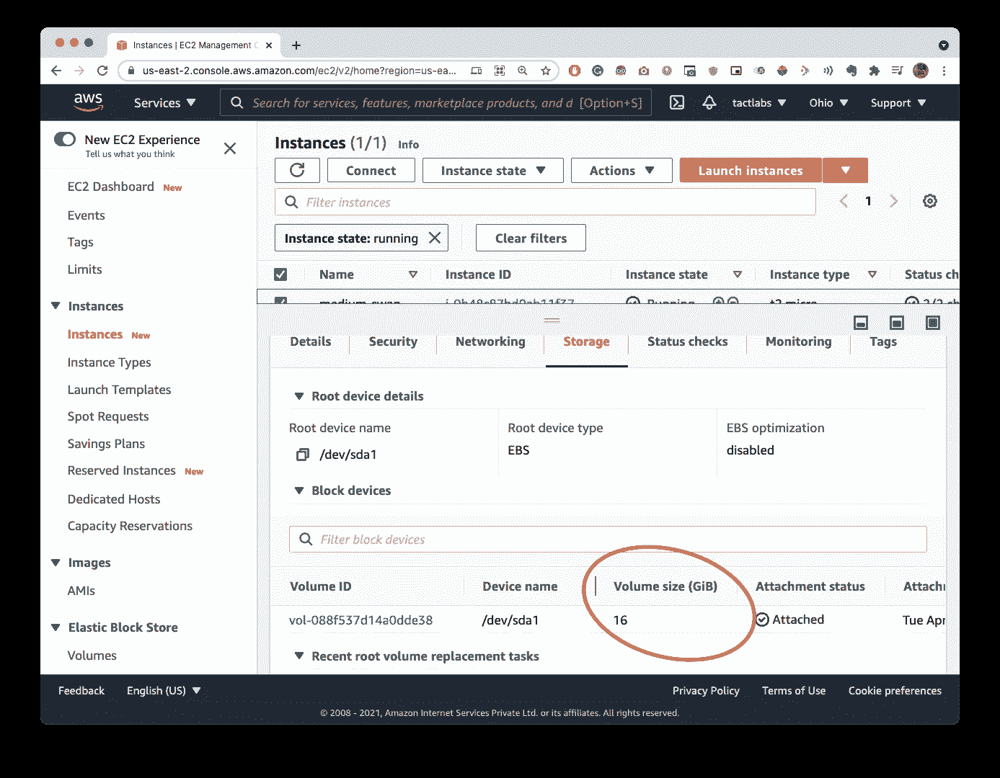

现在，我们需要扩展分区本身。

SSH 或通过任何其他方法连接到 EC2 实例，我们刚刚扩展的 EBS 连接到该实例。

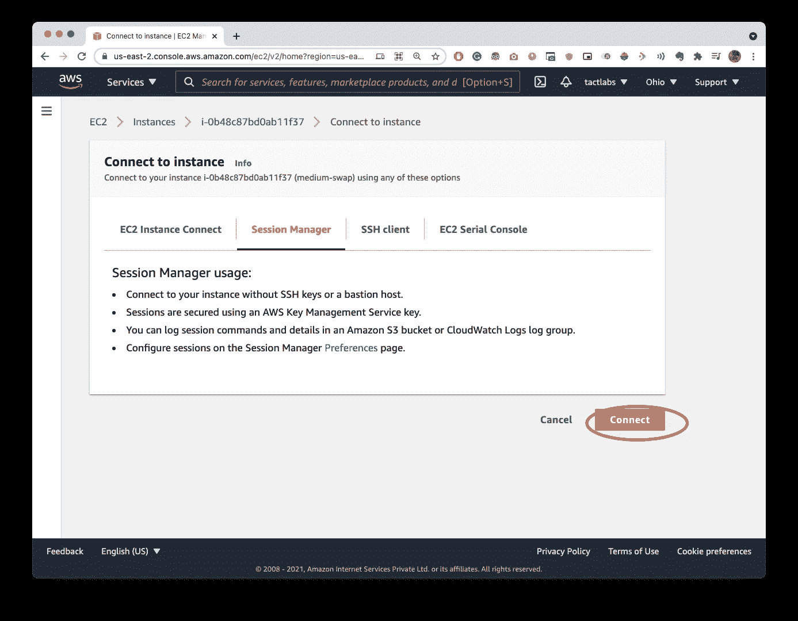

键入以下命令以列出我们的块设备:

```
lsblk
```

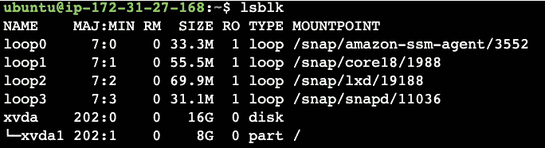

正如您可以看到的，根卷的*大小反映了新的大小 16GB，分区的大小反映了原始大小 8 GB，并且在您可以扩展文件系统*之前必须进行扩展。

为此，请键入以下命令:

```
sudo growpart /dev/xvda 1
```

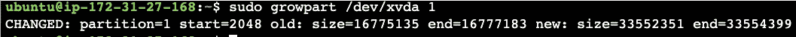

> *小心，设备名和分区号之间有一个空格！*

现在，我们可以检查分区是否反映了增加的卷大小(我们可以使用已经使用过的 lsblk 命令进行检查):

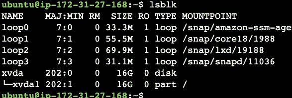

最后但同样重要的是，我们需要扩展文件系统本身。
如果您的文件系统是 ext2、ext3 或 ext4，请键入:

```
sudo resize2fs /dev/xvda1
```

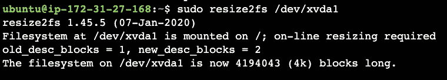

如果您的文件系统是 XFS，请键入:

```
sudo xfs_growfs /dev/xvda1
```

最后，我们可以通过键入以下命令来检查我们的扩展文件系统:

```
df -h
```

如果一切顺利，我们应该能够看到我们的有效文件系统扩展大小:

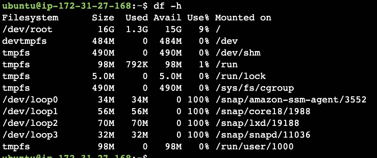

您刚刚扩展了 EBS 卷大小，没有停机时间

# 结论

如果您发现需要扩展 prod 实例中的空间，这种方法将帮助您在不停机的情况下实现这一目标。