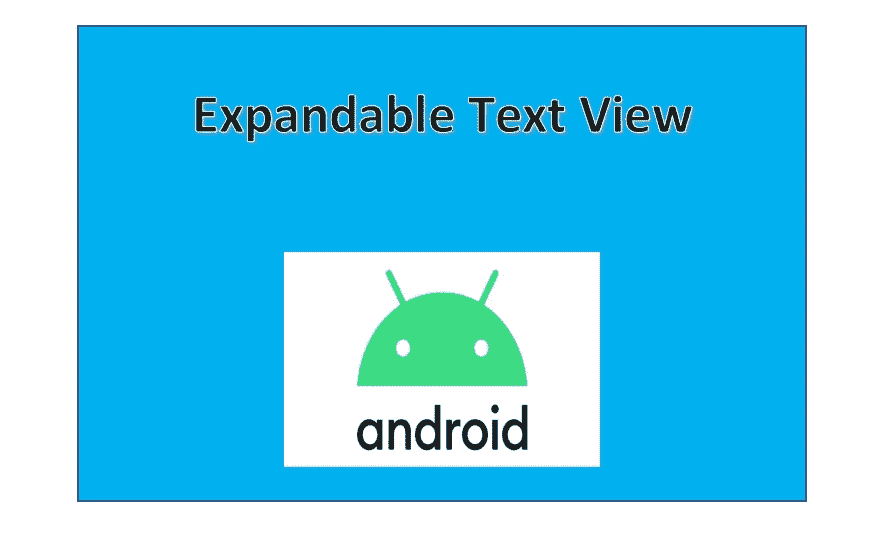
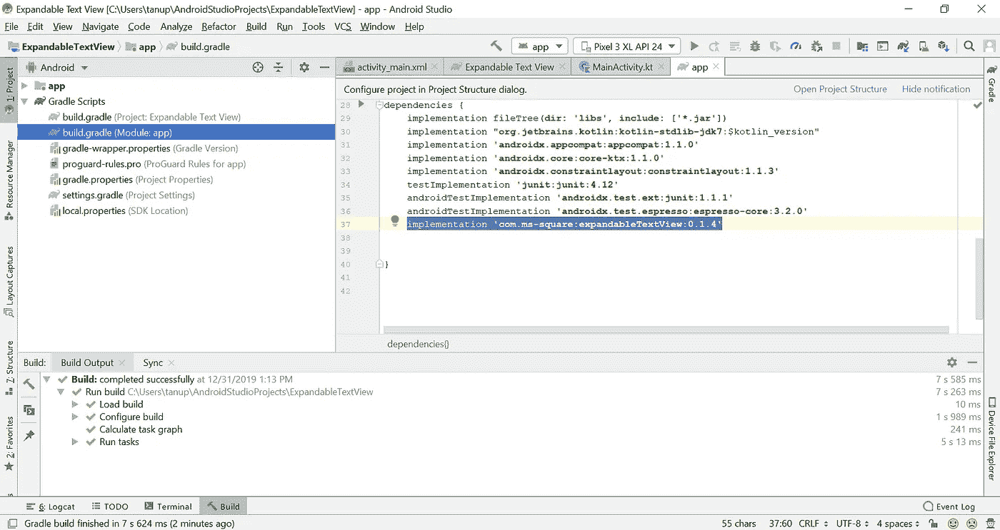
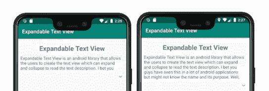
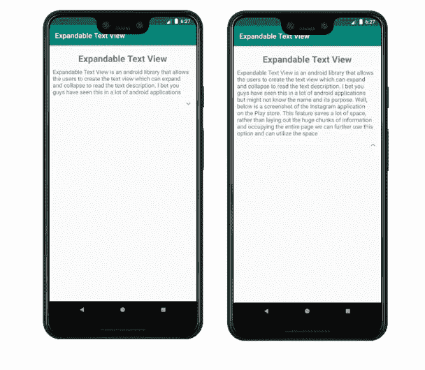

# 使用 Kotlin 和 Android Studio 的可扩展文本视图

> 原文：<https://levelup.gitconnected.com/expandable-text-view-using-kotlin-and-android-studio-2b70ff04c0e9>

这个详细的指南将教你实现一个可扩展的文本视图



可扩展文本视图是一个 android 库，允许用户创建可以扩展和折叠的文本视图来阅读文本描述。我敢打赌，你们在很多 android 应用程序中都见过这个，但可能不知道它的名字和用途。

下面是 Play store 上 Instagram 应用的截图。“ ***开发商联系人*** ”有一个微小的下拉框样符号。在展开时，我们可以进一步阅读开发人员的所有联系选项，这些信息也可以通过单击选项来折叠。这个特性节省了大量的空间，而不是将大量的信息排列起来，占据整个页面。我们可以使用这种策略来优化间距。在本教程中，我们将构建一个类似的可扩展文本视图，它将具有相同的外观和功能。


Play store 上 Instagram 应用程序的屏幕截图

**让我们开始吧。在 Android Studio 上创建一个新项目。**

## 1.将外部库添加到 Android Studio

如前所述，“ ***可扩展文本视图*** ”是一个外部库，我们需要用它来手动导入。该库可从 [***GitHub 资源库***](https://github.com/Manabu-GT/ExpandableTextView) *、* 获得，更多关于该库的详细信息，请参考下面的链接。

[](https://github.com/Manabu-GT/ExpandableTextView) [## 相叶マナブ-GT/ExpandableTextView

### ExpandableTextView 是一个 Android 库，允许开发人员轻松创建一个可以展开/折叠的文本视图…

github.com](https://github.com/Manabu-GT/ExpandableTextView) 

有很多方法可以给 Android Studio 添加一个外部库。最简单的方法之一就是直接在 ***build.gradle*** 文件里面添加(复制粘贴)库。将下面的代码添加到 build.gradle 文件中。

```
implementation **'com.ms-square:expandableTextView:0.1.4'**
```

build.gradle 文件可以在“ ***app*** 下找到，然后在 ***Gradle 脚本→ build.gradle(模块:app)下找到。*** 确保将上述代码粘贴到 ***依赖*** 函数中。按照下面的截图，以获得更好的图片。



将上面的代码粘贴到 build.gradle 文件中

## 2.将属性添加到我们的布局文件(activity_main.xml)

我们应该在布局文件中添加的属性有 ***可扩展文本视图*** 、 ***文本视图*** 和 ***图像视图*** 。

> **注意**:需要注意的重要一点是，TextView 和 ImageButton 的视图 Id 必须分别设置为“**、@id/expandable_text** 和“**、@id/expand_collapse** ”，这个库才能工作。

我使用相对布局来放置所有的属性。代码非常简单明了。我们可以通过改变`animDuration`的值来改变展开和折叠的动画速度

```
*<?***xml version="1.0" encoding="utf-8"***?>* <**RelativeLayout
    xmlns:android="http://schemas.android.com/apk/res/android"
    xmlns:tools="http://schemas.android.com/tools"
    android:layout_width="match_parent"
    android:layout_height="match_parent"
    tools:context=".MainActivity"**>*<!-- This is just for the name of the project -->* <**TextView
        android:layout_width="match_parent"
        android:layout_height="wrap_content"
        android:id="@+id/textView"
        android:text="Expandable Text View"
        android:gravity="center"
        android:textSize="25dp"
        android:textStyle="bold"
        android:layout_marginTop="20dp"**/>

    *<!-- This is the actual mandatory library attributes that must be used -->* <**com.ms.square.android.expandabletextview.ExpandableTextView
        xmlns:android="http://schemas.android.com/apk/res/android"
        xmlns:expandableTextView="http://schemas.android.com/apk/res-auto"
        android:id="@+id/expand_text_view"
        android:layout_width="match_parent"
        android:layout_below="@id/textView"
        android:layout_height="wrap_content"
        android:layout_marginTop="10dp"
        expandableTextView:maxCollapsedLines="4"
        expandableTextView:animDuration="200"**>

        <**TextView
            android:id="@id/expandable_text"
            android:layout_width="match_parent"
            android:layout_height="wrap_content"
            android:layout_marginLeft="10dp"
            android:layout_marginRight="10dp"
            android:textSize="16sp"
            android:textColor="#666666"** />

        <**ImageButton
            android:id="@id/expand_collapse"
            android:layout_width="wrap_content"
            android:layout_height="wrap_content"
            android:padding="16dp"
            android:layout_gravity="right|bottom"
            android:background="@android:color/transparent"**/>

    </**com.ms.square.android.expandabletextview.ExpandableTextView**>

</**RelativeLayout**>
```

这里的图像视图用于显示小可爱下拉按钮(展开和折叠按钮)。有关库使用的更多详细信息，请单击下面的链接:

[](https://github.com/Manabu-GT/ExpandableTextView#usage) [## 相叶マナブ-GT/ExpandableTextView

### ExpandableTextView 是一个 Android 库，允许开发人员轻松创建一个可以展开/折叠的文本视图…

github.com](https://github.com/Manabu-GT/ExpandableTextView#usage) 

此外，您可以在折叠过程中更改行数，这可以通过更改`expanbableTextView:maxCollapsedLines="4"`的值来实现。您可以根据自己的喜好将其更改为 3、4、5 或其他数字(无负数)。下面是值 3 和 5 之间的差异(显示 3 行和 5 行)。



## 3.通过 Kotlin 编码添加要显示的文本

这一步非常简单。你所要做的就是获得可扩展文本视图的 ***id*** 并设置文本为你想要的。这可以通过编程实现，如下所示:

```
**import** androidx.appcompat.app.AppCompatActivity
**import** android.os.Bundle
**import** com.ms.square.android.expandabletextview.ExpandableTextView

**class** MainActivity : AppCompatActivity() {

    **override fun** onCreate(savedInstanceState: Bundle?) {
        **super**.onCreate(savedInstanceState)
        setContentView(R.layout.*activity_main*)

        *// Get the id of the expandable text view and set the desired text of your choice.***val** expTv: ExpandableTextView = findViewById(R.id.*expand_text_view*) expTv.setText(**"Expandable Text View is an android library that allows the users to create the text view which can expand and collapse to read the text description. I bet you guys have seen this in a lot of android applications but might not know the name and its purpose. Well, below is a screenshot of the Instagram application on the Play store. This feature saves a lot of space, rather than laying out the huge chunks of information and occupying the entire page we can further use this option and can utilize the space"**) }}
```

就这样，Koltin 编码完成了。

## 4.运行应用程序

这是教程的最后一步。成功完成上述步骤后，现在可以在模拟器上运行应用程序了。按绿色播放按钮或(Shift+F10)在模拟器上运行应用程序。如果您仔细地遵循了这些步骤，那么您将得到如下所示的输出:



决赛成绩

如上图所示，文本下方有一个类似下拉的小按钮，点击这个按钮，你可以根据自己的喜好展开或折叠文本。

今天到此为止。我希望你们喜欢这个教程。如果你对代码或教程有任何疑问，请通过评论区告诉我。在那之前，再见，祝你愉快。