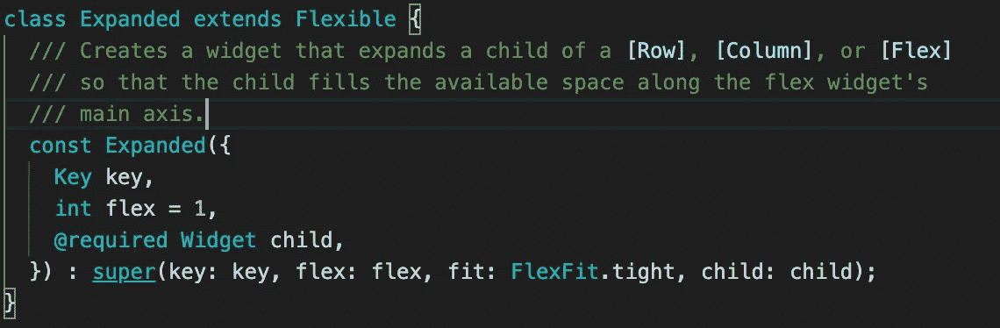
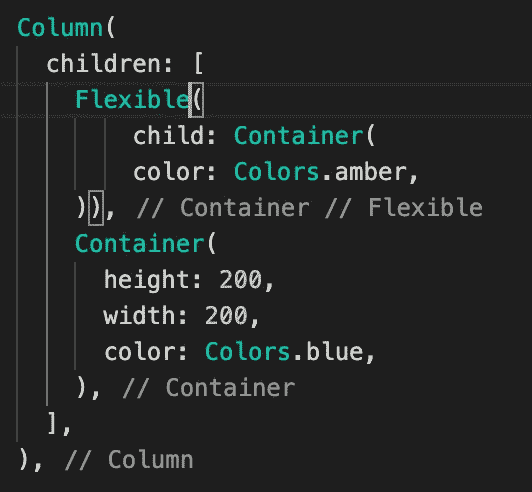
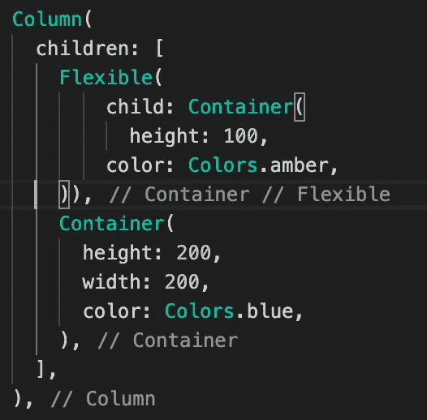
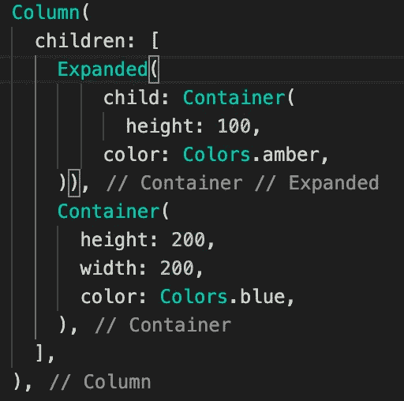

# 扩展与灵活:颤动

> 原文：<https://levelup.gitconnected.com/expanded-vs-flexible-flutter-b0eb4b251a36>

你知道吗**扩大的**也是**灵活的** 🥸？

照片由[本·怀特](https://unsplash.com/@benwhitephotography?utm_source=medium&utm_medium=referral)在 [Unsplash](https://unsplash.com?utm_source=medium&utm_medium=referral) 上拍摄

是的，你没听错。Expanded 只不过是 Flexible 的扩展类。

骚动中的扩大阶级

现在我们知道了一个令人瞠目结舌的事实，让我们看看**扩展和灵活之间的相似之处？**

看两个代码。两者结果相同。

扩展和灵活的示例

扩展和灵活的结果[相同的结果]

如果仔细观察代码，我们可以很容易地发现，一个容器分别放在 expanded 和 flexible 中。

但是，两者产生完全相同的结果。

因此，我们可以说，有时两者会产生相同的结果。

[两个结果相同，这就是为什么只显示一个图像。]

看到两者相似的结果非常令人惊讶。现在，让我们通过添加高度参数来更改我们的容器，并查看更改。

看两个代码。两种结果都不一样。

灵活和扩展的示例

灵活扩展的结果

如果我们仔细观察上面的代码，我们可以看到只有一个变化，那就是我们在容器中添加了“高度:100”(在扩展和灵活的内部)。但是这个小小的改变给了我们不同的结果。

因此，如果 flexible 中的孩子知道它的高度(列中的高度和行中的宽度),那么它将采用提到的高度。但是，如果没有提到高度，那么它将采用剩余的高度，它将像一个扩展的小部件。

并且扩展的小部件将总是占据剩余的高度(或宽度)。

感谢阅读。

帮我接通 [**推特:Vivek Yadav(@ viveky 259259)**](https://twitter.com/viveky259259)

[在 **Github**](https://github.com/viveky259259/) 上找到**开源**内容

跟我连线:[**Github**](https://github.com/viveky259259/)[**LinkedIn**](https://www.linkedin.com/in/vivek-yadav-665823129)[**insta gram**](https://www.instagram.com/viveky259/)[**Patreon**](https://www.patreon.com/viveky259)

# happy code # flutter # widgets # cross platform # tutorial # channel # viveky 259 # viveky 259259 # procoach

# * *订阅即将发布的帖子。感谢阅读。让我知道你对这篇文章的看法。