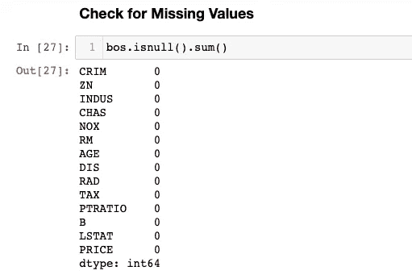
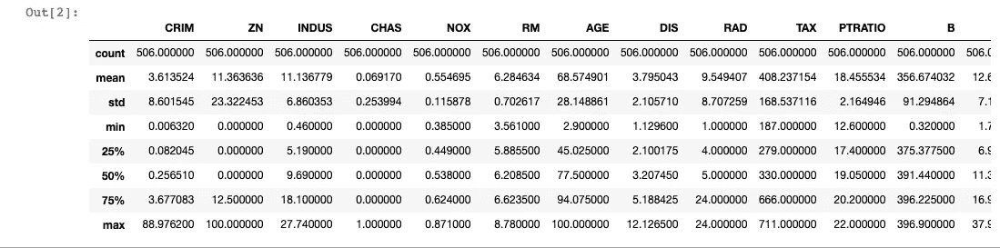
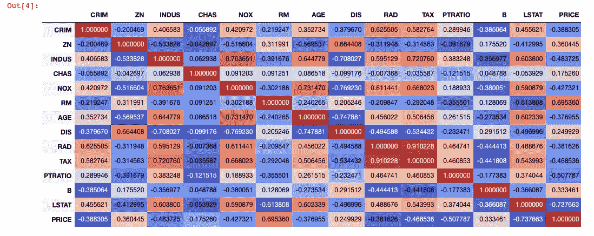
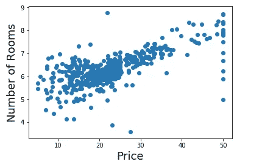
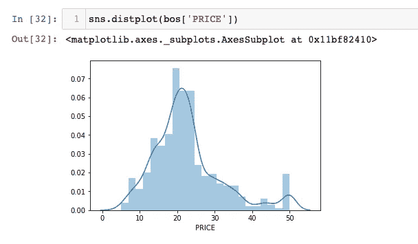
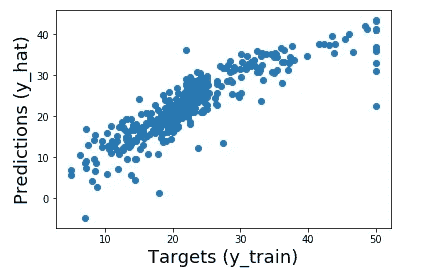
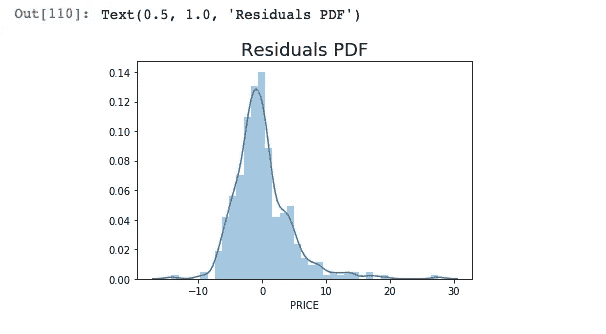
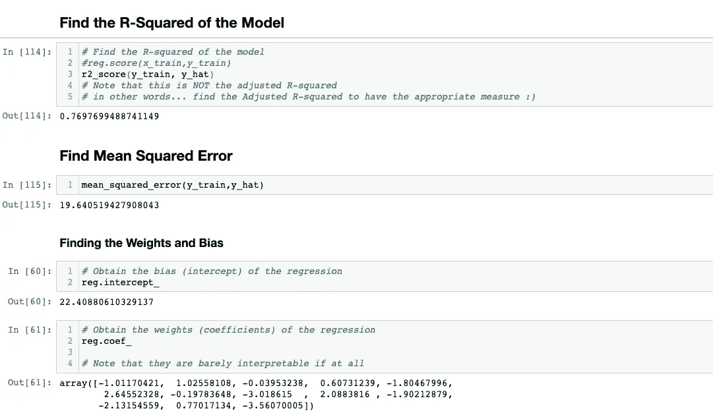
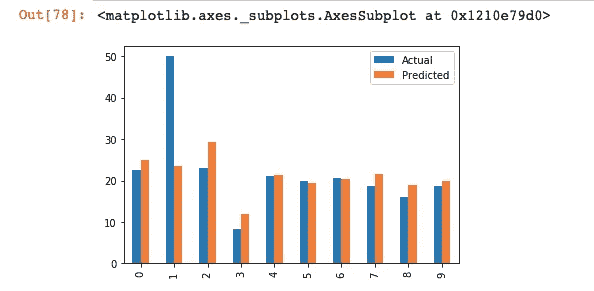

# 贵吗？便宜？房价:预测波士顿房价数据集

> 原文：<https://levelup.gitconnected.com/expensive-cheap-housing-prices-predict-prices-boston-housing-dataset-d60987b65c75>

来源:波士顿住房市场

> 波士顿住房数据的多元线性回归

在波士顿这座迷人的城市买房之前，让我们用机器学习来预测未来的价格。

# 选择的算法

让我们应用线性回归机器学习算法，因为我们的输入被标记，我们试图预测价格范围的值作为输出。我们将应用数据科学工作流来解决这个问题，以获得最佳结果。让我们开始吧！

来源:[https://media . tenor . com/images/edee 3 F2 b 307 be 864038318 eafbc 7d 5 ad/tenor . png](https://media.tenor.com/images/edee3f2b307be864038318eafbc7d5ad/tenor.png)

# 你会学到什么

您将了解如何将机器学习生命周期不仅应用于这个问题，还应用于您试图解决的任何数据科学问题。数据科学生命周期在数据科学领域无处不在，是美国电话电报公司、亚马逊、脸书和许多其他公司的数据科学家和机器学习工程师在将任何模型投入生产之前使用的。

**机器学习生命周期:**

1.  加载数据集
2.  数据预处理
3.  数据分割
4.  型号选择
5.  模型拟合
6.  模型评估

来源:[https://pics . me . me/let-get-to-work-yourdailydoseoffun-7285812 . png](https://pics.me.me/lets-get-to-work-yourdailydoseoffun-7285812.png)

# 数据集

*   您正在处理的数据集是波士顿房价
*   Boston_Housing_Prices 数据集是一个著名的数据集，通常用于学习或测试回归技术。该数据集包含 14 个变量，其中一个(MEDV，家庭的中值)我们将用作目标。

**数据集和列的含义可以在** **这里找到** [**。**](https://www.kaggle.com/c/boston-housing)

# 1.加载我们的数据集并导入依赖项

# 2.数据预处理

## 与目标值高度相关的列

*   房间平均数量
*   ZN(25，000 平方英尺以上地段的土地区域)
*   b(附近的黑人)
*   DIS(就业中心附近)
*   我们看到“TAX”和“RAD”是该数据集中相关度最高的列，相关度为 0.91

# 线性回归模型

## 声明输入和目标变量

## 想象我们的目标变量

## 应用数据标准化(缩放)来改善预测结果

## 3.数据分割:训练测试分割

## 4.模型选择:创建回归

## 比较目标和预测的图

## 绘制残差

# 6.模型评估

## 我们如何评估机器学习模型？

对于监督学习，可以从训练和测试数据中评估模型。

对于回归，评估指标是:

1.  r 平方
2.  均方误差
3.  平均绝对误差

对于分类，评估指标是:

1.  分类准确度
2.  分类召回率、精确度和 F1 分数

对于无监督学习，没有评估模型的系统方法；然而，还有其他方法可以帮助数据科学家和工程师测量他们的模型结果。

对于这个模型，我们将通过 R 平方值来评估它的得分。

# 使用 Sklearn 库计算指标

> 看起来我们的 R 平方值是 0.76！

# 那是什么意思？

r 平方=解释偏差/总偏差

r 平方始终介于 0 和 100%之间:

*   0%表示该模型不能解释响应数据在其平均值附近的任何可变性。
*   100%表示模型解释了响应数据围绕其平均值的所有可变性。
*   R 的平方越高，模型预测未来价格的能力就越强。

从理论上讲，我们的模型可以解释我们数据集中 76%的变化。

# 后续步骤

干得好，您学会了如何将机器学习模型生命周期应用于数据集。该模型不是 100%准确，但机器学习模型很少具有 100%的准确性，除非它是[过度拟合](https://www.investopedia.com/terms/o/overfitting.asp)。为了提高准确性，您可以通过删除行或对数据集应用另一种缩放技术来执行更多的步骤 2 和 3。另一个选择是寻找更多的数据来训练你的模型。所有这些都是改进任何机器学习模型的完美下一步。

> 恭喜你学会了这项新技能！我希望你把这些知识应用到其他惊人的数据集上！继续学习！！！

# 来源

 [## 如何解释回归分析中的 R 平方和拟合优度

### 本文由 Minitab 的 Jim Frost 撰写。他来到 Minitab 时有着广泛的学术背景…

www.datasciencecentral.com](https://www.datasciencecentral.com/profiles/blogs/regression-analysis-how-do-i-interpret-r-squared-and-assess-the)  [## sklearn.linear_model。线性回归-sci kit-学习 0.22.2 文档

### 普通最小二乘线性回归。线性回归拟合系数为 w = (w1，...，wp)到…

scikit-learn.org](https://scikit-learn.org/stable/modules/generated/sklearn.linear_model.LinearRegression.html)  [## 过度拟合的工作原理

### 过度拟合是一种建模错误，当一个函数过于接近一组有限的数据点时就会出现…

www.investopedia.com](https://www.investopedia.com/terms/o/overfitting.asp) 

# 关于我

 [## Andre Williams -数据分析和数据科学实习生美国电话电报公司| LinkedIn

### 在全球最大的职业社区 LinkedIn 上查看 Andre Williams 的个人资料。Andre 在他们的清单上列出了 5 份工作…

www.linkedin.com](https://www.linkedin.com/in/andrewilliams22/)  [## 安德烈·威廉姆斯-中等

### 阅读安德烈·威廉姆斯在媒介上的作品。Andre 是美国电话电报公司大学的数据科学实习生，也是计算机科学专业的学生

medium.com](https://medium.com/@andre_williams)  [## Andre-Williams22 -概述

### 在 GitHub 上注册你自己的个人资料，这是托管代码、管理项目和构建软件的最佳地方…

github.com](https://github.com/Andre-Williams22)