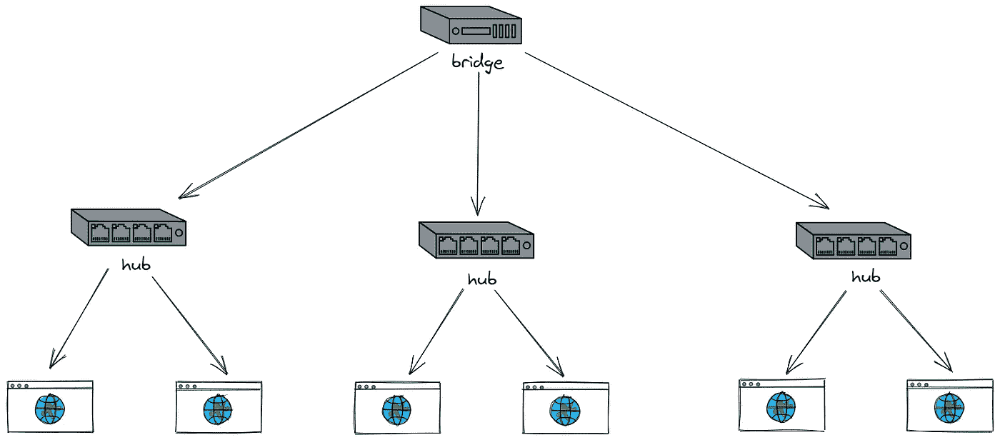
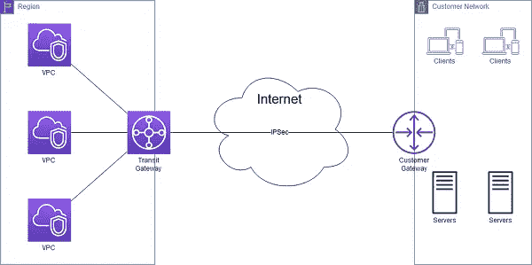

# 经验分享:关于设计网关的一些想法

> 原文：<https://levelup.gitconnected.com/experience-sharing-some-ideas-about-designing-gateways-3026674000ca>

如何设计网关

罗曼·博日科在 [Unsplash](https://unsplash.com/s/photos/desk?utm_source=unsplash&utm_medium=referral&utm_content=creditCopyText) 上拍摄的照片

**什么是网关？**

网关，比如很多地方的网关都没问题，但是网关和网桥的区别需要区分。

网桥工作在数据链路层，在不同或相同类型的局域网之间存储和转发数据帧，并在必要时在链路层执行协议转换。

网桥连接两个或多个传输信息包的网络。

作者图片

网关是一个很大的概念，它不是特指一种产品。

只要两个不同的网络连接在一起，就可以称之为网关。一般来说，网桥只转发信息，而网关可以执行打包。

AWS 提供的图像

根据网关的特点，我们可以这样理解网关。

如果你去白宫找总统，所有人都知道总统绝对不是想见面的人。遇到间谍怎么办？

那么你去白宫必须进入入口的大门，而大门就是这里的入口。

首先，每个想看总数的人都必须从这个门进入(这个叫统一入口)。这个门相当于把白宫和外界隔绝了，主要是保护里面的安全和正常工作。

来到这扇门后，门卫肯定会要求你出示相关证件(这叫认证测试)，意思是判断你总共要看的要求是否合理。

如果认证后，你发现你找总裁只是为了投诉汉堡不好吃，门卫会告诉你没必要找总裁，你去找工商局就可以了(这是动态路由，路由请求到后端集群中的不同)。

这时候就会给你做一些包装，比如给你一张参观卡之类的，然后告诉你怎么走，等等。

看，网关的作用就是这三个，最终目的是降低你和集群之间的耦合，具体来说就是降低客户端和服务器之间的耦合。

如果没有网关，就意味着所有请求都会直接调用服务器上的资源，所以耦合太强，服务器有问题，客户端会直接报错。

**为什么需要网关？**

当使用单一应用程序架构时，客户端(web 或移动)通过对后端应用程序进行 REST 调用来获取数据。

负载平衡器将请求路由到 N 个相同的应用程序实例之一。

然后，应用程序查询各种数据库表，并向客户端返回响应。

在微服务架构下，单个应用被分成多个微服务。如果所有微服务都直接对外暴露，势必会出现各种安全问题，内外耦合严重。

客户端可以直接向各个微服务发送请求，主要问题如下:

将服务器上的各种服务直接暴露给客户端调用必然会导致各种问题。同时，服务器端的每个服务的可扩展性和伸缩性都很差。

API 网关是微服务架构中的基础组件，位于接入层之下，业务服务层之上。上面提到的功能适合在 API 网关中实现。

**网关设计思路。**

网关需要具备以下功能。

***# 1。请求路由。***

网关必须具有请求路由的功能。这样对于主叫端来说也是一件非常方便的事情。

因为主叫端不需要知道自己需要使用的其他服务的地址，都交给网关处理。

***# 2。服务注册。***

为了代理后面的服务并将请求路由到正确的位置，网关应该具有服务注册功能，即后端服务实例可以注册和注销其提供的服务的地址。

一般来说，注册就是注册一些 API 接口。

例如，对于 HTTP Restful 请求，您可以注册相应 API 的 URI、方法和 HTTP 头。

这样，Gateway 可以根据收到的请求中的信息决定路由到哪个后端服务。

***# 3。负载平衡。***

因为网关可以接收多个服务实例，所以网关还需要在每个对等服务实例上实现负载平衡策略。

简单点是直接轮循轮询，更复杂点可以通过设置权重来分配，更复杂点也可以实现会话附着。

***# 4。弹性设计。***

网关还可以实现异步、重试、幂等、流量控制、融合、监控等功能。在弹性设计中。

这样，应用服务就像服务网格一样，可以只关心自己的业务逻辑而不关心控制逻辑。

***# 5。安全。***

SSL 加密和证书管理、会话验证、授权、数据验证，以及防止对请求源的恶意攻击。

错误处理越早越好。因此，网关可以是一个站点范围的访问组件，以保护后端服务。

当然，网关还可以做更多更有趣的事情，比如灰度发布、API 聚合、API 编排。

***# 6。灰色释放。***

网关可以完全分流同一服务不同版本的实例，也可以收集相关数据。

这对于软件质量的提高甚至产品试错都有非常积极的意义。

***# 7。API 聚合。***

使用网关可以将多个单独的请求聚合成一个请求。

在微服务架构中，随着服务变得越来越小，一个明显的问题是客户端可能需要多次请求才能获得所有数据。

因此，客户端和后端之间的频繁通信会对应用程序的性能和规模产生非常不利的影响。

因此，我们可以要求网关帮助客户端请求多个后端服务(在某些场景下，可以并发请求)，然后将后端服务的响应结果进行组装并发送给客户端(当然，这个过程也可以异步完成，但这需要客户端的配合)。

***# 8。API 编排。***

同样在微服务架构下，要完成一个完整的业务流程，需要调用一系列的 API，就像一种工作流一样，这个业务流程完全可以通过网页来编排。

我们可以通过 DSL 定义和编排不同的 API，或者我们可以像 AWS Lambda 服务那样连接不同的 API。

**网关设计重点。**

***# 1。高性能。***

在技术设计中，网关不应该也不可能成为性能瓶颈。为了高性能，最好使用 C、C++、Go、Java 等高性能编程语言。

网关对后端的请求以及对前端的请求必须使用异步非阻塞 I/O，以确保后端延迟不会导致应用程序出现性能问题。

C 和 C++见 Linux 下`epoll`的异步 IO 模型和 Windows 的 I/O 完成端口，Java 见 Netty 和 Spring Reactor 的 NIO 框架。

***# 2。高可用性。***

因为所有的流量或呼叫都要经过网关，所以网关必须成为高可用的技术组件，它的稳定性直接关系到所有业务的稳定性。

如果没有设计好网关，它将成为单点故障。

所以，一个好的网关至少应该做到以下几点。

*   集群化:对于成为集群的网关来说，最好是自己组建集群，自己同步集群数据，不需要依靠第三方系统同步数据。
*   服务:网关还需要不间断地修改配置。一种是像 Nginx 的 reload 配置，可以实现持续服务。自己的管理 API 在运行时修改自己的配置。
*   持续性:比如重启，像 Nginx 一样优雅重启。有一个负责请求分派的主进程。当我们需要重启时，新的请求被分配给新的进程，旧的进程在处理完请求后退出。

***# 3。高膨胀。***

因为网关需要承担所有的业务流量和请求，所以或多或少都要有业务逻辑。

而且我们都知道商业逻辑是多变的，不确定的。

比如一些业务相关的东西需要添加到网关上。

因此，一个好的网关还需要具有可扩展性和二次开发能力。

当然也可以通过类似 Nginx 的模块进行二次开发。

另外，在运维方面，网关要有以下设计原则。

**业务是松散耦合的，而协议是紧密耦合的。**

在业务设计中，网关不应该与下面的服务形成服务耦合，也不应该有业务逻辑。

网关应该是网络应用层上的一个组件，不应该处理通信协议体，只应该解析和处理通信协议头。此外，除了服务发现，网关不应该依赖于第三方服务。

**应用监控，提供分析数据。**

需要在网关上考虑应用程序性能监控。除了对应后端服务的高可用性统计外，还需要使用 Tracing ID 实现分布式链路跟踪，统计一定时间段内各个 API 的吞吐量和响应时间。并返回代码以启动弹性设计中的相应策略。

**通过弹性设计保护后端服务。**

网关必须实现弹性设计，如熔断、限流、重试和超时。

如果一个或多个服务调用花费的时间太长，可以超时并返回一部分数据或网关中最后一个成功请求的数据缓存。可以考虑这样的设计。

**DevOps。**

因为网关组件非常关键，所以需要像 DevOps 这样的东西来最小化它失败的机会。

这个软件需要很好的测试，包括功能和性能测试，以及浸泡测试。

最后，还需要一系列自动化运维的管控工具。

**网关设计注意事项。**

*   与其将聚合后端服务的功能构建到网关的代码中，不如考虑将聚合服务放在网关核心代码之外。这个插件可以被使用，或者它可以被放在一个网关的后面来形成一个无服务器的服务。
*   网关应靠近后端服务，并与后端服务使用相同的内部网，这样可以确保网关和后端服务调用的低延迟，并可以减少许多网络问题。这里还有一点，网关处理的静态内容要靠近用户(要放在 CDN 上)，此时的网关和动态服务要靠近后端服务。
*   网关也需要做扩容，所以需要变成集群来分担前端带来的流量。这可以通过 DNS 循环法，或通过 CDN 进行流量调度，或通过具有更高性能的低级负载平衡设备来实现。
*   对于服务发现，可以做一个短期缓存，这样就不需要每次请求的时候都检查相关服务的位置。当然，如果你的系统并不复杂，可以考虑将服务发现功能直接集成到网关中。
*   考虑网关的隔板设计。使用不同的网关服务不同的后端服务，或者使用不同的网关服务不同的前端客户。

此外，因为网关是用户请求和后端服务的桥接设备，所以需要考虑一些安全方面的问题。

***# 1。加密数据。***

你可以把 SSL 相关的证书放在网关上，网关会管理统一的 SSL 传输。

***# 2。验证用户的请求。***

一些基本的用户认证可以在网关上完成，比如用户是否登录，用户请求中的令牌是否合法等。

但是，我们需要权衡网关是否需要验证用户的输入。

正因为如此，网关需要从只关心协议头变成需要关心协议体。一方面，协议体中的东西不像协议头那样标准，另一方面，解析协议体需要大量的运行时间，从而降低网关的性能。

对此，我想说的是，要看具体需求，一方面，如果协议体是标准的，那么这是可以做到的。

另一方面，解析协议引起的性能问题需要相应地隔离。

***# 3。检测异常请求。***

网关需要检测一些异常访问，比如在相对较短的时间内，请求的数量超过了某个值。

例如，来自同一个客户端的 4xx 请求的错误率太高。对于这样的访问请求，网关一方面要屏蔽这样的请求，另一方面要发出警告，可能是一些比较严重的安全问题，比如黑客攻击。

感谢阅读。

如果你喜欢这样的故事，想支持我，请给我鼓掌。

你的支持对我来说非常重要，谢谢你。