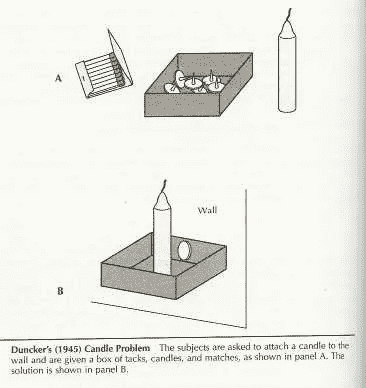

# 有经验的开发人员知道并使用这 3 个技巧来解决问题

> 原文：<https://levelup.gitconnected.com/experienced-developers-know-and-use-these-3-tips-to-solve-problems-48a278968d08>

## 解决任何软件问题之前需要掌握的 3 项重要技能

[亚娜拉·www.freepik.com 创作的商业照片](https://www.freepik.com/photos/business)

*我们用 Java 还是 C#？为什么我们甚至需要 Java？为什么 Java 是微服务的正确选择？*

所有这些问题都应该揭示解决方案。但是他们真的足够好吗？你能把更多宝贵的时间花在有影响力的事情上吗？你问的问题对吗？

选择正确的问题来解决对任何产品来说都是至关重要的。如果没有一个正确的向导，我们可能会迷失方向。

***那么开始解决问题的正确框架是什么？让我们看看大多数工程师在解决问题之前都错过了什么。***

# Web 开发由来已久。那么解决方案在哪里呢？

有了这么多框架，web 开发应该就容易多了。

我们有解决大多数问题的方法。为了一张更好的 CD，巨石被打碎。微服务使我们能够更好地扩展。

***尽管如此，即使是有经验的开发者也会感到困惑。***

即使你一直在编写小程序，或者从 Angular 5 开始，你也会对新的开发感到困惑。

web 开发的绝对进步会吓到你。每个人都害怕失去技能。

你要么作为一名软件工程师死去，要么活到成为一名经理。

一些人因为不断学习而进入管理岗位。此外，一些人担心他们的技能会过时。

***你不可能事事都跟上。不管怎样，你都在循环中。***

*   学习饼干
*   使用 cookies 一段时间
*   完美会话 cookies
*   JWT 回来了
*   学习 JWT
*   循环继续…

有时解决方案类似于旧方案。或者他们完全像旧的方法。或者从开始，你甚至不需要新的框架。

任何技能都是有用的。

甚至 COBOL 运行至今。所以了解 COBOL 仍然是一项有价值的技能。尽管 COBOL 是一个老工具，但它满足了需求，没有人想放弃它。

每个开发人员都想转向一个新的闪亮的工具。比如从 Java 到 Rust。 ***但是谁愿意把所有的 Apache 项目从 Java 重写到 Rust？***

预测某样东西会过时是很难的。即使是伟大的企业家也会犯语言预测错误。 ***所以读 X 语会死，要带着一勺盐。***

你的经历不会消失。基础很重要。

你可以写 Java，但是要有一些前端开发的背景。你将很容易发现前端的变化，并理解发生了什么。

***如果你在一个循环中你能做什么？没什么。***

接受新的解决方案与旧的原则相似的事实。或者甚至依赖于他们。

***不要被旧的做事方式所束缚。*** 从不同的角度看。此外，要乐于看到消极的一面。

Jason 在这方面做得最好[，他对前端框架的负面影响](https://medium.com/codex/stop-fighting-the-reason-css-exists-with-these-dumbass-frameworks-91732f5993c7)。即使你不是前端开发人员，这也是一本好书。

***蜡烛盒实验让我想起了这个问题。参与者总是关注蜡烛的粘性。这就阻止了他们把盒子钉在墙上。***

[https://en . Wikipedia . org/wiki/Functional _ fixeness # Candle _ box](https://en.wikipedia.org/wiki/Functional_fixedness#Candle_box)

# 你想证明什么？

***每一个解决方案都有它的优点和缺点。***

想出一个解决方案应该就是这样。一些开发人员采用第一种方法，或者他们的前辈推荐的方法。这可能会导致奇怪的情况，因为有些事情不像预期的那样工作。

尽管这位前辈以前解决过这个问题，但他忽略了最近的发展。

***不要倒向权威偏见。***

你应该总是权衡任何解决方案的利弊。这在当前环境下行得通吗？还有什么其他的解决方法？

这是一个旧工具，让我们使用更新的工具吧

你不会因为一台新冰箱出现就换掉一台旧冰箱。 ***旧的还冻东西，为什么要换？*** 除非一个新的有一定的好处，能源消耗，和环境影响。

***对于软件解决方案，你也应该采取同样的方法。***

列出你不喜欢的和喜欢的解决方案。如果是一门语言，让你烦恼的是什么？ 如果是一个框架比较别人的利弊。

***呈现优劣的好方法是*** [***哈维蛋蛋***](https://en.wikipedia.org/wiki/Harvey_balls) ***。*** 这里有一个[对比 JDK](https://www.azul.com/products/core/jdk-comparison-matrix/)的例子。您可以清楚地看到 X 中缺少什么，而 y 中有什么。根据这些比较，这个特性符合您的需求吗？

你应该专注于你的兴趣。

如果你从解决方案的观点开始，你会走进死胡同。如果你把注意力放在兴趣和问题上，你总会达成共识。

因此，我们开始通过利益的透镜来框定问题。

在 YouTube 上，他们就搜索功能进行了一场[激烈的辩论。当结果很少时，他们需要链接到谷歌或者返回一个空的响应。**争论没有结果后，*他们开始关注利益。***](https://coda.io/@shishir/eigenquestions-the-art-of-framing-problems)

他们确定了对客户来说什么是重要的。使用这种方法，他们决定不链接到谷歌的结果。因为这不利于客户的一致性利益。

***你想用你的解决方案证明什么？***

也许 Java 不是最好的选择，但是你能证明吗？构建可废弃的 PoC 并继续前进。即使你不能证明什么，你也要有所表现。

# 你觉得自己像一个软件作曲家吗？

***需要了解项目内部的一切吗？***

有些开发人员成为了无所不知的牺牲品。 凡属及其怪癖。这种特质会让他们成为更好的开发人员。或者至少他们是这么认为的。

另外，有些人认为了解每个框架的细节很重要。

他们深入主题，再也不会使用这些知识。我们都为此感到内疚。你会详细了解一个话题，但今天没有知识应用。

如今大多数软件工程都是乐高驱动的。

你可以连接一些组件，继续你的生活。为什么你甚至需要知道那些组件里面有什么？哪里需要停止深潜？

***没有人知道研究到哪里为止。你可以无限期地研究。***

但是一旦你的问题出现，你就会确定。你应该有一个应对策略。了解每个框架的痛点是什么。

[***先掩盖棘手的部分。***](http://blog.ezyang.com/2011/12/bugs-and-battleships/?utm_source=substack&utm_medium=email)

正如《虫子和战舰》的作者所提到的，它涵盖了棘手的部分。你可以去测试每一个小细节，这需要一段时间。了解任何解决方案的难点，并涵盖这一部分。

***那么，为什么知道内在的东西并不重要呢？***

你不会去构建一个已经很好的工具。

当当前的工具正在工作时，您为什么要创建一个定制的测试运行程序呢？你甚至不关心跑步者如何进行测试。只要他们在跑，就没问题。

如果这就是商业的本质，那么内在就是重要的。

你不会在乎一个电子商务网站的一分钱。但是如果你的企业需要这些知识，你就需要学习这个标准。

关于内部的细节将有助于解决业务问题，以及前进道路上的挑战。