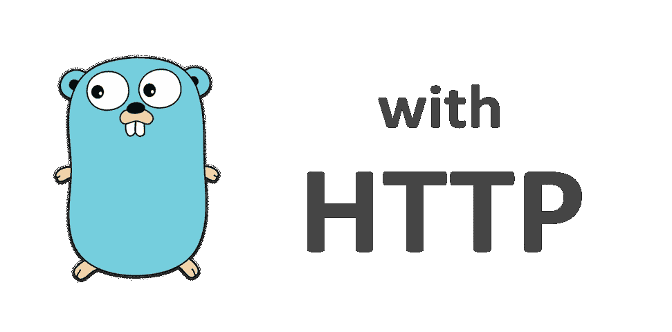
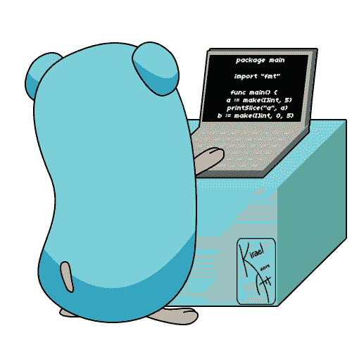

# 将 Golang 的内置 HTTP 服务器实现与最流行的社区包 gorilla/mux 进行比较

> 原文：<https://levelup.gitconnected.com/experiment-golang-http-builtin-and-related-popular-packages-1d9a6dcb80d>



## [安息吧](/go-restful-series-a7addbfef5b1) — #6

本文总结了我使用 Golang HTTP 进行的实验，使用内置功能和最流行的社区开发包来找出声明 HTTP 视图和处理 HTTP 请求的有效方法。



# 内置网络/http 包

## 声明处理程序

`net/http`包包含接受请求和动态处理请求所需的所有实用程序。我们可以用`http.HandleFunc`注册处理程序。该处理程序的第一个参数采用一个字符串路径进行匹配，第二个参数是一个在该路径匹配时执行的函数。

```
http.HandleFunc("/", **func** (w http.ResponseWriter, r *http.Request) {
    fmt.Fprintf(w, "Go RESTful Series")
}
```

匹配算法是前缀匹配，所以上面的声明将把每个请求路由到内联匿名函数。也就是说，因为只有`/`，所以所有的路线都会匹配它。

## 读取请求

每个处理函数接收一个`*http.Request`作为第二个参数**，这是一个包含与请求相关的所有信息的结构实例指针。**

```
r.Method  *// request method*
r.URL     *// request URL*
r.Header  *// request headers*
r.Body    *// request body*
```

参考[这里的](https://golang.org/pkg/net/http/#Request)获取完整的`http.Request` API 参考。

## 写下回应

每个处理函数都接收一个`http.ResponseWriter`作为第一个**参数，它公开了用于编写响应的头和体的 API。它实现了`io.Writer`接口，这样我们就可以编写类似于写入文件/stdout 等的响应。**

```
*// Set header*
w.Header().Set("Some-Header", "value")*// Write using standard write method in fmt package.* fmt.Fprintf(w, "Body content")*// Write body will automatically write all previous-set header fields.*
```

## 启动服务器

为了运行上面的代码，我们需要启动服务器。

```
http.ListenAndServe(":80", **nil**)
```

这将使用我们使用`http.HandleFunc`设置的默认路由启动默认 HTTP 服务器。如果你想创建一个新的服务器并在你自己的服务器中管理它，请参考[这里的](https://golang.org/pkg/net/http/)，为了这篇文章，默认的服务器就足够了。

# 社区开发的包

Go 的`net/http`包已经为编写 HTTP 应用程序提供了相当数量的 API。然而，有一点它做得不是很好，那就是复杂的请求路由，比如将请求 URL 分割成单个参数。幸运的是，有一个非常流行的由社区开发的名为`gorilla/mux`的包来处理这些责任。

## 导入

```
import "github.com/gorilla/mux"
```

## 重构代码以使用 gorilla/mux

为了应用`gorilla/mux`，我们需要对之前的实现做一些更新。

```
*// Create a new mux router.*
r := mux.NewRouter()*// Replace http.HandleFunc by router.HandleFunc.* r.HandleFunc("/", handler)*// Replace 2nd parameter by the configured mux router.* http.ListenAndServe(":80", r)
```

## 声明复杂路线

有了`gorilla/mux`，我们可以用变量声明复杂的路线，用方法约束路线等等。

```
r.HandleFunc("/users/", listUsers).Methods(http.MethodGet)
r.HandleFunc("/users/", createUser).Methods(http.MethodPost)
r.HandleFunc("/users/{userId}/", getUser).Methods(http.MethodGet)
r.HandleFunc("/users/{userId}/", updateUser).Methods(http.MethodPut)
r.HandleFunc("/users/{userId}/", deleteUser).Methods(Http.MethodDelete)
```

参考[这里的](http://www.gorillatoolkit.org/pkg/mux)获取完整的`gorilla/mux` API 参考。

## 获取捕获的变量

我们用变量声明了路由，我们应该能够在处理程序中捕获这些变量的值。

```
**func** handler(w http.ResponseWriter, r *http.Request) {
     *// mux.Vars(r) returns all values captured in the request URL.* vars := mux.Vars(r) *// vars is a dictionary whose key-value pairs are variables' name-value pairs.*
     fmt.Fprintf(w, "User %s\n", vars["userId"])
}
```

如您所见，Go 中的标准 HTTP 服务器实现已经很强大了。通过使用`gorilla/mux`,我们能够获得一个更简单的接口来处理复杂的路由和管理请求。