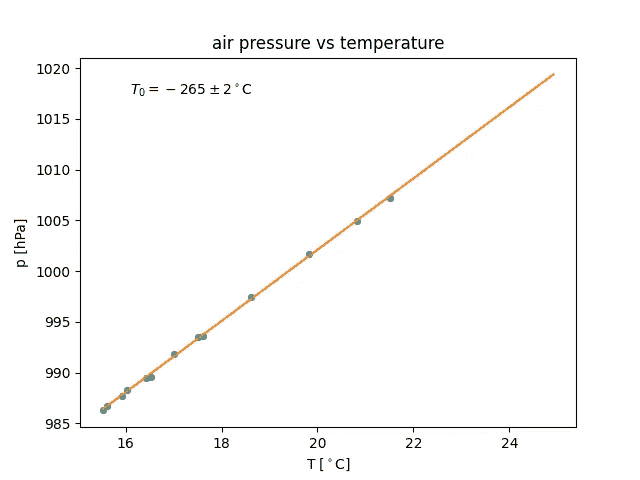

# 对气体状态的实验研究

> 原文：<https://levelup.gitconnected.com/experimental-study-of-the-state-of-a-gas-b0326ef8f8f>

## 使用 Arduino，我们可以测量气体的温度和压力，并研究其状态方程

在我的上一篇文章中，我展示了如何通过 BLE 从 Arduino 获取实验数据。正如所承诺的，我现在开始收集和解释这些数据，在实验中，气体经历**等容**过程，即压力 *p* 和温度 *T* 可以变化，而体积 *V* 保持不变的过程。

这个实验确实非常简单。你只需要一个支持 BLE 的 Arduino 板，一个气压和温度传感器，一个电源和一个罐子。我使用了一个连接到 BME180 传感器的 Arduino MKR 1010 WiFi。作为电源，我刚刚使用了一个电源组。


一个装有 Arduino MKR 1010 WiFi、BME180 传感器和电源组的罐子。

罐子里的气体量相当稳定，至少在相对较大的压力和温度区间内是如此。容器不是完全密封的，因此，当内部压力过高或过低时，气体泄漏是可能的，当温度变得过低或过高时也是如此。*低*和*高*在这里的含义，取决于罐子类型。由于热膨胀，容器的体积也可能改变。然而，如果实验在离正常条件不远的地方进行(p=101.325 kPa，T = 20°C)，像图中这样的罐子就可以完美地工作，尤其是在过程足够慢的情况下。

在我做的实验中，我只是把罐子放在冰箱里一会儿，然后从里面拿出来，等着它随着室温变热。事实上，热量是由罐子里的电子设备释放出来的。这样的热量有助于提高温度，但是，当然，它没有害处。

**从 BLE** 读取数据使用任何 BLE 扫描仪(智能手机和电脑都有应用程序)，人们可以很容易地找到设备的地址，通常是类似于 MAC 地址的形式(例如 A5:B3:C2:24:15:16)或类似于 UUID 的形式(例如 A8 D7 a4 f 1–3d 94–4A7D-9D3C-3d 17607 c 3515)。

下面的代码部分是从[詹姆斯·刘易斯](https://medium.com/@baldengineer/about)提供的例子中剽窃来的。我不是异步流程方面的专家，所以下面的内容可能不会太严谨。如果你发现一些令人不安的事情，请通过电子邮件或在评论中给我留言。

首先，我们需要创建一个对象，该对象等待一个异步事件(包括来自 BLE 数据源的数据的可用性),如果检测到该事件，就对其做出反应。这是按如下方式完成的。

```
import asyncioaddress = ("A8D7A4F1-3D94-4A7D-9D3C-3D17607C3515")if __name__ == “__main__”:
  loop = asyncio.get_event_loop()
  loop.run_until_complete(run(address))
```

这里，`loop`是一个持有所谓循环的对象(你可以把它想象成一个无限循环轮询一个事件)。在最后一行，循环被指示以`address`作为参数调用函数`run`。后者是一个格式如上的字符串(如果运行在 MAC 或 Linux 上，则为 UUID；作为 MAC 地址，如果您在 Windows 上运行)。反过来，`run()`被定义为

```
from bleak import BleakClient
CH_UUID = "555a0002-0020-467a-9538-01f0652c74e8"async def run(address):
    async with BleakClient(address) as client:
        x = await client.is_connected()
        await client.start_notify(CH_UUID, notification_handler)
        await asyncio.sleep(600)
        await client.stop_notify(CH_UUID)
```

`async with EXPR as VAR`块可以这样读:`BleakClient(address)`尝试连接到给定的地址。如果成功，那么在块中产生的 BLE 客户端被标识为`client`,并执行后者。它要求`client`提供关于新的可用数据的通知，其中`CH_UUID`作为 UUID，然后休眠 600 秒，然后停止通知。在通知新数据时，将调用`notification_handler`，定义如下。

```
def notification_handler(sender, data):
    array = bytearray(data) t  = struct.unpack('f', array[0:4])
    p = struct.unpack('f', array[4:8])
    T = struct.unpack('f', array[8:12])
    print(f'{t[0]}, {p[0]}, {T[0]}')
    f = open('pT.csv', 'a')
    f.write(f'{t[0]}, {p[0]}, {T[0]}\n')
    f.flush()
    f.close()
```

它将从 BLE 客户端接收的`data`解释为一个字节数组。然后，它从数组中提取前四个字节，并将它们用作变量`t`的内容。第二组四个字节被解释为浮点并分配给`p`，而最后一组四个字节代表温度`T`。事实上，我指示运行在 Arduino 上的客户端将这三个值打包到发送到连接设备的数组中(参见[相应的帖子](https://giovanni-organtini.medium.com/arduino-ble-programming-4fa97506cf6a))。

剩下的就很简单了:数据被打印在屏幕上，并写入一个名为`pT.csv`的文件，在*追加*模式下打开。

**数据分析** 一旦如上所述收集了数据，我们就可以从 CSV 文件中读取 *p* 和 *V* 并对其进行分析，例如，绘制作为温度函数的压力图。结果以及线性拟合如下所示。



正如所料，压力 *p* 作为体积 *V* 的函数遵循一条直线。对直线拟合数据，我们得到截距 *q* 。后者允许我们估计绝对温标的零点。实际上，理想气体的状态方程可以写成 *pV=nRT* ，当 *T* 用开尔文表示时。如果用摄氏度来表示(关于温标的讨论，也参见[这篇文章](https://medium.com/cantors-paradise/temperature-scales-42d6cdb6e2be))，等式读作 *pV=nR(T+T₀)* 和 *q=nRT₀/V* 。因此，T₀的值是从 *q* 的值和直线的斜率 *m* 获得的( *m=nR/V* )。

事实上，结果并不坏。我们发现 t₀=−265 2°c，实际上是已知值 273°c 的四倍，但我们必须考虑到，该实验是在资源有限且未对传感器进行适当校准的情况下完成的。在这些条件下，几个 sigmas 的差异是非常好的结果。

从这样的结果中，人们可以继续研究，例如，过程的可逆性。如果这个过程足够慢，温度的来回变化会导致 pV 平面遵循相同的曲线(直线)。如果温度变化非常快(例如，当离开冰箱时，将罐子放入热水中)，该过程可能变得不可逆(即，它由一连串非平衡态的状态组成)，并且 pV 平面中的轨迹可能明显不同。

根据我的经验，这样的观察对于阐明可逆和不可逆过程的区别是很重要的。你仍然可以测量压力、温度和体积，然而，远离平衡，它们不满足状态方程。因此，气体的状态不能用 pV 平面上的一个点来表示。