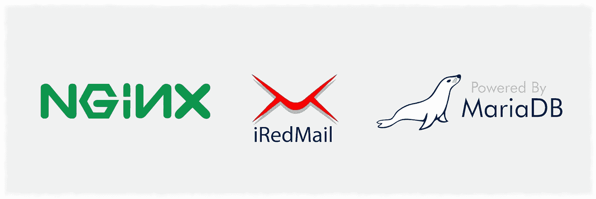

# 用波德曼做实验

> 原文：<https://levelup.gitconnected.com/experimenting-with-podman-e6cb24428bfd>

## 更安全、高度兼容的 Docker 替代方案？


在过去的十年里， [Docker](https://docker.com) 通过将自动化集装箱化技术推向市场，让我们能够在一块裸机上运行比以往任何时候都更多的独立应用程序，彻底改变了我们的行业。所以我不认为 Docker 会很快消失，即使 k8s 最近宣布[反对 Docker 的运行时](https://kubernetes.io/blog/2020/12/02/dont-panic-kubernetes-and-docker/)。然而，事实是，从安全角度来看，以 root 用户身份运行应用程序或拥有具有广泛特权的容器是不可取的，这一直是安全社区对 Docker 的主要批评。

那么，既然现在有了新的选择，为什么即使是有安全意识的人也不离开 Docker 呢？也许是因为一旦你完全投入到大规模部署的底层基础设施中，就很难再切换到另一个替代方案。从让您的团队熟悉一组新的命令行工具和重建容器映像，一直到处理一般的兼容性问题，都是需要关注的原因。所以你已经可以想象为什么 Docker 仍然如此受欢迎，尽管它有这个明显的安全缺陷。

这就是为什么《T4》对我来说是一个如此有趣的项目。乍一看，它不仅解决了 Docker 的基本安全缺陷，而且从用户的角度来看，它的工作方式与 Docker 非常相似。你可以把命令中的单词“docker”换成“podman ”,一切都像预期的那样工作，不需要学习新的标志。你也可以运行现有的 docker 图像或任何 OCI 兼容的图像。这简直好得令人难以置信。因此，最近，随着我永无止境的好奇心的激发，我决定尝试一下波德曼的基础知识，看看它是否会像宣传的那样成功。

> [Podman](http://podman.io/) 是一款无后台、开源的 Linux 原生工具，旨在使用开放容器倡议([【OCI】](https://www.opencontainers.org/))[容器](https://developers.redhat.com/blog/2018/02/22/container-terminology-practical-introduction/#h.j2uq93kgxe0e)和[容器映像](https://developers.redhat.com/blog/2018/02/22/container-terminology-practical-introduction/#h.dqlu6589ootw))轻松查找、运行、构建、共享和部署应用。Podman 提供了一个命令行界面(CLI ),任何使用过 Docker [容器引擎](https://developers.redhat.com/blog/2018/02/22/container-terminology-practical-introduction/#h.6yt1ex5wfo3l)的人都很熟悉。大多数用户可以简单地将 Docker 别名为 Podman(别名 docker=podman)而没有任何问题。

## 测试

由于我最近一直在探索一种方法来构建一个具有联系人和日历管理功能的健壮的邮件系统，以取代 GSuite、Office365 等，所以我决定使用与电子邮件服务相关的 docker 图像对 Podman 进行一个快速测试，这样我可以一举两得。在我的第一次测试中，我从 NGINX 和 iRedMail 开始。



不过，在我们开始之前，让我们稍微谈一下安装。由于波德曼现在是 20.10 版 Ubuntu 官方库的一部分，你只需执行下面的命令，一切都完成了:

```
sudo apt install podman
```

然而，如果你使用的是 LTS 版本，并且像我一样喜欢继续使用它，要在 20.04 上安装 Podman，你需要做的是:

```
echo 'deb [http://download.opensuse.org/repositories/devel:/kubic:/libcontainers:/stable/xUbuntu_20.04/](http://download.opensuse.org/repositories/devel:/kubic:/libcontainers:/stable/xUbuntu_20.04/) /' | sudo tee /etc/apt/sources.list.d/devel:kubic:libcontainers:stable.listcurl -fsSL [https://download.opensuse.org/repositories/devel:kubic:libcontainers:stable/xUbuntu_20.04/Release.key](https://download.opensuse.org/repositories/devel:kubic:libcontainers:stable/xUbuntu_20.04/Release.key) | gpg --dearmor | sudo tee /etc/apt/trusted.gpg.d/devel_kubic_libcontainers_stable.gpg > /dev/nullsudo apt update
sudo apt install podman
```

您会注意到，与 docker 不同，您不再需要将您的用户添加到 docker 组来启动没有 sudo 的容器。这是因为 Podman 是无守护进程和无根的，所以你可以直接用你当前的用户运行容器，因为不需要额外的特权。

此外，从文档的外观来看，我可以创建网络并以完全相同的方式启动 Docker 映像。因此，让我们尝试创建一个带有自定义子网的网络:

```
hkdb@vm:~$ podman network create mailnet --subnet 172.20.0.0/24
/home/hkdb/.config/cni/net.d/mailnet.conflist
```

让我们检查一下它是否达到了我想要的效果:

```
hkdb@vm:~$ podman network ls
NAME     VERSION  PLUGINS
mailnet  0.4.0    bridge,portmap,firewall,tuning,dnsname
```

看起来不错！我们现在有了一个网络，为我们的容器自定义了一个子网。现在让我们在我们构建的网络中尝试一个简单的 NGINX 映像，将端口 80 和 443 发布给本地主机:

```
hkdb@vm:~$ podman run -d --name nginx --net mailnet -p 80:80 -p 443:443 nginx
Completed short name "nginx" with unqualified-search registries (origin: /etc/containers/registries.conf)
Trying to pull docker.io/library/nginx:latest...
Getting image source signatures
Copying blob 2766c0bf2b07 done  
Copying blob 6ec7b7d162b2 done  
Copying blob cb420a90068e done  
Copying blob e05167b6a99d done  
Copying blob 70ac9d795e79 done  
Copying config ae2feff98a done  
Writing manifest to image destination
Storing signatures
d9d22f385757a86e14b1c8d2c4bfdba3717b595444b9b26db0a15299e8c2706a
```

让我们检查一下集装箱:

```
hkdb@vm:~$ podman ps
CONTAINER ID  IMAGE                                                                                                      COMMAND               CREATED             STATUS                 PORTS                                     NAMES
d9d22f385757  docker.io/library/nginx:latest                                                                             nginx -g daemon o...  About a minute ago  Up About a minute ago  0.0.0.0:80->80/tcp, 0.0.0.0:443->443/tcp  nginx
f573472abe40  quay.io/libpod/rootless-cni-infra@sha256:304742d5d221211df4ec672807a5842ff11e3729c50bc424ea0cea858f69d7b7  sleep infinity        About a minute ago  Up About a minute ago                                            rootless-cni-infra
```

注意到有一个名为“无根 cni-infra”的容器了吗？由于我们指定 nginx 容器发布端口 80 和 443，所以 podman 自动启动这一功能，使“无根容器”能够访问本地主机。

IP 地址呢:

```
hkdb@vm:~$ podman inspect nginx |grep IPAddress
            "IPAddress": "",
                    "IPAddress": "172.20.0.2",
```

看起来这个容器的 IP 是 172.20.0.2，这意味着这个容器实际上运行在我们创建的网络中。那么，您可能会问，静态 IP 怎么样？嗯，不幸的是，这是维护人员目前正在处理的一个问题，但是看起来我们离看到这个补丁击中主分支并不是太远了。

因此，让我们继续测试更复杂的东西，通过使用预定义的持久存储启动 iRedMail，并使用-rm 标志，以便在完成后自动删除容器:

```
podman run --rm --name iredmail --env-file iredmail-docker.conf \
   --hostname jasper.syndr.io --net mailnet \
   -p 80:80 -p 443:443 -p 110:110 -p 995:995 \
   -p 143:143 -p 993:993 -p 25:25 -p 465:465 -p 587:587 \
   -v $HOME/data/backup:/var/vmail/backup \
   -v $HOME/iredmail/data/mailboxes:/var/vmail/vmail1 \
   -v $HOME/iredmail/data/mlmmj:/var/vmail/mlmmj \
   -v $HOME/iredmail/data/mlmmj-archive:/var/vmail/mlmmj-archive \
   -v $HOME/iredmail/data/imapsieve_copy:/var/vmail/imapsieve_copy \
   -v $HOME/iredmail/data/custom:/opt/iredmail/custom \
   -v $HOME/iredmail/data/ssl:/opt/iredmail/ssl \
   -v $HOME/iredmail/data/mysql:/var/lib/mysql \
   -v $HOME/iredmail/data/clamav:/var/lib/clamav \
   -v $HOME/iredmail/data/sa_rules:/var/lib/spamassassin \
   -v $HOME/iredmail/data/postfix_queue:/var/spool/postfix \
   iredmail/mariadb:stable
```

砰。iRedMail 已经启动，我可以测试它，看看它是否适合我的需求。不幸的是，从这个测试中，我发现 iRedMail 不符合我的要求，但这超出了本主题的范围。

当然，到目前为止，这只是一个基本的测试，需要更多的时间来彻底验证波德曼作为码头工人的替代者的工作情况。我还需要一点时间来给[波德曼-作曲](https://github.com/containers/podman-compose)和[建造](https://buildah.io/)(波德曼的“码头工人建造”)一个全面的尝试。此外，如前所述，仍有一些问题有待解决，如静态 IP 问题。我猜到了下一个 Ubuntu LTS，它可能会更接近一个稳定的替代品？