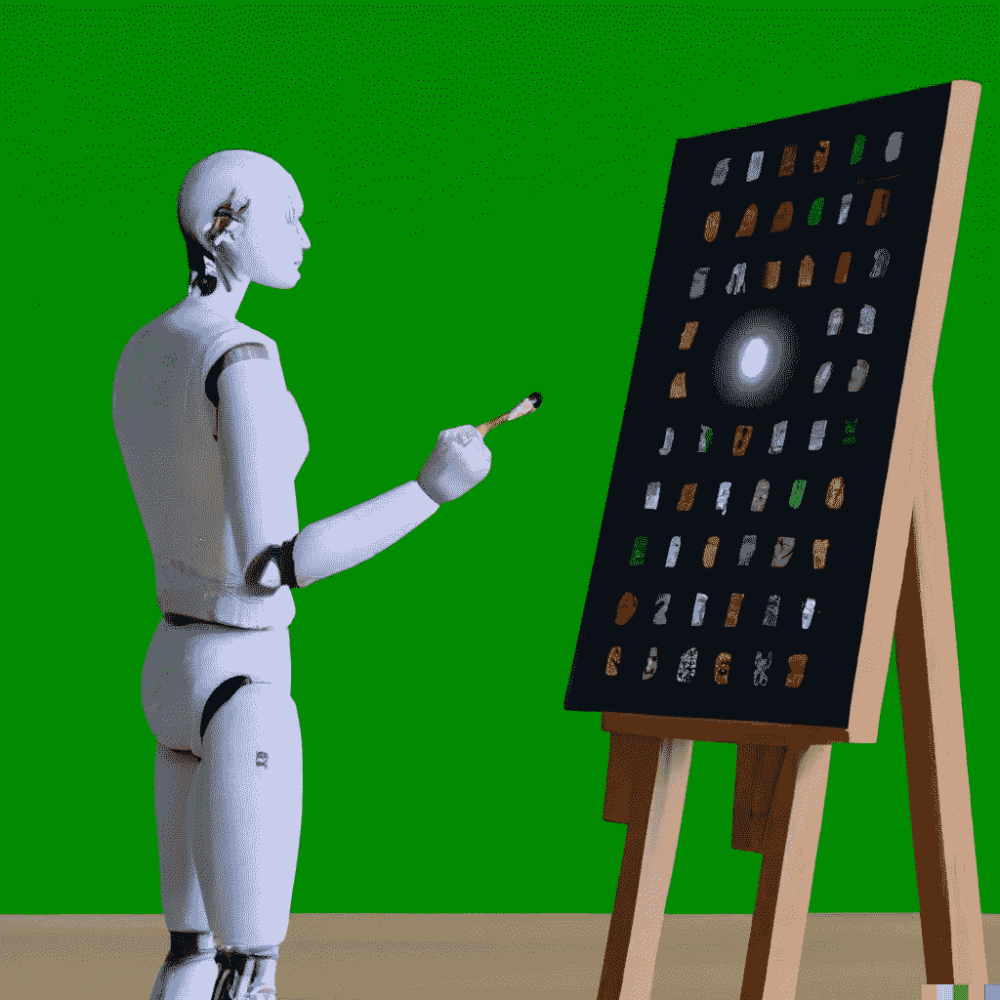

# 专家系统(第三章:人工智能手册)

> 原文：<https://levelup.gitconnected.com/expert-systems-chapter-3-ai-handbook-4143cbf6789d>

简单介绍了三种专家系统及其现代应用。

来自[作者](https://medium.com/@aniltilbe) [1]

专家系统是使用人工智能方法处理某些学科中复杂问题的计算机程序。知识库、推理机和用户界面是专家系统的三个主要组成部分。

知识库是专家系统保存其信息的地方，并包含其工作领域的详细信息。根据其预期用途，这些数据可能以规则、事实或启发的形式呈现。这些信息被输入到推理机中，然后推理机使用它们通过推断来解决问题，例如推论或绑架。此外，用户界面使用户能够通过向专家系统提供输入数据或根据推理请求结果来与专家系统交互。

来自[作者](https://medium.com/@aniltilbe) [1]

# **知识库**

例如，专家金融系统使用知识库进行数据分析，并提供有关市场趋势的预测。知识库收集有关各种经济指标的信息，如就业水平、通货膨胀、利率和全球事件，以实现这一目标。之后，这些信息经过一系列复杂的数学分析，这些分析既考虑了历史结果，也考虑了当前形势(如微观经济学和宏观经济学)。推荐生成器从知识库中提取信息以做出财务决策。

# **推理机**

推理机是专家系统的一部分，它使用逻辑推理，根据自己处理的数据得出结论。

## 插图:

—如果假定“所有的鸟都会飞”并且知道鹰被认为是鸟，那么推理引擎可能会得出鹰会飞的结论。

—如果有人被问及他们是否喜欢冰淇淋，并作出了肯定的回答，则推理引擎可以假设该人会喜欢香草巧克力片冰淇淋，因为他们通常喜欢冰淇淋。

—国际象棋引擎应用这些实现来分析棋盘上的当前形势，以告知如何最好地预测对手的移动(以及如何更快地获得胜利结果)。

来自[作者](https://medium.com/@aniltilbe)【1】

# **用户界面**

专家系统的组成部分是用户界面，它允许用户与系统进行交互。它通常由一个图形用户界面(也称为 GUI)以及一组可用于与系统通信的工具组成。

人工智能专家系统中的用户界面可以采取多种形式，包括但不限于聊天框、命令行、自然语言界面、虚拟现实环境等。

# **专家系统实施和现代应用**

使用专家系统的优势之一是，当传统方法无法解决问题时，专家系统通常可以提供解决方案。当数据不足或问题本身对人们来说太复杂时(由于时间限制、资源依赖等)，可能会出现这种情况。

例如，为了进行诊断，当提供了症状列表时，专家系统可以应用于医学领域。在像这样的系统中，知识库将包括关于不同疾病和与它们相关的症状的信息。在接收到作为输入的症状列表后，专家系统然后可以使用其推理引擎来基于所提供的信息确定哪种疾病是这些症状最可能的原因。这种情况的另一个例子可以在金融领域中看到，其中金融公司可以在推出新产品期间利用专家系统的市场分析能力，或者调查用户的行为。

## **以下是目前使用的其他应用的一些例子:**

—故障诊断是通过将症状列表与专家系统中包含的知识进行比较来确定问题根源的过程。这可以通过将当前情况与以前发生的其他事件进行比较并找出最相似的一个来实现。

—使用以前患者的数据，专家系统可以创建一个疾病发展的模型。该信息可用于预测新患者对治疗的反应。

—预测患者结果:可以使用专家系统，根据以前有类似问题的患者的数据，预测患者可能会有什么结果。

来自[作者](https://medium.com/@aniltilbe) [1]

专家系统已被证明在缺乏主题专家和高决策压力的领域非常有益。例如，专家系统有助于在医疗诊断等领域实现决策过程的自动化，在这些领域，大量的专家知识是必要的，但要将这些信息整理成文可能需要大量的人力资本和资源。作为一个额外的奖励，它们还可以通过提供对复杂系统行为的洞察以及如何最好地与它们交互的建议来促进人机界面。汽车引擎可以使用专家系统来帮助诊断故障，而空中交通管制员可以使用专家系统来更好地管理航线。

专家系统现在被用在各种各样的其他环境中。在故障诊断中，可以使用专家系统根据一组症状来确定问题的原因。这是通过将当前情况与先前已知的情况进行比较并确定哪一个最相似来完成的。当对疾病进展进行建模时，可以使用专家系统根据以前患者的数据对疾病进展进行建模。这些数据可以预测新患者对治疗的反应。此外，当预测患者结果时，专家系统可以基于来自具有类似状况的先前患者的数据来预测患者可能具有的结果。

# 离别的思绪

如果你对这篇文章有任何建议或拓宽主题的建议，我将非常感谢你的来信。另外，请考虑 [**订阅我的简讯。**](https://predictiveventures.substack.com)

我在 Medium 上创建了以下“列表”，你可以访问它来查看这个 [**【人工智能手册】**](https://aniltilbe.medium.com/list/b67f31a002b3) 系列中的所有其他帖子。

如果你喜欢看这样的故事，并且想支持我这个作家，可以考虑注册成为 Medium 会员，获得 Medium 上所有故事的无限使用权:[*** * *订阅 Medium*****](https://medium.com/@AnilTilbe/membership) **。**

## **此外，考虑阅读以下帖子:**

 [## 人工智能历史(第一章:人工智能手册)

### 开始、中间和现在。一个端到端的，但非常简单的介绍人工智能在这个多部分…

levelup.gitconnected.com](/artificial-intelligence-history-chapter-1-ai-handbook-ae5774ef8026) 

***亦作:***

 [## 知识表示(第 2 章:人工智能手册)

### 所有人工智能产品都采用的基本问题空间，这是一个非常简单的知识表示介绍…

levelup.gitconnected.com](/knowledge-representation-chapter-2-ai-handbook-f37da56d5868) 

引用被烘焙到帖子中；另外:

1.  OpenAI 协助开发了这一可视化工具

阿尼尔·蒂尔贝