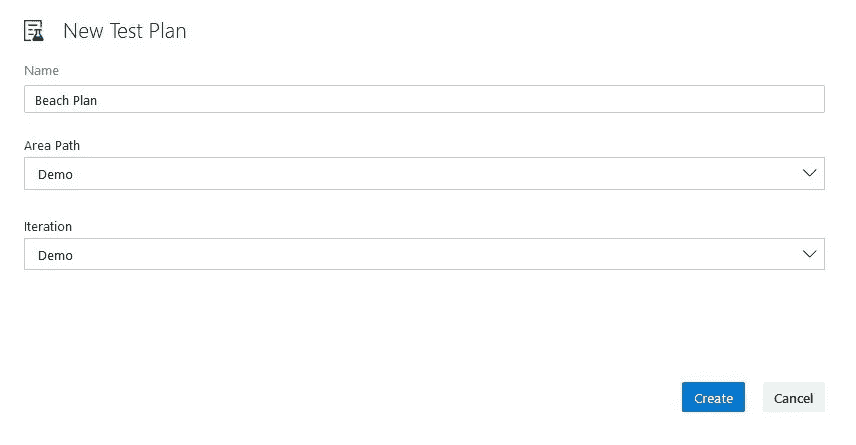
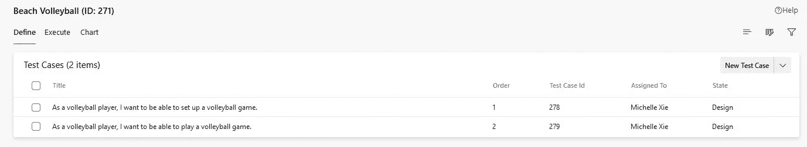

# 举例说明:Azure 测试计划

> 原文：<https://levelup.gitconnected.com/explain-by-example-azure-test-plans-cf10943a8823>

测试可能是一个非常枯燥的话题。天气太干燥了，每次我想到测试，我想做的就是去海滩游泳。今天也是一个非常好的海滩天气，但是我不能在海滩上工作，所以相反，我将使用 [Azure 测试计划](https://azure.microsoft.com/en-au/services/devops/test-plans/)制作一个海滩计划。

**什么是 Azure 测试计划？**

Azure 测试计划听起来确实如此。它是一个工具集，允许您为手动和探索性测试创建测试计划。[人工测试](https://en.wikipedia.org/wiki/Manual_testing)实际上只是人工测试。但是，人类经常容易出错，所以手动测试通常遵循严格的计划。另一方面，探索性测试是创造性测试。像大多数有创意的事情一样，这并不遵循严格的计划。Azure 测试计划实际上是 Azure DevOps 的一部分。你会问，Azure DevOps 是什么？好问题，让我在海滩之旅后回复你…

首先，我将[为我的海滩之旅(或海滩项目)创建一个名为“海滩计划”的新测试计划](https://docs.microsoft.com/en-us/azure/devops/test/create-a-test-plan?view=azure-devops):

我想在海滩上做一些活动。就当是我对这片沙滩的要求吧。在这个海滩上，我希望能够游泳、冲浪、晒日光浴、堆沙堡和打沙滩排球。

对于每个活动，我将在我的海滩计划中创建一个新的测试套件。每个套件将代表一个活动，因为我想将每个活动分开，这样我就可以专注于彻底测试每个海滩活动，并且因为我非常认真地对待我的海滩活动*这可能经常导致不止一个测试案例。*

**

*所以本质上，一个测试套件包含一组相关的测试用例，用于某些场景，比如:游泳、冲浪、晒黑、沙堡建筑和沙滩排球。*

**

*在每个测试套件中，我将[创建与那些特定场景相关的测试用例](https://docs.microsoft.com/en-us/azure/devops/test/create-test-cases?view=azure-devops)。我先从游泳开始。*

*我的第一个游泳测试案例是这样的:*作为一名游泳运动员，我希望能够在海滩游泳。*然后执行这个测试用例的步骤如下:*

1.  *找到海滩*
2.  *找到“在这些旗帜之间游泳”的旗帜*
3.  *跑进水里*
4.  *开始游泳*

**

*这些是我认为验证这个特定测试用例所必需的步骤。我在第 4 步附上了一张图片，展示了一个人在游泳，以此来说明我所说的“开始游泳”是什么意思。因为游泳是我最喜欢做的活动，所以我将优先级状态设置为 1，以表明这是一个非常重要的测试案例，因为如果我不能在这个海滩游泳，那么我就不想去这个海滩。然后我点击蓝色的“保存并关闭”按钮，我的第一个测试用例就创建了。*

*接下来，我将为我的沙滩排球场景创建一些测试用例，但这次我将使用网格方法。网格方法是向测试套件添加测试用例的一种快速简单的方法，尤其是当您有多个测试用例的时候。*

**

*我将要添加的两个测试用例将测试:*

1.  *安排一场排球比赛*
2.  *打排球比赛*

**

*一旦我点击保存然后关闭，我就创建了两个测试用例:*

**

*现在，有趣的是。我将向 Bing 咨询一些严肃的研究(也是为了积累我的 T2 微软奖励点数):*

**

*在网上查询后，我发现以下海滩是我的目标:*

1.  *希腊沉船海滩*
2.  *澳大利亚怀特黑文海滩*
3.  *菲律宾隐蔽海滩*
4.  *巴西普拉亚-杜桑丘*
5.  *墨西哥图勒姆海滩*

**

*回到我的海滩计划。我将添加两个配置变量:*国家和沙子*。*

*国家配置变量将包含我感兴趣的海滩所在的国家列表。我可以添加更多的国家，但我可能不会使用它们，因为我只对测试这五个海滩感兴趣。*

**

*同样对于沙子，我将添加三种类型的沙滩:黑色沙滩，白色沙滩，黄色(或金色)沙滩。*

**

*现在我的两个配置变量已经设置好了，我可以开始添加我的测试配置或者 beach 配置了。对于沉船海滩，我需要创建一个新的测试配置，并将其命名为“沉船海滩”，并向其中添加 country 和 sand 配置变量，其值分别设置为“希腊”和“白色”。我对其他四个海滩重复这个过程，直到我总共有五个测试配置(我可以在五个海滩上执行我的海滩计划)。*

**

*然后回到我的游泳测试套件，我可以分配我刚刚创建的海滩配置。*

**

*因为我想在所有的海滩上测试游泳，所以我将勾选我制作的所有海滩配置。*

**

*这将我的游泳测试用例自动复制到五个副本中，每个副本都有其唯一的海滩(测试)配置:*

**

*现在，我准备好去海滩了！我打算从沉船海滩出发(因为我真的很想去希腊)做一次试运行:*

**

*如果我能够遵循步骤 1 到 4 并得到预期的结果，那么对我来说这就是快乐的一天，因为我的测试用例通过了，我可以继续测试下一个场景了。*

**

*然而，如果没有，我将不得不报告在测试期间发生了什么，使得测试用例失败。好的一面是 Azure 测试计划中有工具允许我这样做。*

**

*我可以记录我采取的所有行动，并将其作为附件。我可以用相机捕捉发生的特定事情，并将其作为附件。当我运行测试用例时，我还可以为每一步添加注释。在每一步，我都必须指出这个行动是否会导致预期的结果。*

*假设在第四步，我开始游泳，发现我高估了自己的游泳能力，根本不会游泳。我没有游泳，而是开始溺水并呼救。沉船海滩不是为不会游泳的人设计的，所以周围没有救生员。通常，海滩上会游泳的人可能会跳入水中救我或呼叫紧急服务，但在测试世界中，我们是在测试环境中操作的，所以我们有足够的时间采取纠正措施，这样我们就不必经常打扰紧急服务。*

*在这种情况下，我们将提出一个错误。bug 通常是指系统中的某种缺陷，它阻止了预期结果的发生。*

**

*在这里，我可以在测试运行期间创建一个 bug，并将其分配给海滩开发者，告诉他们海滩存在缺陷，以便他们可以进行适当的修复，例如*雇用一些救生员*！bug 将包含所有的测试运行细节，因此当 beach 开发人员检查这个 bug 时，他们可以看到测试用例失败的时间和位置，并找出正确的修复方法。附件也可以在这个 bug 中访问。我还可以将这个 bug 的严重性设置为 1，这意味着修复这个 bug 至关重要。*

***探索性测试有什么不同？***

*就像我之前提到的，探索性测试给了测试人员在他们的测试方式中发挥创造力的自由。我们给他们一套工具和产品来测试，而不是创建一个测试计划来执行。在我的情况下，假设我懒得写一份正式的海滩测试计划，但我仍然想去海滩，看看海滩能在多大程度上满足我游泳、冲浪、晒黑、建造沙堡和沙滩排球的需求。或者，假设我根本不知道如何测试海滩，那么我能做的就是使用探索性测试来找出测试海滩的相关测试用例。*

*要开始探索性测试，您需要从市场上安装[测试&反馈扩展](https://docs.microsoft.com/en-us/azure/devops/test/perform-exploratory-tests?view=azure-devops)。*

**

*一旦你安装了扩展，我们就可以开始探索。*

*您可以在两种模式下使用测试和反馈工具:*连接或独立*。连接意味着您可以将结果连接回您的 Azure DevOps。独立基本上意味着离线使用一些探索性的测试特性。*

**

*比方说，我在沙滩上做了一些探索，我得到了一个“*尤里卡！*‘那一刻我突然意识到，在跳入水中之前，我需要先学会游泳。我按下测试反馈工具上的 play 键，开始记录我的发现。*

*首先，我回到我信任的顾问 Bing.com[身边，问自己:](http://bing.com/)*

**

*然后，我使用测试和反馈工具的摄像头功能来捕捉我的发现。一旦我拍摄了截图，我可以添加形状和文本来突出重要的部分。*

**

*从那里，我可以立即用我的发现从 Test & Feedback 扩展中创建一个任务。我也可以创建一个新的 bug 或者一个新的测试用例。*

**

*如果我在连接模式下工作，我可以转到我在 [Azure Boards](https://azure.microsoft.com/en-au/services/devops/boards/) 中的工作项，发现我的新任务已经自动添加到我的工作项中:*

**

*通过我的海滩探索，我发现了一个对海滩的新要求(因为我的游泳技术很差),这是我在人工测试的关键 bug 阶段之前不会知道的。*

*所以，现在你也可以用 Azure 测试计划来计划你自己的海滩之旅了！*

**

****不要脸塞:*** 在 twitter 上关注我的博文更新和其他随机推文！*

**作者:*谢蜜儿*

**原载于*[*https://www.linkedin.com*](https://www.linkedin.com/pulse/explain-example-azure-test-plans-michelle-xie/)*。**