# 举例说明:动态编程

> 原文：<https://levelup.gitconnected.com/explain-by-example-dynamic-programming-776ac2839d8a>

这可能是我迄今为止写的最难的博文之一，因为它针对的是我最大的弱点之一:*动态编程。*顺便说一句，你不一定要成为程序员才能理解这一点。这些“举例说明”系列的全部要点是用任何人都能理解的方式来解释事情，所以如果内容太专业，请告诉我。

## **那么，** **什么是动态编程呢？**

我喜欢把它看作是带记忆的递归。递归本质上是把一个大问题分解成更小的子问题，这样它就变得如此之小，以至于你可以最终解决它，而你不会被这个大问题淹没。我一直觉得递归很难理解。所以当我遇到动态编程时，我就反其道而行之了。但是逃避问题并没有给我一个解决方案(令人震惊，我知道),所以我尝试把我知道的最大的问题分解成我(希望你)能理解的东西…

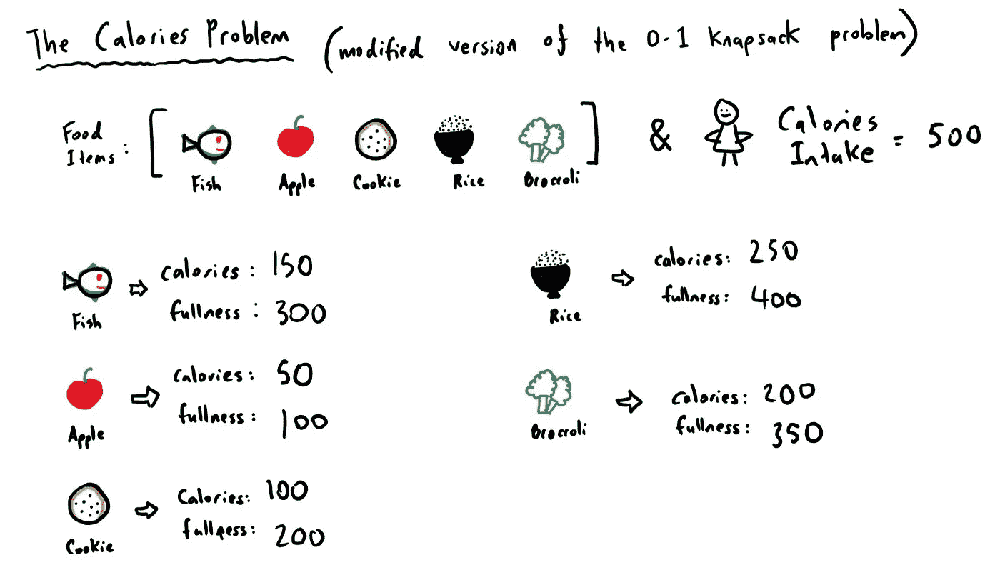

和往常一样，我喜欢用自己的方式来解释概念和想法。如果你上过传统的计算机科学课，听说过 NP 问题(NP 完全、NP 困难等)，或者关注过脸书上的任何计算机科学迷因网页，那么你可能会遇到“0-1 背包问题”。嗯，**“优化你的卡路里摄入量”**问题是我的 0-1 背包问题的等价物。由于如今每个人都如此痴迷于计算卡路里，我认为这可能是一种有趣的方式，使这个话题与现实世界更加相关。

## **热量问题是什么？**

每种食物都有一定的卡路里数，我相信你在吃了某种食物后会有那种*“我现在饱了”*的感觉，所以对于每种食物(在我的列表中)，我也会附上一个“饱腹感”值来表示你在吃了那种特定的食物后会有多饱。

基本上，我们想要解决的是:

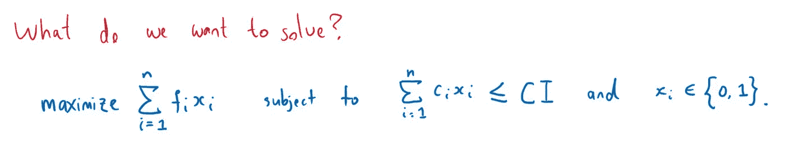

我们想最大化我们从食物中获得的满足每日标准卡路里摄入量的饱腹感。这里有一个假设，每种食物你最多只能吃一次或者根本不吃。(为看起来吓人的数学符号道歉)

换句话说，我们可以食用哪些食物组合会最大限度地满足我们的饱腹感(这样我们就不会很快又饿了)，但我们每天摄入的热量应该是多少？

假设每天摄入的热量(CI)是 500。

这就是动态编程可以用来解决这个问题的地方:

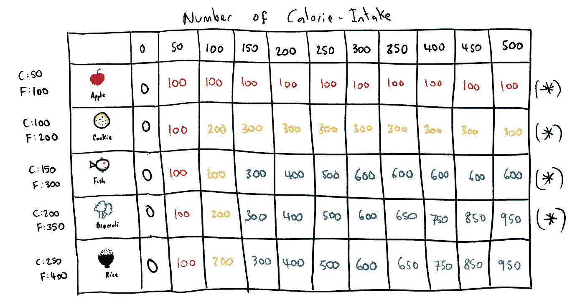

在左手边，我列出了我们正在考虑的所有食物:苹果、饼干、鱼、花椰菜和米饭，以及它们的卡路里和饱腹感信息。

在顶部，从 0 到 500 是卡路里等级。我停在 500，因为在这种情况下，我们认为 500 是你能消耗的最大卡路里。

还记得我说的动态编程:*递归+内存*？

所以，我们想做的是把问题分解成最小的子问题，解决这个小的子问题，[记忆它(就像把它存储在内存中)，直到我们最终能解决这个大问题。这就是通常所说的“自下而上的方法”。](https://en.wikipedia.org/wiki/Memoization)

我们将从苹果开始，从左向右移动。每一栏都在强加一个严格的“卡路里截止点”。所以在第 0 栏，我们是说，你在这一栏可以消耗的最大卡路里是 0(如果你问我，这是一个非常吝啬的饮食)。

因为我们从食物列表中只有苹果开始，这意味着我们只能吃苹果。请记住，我们开始时规模很小，以后会增加更多的复杂性。

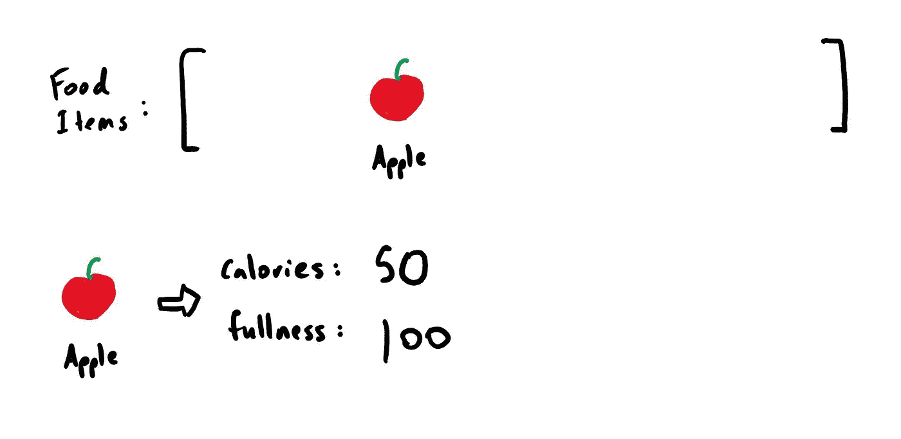

现在转到第 50 栏，我们已经将严格的卡路里截止值提高到 50 卡路里。一个苹果含有 50 卡路里，所以我们现在可以吃苹果了(耶！).吃完苹果后，我们写下 100 表示饱。当我们移动到列 500 时，可以看到所有的填充值都保持在 100。

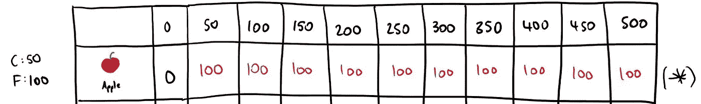

**为什么？**

还记得我之前说的吗？每种食物你只能吃一次，所以即使我们的卡路里截止点提高了，因为我们只考虑苹果，我们最多只能吃一次。

我知道你现在很烦躁(饥饿+愤怒),所以让我们在我们的清单上增加另一项食物:饼干！

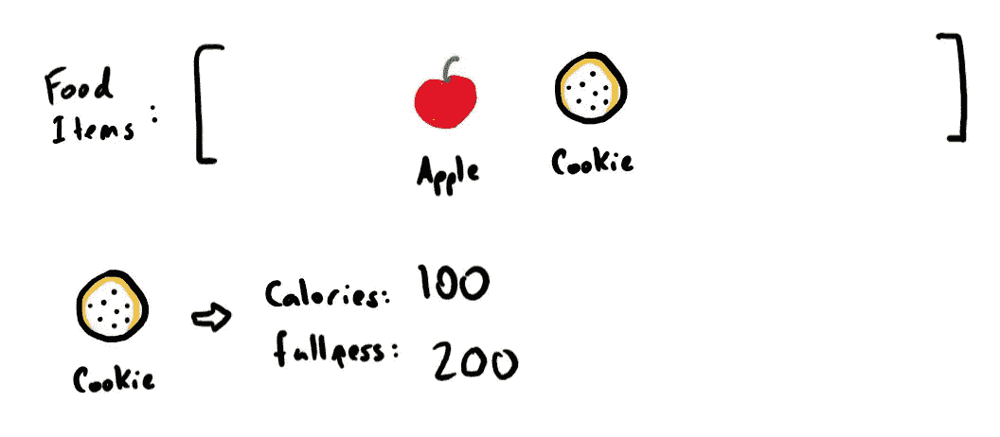

现在我们可以吃一个苹果或一块饼干，或者两者都吃，这取决于我们的卡路里摄入量。

同样，在第 0 列，我们不能消费任何东西，所以充满度保持在 0。在第 50 栏，我们只能吃苹果，因为饼干的卡路里数是 100，所以饱腹感保持在 100。现在，在第 100 列，我们可以吃一个苹果或一块饼干，因为我们想最大化我们的饱腹感，我们选择了饼干而不是苹果(毕竟饱腹感= 200 大于饱腹感= 100)。所以我们吃完饼干后写下 200。

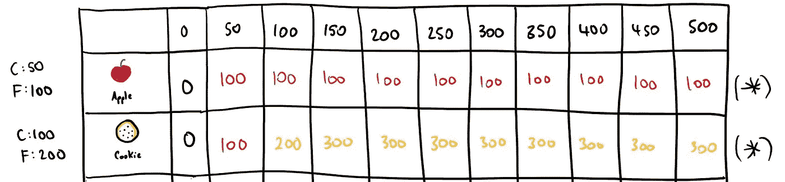

在下一栏，我们的热量需求增加到 150。我们吃了饼干，这给了我们 200 的饱腹感，但是我们还有 150–100 = 50 卡路里。因为我们已经考虑了前一行中的所有苹果(将其记忆)，所以我们只需在第 50 列的苹果行中进行查找。这告诉我们，我们可以再增加 100 到我们的总饱腹感值，所以现在我们的总饱腹感变成 200 + 100 = 300，这意味着如果我们的热量需求是 150 卡路里或更多，我们至少可以达到 300 的饱腹感。或者，换句话说，我们的“悬挂感”减少了。

因为我们只有两种食物要考虑，并且我们已经在列 150 中考虑了这两种食物，所以所有剩余的列也将具有相同的充满度值。

接下来，我们把鱼加入我们的食物清单。一条鱼的卡路里数是 150，这意味着从第 0 列到第 100 列，我们在上面一行取相同的饱腹值。

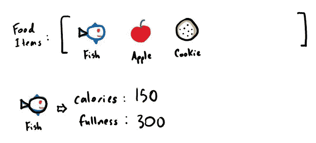

在第 150 栏，我们可以吃鱼，也可以吃苹果和饼干，因为它们都含有 150 卡路里的热量。通常我们会选择最大化我们的丰满值的选项，但是因为它们都导致 300 的值，我选择了鱼。现在，如果我们看一下第 200 栏，我们可以吃鱼，这意味着我们还剩 200–150 = 50 卡路里。再次，我们看上面的行，找到 50 卡路里栏，这给了我们额外的 100 卡路里，这意味着我们的总饱腹感现在是 300(来自鱼)+ 100 = 400。然后我们继续前进，对于每一列，计算出在给定热量限制的情况下我们可以获得的最大饱腹值:

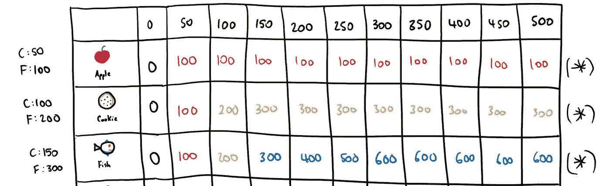

直到最后，我们开始这样做:

注意最后一行(大米行)的值与上面一行(花椰菜行)的值完全相同。这是因为当我们经历时，我们发现考虑到卡路里的限制，米饭不能提供足够的饱腹感来克服其他组合。因此，我们几乎可以排除这个选项，因为我们知道它永远不会成为任何组合的一部分，让我们在 500 卡路里的热量摄入限制下获得最大的饱腹感。

现在我们可以看到一个非常明显的事情，最高的组合丰满度值是 950。这意味着，给定我们所有的食物和 500 卡路里的摄入限制，我们只吃一次或不吃任何食物所能得到的最大饱腹感是 950。

因此，为了准确计算出哪些食物有助于最大的饱腹感，我们可以倒过来从西兰花开始。西兰花为 950 贡献了 350，这意味着我们还有 950–350 = 600。我们现在看上面的前一行(鱼行)，看看这一行中是否有 600。因为 600 确实存在于 fish 行中，这意味着 fish 也是 950 的贡献者。现在我们还有 600–300(来自鱼)= 300。我们继续向上一个 cookie 行，检查该行中是否存在 300。因为它是，我们知道它也有助于 950。最后，我们还剩 300–200(来自 cookie) = 100。我们再往前走一步到苹果行，检查 100 是否存在。嗯，它几乎无处不在，所以我们知道苹果也为 950 做出了贡献。现在我们还剩 100–100(来自苹果)= 0。我们就此打住。

*所以……结果是:*

*   **食物:**西兰花、鱼、饼干、苹果
*   **可获得的最大丰满度值:** 950
*   **卡路里数:** 200 + 150 + 100 + 50 = 500

现在你可以告诉你的家人和朋友，如果他们有 500 卡路里的摄入限制，并且在他们的储藏室或冰箱里只有这 5 种食物，这些应该是他们最大限度地提高能量水平的食物(假设更大的饱腹感=更高的能量水平)。如果他们问你怎么知道的，就说“魔法！”或者“嗯，你知道，我自己也是一个有点活力的程序员”。

鉴于[微软最近的声明及其对可持续发展的承诺](https://news.microsoft.com/climate/)，这对程序员(和非程序员)来说是一个很好的提醒，优化可以减少浪费。使用动态编程实践，可以优化代码以更高效地执行，从而花费更少的计算时间(更少的计算资源)，使得运行优化的软件更节能、更快。优化是生活中许多方面的关键，即使这个优化卡路里摄入的愚蠢例子也可以帮助我们减少现实世界中的食物浪费，以便我们可以走向更可持续的生活方式。

***编辑:*** 我最初把这篇文章发布到 LinkedIn 上，发现有人点名批评我对递归的定义/解释。起初我很惊慌，因为那个人在 IT 行业的经验比我丰富得多，而且这篇文章已经被分享了很多次，我开始担心我告诉了所有人错误的事情。所以，就像我所有的问题一样，我做了一些挖掘来寻找解决我最糟糕的噩梦的方法:

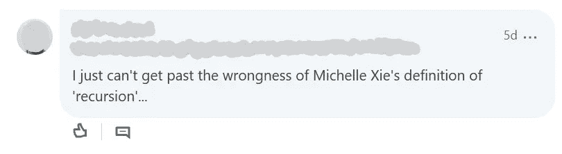

关于递归，我最初说的是:

> 递归本质上是把一个大问题分解成更小的子问题，这样它就变得如此之小，以至于你可以最终解决它，而你不会被这个大问题淹没。

这是[麻省理工](https://web.mit.edu/6.005/www/fa15/classes/10-recursion/)不得不说的:

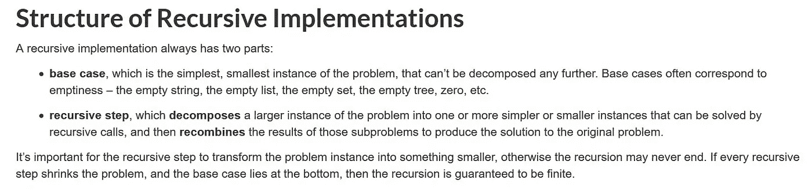

这是普林斯顿大学不得不说的话:

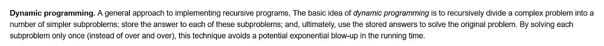

这是 [SparkNotes](https://www.sparknotes.com/cs/recursion/whatisrecursion/section1/) 不得不说的话:

最后但同样重要的是，这是[维基百科](https://en.wikipedia.org/wiki/Recursion_(computer_science))不得不说的:

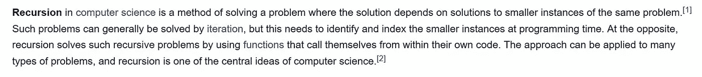

我承认，我的解释有点过于简单了。也许我应该提到类似这样的话，“直到你到达基本情况(最小的可能的问题)并且最终能够解决问题，然后再回到解决更大的问题”。这个编辑并不是要对任何人大声疾呼，我真的很感谢这些反馈，因为它帮助我提高，所以我要感谢这个人。我想我这次编辑的另一个观点是，当我错了的时候，我会诚实地承认。这些帖子是分享我的学习的一种方式，我的学习有时可能是错误的，所以如果是这样，请让我知道。毕竟人无完人:)

*作者:*谢蜜儿

*最初发表于*[T5【https://www.linkedin.com】](https://www.linkedin.com/pulse/explain-example-dynamic-programming-michelle-xie/)*。*