# 举例说明:面向对象编程(OOP)

> 原文：<https://levelup.gitconnected.com/explain-by-example-oop-24fe5d6c978>

当我在大学的时候，我很少被教授面向对象编程的概念。我希望在我的 Java 课程中向我介绍 OOP 时，我有[这样的解释](https://www.freecodecamp.org/news/object-oriented-programming-concepts-21bb035f7260/)。我从未真正理解的一件事是为什么 OOP 很重要。我的代码可以工作，为什么我要修改它来适应这种 OOP 设计呢？

答案很简单:可重用性、简单性和安全性。我以为是因为程序员想成为*看中*(在某些方面，这是真的)。因此，与其告诉你 ***什么是*** OOP，我将从 ***为什么*** 开始，因为我认为它提供了一个更有说服力的论据，说明为什么我们应该在 OOP 设计中编写代码。

那么，为什么要在 OOP 设计中编写代码呢？

我刚才提到了可重用性，所以让我们看一个简单的 flower 例子，看看为什么可重用性很重要。

人们经常问我如何制作图纸，老实说，我用的是一种更高级的画板，叫做微软白板，这通常是设计过程。

我将从一个组件一个组件地构建我的花开始:

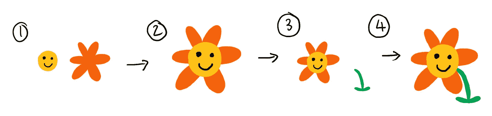

为什么要以这种一个组件一个组件的方式构建我的花？

这允许我重用组件。让我们想象一下，我想要构建一朵不同颜色的花，我只需要改变一些组件的颜色属性，然后重用其余的组件来构建一朵不同颜色的花。所以可重用性是关键。

**另一个是什么？**

我也提到了简单。通过将它分解成组件，我可以在不影响其他组件的情况下维护我的花的组件。想象一下，如果我把这朵花粘在学校的练习本上。现在，如果我想要我的花的另一个副本，我将不得不从我的练习本上剪下它，如果任何人以前曾经试图变得狡猾，就会知道，剪下比建造困难得多。同样的逻辑也适用于软件代码，你可以剪切和复制代码片段，但这通常是混乱的，需要更多的时间，并且你可能最终得到难以定制或修改的副本。

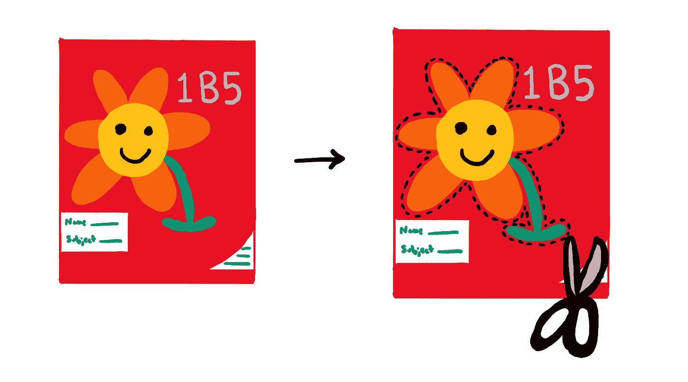

所以想象一下，你可以一个组件一个组件地构建你的代码，并在进行过程中进行定制，而不是剪切和复制。你可能最终得到一个全新的软件，同时重用你或其他人过去做过的大量工作。

这是 OOP 背后的思想。像对待物体一样对待一切事物(或者我到目前为止一直称之为“组件”)，并以这样一种方式编写程序，即这些物体可以相互作用并在彼此之上构建，就像使用 [Lego](https://www.lego.com/) 建造房屋和城市一样。

首先你用模板定义这些对象，称为“类”。一个类就像是你的对象的蓝图。当你想创建一个对象时，你可以使用这个类模板，它概括了你构建这个对象所需要的一切，你只需要简单地说，“去为我创建这个对象”。

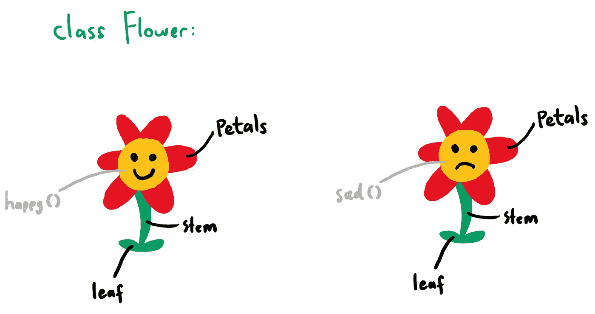

因此，每次我们通过 flower 类模板实例化一个 Flower 对象时(这是一个时髦的说法，意思是“创建一个实例”)，我们都有一个 Flower 对象，它由一定数量的花瓣、叶子、茎干组成，并且能够让我们的花变得快乐或悲伤。

例如，我们的 Flower 类可能如下所示:

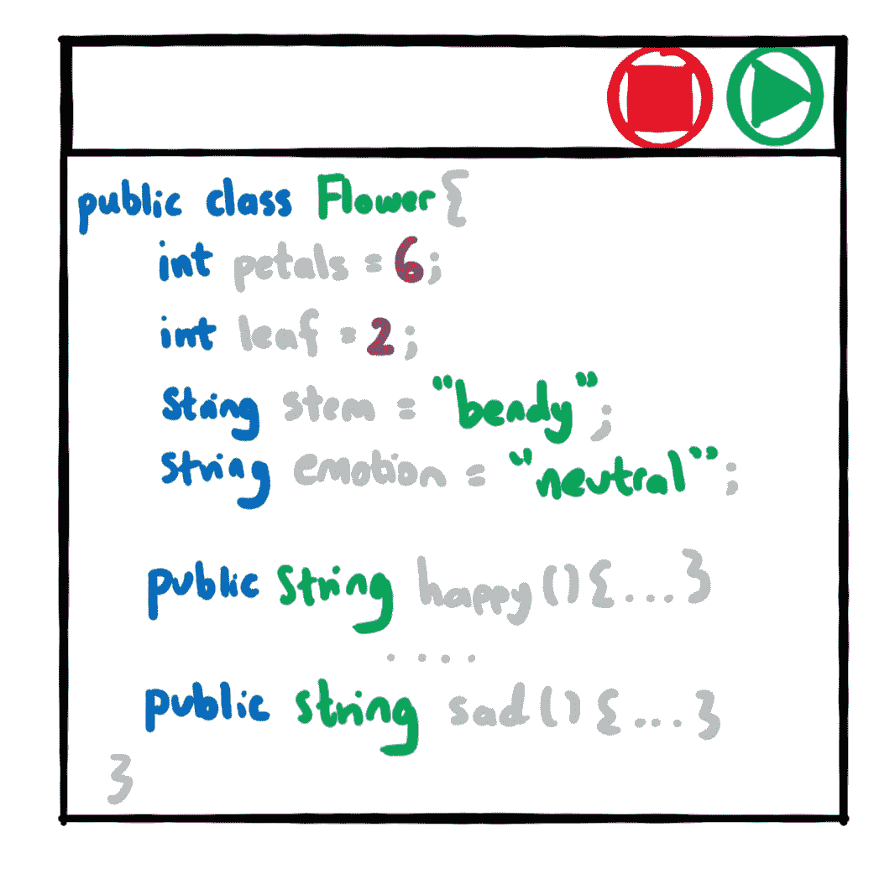

现在花瓣、叶子、茎和情感就是我们在 OOP 中所说的属性。你可以把它想象成默认值。你可以使用我马上要谈到的方法来改变这些缺省值，但是让我们来讨论为什么属性是重要的。

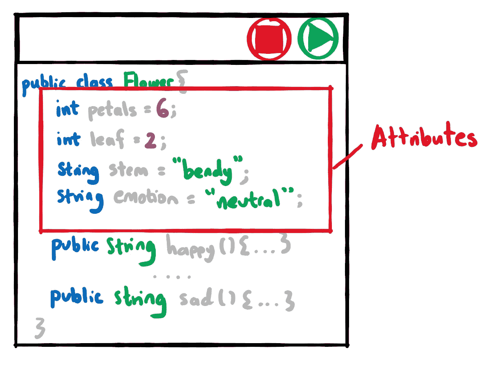

**为什么属性很重要？**

属性允许我们定义花对象的外观。如果我对你说“去做一朵花吧”，你大概会问我“什么样的花？多少花瓣。什么颜色？你想要多大的？”

但是如果我给你一个带有一些属性的 flower 类，这将为你我节省一些问答时间，因此 OOP 鼓励代码的简单性。

**你也提到了方法，它们是什么？**

如果你不喜欢我在 flower 类属性中给你的默认值怎么办。假设你想要一朵叶子多花瓣少的花。你会如何改变？

这就是方法(我经常称之为“类函数”)的用武之地。方法允许您修改所实例化的类对象的功能或行为。因此，如果您想改变 flower 对象的情感，您可以调用 happy()方法或 sad()方法。

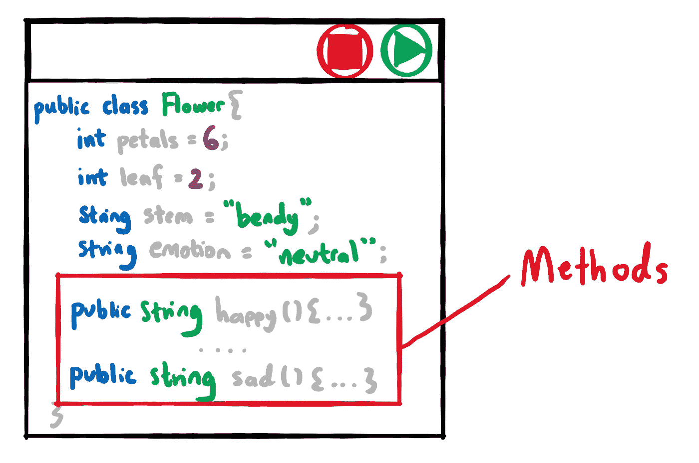

这些 happy()和 sad()方法是如何工作的？

这就是我将要介绍的 OOP 的首要原则之一，即'[抽象](https://en.wikipedia.org/wiki/Abstraction_(computer_science))。抽象可能是我在大学时最喜欢听到的短语之一，那时教授会告诉我们，“考试时你不需要知道这些。”这是我**一直**记下的事情。OOP 中的抽象也是如此。抽象告诉我们，“嘿，你不需要知道这个方法是如何在幕后实现的。你只需要知道，如果你调用这个方法，你应该得到它承诺要做的事情。”在这种情况下，如果我们调用 happy()方法，我们可以让我们的 flower 对象开心。如果我们调用 sad()方法，我们可以使我们的花对象悲伤。

现在，到目前为止，我们的 flower 类不允许我们修改花瓣、叶子或茎的数量，所以让我们在我们的类中添加一些方法来允许我们这样做。我们将添加一个 setPetals()方法。这允许我们封装我们的属性。

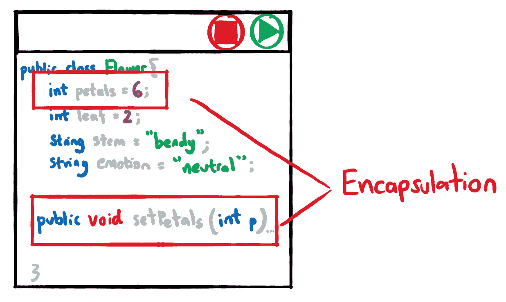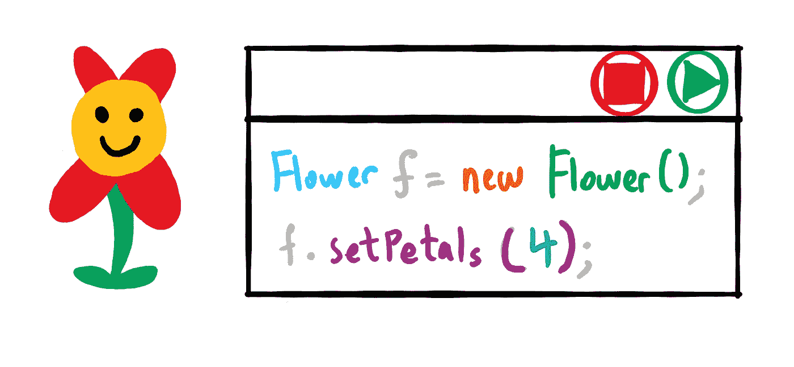

**等等，封装？**

封装是 OOP 的另一个原则。有时，我们可能希望对某些信息保密。例如，我们可能希望允许花对象的花瓣数量被更新，但是我们不想向任何人公开该信息。这个花的例子可能不是这里的最佳用例，所以让我们想一个不同的例子。

当我在大学时，我是助教，这意味着我必须批改作业和考试。现在，对于那些曾经不幸得不得不批改成堆的作业和考试的人来说，你会知道“这难以辨认的字迹想表达什么？”以及“该不该给这个学生加分？”。作业和考试需要交叉标记，以尽量减少这样的偏差。

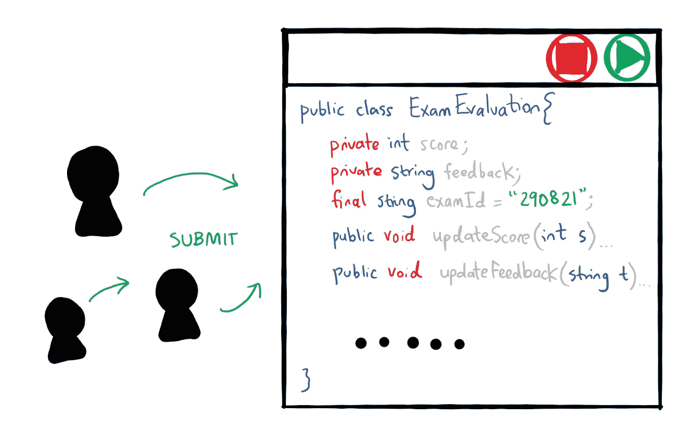

现在，如果我们要编写一些软件代码来允许我们的助教将他们的标记和反馈提交到系统中，这就是我们需要考虑封装的地方。该系统的一个要求是，“我们希望允许我们的助教提交他们的反馈，但不要查看其他助教的反馈，因为这样我们的学生将得到公平的评价和分数。”

我们可以声明一个私有属性“score”和“feedback ”,并且只允许通过类中的“updateScore()”和“updateFeedback()”方法更新这些属性。没有方法允许助教访问其他助教的分数和反馈，这可能会影响他们的判断和反馈评估。

您刚刚了解了为什么封装很重要。有时，我们希望在我们的类中保持某些信息的私密性，只允许访问可以公开的内容。这是一个支持 OOP 如何在代码设计中鼓励安全性的原则。

我不是种花人，但即使是我也知道有不同种类的花，如“向日葵”、“雏菊”、“兰花”、“百合”、“罂粟”等等。

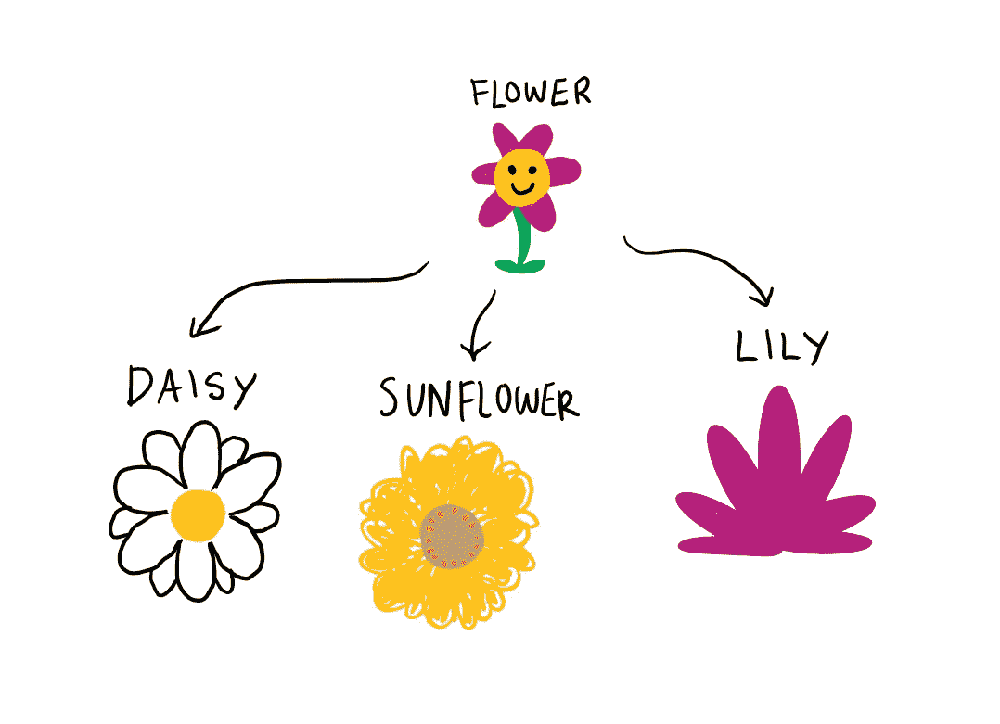

因此，在这种情况下，我们的 Flower 类有点过于通用，无法创建任何特定类型的花，这就是为什么我要在 OOP 中引入第三个原则，称为'[继承](https://en.wikipedia.org/wiki/Inheritance_(object-oriented_programming))'来克服这个问题。

继承允许我们定义类之间的父子关系。这意味着您可以扩展 flower 类(它是一个超类)并创建 Flower 的子类型(它是一个子类)。

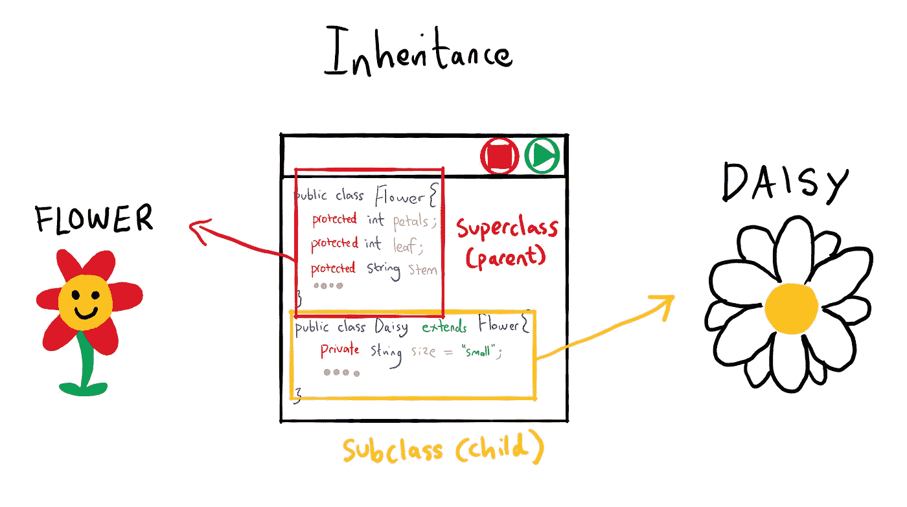

**为什么继承？**

继承允许代码重用。例如，雏菊也有花瓣、茎和叶，就像任何其他普通的花一样，所以我们可以从 Flower 类继承所有这些属性和方法，而不是在 Daisy 类中重新定义所有这些属性和方法。除此之外，雏菊还有一些特殊的特征，例如，它们通常很小，有很多花瓣，本质上是白色的，等等。我们可以在 Daisy 类中指定所有这些细节。

这里要注意的另一个重要概念是，您可以重写子类中的方法或重载同一类中的方法。这触及了我将要讨论的 OOP 的最后一个原则，叫做“[多态性](https://en.wikipedia.org/wiki/Polymorphism_(computer_science))”。

很长一段时间，我从来没有真正理解继承和多态之间的区别，但归结到基础，继承允许你共享特征和行为，多态允许你改变或修改共享的特征和行为。

举例。我们了解到，我们可以创建一个 Daisy 子类来表示更具体的 Flower 类。我们的 Daisy 类继承了我们的 Flower 类中定义的所有特征，但是如果我们想要改变一些特征呢？

例如，在前面的 Flower 类中，我们说过将有一个“setPetals()”方法，它允许您确定 Flower 对象中花瓣的数量。如果一朵标准的花只有 5 片花瓣，而一朵雏菊花却有 20 片花瓣呢？

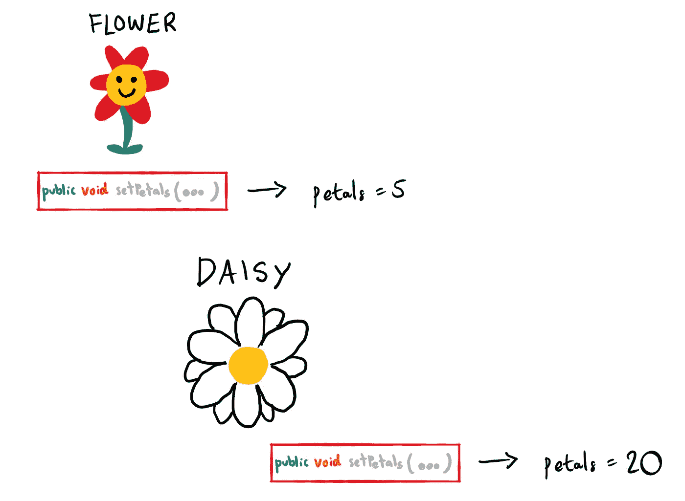

在这种情况下，我们可以用 Daisy 类中的“setPetals()”方法覆盖 Flower 类中的“setPetals()”方法。

这样，当我们实例化 Daisy 对象并调用' setPetals()'时，我们将把花瓣数设置为 20 而不是 5。

多态的另一种工作方式是重载同一个类中的方法。例如，我们可以通过重载 Flower 类中的一些方法，在 Flower 类中创建不同类型的花。

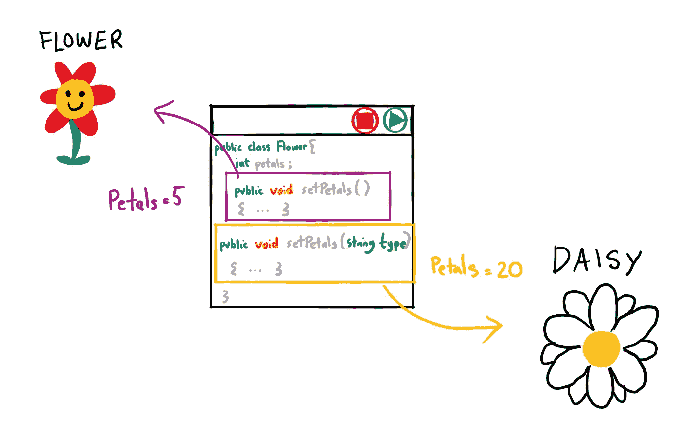

您可能想知道(因为我确实想知道)，为什么您应该用一种方法而不是另一种方法进行变形呢？

我发现的这篇[文章](https://hackernoon.com/overloading-vs-overriding-in-c-nn1331h4)给出了一个使用计算器的很好的例子，我打算偷一个，所以不再有花的例子。

**为什么超载？**

重载也称为编译时多态性。基本上，这意味着编译器会在编译时决定使用哪种方法。

假设你在一个计算器类中有 3 个方法。这些方法让我们可以把一些数字加在一起。

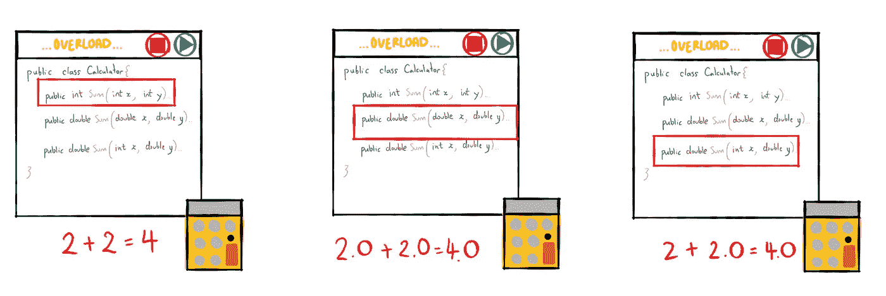

1.  **int *sum* (int *x* ，int *y* )**

第一个 sum 方法接受两个参数，x 和 y，它们都是整数类型。返回值也是一个[整数类型](https://en.wikipedia.org/wiki/Integer_(computer_science))。

所以如果我们称之为:计算器()。sum(2，2)。我们拿回 4 美元。

2 **。double*sum*(double*x*，double *y* )**

第二个 sum 方法再次接受两个参数，x 和 y，但是这一次，它们都是 Double 类型。返回值也是[双型](https://en.wikipedia.org/wiki/Double-precision_floating-point_format)。

如果我们调用:计算器()。sum(2.0，2.0)。我们拿回 4.0。

3.**double*sum*(int*x*，double *y* )**

第三个 sum 方法再次接受两个参数，x 和 y，但这次它是一个整数类型和一个双精度类型。结果值以双精度类型返回。

如果我们调用:计算器()。sum(2，2.0)。我们拿回 4.0。

重载是简单性的一个很好的证明。我们已经简化了类方法，使用相同的名称“sum ”,它可以接受不同类型(通常是不同数量)的参数。在编译时，根据传递给方法的参数类型，编译器决定是否执行“sum”方法 1、2 或 3。

**为什么要压倒一切？**

重写也称为运行时多态性。还记得我们之前谈到的继承的概念吗，关于类的整个“父子”关系。大多数父母都知道，并不是所有告诉孩子的事情都会得到孩子的同意。OOP 中的超类和子类也是如此。子类(子类)不一定与超类(父类)中的所有东西都一致。在这种情况下，他们有能力覆盖某些方法，同时重用他们同意的所有其他方法。

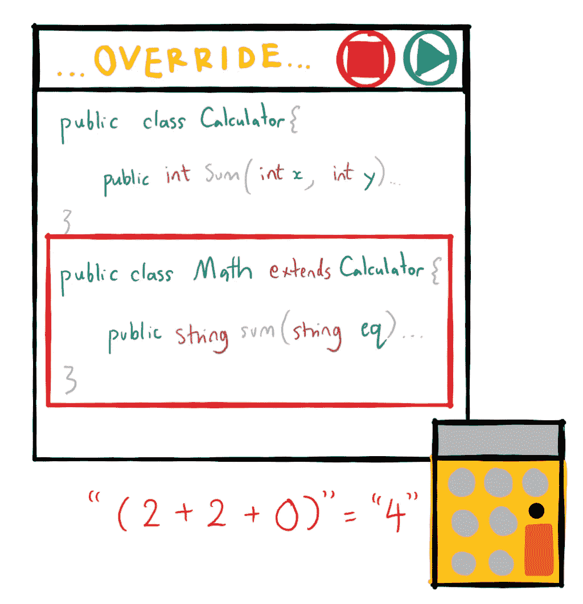

这一次，我们可以通过用另一个名为“Math”的类扩展 Calculator 类来添加更多的“sum”方法。Math 类将继承 Calculator 类中定义的所有方法，并用自己的实现覆盖“sum”方法。也许，我们希望我们的数学计算器能够计算更复杂的东西，比如一个数学方程，所以如果我们调用:Math()。sum("2+2+0 ")，结果我们得到“4”。

你做到了。

你刚刚学习了对象、类、属性、方法、抽象、封装、继承和多态。最重要的是，我希望你理解 OOP 设计中编码背后的 *why* 。

和往常一样，我喜欢在博客文章的结尾大声疾呼。第一个大声喊出来的是在 OOP 上通读[这篇博文](https://www.educative.io/blog/object-oriented-programming)。第二个呼喊是非常自私的，那就是在 Twitter (@mishxie)上[关注我](https://twitter.com/mishxie)我的博客公告。不要忘记[在 Medium 上关注我](https://medium.com/@michelle.xie)，留下任何评论/反馈/批评。

再次感谢阅读。希望你觉得有用:)