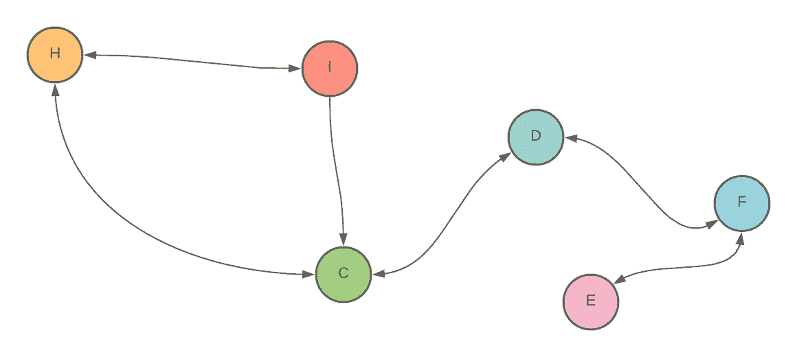
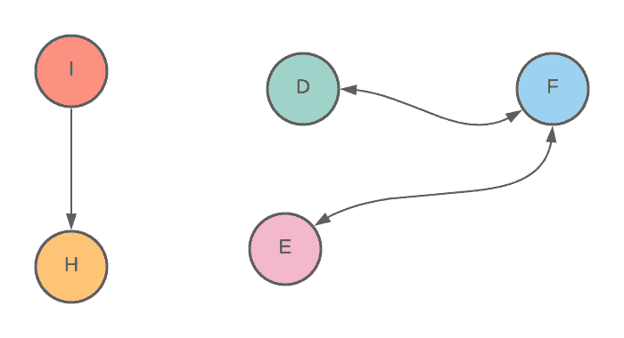
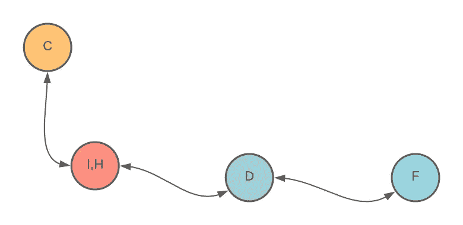
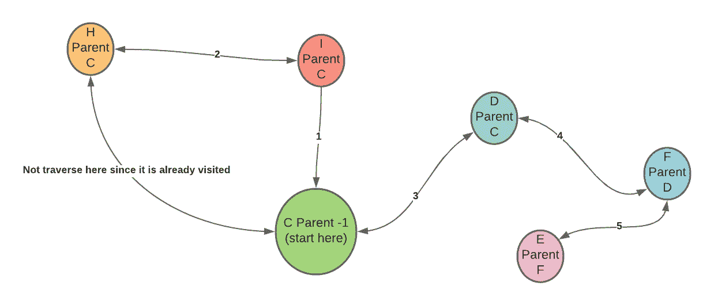
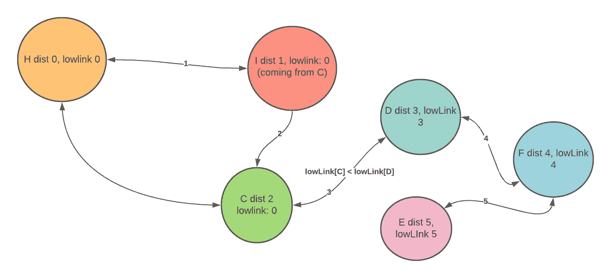

# 解释割顶点和割边就像我五岁一样

> 原文：<https://levelup.gitconnected.com/explain-cut-vertex-and-cut-edges-like-im-five-bc295f919eeb>

在我解释割顶点和割边的定义之前，让我们来看看这个问题陈述。

给定一个网络(图)，找出网络中的临界点(或边)，这样，如果我们删除该点或边，它会将网络一分为二。

网络中的一个临界点是，当你移除顶点时，该顶点将断开网络。

我们可以把一个网络想象成一个图，其中每个节点可以是一个实体，边代表两个实体是否相连。

将图一分为二的点称为割点。

与割边相同，它是一条临界边(或桥)，是必要边，当去掉时会使一个图一分为二。

在这种情况下，让我们假设顶点，因为边将是相似的顶点，我们将简要讨论如何找到桥。

那么我们如何解决这个问题呢？

因为我们想找到所有的顶点，我们将把图一分为二。我们将尝试逐个删除图中的每个顶点。如果图形在移除顶点后断开，我们可以将该顶点添加到我们的割顶点桶列表中。

蛮力法管用。然而，如果我们有一个很大的图形，它将永远需要做操作。

对于每个顶点，我们执行以下操作:

*   移除顶点
*   检查图是否保持连接(我们可以使用 DFS 或 BFS，或联合查找)
*   将顶点添加回图表

想象一下，检查一个图是否是每个顶点的连通分支。根据您如何实现检查连通分量算法，您将运行`V*(V+E)`。遍历每个顶点花费 V，检查每个顶点上的连通分量花费`V+E`。

当我们仔细观察上面的解决方案时，我们意识到检查图是否保持连接可以通过检查是否有一个环沿着邻居向下连接到该顶点的祖先来完成。

在图论中，顶点内的循环形式意味着后边缘。可以把它看作子节点中指向父节点的另一条边。

让我们以此为例:

[示例(切割顶点)]

这个顶点上还有什么条件可以确定这个顶点是临界顶点？

如果一个关键顶点的邻居没有指向其父节点的后边缘，我们可以尝试将具有后边缘的节点组合成更重要的节点。像这样:

你意识到了什么？

通过观察，我们之前看到的精心制作的图表变成了一棵树。

我们还可以得出一个结论——如果一个图没有循环，那么它也是一个 T2 树。

顶点 C 是关键顶点，因为它是树的根，并且它有两个以上的孩子。为什么是两个？因为如果我们在那个根中有一个孩子，去掉那个顶点，这个图仍然是连通的。如果我们在根中有两个孩子，并删除顶点，它将把图一分为二。

图中的另一点是，一片叶子不可能是关节点，因为如果我们去掉叶子，图仍然是连接的。

从上面所有的观察中，我们可以看出，一个顶点在这两个条件下是临界顶点:

1.  顶点是 DFS 树的根，它至少有两个子节点
2.  如果顶点不是 DFS 树的根，则没有从其子节点连接到其祖先或自身的后边缘。

好了，我们知道这两个主要属性是如何找到关节点的。我们如何确定父母至少有两个孩子？我们如何知道顶点的子顶点是否没有后边缘？

很高兴你这么问。

# 我们如何确定父母至少有两个孩子？

我们可以跟踪在 DFS 树中遍历的所有父节点。假设我们从顶点 c 开始。我们可以有一个父数组，其中索引代表顶点，索引象征父数组的指针。我们将顶点 C 设为-1。我们探索它的邻居(孩子),并将父数组中的所有邻居元素标记为 c。

# 我们如何发现没有后边缘来自顶点的子顶点？

当我们使用 DFS 遍历图时，我们可以使用时间戳数组来跟踪每个节点遍历图的顺序。如果我们开始遍历顶点 C，顶点 C 的时间戳数组元素将是 1。然后，我们遍历 C 的邻居，假设是顶点 D，顶点 D 中的时间戳数组是 1。我们遍历顶点 D 的邻居，该邻居将被赋予时间戳 2，以此类推。

为什么我们需要时间戳来确定周期？

确定循环的典型方式是保存 DFS 操作期间所有被遍历节点的列表。如果一个节点有一个邻居指向已经存在的列表，这意味着该图有一个循环。

保存所有节点的时间戳表有助于我们跟踪遍历中第一个访问的节点。

在时间戳表中，我们可以看到操作发现顶点 D 晚于顶点 c。有了这一知识，我们可以看到一个更具体的属性，如果顶点 D 可以比顶点 c 更早到达节点时间戳表。

为了检查顶点 D 是否可以到达比顶点 C 更早的节点时间戳表，我们需要找到另一个数组来跟踪从顶点 D 可以访问的最低时间戳。让我们称之为“低墨水”。

如果顶点 D 的低链接为 0，我们从顶点 D 可以到达的最早发现时间为 0。

低链接对我们寻找循环有什么帮助？有了时间戳表，我们可以检查每个节点的发现时间。

通过 low 链接，我们可以检查当前节点到达的最早发现时间。

上图中，顶点 A 的发现时间为 1。顶点 B 的发现时间是 2。然而，在图中的某个地方，循环中有一个后边缘指向顶点 a。我们可以通过低链接检查顶点 B 的邻居之一的低链接，并看到小于顶点 B。如果它小于顶点 B，这意味着顶点 B 的邻居之一与 B 的祖先有联系。

要找到临界点，我们不希望有一个后沿。因此，如果其邻居的任何低链路大于当前时间戳距离，我们可以保证没有后沿。

我们可以遍历所有的顶点，做一个 DFS。我们将有一系列的访问，父母，墨水少，和探索时间。对于每个顶点:

*   使用当前时间戳设置发现时间(在每个 DFS 的开头，initial 为 0)。将低链接设置为发现时间。
*   设置发现顶点的父对象。
*   对于每次递归，我们通过比较邻居的最小发现时间和当前发现时间来不断改变低链路。
*   一旦我们设置完所有的低链接、发现时间和父图，我们就可以提到这两个属性了。首先，我们检查当前节点是否是父节点，是否有两个以上的子节点。第二，我们检查是否有任何邻居节点具有大于当前发现时间的低链路。(发现时间[当前节点]>低链接[邻居])
*   如果两个陈述中的任何一个是正确的，那么这个节点就是关节点。

执行上述算法可以将时间复杂度从`V*(V+E)`降低到`V+E`。

查找桥或切割边类似于查找切割顶点，只是它不需要检查第一个语句——顶点是一个父级，至少有两个子级。图中任何不能引起循环的边都是桥。

# 用例

切割顶点和切割边对于检测网络中的弱点是有用的，因为如果它具有切割顶点的属性，则网络是断开的。

我们识别网络、循环、需求、管道中的流体和电路中的单点故障。

希望你觉得这个解释有用！你可以试着把算法实现为一个练习，进一步把知识植入你的大脑。本文旨在理解算法的直观性以及切割顶点和切割边的定义。请随意在下面评论，这样其他人也可以从你的问题或评论中学习。

# 资源

有一些关于连接点和桥的很好的资源，以及它们的用例。如果您想了解更多信息，请查看下面的参考资料！

*   [双连通图讲座](https://web.iitd.ac.in/~bspanda/biconnectedMTL776.pdf)
*   [心流网—维基百科](https://en.wikipedia.org/wiki/Flow_network)
*   [图中的关节点(或切割顶点)——GeeksforGeeks](https://www.geeksforgeeks.org/articulation-points-or-cut-vertices-in-a-graph/)

*最初发表于*[T5【https://edward-huang.com】](https://edward-huang.com/algorithm/graph-theory/2021/01/24/explain-cut-vertex-and-cut-edges-like-im-five/)*。*