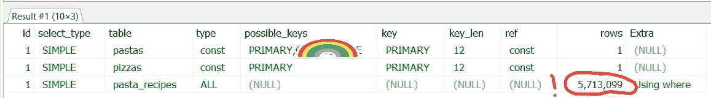
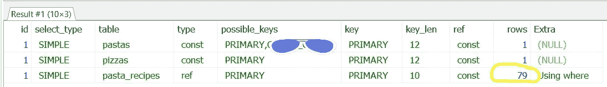
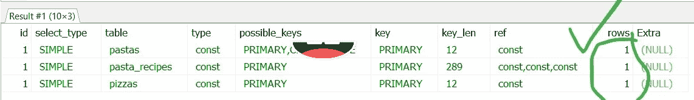

# 发布前解释你的数据库查询

> 原文：<https://levelup.gitconnected.com/explain-your-database-queries-before-release-fc8986b0d36e>

## 并避免生产中一些令人讨厌的性能意外


图片由来自 [Pixabay](https://pixabay.com/?utm_source=link-attribution&utm_medium=referral&utm_campaign=image&utm_content=1209640) 的[自由照片](https://pixabay.com/photos/?utm_source=link-attribution&utm_medium=referral&utm_campaign=image&utm_content=1209640)提供

最近，我在 [Nightlife Music](http://www.nightlife.com.au) 的一位同事向我(代码评审员)和另一位同事(代码编写员)展示了优化 SQL 查询的两种方法。这个练习让我在我们的代码审查清单中添加了一个`ensure all queries are explained check`。

这篇文章的重点不是解释关键字，而是强调这样一个事实，即这样做是非常重要的，特别是当你的查询在大型数据集上运行和/或快速连续运行多次时(对我们来说都是如此)。

## 该查询

这是一个简单的查询，但结果是我们要连接的两个表使用了不同的编码标准。当我们使用这样的查询时，只有当两个表之间的编码相同时，才会使用索引。

首先，我们都不知道其中一个表格使用了`latin1`编码。其次，我们编写的查询非常简单，我们都没有想到会有任何问题。

事情是这样的:

```
SELECT * FROM myDB.pizzas pizzasJOIN myDB.pastas pastas USING (pizza_code)JOIN myOtherDB.pasta_recipes pasta_recipes
ON pasta_recipes.sauce = **pastas.sauce**WHERE pizzas.pizza_id = my_pizza_idAND pasta_recipes.key = 'PIZZA NAME'
```

看起来很简单，对吧？我们哪里出错了？嗯，表格`pizzas`和`pastas`都编码在`latin1`中，而 pasta_recipes 编码在`utf8`中。如上所述，因为我们在`pastas`和`pasta_recipes`之间进行连接，所以这里不能使用索引。

## 向救援队解释

尽管我们都没有意识到这些表使用了不同的编码，但我们应该测试我们的查询，以确保它使用了索引并扫描了最少的行数。在这种情况下，我们只期望得到**一个**结果，因此应该只检索一行。

我们如何确定我们的查询是否将使用索引以及检索了多少行？通过使用`EXPLAIN`关键字。

让我们在数据库上运行它:

```
**EXPLAIN**SELECT * FROM myDB.pizzas pizzas      // latin1 tableJOIN myDB.pastas pastas USING (pizza_code)   // another latin1 tableJOIN myOtherDB.pasta_recipes pasta_recipes     // utf8 table
ON pasta_recipes.sauce = pastas.sauceWHERE pizzas.pizza_id = my_pizza_idAND pasta_recipes.key = 'PIZZA NAME'
```



在没有编码转换的情况下对我们的查询使用 EXPLAIN 的结果

如您所见，我们搜索了 500 多万行来寻找符合我们的`JOIN`标准的行。索引*不是*用于`pastas`和`pasta_recipes`之间的连接。

现在让我们看看当我们将`pastas`转换为使用相同的编码时会发生什么:

```
**EXPLAIN**SELECT * FROM myDB.pizzas pizzasJOIN myDB.pastas pastas USING (pizza_code)JOIN myOtherDB.pasta_recipes pasta_recipes
ON pasta_recipes.sauce = **CONVERT(pastas.sauce USING ASCII)**WHERE pizzas.pizza_id = my_pizza_idAND pasta_recipes.key = 'PIZZA NAME'
```



在连接的表之间使用相同编码时的解释结果

好了，现在我们有进展了！让我告诉你，查询要快得多。但是，等一下，我们不是只期待一排吗？我们现在将索引用于`sauce`列上`pasta_recipes`和`pastas`之间的连接，但是看起来我们正在扫描行以找到`key`匹配`pizza_name`的行。因此，当我们检查`pasta_recipes`表上的索引时，发现在`key, sauce and **type**` 列上有一个`composite index`。因此，我们需要在`WHERE`子句中包含一个`type`来真正优化我们的查询:

```
**EXPLAIN**SELECT * FROM myDB.pizzas pizzasJOIN myDB.pastas pastas USING (pizza_code)JOIN myOtherDB.pasta_recipes pasta_recipes
ON pasta_recipes.sauce = CONVERT(pastas.sauce USING ASCII)WHERE pizzas.pizza_id = my_pizza_idAND pasta_recipes.key = 'PIZZA NAME'**AND pasta_recipes.type = 'tomato'**
```

结果是:



当我们使用 pasta_recipes 表上的索引时，我们解释的结果

我们现在已经完全优化了查询，它几乎立即返回。每个表只返回一行。快乐的日子！

## 不这样做真的会伤害你(和你的数据库！)

在 [Nightlife](https://www.nightlife.com.au) 中，每天早上 6 点左右，我们会有大约 6000 个这样的查询，以及成千上万的其他查询(包括读和写)，所以我们尽可能地调整它们是非常重要的。使用 SQL 查询的`[EXPLAIN](https://dev.mysql.com/doc/refman/8.0/en/explain.html)`关键字，以及来自其他数据库的对应关键字，如 [MongoDB](https://docs.mongodb.com/manual/reference/method/cursor.explain/) 和 [Neo4j](https://neo4j.com/docs/cypher-manual/current/) (大多数数据库都应该有对应的关键字)，我们至少可以发现什么时候出了问题，即使我们不确定如何修复它们。如果我们不知道，我们总是可以请我们信任的同事来“解释”出了什么问题。

所以，如果你还没有，确保你的团队在他们所有的查询中都使用了 explain，并且在投入生产之前亲自看看结果！

感谢阅读。

## 资源

1.  [夜生活音乐](https://www.nightlife.com.au)
2.  MySQL [讲解](https://dev.mysql.com/doc/refman/8.0/en/explain.html)
3.  MongoDB [解释()](https://docs.mongodb.com/manual/reference/method/cursor.explain/)
4.  Neo4j [讲解](https://neo4j.com/docs/cypher-manual/current/query-tuning/how-do-i-profile-a-query/)