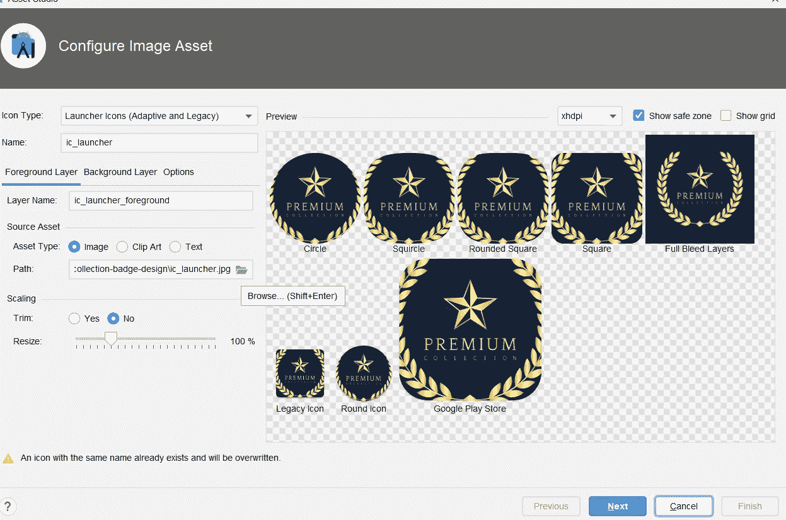

# 用现实生活中的例子解释 Android 产品的风格

> 原文：<https://levelup.gitconnected.com/explaining-android-product-flavors-using-a-real-life-example-a539c306b62c>

产品风味图像

**文章的流程:**

1.  什么是产品风味？
2.  我们可以使用产品口味的场景。
3.  使用产品风格创建 CodingQuestions 应用程序

# 什么是产品风味？

产品风格是你的应用程序的变体。当你想创建应用程序的多个版本时，这是非常有用的。使用产品风格，我们可以使用相同的基本代码开发应用程序的多个变体。

# 我们可以使用产品口味的场景

**场景 1** :假设你有一个非常受欢迎的应用程序，公司联系你，让你使用你的受欢迎应用程序的相同功能，在你的应用程序中进行一些定制，并添加一些更多的功能，这被称为**白标**。

**场景二**:假设你有一个免费使用的 app。现在你想用同样的功能和额外的功能，但这将是付费应用程序的另一个应用程序。我们也可以在这个场景中使用产品风味。

# 使用产品风格创建 CodingQuestions 应用程序

现在，我们将创建一个应用程序，在回收视图中显示编码问题。考虑这样一个场景，你希望一个应用程序是免费的，有几个问题被锁定，几个问题被解锁，第二个应用程序是一个高级应用程序，有所有问题被解锁，你还可以玩竞赛。因此，我们将利用产品风味的力量，使用通用代码来创建这两个应用程序。

**我来解释几个基础:**

**构建变体**由构建类型和产品风格组成。构建变体是 Gradle 使用一组特定的规则来组合在您的构建类型和产品风格中配置的设置、代码和资源的结果**。**

**构建类型**应用不同的构建和打包设置。构建类型的一个例子是“调试”和“发布”。构建类型是指**构建和打包设置，如项目的签名配置**。例如，调试和发布版本类型。调试将使用 android 调试证书来打包 APK 文件。而发布构建类型将使用用户定义的发布证书来签署和打包 APK。

**这里是** [**Github 回购**](https://github.com/Arunshaik2001/CodingPlatform)

首先，创建一个空的 android studio 项目。我把它命名为**编码平台**。

创建 android studio 项目

现在，来谈谈产品风味。

转到 **build.gradle(:app)** 文件。

在 android 中，添加这些行，然后按 sync now。

点击左下角的 **BuildVariants** 选项卡。你会看到这样的东西。

恭喜你，你已经创建了 4 个不同的版本。

现在转到 **app- > src。**右击 src 转到**新建- >目录。**

现在，点击

一个一个选。

现在，您应该会看到类似这样的内容。

你不会在新目录中看到高级选项。为此，从“构建变体”选项卡中选择 preimumDebug。然后也为它们创建文件夹。

执行完这些步骤后。您应该会看到类似这样的内容。

现在，我们将专注于构建我们的应用程序，它使用回收器视图显示了一系列问题。我不打算解释回收者的观点，因为我们只想关注产品口味。

但是，这里是代码。

你必须在**主**文件夹中创建这些 kotlin 文件，就像你在不使用产品风格的情况下制作 android 应用程序一样。

这是一个名为**的数据类问题**

现在**转到 freeDebug 文件夹**。按此顺序创建文件夹。

现在，在示例文件夹中创建 MainActivity.kt。

这是 **MainActivity.kt** 文件代码

在相同的中，遵循 Premiumdebug 的相同步骤。将代码粘贴到 **MainActivity.kt** 中

## 如果你已经注意到我在使用主目录中的 activity_main.xml 和 item_views.xml 文件，这就是产品风格的魅力所在。

## 注意:我在这里使用视图绑定。所以请参考这篇[视图绑定文章](https://medium.com/@arunshaik432/android-view-binding-31daf3a5079)以便更好地理解。

我已经将字符串值放在了各自变体的**RES->values->strings . XML**中。

现在，如果您已经从 BuildVariant 选项卡中选择了 **freeDebug** 。你会看到这个。

现在，如果你选择**高级调试**，你会看到这个。

它将处于水平方向。

现在，更改各个变体的**应用程序启动器图标**。遵循这些步骤。

**右键单击 src- >新建- >图像资产**

**选择你的启动器图标，点击下一步**

**选择 preiumDebug 作为根目录**

**点击完成。**

**按照相同的步骤进行 FreeDebug。**

你会看到这样的图标。

您可以通过更改 strings.xml 文件中的 app_name 来更改应用程序名称。

您可以像我们在 main 中所做的那样，通过在 themes.xml 文件中进行更改来更改不同变体的主题。

使用产品风格创建免费和优质应用程序的工作已经完成。

**感谢您阅读**