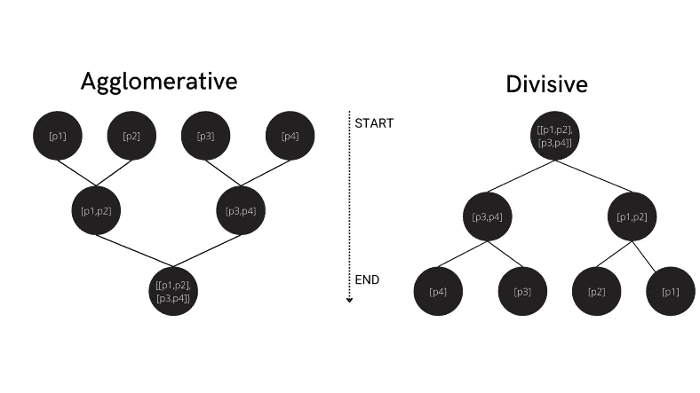

# 简要解释每个机器学习模型

> 原文：<https://levelup.gitconnected.com/explaining-each-machine-learning-model-in-brief-92f82b41ba71>

## 20 种机器学习模型概述从线性回归到 XGBoost 到 DBSCAN 聚类直到 PCA


马库斯·温克勒在 [Unsplash](https://unsplash.com?utm_source=medium&utm_medium=referral) 上的照片

在这篇博客中，我想分享一个资源，它提供了所有机器学习模型的简明解释，从简单的线性回归到 XGBoost 再到聚类技术。

## 涵盖的型号

```
**1\.  Linear Regression
2\.  Polynomial Regression
3\.  Ridge Regression
4\.  Lasso Regression
5\.  Elastic Regression
6\.  Logistic Regression
7\.  K Nearest-Neighbors
8\.  Naive Bayes
9\.  Support Vector Machines
10\. Decision Trees
11\. Random Forest
12\. Extra Trees
13\. Gradient Boost
14\. Ada Boost
15\. XGBoost
16\. K Means Clustering
17\. Hierarchical Clustering
18\. DBSCAN Clustering
19\. Apriori 
20\. PCA**
```

# L 线性回归

线性回归通过使用最小二乘法找到一条与所有数据点距离最小的“**最佳拟合线**，试图找到自变量和因变量之间的关系。最小二乘法找到最小化残差平方和(SSR)的线性方程。

举个例子，下面的绿线比蓝线更适合，因为它与所有数据点的距离都最小。


图 1:作者使用[Canva.com](http://Canva.com)创建的图像

# 拉索回归(L1)

套索回归是一种正则化技术，通过在模型中引入一定量的偏差来减少过度拟合。这是通过最小化残差的平方差并加上惩罚来实现的，其中惩罚等于λ乘以斜率的绝对值。λ指的是惩罚的严厉程度。它作为一个超参数工作，可以改变以减少过度拟合并产生更好的拟合。


图 2:成本函数套索回归

当我们有大量要素时，L1 正则化是首选，因为它忽略了斜率值非常小的所有变量。


图 3:显示正则化对过度拟合回归线的影响的图表

# 岭回归(L2)

岭回归类似于套索回归。两者唯一的区别是刑期的计算。它增加了一个罚项，等于幅度的平方乘以λ。


图 4:成本函数岭回归

当我们的数据遭受多重共线性(*独立变量高度相关*)时，最好使用 L2 正则化，因为它将所有系数收缩为零。

# 弹性净回归

弹性网回归结合了套索和岭回归的损失，提供了一个更有规律的模型。

它允许两种损失的平衡，与单独使用 l1 或 l2 相比，这导致了更好的执行模型。


图 5:图片摘自《走向数据科学》文章“[从线性回归到岭回归套索和弹性网](https://towardsdatascience.com/from-linear-regression-to-ridge-regression-the-lasso-and-the-elastic-net-4eaecaf5f7e6)

# 多项式回归

它将因变量和自变量之间的关系建模为 nᵗʰ次数多项式。多项式是形式为*的项的和，其中 *n* 为非负整数， *k* 为常数， *x* 为自变量。它用于非线性数据。*

**

*图 6:在非线性数据上拟合简单线性回归和多项式回归直线。*

# *逻辑回归*

*逻辑回归是一种分类技术，试图找到数据的最佳拟合曲线。它利用 sigmoid 函数在范围 0 和 1 之间转换输出。与使用最小二乘法找到最佳拟合直线的线性回归不同，逻辑回归使用最大似然估计(MLE) 来找到最佳拟合直线(曲线)。*

**

*图 7:二进制输出的线性回归与逻辑回归*

# *k-最近邻(KNN)*

*KNN 是一种分类算法，它根据新数据点与最近分类点的距离对其进行分类。它假设彼此非常接近的数据点出口高度相似。*

*knn 算法也被称为懒惰学习器，因为它存储训练数据，直到新的数据点出现时才将其分类到不同的类中进行预测。*

*默认情况下，KNN 利用欧几里德距离为新数据寻找最近的分类点，采用最近类的*模式*为新数据点寻找预测类。*

*如果 k 值设置得很低，那么新的数据点可能被认为是异常值，但是如果它太高，那么它可能会忽略样本很少的类。*

**

*图 8:对数据应用 KNN 之前和之后*

# *朴素贝叶斯*

*朴素贝叶斯是一种基于贝叶斯定理的分类技术。它主要用于文本分类。*

*贝叶斯定理描述了一个事件的概率，它基于可能与该事件相关的条件的先验知识。它陈述了下面的等式—*

**

*图 9:贝叶斯定理公式*

*朴素贝叶斯之所以称为朴素贝叶斯，是因为它假设某个特征的出现独立于其他特征的出现。*

# *支持向量机*

*支持向量机的目标是在 n 维空间(n 个特征)中找到一个超平面，该超平面可以将数据点分成不同的类。它是通过最大化类之间的余量(距离)来找到的。*

*支持向量是超平面的封闭数据点，它可以影响超平面的位置和方向，并有助于最大化类之间的间隔。超平面的维数取决于输入特征的数量。*

**

*图 10:线性可分数据的支持向量机*

# *决策图表*

*决策树是一种基于树的结构化分类器，包含一系列条件语句，用于确定样本到达底部之前的路径。*

**

*图 11:一个决策树的例子*

*决策树的内部节点代表特征，分支代表决策规则，叶节点代表结果。树的决策节点像 if-else 条件一样工作，叶节点包含决策节点的输出。*

*它首先使用属性选择度量(ID3 或 CART)选择一个属性作为根节点，然后递归地将剩余的属性与其父节点进行比较，以创建子节点，直到树到达其叶节点。*

```
***CART (GINI)** 1\. Probability Table
2\. Calculate the Gini Index for Attribute Values Like Overcast, Sunny, Rain
*1 - (P/P+N)² -(N/P+N)²*3\. Calculate Gini Index for Attribute Eg: Outlook
*len(sunny) / len(y) *gini(sunny) + ....***ID3 (INFORMATION GAIN & ENTROPY)** 1\. Calculate IG For y
*IG(Attr) = -[P/P+N] * log[p/P+N] - [N/P+N * log[N/P+N]*2\. Calculate Entropy for each value of different attributes in by like outlook - overcase,rain,sunny
*entropy(Attr=Value) = -[P/P+N] * log[p/P+N] - [N/P+N * log[N/P+N]*3\. Calculte Gain For Attribute Like outlook
*Gain(Outlook) = len(sunny) / len(y) *entropy(sunny) + ....*4\. Calculate Total Information Gain
*IG(y) - Gain(Attribute)
IG(Outcome) - Gain(Outlook)**
```

# *随机森林*

*随机森林是由几个决策树组成的集合技术。在构建每棵树时，它使用 bagging 和特征随机性来创建一个不相关的决策树森林。*

*随机森林中的每棵树都在不同的数据子集上进行训练，以预测结果，然后选择具有多数投票的结果作为随机森林预测。*

**

*图 12:4 个估计量的随机森林分类器。*

*例如，如果我们只创建了一个决策树，第二个，那么我们的预测将是 0 类，但依赖于所有四棵树的模式，我们的预测已变为 1 类，这就是随机森林的力量。*

# *额外的树*

*Extra Trees 非常类似于随机森林分类器，两者之间唯一的区别是它们选择根节点的方式。在随机森林中，最佳特征用于分裂，而在额外的树分类器**中，随机特征被选择用于分裂**，因此额外的树提供了更多的随机性和特征之间非常少的相关性。*

*两者之间的另一个比较是，随机森林使用 bootstrap 副本来生成大小为 N 的子集，用于训练集成成员(决策树)，而额外的树使用整个原始样本。*

*与随机森林相比，额外树算法在计算上快得多，因为考虑到随机选择分裂点，对于每个决策树，训练直到预测的整个过程是相同的。*

**

*图 13:随机树和额外树的比较*

# *ADA 增强*

*ADA Boost 是一种类似于随机森林的增强算法，但有一些显著的不同*

1.  *ADA Boost 不是构建决策树的森林，而是构建决策树桩的森林。(树桩是只有一个节点和两片叶子的决策树)*
2.  *在最终决策中，每个决策树桩被赋予不同的权重。*
3.  *它为错误分类的数据点分配更高的权重，以便在构建下一个模型时赋予它们更多的重要性。*
4.  *它有助于将多个“弱分类器”组合成一个强分类器。*

**

*图 14:提升集成学习算法的一般过程*

# *梯度推进*

*梯度推进构建了多个决策树，其中每一个树从先前树的错误中学习。它利用残差来提高预测性能。梯度增强的全部目的是尽可能地减少残余误差。*

*梯度提升类似于 ADA 提升，两者的区别在于 ADA 提升构建决策树桩，而梯度提升构建多叶决策树。*

*梯度推进从建立一个基础决策树开始，并取初始预测值(通常是平均值)。然后，以初始特征和残差为因变量建立新的决策树。对新决策树的预测是通过采用模型的初始预测+样本乘以学习率的残差来进行的，并且该过程一直重复，直到我们达到最小误差。*

# *XGBoost*

*XGBoost 是一种更加**规则化的渐变增强**形式。它使用先进的正则化(L1 & L2)，以提高模型泛化能力。*

*XGBoost 利用叶子和前一个节点之间的相似性分数来决定哪个节点用作根节点，哪个用作子节点。*

# *k 均值聚类*

*KMeans 聚类是一种无监督的机器学习算法，它将未标记的数据分组为 K 个不同的簇，其中 K 是用户定义的整数。*

*它是一种迭代算法，利用聚类质心将未标记的数据划分为 K 个聚类，使得具有相似属性的数据点属于同一聚类。*

```
*1\. Define K and Create K Clusters
2\. Calculate Euclidean Distance of each data point from K Centroid
3\. Assing CLosest Data Point to Centroid and Create a CLuster
4\. Recalculate Centroid By Taking mean*
```

**

*图 15:使用不同 K 值的 K 均值聚类对未标记数据进行聚类*

# *分层聚类*

*分层聚类是另一种基于聚类的算法，它以树的形式创建聚类的层次结构来划分数据。它自动找到数据之间的关系，并将它们分成 n 个不同的簇，其中 n 是数据的大小。*

*层次聚类有两种主要方法:凝聚法和分裂法。*

**

*图 16:聚集和分裂层次聚类之间的聚类创建过程比较*

*在凝聚聚类中，我们将每个数据点视为单个聚类，然后组合这些聚类，直到我们只剩下一个组(完整的数据集)。另一方面，分裂式层次聚类从整个数据集(被视为一个单独的聚类)开始，然后将其划分为不太相似的聚类，直到每个单独的数据点成为其自己唯一的聚类。*

# *DBSCAN 聚类*

*[DBSCAN](https://scikit-learn.org/stable/modules/generated/sklearn.cluster.DBSCAN.html?highlight=dbscan) (带有噪声的应用的基于密度的空间聚类)基于这样的假设工作:如果一个数据点更接近该聚类的*多个*数据点，而不是任何单个点，则该数据点属于该聚类。*

**

*图 17:摘自维基百科的 DBSCAN 聚类示例，minPts = 4。点 A 和其他红点是核心点，因为在 *ε* 半径内围绕这些点的区域包含至少 4 个点(包括点本身)。因为它们都可以互相访问，所以它们形成了一个集群。点 B 和 C 不是核心点，但是可以从 A(经由其他核心点)到达，因此也属于该集群。点 N 是一个噪声点，它既不是核心点，也不是可直接到达的点 **[** [**来源**](https://en.wikipedia.org/wiki/DBSCAN) **]***

*`epsilon`和`min_points`是两个重要的参数，用于将数据划分为小的聚类。`epsilon`指定一个点与另一个点的接近程度，以便将其视为聚类的一部分，同时`min_points`确定形成聚类所需的最小数据点数。*

# *Apriori 算法*

*Apriori 算法是一种关联规则挖掘算法，它根据数据项之间的依赖关系将数据项映射在一起。*

*使用 apriori 算法创建关联规则有一些关键步骤。确定大小为 1 的每个项目集的支持度，其中支持度是数据集中项目的频率。
2。倾向于所有低于最小支持度阈值的项目集(由用户决定)
3。创建大小为 n+1 的项目集(n 是前一个项目集的大小),并重复步骤 1 和 2，直到所有项目集支持度都高于阈值。
4。使用置信度生成规则(当已经给出 x 的出现次数时，x & y 出现的频率)*

# *主成分分析*

*PCA 是一种线性降维技术，它将一组相关特征转换成更少( *k < p* )数量的不相关特征，称为主成分。*

*通过应用 PCA，我们丢失了一些信息，但它提供了许多好处，如提高模型性能，降低硬件要求，并提供了使用可视化来理解数据的更好机会。*

**

*感谢你读到这里，如果你喜欢我的内容并想支持我—*

*D *o 关注我上* [**中**](http://abhayparashar31.medium.com/) *和我的* [**惊艳发布**](http://medium.com/pythoneers) *面向 Python 开发者和 AI 爱好者。**

*A *在*[**LinkedIn**](https://www.linkedin.com/in/abhay-parashar-328488185/)*上与我关联。**

*T *瓮中之鳖* [**我的引荐链接**](https://abhayparashar31.medium.com/membership) *。你会费的一小部分会归我。**

*A*ttach yourself to*[**我的邮件列表**](https://abhayparashar31.medium.com/subscribe) *千万不要错过阅读我的另一篇文章。* 落款— [阿沛·帕拉沙尔](https://medium.com/u/76f234261155?source=post_page-----92f82b41ba71--------------------------------) 🧑‍💻*

**

## *一些精选的文章供你接下来阅读*

*   *[**关于 Python 你不知道的 10 个事实**](https://medium.com/pythoneers/10-facts-you-didnt-know-about-python-b18d87529c23)*
*   *[**提升你的 Python 技能的 10 个高级 Python 概念**](/10-advance-python-concepts-to-level-up-your-python-skills-da3d6284ad53)*
*   *[**10 个有用的自动化脚本你需要尝试使用 Python**](https://medium.com/pythoneers/10-useful-automation-scripts-you-need-to-try-using-python-de9c993f1f5)*
*   *[**35 个对开发者最有价值的 GitHub 库**](https://medium.com/pythoneers/35-most-valuable-github-repositories-for-developers-45ab9df1af81)*
*   *[**针对日常问题的 22 个 Python 代码片段**](/22-python-code-snippets-for-everyday-problems-4c6a216c33ae)*
*   *[**15 个你可能不知道的 Python 包退出**](https://medium.com/pythoneers/15-python-packages-you-probably-dont-know-exits-aef0525a965f)*
*   *[**每个开发者必去的 10 个黑仔网站**](https://medium.com/pythoneers/10-killer-websites-every-developer-should-try-170b365a0590)*
*   *[**30 Python Hacks 每个开发者都应该知道的**](/30-python-hacks-every-developer-should-know-11d4b5f95be5)*

# *分级编码*

*感谢您成为我们社区的一员！在你离开之前:*

*   *👏为故事鼓掌，跟着作者走👉*
*   *📰查看[升级编码出版物](https://levelup.gitconnected.com/?utm_source=pub&utm_medium=post)中的更多内容*
*   *🔔关注我们:[Twitter](https://twitter.com/gitconnected)|[LinkedIn](https://www.linkedin.com/company/gitconnected)|[时事通讯](https://newsletter.levelup.dev)*

*🚀👉 [**加入升级人才集体，找到一份神奇的工作**](https://jobs.levelup.dev/talent/welcome?referral=true)*