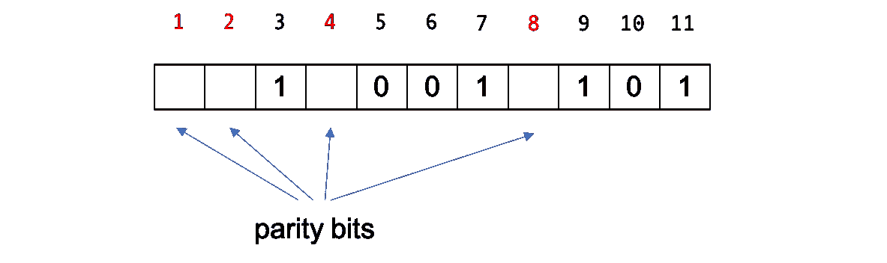
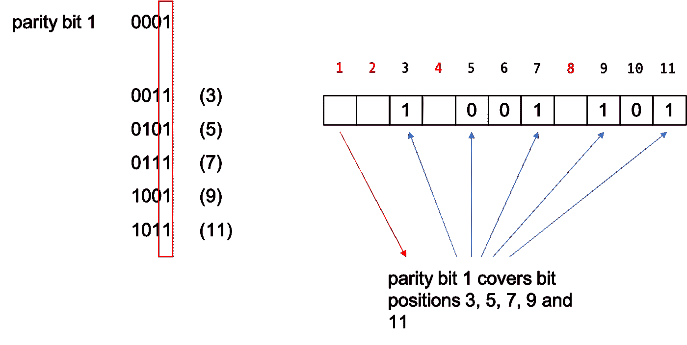
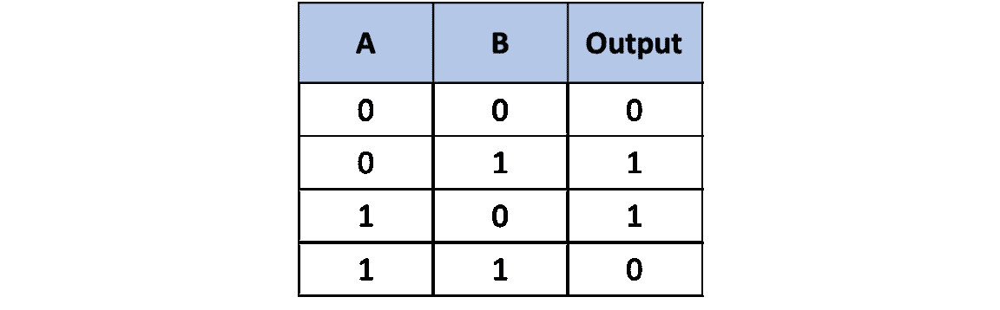
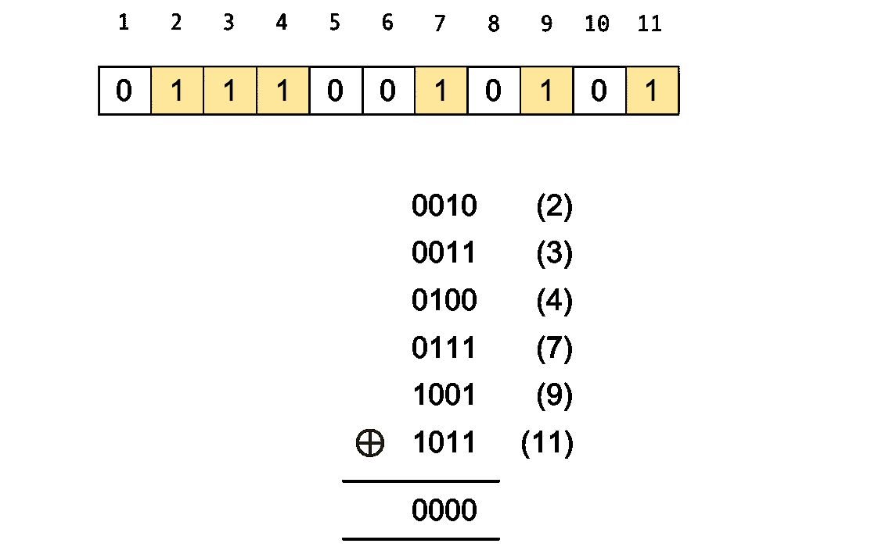
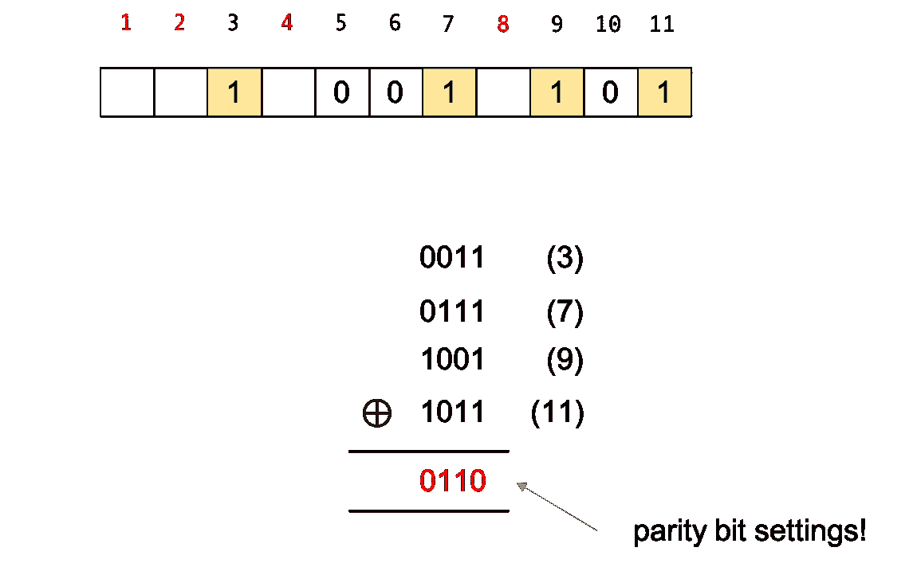
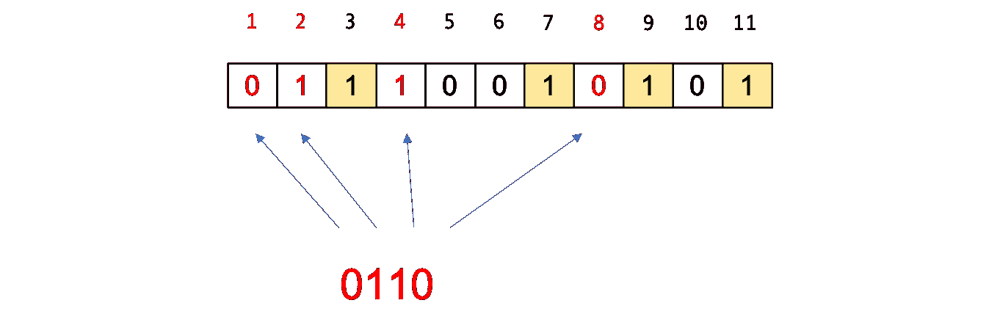
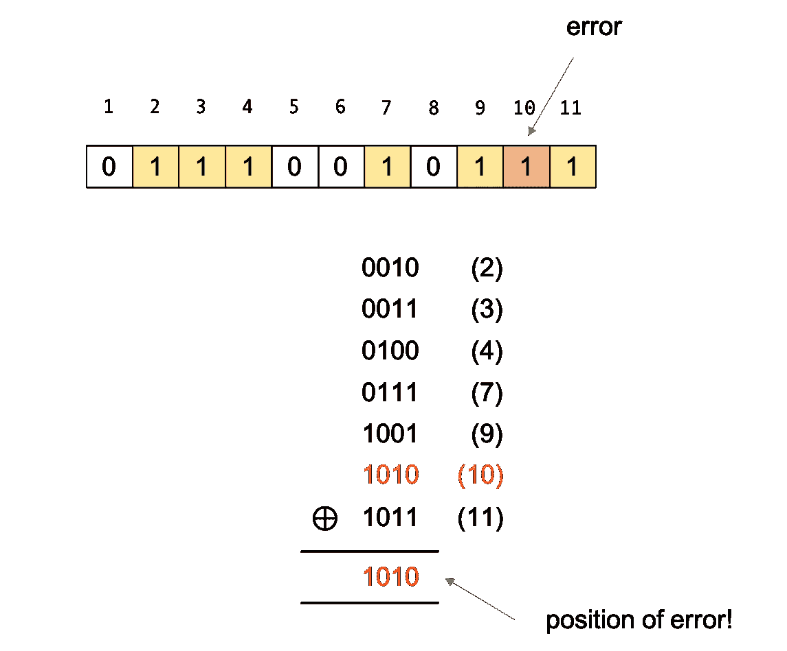

# 用 Python 解释错误检测和纠正代码

> 原文：<https://levelup.gitconnected.com/explaining-error-detection-and-correction-codes-with-python-be517596d42f>

## 校验和与汉明码的工作原理

不久前，我在玩二维码，写了一些应用程序，基本上是在摆弄它们。我之前没有对二维码做过任何认真的工作，所以我没有意识到它们可以自我纠正。这意味着即使部分二维码丢失，它仍然是可扫描的，您可以从中提取正确的信息！这解释了如何在它上面添加一个图片，屏蔽部分代码，它仍然可以工作。

如果你不相信或者看不出这有多酷，就试试这个小实验吧。下图二维码部分被撕。试着扫描一下。你会发现，即使它的某些部分丢失了，它仍然可以被扫描。


由于纠错，部分被阻挡或破坏的 QR 码仍然可以被扫描

自我校正的能力不在你的二维码扫描软件中，而是在二维码的一部分的一组错误校正码中。

# 误差检测

当通过不可靠的信道(大多数信道都是不可靠的)传输和接收信息时，通常需要检查传输的信息是否正确。这些检查通常分为两类——错误检测，用于检查传输过程中是否出现错误；错误纠正，用于检测并纠正错误。


泰勒·维克在 [Unsplash](https://unsplash.com/s/photos/sending-data?utm_source=unsplash&utm_medium=referral&utm_content=creditCopyText) 上的照片

错误检测并不是什么新东西。在公元 7 世纪到 10 世纪之间，一群犹太抄写员创造了[数字 Masorah](https://www.bl.uk/hebrew-manuscripts/articles/to-read-or-not-to-read-is-not-the-question) 来确保希伯来圣经被正确抄写。这是通过写下一行、一节、一本书等的字数以及页边空白处的用词统计来完成的。

在软件和硬件中，错误检测和纠正几乎是多余的，这有时使它不可见。例如，在 TCP/IP 堆栈中，每个以太网帧都使用 CRC-32 错误检测。IPv4 报头有一个校验和来保护其内容。纠错码用于 CD 播放器、高速调制解调器、深空通信、RAM 模块、数据存储、QR 码以及许多需要以某种方式传输、存储或验证数据的场合。

## 校验和

有许多错误检测策略。其中一些是如此常用，以至于我们几乎不再注意到它。以[校验和](https://en.wikipedia.org/wiki/Checksum)为例，它是从一个较大的数据块中派生出来的一个小数据块，用来验证数据是否正确。这种叫做[卢恩算法](https://en.wikipedia.org/wiki/Luhn_algorithm)的版本在很多日常场合都有使用。


图片由 [CardMapr.nl](https://unsplash.com/@cardmapr?utm_source=unsplash&utm_medium=referral&utm_content=creditCopyText) 在 [Unsplash](https://unsplash.com/@cardmapr?utm_source=unsplash&utm_medium=referral&utm_content=creditCopyText) 上拍摄

例如，我们的信用卡号码是 16 位，最后一位是校验和位。这就是 Luhn 算法对信用卡号码的工作原理。我们来拿签证(考)号`4001 5900 0000 0001`。最后一个数字是`1` —这是校验和数字。让我们看看这是如何工作的。

我们用剩下的 15 个数字来处理。

```
4  0  0  1  5  9  0  0  0  0  0  0  0  0  0 
```

从第一个数字开始，我们将第二个数字加倍。

```
8  0  0  1 10  9  0  0  0  0  0  0  0  0  0
```

每当你有一个 2 位数时，我们将这些数字相加得到一个位数(在下面的例子中，我们得到`10`，所以我们将它们相加`1 + 0`得到`1`。

```
8  0  0  1  1  9  0  0  0  0  0  0  0  0  0
```

把所有的数字加在一起。

```
8 + 0 + 0 + 1 + 1 + 9 + 0 + 0 + 0 + 0 + 0 + 0 + 0 + 0 + 0 = 19
```

我们把这个数加到校验位上。

```
19 + 1 = 20
```

如果该数字是 10 的倍数，则该数字有效。因此，有时这种算法也被称为[模数](https://en.wikipedia.org/wiki/Modular_arithmetic) 10 算法。

除了信用卡，校验和还被用于 IMEI 号码、身份证号码(新加坡的 NRIC 号码使用模数 11 校验和算法)、汽车牌照号码等等。

# 平价

在数学中，术语*奇偶性*是一个整数的属性，无论它是奇数还是偶数。例如，3 的奇偶性是奇数，402 的奇偶性是偶数。奇偶位或校验位是添加到二进制代码串中使其成为奇数或偶数的位(记住一位是 0 或 1 的二进制数)。奇偶校验位是最早也是最常用的错误检测方法之一。


照片由[纳丁·马里奥](https://unsplash.com/@nadinmario?utm_source=unsplash&utm_medium=referral&utm_content=creditCopyText)在 [Unsplash](https://unsplash.com/s/photos/balanced?utm_source=unsplash&utm_medium=referral&utm_content=creditCopyText) 上拍摄

基本思想很简单。假设 Alice 想要使用奇数奇偶校验向 Bob 发送一条 7 位数据`1001101`。为了计算奇偶校验位，Alice 将所有数字加在一起。

```
1 + 0 + 0 + 1 + 1 + 0 + 1 = 4
```

总和`4`是偶数，为了使其成为奇数奇偶校验，Alice 需要添加一个奇偶校验位`1`使其成为`**1**1001101`。请注意，奇偶校验位添加在数字的前面。爱丽丝然后把`11001101`发给鲍勃。

当 Bob 收到`11001101`(即没有错误)时，他检查奇偶校验:

```
1 + 1 + 0 + 0 + 1 + 1 + 0 + 1 = 5
```

这很奇怪，所以他知道数据发送正确。假设 Bob 接收到`1100110**0**`，其中一位(最后一位)被翻转。他检查奇偶校验:

```
1 + 1 + 0 + 0 + 1 + 1 + 0 + 0 = 4
```

这是偶数，但是因为奇偶应该是奇数，他知道有误差，尽管他不知道在哪里。

这就是宇称的本质。事实上，这正是 ASCII 对错误检测的作用。ASCII 使用 7 位来表示其数据，对于错误检测，它使用第 8 位。在移动数据时，奇偶校验是检测错误的一种很好的方式，使用 1/8 或 12.5%的容量进行错误检测也不错。

但是等等，如果有 2 位出错了呢？简而言之，奇偶校验位错误检测不再有效。

但是在我们翻表之前，让我们先来看看一些概率。假设 n = 8 位，每一位的误差概率为 p = 0.01 (1%)。

```
Probability of no errors for a single bit = (1–p)
Probability of no errors for n bits = (1-p)^n
Probability of error for at least 1 bit = 1 - (1-p)
```

这意味着对于 n = 8 和 p = 0.01，误差概率为:

```
Probability of error for at least 1 bit = 1 — (1–0.01)⁸ = 0.077 or 7.7%
```

只有 1 比特的错误概率怎么样？

```
Probability of 1 bit with error and 7 bits no error = p x (1-p)^(n-1)
```

因为有 n 个比特位置:

```
Probability just 1 bit with error = n x p x (1-p)^(n-1)
```

同样，对于 n = 8 和 p = 0.01，这是:

```
Probability just 1 bit with error = 8 x 0.01 x (1 - 0.01)⁷ = 0.074 or 7.4%
```

这应该已经告诉我们一些事情了，但是让我们继续讨论 m = 2 比特有误差的概率。

```
Probability of m bits with error and n - m bits with no error = p^m x (1 — p)^(n-2)
```

对于 m = 2 位，我们讨论的是组合，即 8 位中有 2 位有错误。不用算，8 选 2 的组合是 28(你可以自己算)。

```
Probability of 2 bits with error and 6 bits with no error = 28 x 0.01² x (1–0.01)⁶ = 0.0026 or 0.26%
```

你可以自己算 m > 3，但是我们来盘点一下。如果我们有一个 8 位数据块，并且该数据块中某一位出错的概率为 1%:

1.  块中的错误概率是 7.7%
2.  8 位中只有 1 位有错误的概率是 7.4%
3.  8 位中有 2 位出错的概率为 0.26%

这回答了我们之前的问题:如果数据块中有 2 个以上的位出错，会发生什么情况。奇偶校验不起作用，但发生这种情况的概率相对较低。

但在我们变得过于兴奋之前，我们先来看看区块是否变大了。假设 n = 16，其中 15 位数据由 1 位奇偶校验保护，或者 6.25%的容量用于错误检测。

```
Probability of error for at least 1 bit = 1 — (1–0.01)¹⁶ = 0.148 or 14.8%
Probability just 1 bit with error = 16 x 0.01 x (1 - 0.01)¹⁵ = 0.138 or 13.8%
Probability of 2 bits with error and 6 bits with no error = 120 x 0.01² x (1–0.01)¹⁴ = 0.01 or 1%
```

如你所见，如果位数变为 16，2 位出错的概率变为 1%。单个奇偶校验位保护的数据越多，它的用处就越小。

到目前为止，我们只讨论了错误检测，那么错误纠正呢？纠错码是我们添加的嵌入在数据中的代码，这样它们不仅可以用来检测错误，还可以用来定位错误。

接下来我们来看看这个。

# 纠错

一种最简单的纠错方法是多次发送数据。这是[重复代码](https://en.wikipedia.org/wiki/Repetition_code)的基础。通过多次发送相同的数据，接收器可以检测是否发生了错误(当 3 个消息不相同时)以及错误发生在哪里(简单多数获胜)。这意味着发送代码的次数不应该是偶数。

我们再举一个和之前一样的例子。爱丽丝想把`1001101`发送给鲍勃。为了纠错，她使用长度为 3 的重复码。对数据进行编码，我们得到这个:

```
111 000 000 111 111 000 111
```

如果我们发送这个，Bob 看到相同的重复代码，那么就没有错误。假设鲍勃收到了不同的东西。

```
**110** 000 000 111 111 **100** 111
```

使用简单多数我们看到`110`是错误的，应该是`111`，而`100`也是错误的，应该是`000`。

如你所知，重复代码不是很有效。

## 汉明码

理查德·海明是一位美国数学家，他的工作在计算机工程和电信方面有很多应用。他是洛斯阿拉莫斯实验室的[曼哈顿计划](https://www.history.com/topics/world-war-ii/the-manhattan-project)(是的，那个曼哈顿计划)的一部分，也是贝尔电话实验室[的一部分。当他在贝尔实验室工作的时候，他研究了](https://en.wikipedia.org/wiki/Bell_Labs)[V 型](https://en.wikipedia.org/wiki/Model_V)，这是一台机电计算机，它在穿孔纸带上输入信息。当在磁带上检测到错误时，机器会停止并警告操作人员，以便纠正错误。

海明认为，既然机器能检测出错误，它当然也能定位错误的位置并加以纠正。他的挫败感驱使他研究可以纠错的算法。他设计了术语来描述算法，例如，在 ASCII 奇偶算法中可以描述为(8，7)码，共有 8 位，7 位是数据位。*码率*，即数据位与所有位的比率，为 7/8 (87.5%的位为数据)。我们前面讲的重复码是(3，1)码，其中只有 33.33%的比特是数据。


贝尔实验室的 V 型机电计算机(由美军照片—[http://ftp.arl.mil/ftp/historic-computers/](http://ftp.arl.mil/ftp/historic-computers/)，公共领域，[https://commons.wikimedia.org/w/index.php?curid=40237251](https://commons.wikimedia.org/w/index.php?curid=40237251))

他还设计了著名的汉明码，这是最早发明的纠错码之一。它使用奇偶校验来确定错误的位置。

## 汉明码

用一个例子来解释算法更容易。让我们再来看一下之前 Alice 想要发送给 Bob 的 7 位数据`1001101`,看看汉明码是如何工作的。


为了对这个数据包进行编码，我们需要将 2 的幂的比特位置(也就是说，在它们的位置的二进制形式中有一个 1 比特)作为奇偶校验位，而其余的是数据位。所以这里的奇偶校验位在比特位置 1、2、4 和 8，在二进制中是`0001`、`0010`、`0100`和`1000`。



每个奇偶校验位覆盖由其位位置的二进制形式确定的位位置。例如，对于位 1，它覆盖具有最低有效位设置的所有位位置，例如 3 (11)、5 (101)、7(111)、9 (1001)和 11 (1011)。注意，最后一个有效位是 1。



在我们的例子中，位位置 3 是 1，位位置 5 是 0，位位置 7 是 1，位位置 9 是 1，位 11 也是 1。我们加在一起是 4。假设我们想要偶数奇偶校验(奇偶校验并不重要，只要我们在编码和解码时保持一致)，那么奇偶校验位 1 就被设置为 0。

对于奇偶校验位 2，它将覆盖设置了第二个最低有效位的所有位位置。这意味着奇偶校验位 2 将覆盖位位置 3 (0011)、6 (0110)、7 (0111)、10 (1010)和 11 (1011)。如果我们检查这些位置，那么你可以看到相应的位是 1，0，1，0，1，加起来是 3。为了使它偶校验，我们需要使奇偶校验位 2 为 1。

同样，奇偶校验位 4 将覆盖为 0、0 和 1 的位位置 5、6 和 7，因此奇偶校验位 4 需要为 1。奇偶校验位 8 覆盖为 1、0 和 1 的位位置 9、10 和 11，因此奇偶校验位 8 需要为 0。

最终编码的(11，7)码是这样的:


爱丽丝然后发送`01110010101`给鲍勃。当鲍勃收到这个代码时，他需要解码它。为了解码并确定数据是否正确，我们采用二进制形式的位位置，该位位置具有其位设置(即它是 1)，然后对其进行 XOR 运算。

如果您还记得您的计算机基础知识，XOR 或 exclusive-or 运算是一种逻辑运算，只有当它的参数不相同时才返回 true (1)。所以如果你对 1 和 1 或者 0 和 0 进行异或运算，你会得到 0。根据下面的真值表，如果你对 1 和 0 或者 0 和 1 进行异或运算，你将得到 1。



如果您对设置了位的位位置进行异或运算，并且没有错误，结果将为 0！



事实上，你也可以选择未置位(0)的位位置，这并不重要。无论哪种情况，如果是 0，就意味着没有错误。这看起来很神奇，但是仔细想想，异或的结果基本上就是自变量的奇偶性。

事实上，如果我们回顾一下我们之前所做的，看看我们是如何得到奇偶校验位的，我们可以使用一个捷径。在设置奇偶校验位之前，我们先来看看数据位的位置。


现在，让我们取已经设置了位的位位置，并对它们进行异或运算。记住，这是在之前*我们设置奇偶校验位。*



异或的结果基本上是奇偶校验位的设置！这是编码奇偶校验位的快速方法。



这是派对的诀窍。如果在传输的信息中有一个错误，当你解码(即做异或)你会得到错误的位置！例如，比特位置 10 处的值被翻转，而不是 0，并且现在被设置为 1。



如果您现在对设置的位位置进行异或运算，而不是对 0 进行异或运算，您将得到错误发生的位置！这是因为在 XOR 运算中，除了错误的位之外，其他的都相互抵消了！

如果 Bob 得到这样的结果，他将立即知道错误的位置，并可以将其翻转回来，使代码自我更正。这就是汉明码的工作原理。

当错误率低时，通常使用汉明码。消息块的大小取决于奇偶校验位的数量`p`:

```
block size n = 2^p - 1
```

例如，对于 4 个奇偶校验位(1，2，4，8)，在我们的示例中，我们可以达到 15 位的块大小(即使我们最终只得到 n = 11 的块大小)。

消息块中数据的大小为:

```
data k = 2 ^p - 1 - p
```

在我们的示例中，可以表示的最大数据量是 15–4，即 11(在我们的示例中，我们只有 7 位)。

因此，在我们的例子中，我们使用了(15，11)码和码率，然后`k/n`是 11/15，这意味着 73.7%的消息块是数据。

# 密码

我们来看一些代码！为此我使用了 Python，并且只使用了最基本的 Python，没有导入库。您可以很容易地将它移植到大多数语言中。

让我们从一些基本的助手函数开始。

我将使用与之前相同的汉明(15，11)码。我定义了一个`hamming()`函数，它接收奇偶校验位的数量，并返回奇偶校验位位置的列表。例如，如果我将`4`传递给函数，我将得到`[1, 2, 4, 8]`。这将有助于以后找到奇偶校验位的位置。

XOR 是纠错码的关键，所以我需要一个`xor()`函数，它将接受一系列数字并对它们进行 XOR 运算，然后返回结果。

## 编码

我们先来看编码！

我们从一些数据输入开始。这些步骤是:

1.  获取数据，计算出奇偶校验位的位置，并在这些位置向数据中插入零。这是使用`setup()`函数完成的，该函数调用`insert_zeroes()`函数来插入 0
2.  之后，使用`pos()`功能找到设置了位的位位置(即设置为 1 的位位置)
3.  使用`xor()`函数对这些位位置编号进行异或运算，以获得我们应该在这些位置设置的奇偶校验位值
4.  最后，使用`set_parity()`功能，获取位值，并将其设置到奇偶校验位位置

让我们快速看一下这是如何使用的。

我们采用与之前相同的数据块示例— `1001101`。

```
original: 0b1001101
encoded : 0b10011100101
```

奇偶校验位的位置分别为 1、2、4 和 8，值分别为 1、0、0 和 1，因此我们的编码是正确的！

## 解码

接下来我们来看解码。

解码基本上颠倒了步骤:

1.  我们使用`pos()`函数找到设置了位的位位置(即设置为 1 的位位置)，然后使用`xor()`函数对它们进行异或运算
2.  如果结果为 0，则没有错误，我们继续下一步。
3.  如果结果不为 0，那么结果会显示该位出错的位置，我们需要翻转它。使用`flip()`功能完成此操作。`flip()`函数实际上再次使用 XOR 来翻转具有错误值的位位置处的位
4.  一旦我们确定值是正确的，我们需要使用`remove_bit()`函数删除奇偶校验位。删除比添加容易，但我们需要以相反的顺序删除位。为什么？这是因为，如果我们按升序删除这些位，位的位置将会改变！

就是这样！现在让我们看看这是如何一起工作的。

我们通过翻转其中一位来模拟误差。

```
original: 0b1001101
encoded : 0b10011100101
flipped : 0b10001100101
decoded : 0b1001101
```

就是这样！

代码看起来相当冗长，事实上也的确如此。我们可能会优化它，并做更多的错误捕捉，所以如果你想直接使用它，请考虑自己添加这些。我也没有实现我们如何使用另一个奇偶校验位来进行多达 2 位的错误检测(尽管汉明只能进行 1 位纠错)。

希望这本书和我写的一样有趣！

这是一个笔记本里的全部要点。