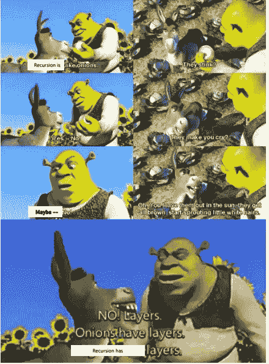
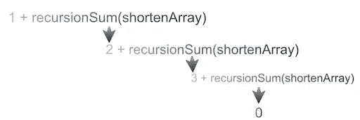
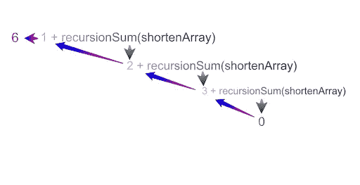

# 解释 JavaScript 中的递归

> 原文：<https://levelup.gitconnected.com/explaining-recursion-in-javascript-9168e4aba8f2>

这个博客将介绍 javascript 中的递归。

递归是调用函数本身的行为。这允许您递归或迭代传入的参数，同时在内存中保存每次迭代的值。一旦函数调用完毕，每个堆栈值将减为一。还有其他方法来迭代数据，但是当有可执行的可重复模式时，递归会很有用。

递归看起来很危险，因为你的函数有可能无限地调用它自己，但是记住下面这三点，希望你能避免这种情况。

onions.png

# 递归需要 3 个简单的部分:

*   在内部调用它自己
*   递归情况
*   基本情况/返回语句

# 概念:

递归背后的思想是通过调用函数本身来计算返回语句。每个函数调用将允许你更深入地了解你的参数。在下面的函数中，我们将在一个整数数组中添加元素，以返回一个数组中所有元素的总和。

# **决定目的地并制定计划**

## **在递归中迭代一个参数时，你一次只关注一层。**

当这个函数被调用时，参数将是一个数字数组，因此，我们在迭代时一次只关注一个数字。该函数的输出将是给定数组中所有数字的总和。记住你的预期产出将有助于你理解如何计划。

# **递归案例和函数调用— *【踪迹】***

## 递归事例由函数在每次迭代中采取的动作组成。最后一步是返回函数调用。

depth.png

每次调用递归函数时，返回的结果都存储在内存中，留下一串值。示例函数返回一串数字，并使用加法运算符将值相加。为了让函数停止调用自身，并在本例中将值相加，需要一个基本用例。

# **基础案例— *【回归】***

## **一个基本用例由一个条件组成，该条件告诉你的函数何时停止递归，并将其值返回到链的上游**

return.png

一旦函数停止调用自己，递归堆栈就会崩溃，返回链中的每个值。在上述函数的情况下，一旦到达数组的最后一个元素，函数就会停止。一旦数组长度为零，条件将被设置为返回。一旦所有值加在一起，该值将被设置为返回零，以保持真正的总和。

根据你的条件，你需要调整你的函数，这样才能达到基本情况。在这种情况下，需要满足的条件是递归到数组中的最后一个元素。函数中采用的方法是使用 slice 方法在内存中保留第一个元素。具体来说，这也改变了数组中的第一个元素，进一步进入递归调用。新数组被传递到递归调用中，每次调用时长度递减，直到满足最后一个条件。

这就是全部了！我希望这澄清了一点，为什么递归不是那么糟糕，在某些情况下，这是一种非常独特的解决问题的方式。