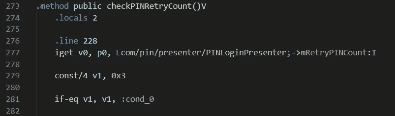

# 利用 Android 上的应用 PIN 机制

> 原文：<https://levelup.gitconnected.com/exploiting-custom-protection-mechanisms-in-apps-5983ecd936f6>

## 定位和利用自定义应用程序保护方法。

移动应用是我们日常生活的一部分，从银行、消息、健康、金融到社交网络；但是这类 app 大多有什么共同点呢？

它们都持有某种私人用户数据。

无论这些数据是账号、私人信息、信用卡账单，还是你最后一次登记入住的地点……就在你家拐角处的那家不错的咖啡馆。我们的设备存储了大量信息，这些信息可能会帮助某些人窃取身份。


照片由[晨酿](https://unsplash.com/@morningbrew?utm_source=medium&utm_medium=referral)在 [Unsplash](https://unsplash.com?utm_source=medium&utm_medium=referral) 拍摄

> 我们依靠应用程序开发人员来充分保护我们放入他们应用程序的数据。

作为用户，如果我们决定使用一个应用程序，我们必须依靠开发者来创建一个安全的应用程序并保护我们存储的数据；这是我们对他们的绝对信任。我们有用户名、密码、生物特征，但是那些添加到应用程序中试图保护这些私人信息免受恶意攻击的自定义安全特性呢？别针之类的保护措施？

在这篇文章中，我们将看看一个应用程序，它有一个自定义的 PIN 输入机制，作为一个单独的防线，以防其他人物理访问设备或知道锁屏密码。这将是一个二级认证机制，试图平衡可用性和安全性，这样用户就不必每次使用应用程序时都登录。

我们不是在讨论 PIN 是如何存储的，也不是围绕它的加密。我们对 PIN 实现的实际逻辑和内部工作方式以及潜在的弱点感兴趣。

# 一根针统治所有人

## 密码

在第一个例子中，我们将展示如何修补应用程序，使其允许任何 PIN 工作，而不管用户创建的原始 PIN。

在查看 Java 代码时，我们看到一个名为*onpisubmit*()的方法，我们可以看到它返回 void，因此没有任何东西被传递回调用方法。所有的 PIN 功能都在这里处理。

为了绕过这个认证，我们需要确保我们总是触发适当的 IF 条件。

1.  之前已经设置了一个 PIN，因此它存在。
2.  提交的 PIN 字符串不为空。
3.  将存储的 PIN 与刚刚提交的 PIN 进行比较。

如果 PIN 有效，则 If 通过，代码继续运行到第 153 行。


在查看 smali 时，我们可以清楚地看到这些 IF 条件和检查结果被传递到变量 v0 中，并根据第 477、485 和 493 行的值跳转到 cond_2。这些语句与上面的三个要点相匹配，所以第 493 行实际比较了两个 PIN 字符串，这是最后一次检查。

这个比较是用语句来完成的， **if-eqz v0，:cond_2** ，由此跳转到 **cond_2** ， **if** 的值 **v0** 是 **eq** ual 到 **z** ero。等于零意味着如果字符串不匹配，结果将为 0/False。如果 PIN 串匹配，结果将为 1/真，并且不会跳转到 **cond_2** 。

前面条件的结果，*是空的*，使用相反的， **if-nez v0，:cond_2，**，因此如果结果为 1/True 将跳转。


构成存储和输入 PIN 的条件比较的三个条件。

## 修补

很明显，我们不想跳到 **cond_2** ，第 493 行的最后一次检查是最关键的，因为这是改变 v0 值的最后一个条件。如果我们修改上面的代码，一旦检查完成，v0 将被另一个值覆盖。

> 注意到方法的返回值是布尔型的，我们可以开始构建我们的引脚旁路。

我们还可以看到， *isEmpty* 和 *equals* 方法的返回值都是布尔值，这提供了我们修补该检查的方法。

首先，我们可以修改从字符串的*等于*检查中接受值的行，而不是移动实际检查的结果，我们可以将常数 1 硬编码到 v0 中。

```
move-result v0  -->  const/4 v0, 0x1
```


硬编码值 1 以确保检查返回 True

第二个补丁可以简单地反转 smali 条件语句的逻辑，使其在有效引脚而不是无效引脚上跳转到 cond_2。然而，当用户试图使用该应用程序并插入正确的 PIN 码时，这可能会触发用户注意到有些不对劲，但它不起作用。这意味着在这种情况下选择 1 更可取。

```
if-eqz v0, :cond_2  -->  if-nez v0, :cond_2
```


当输入不正确的 PIN 时，反转条件检查以返回 True。然而，当输入真实的 PIN 时，这也将返回 False

# 无限制 PIN 重试

## 密码

PIN 认证机制还具有另一种保护；这种额外的安全措施是对不正确的 PIN 尝试进行计数。在 3 次不正确的尝试后，该应用程序将注销，并强制用户使用有效的用户名和密码重新进行完全验证。

在与上面的 PIN 检查相同的类中，发现了一个名为 *checkPINRetryCount* ()的返回 void 方法。这是一个非常简单的代码块，它检查在*onpisubmit*()方法中增加的错误尝试变量是否等于 3。


如果我们看一下 smali 代码，我们可以立即看到这个检查中包含的逻辑缺陷。重试计数器限值被硬编码为常量十进制值 0x3，然后在第 281 行进行比较， **if-ne v0，v1，:cond_0** 。

*   如果 **v0** 不等于 **v1** ，则跳转到 **cond_0。**
*   :cond_0 将**返回-void** 。


硬编码不正确的尝试值和比较检查

## 修补

与前面的例子一样，由于机制的简单性，有多种方法可以绕过这种检查。

我们有以下选择:

*   在执行实际的比较检查之前，添加一个新的代码语句，以便在调用方法后立即返回 void。


通过在比较相等之前返回 void 来绕过检查。

*   也可以更改第 279 行的硬编码限值。将其从 3 大幅增加到 999，以允许更多的尝试。

> 注意，在这种情况下，我们必须用 **const/16** 替换 **const/4** ，因为我们需要更多位来表示值为 999 的整数。


修改重试值以允许 999 次尝试，而不是原来的 3 次。

*   将比较指令替换为相反的等价指令 **if-eq** ，同时改变用于比较的寄存器，以便始终返回 True。
    修改后的代码现在将比较 v1== v1，或 0x3 == 0x3，并且总是为真以跳转到 cond_0，即 return-void 语句。



反转条件检查比较语句，使其始终返回 True。

我们已经看了两个以 PIN 输入形式自定义实现额外安全机制的例子。虽然从用户和开发的角度来看，这些额外保护的想法似乎是一个很好的想法，但如果不确保安全性是开发生命周期的一部分，就有可能在代码流中引入非常基本的缺陷，任何攻击者都可以利用这些缺陷。

虽然这些只是简单的例子，但它们代表了自制安全解决方案的一个非常现实的问题。任何自制程序的实现都应该比应用程序的其他部分更加关注安全性，其他部分可能会使用嵌入式开源库或供应商支持的 API。

这里的攻击媒介是一个非常真实的威胁，因为我们已经看到最困难的部分不是绕过防御，而是社交工程用户安装修改后的应用程序，并获得物理访问以从设备获取信息。