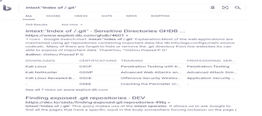
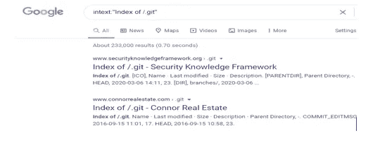
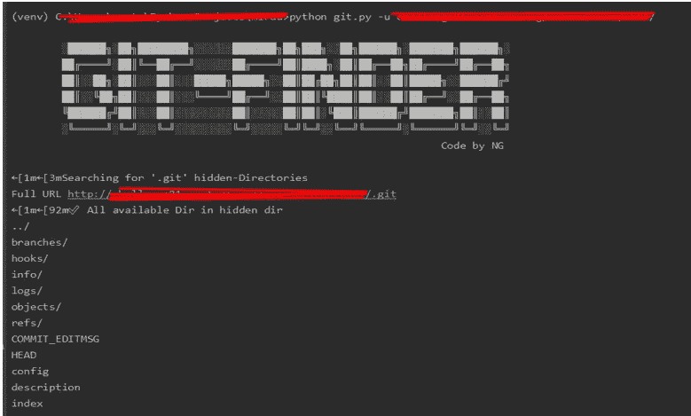
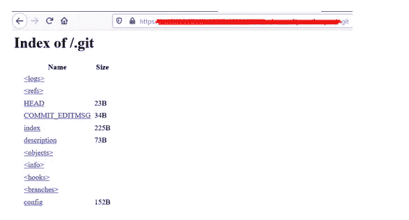
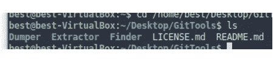
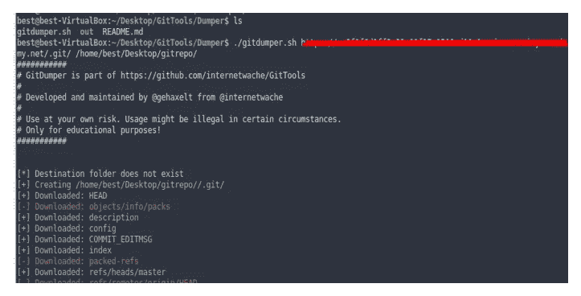
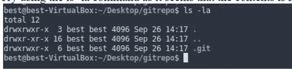
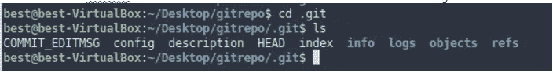
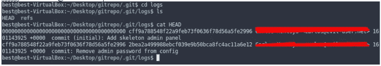
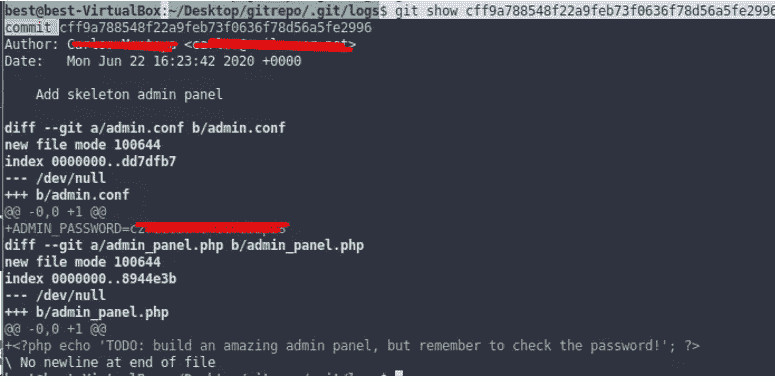

# 利用不安全的代码管理

> 原文：<https://levelup.gitconnected.com/exploiting-insecure-code-management-23fcd00eba60>

**用现实世界的例子:**

**不安全的代码管理/版本控制历史:“**”

为了维护和跟踪代码中的变化，web 应用程序通常使用 git 存储库，但在此过程中，“有时开发人员会保存一些敏感信息”，如数据库信息或凭据、API 密钥、配置文件等，而攻击者会利用这些保存的信息。

安装在网站根目录下的 Git 目录如果公开的话，可以给我们提供很多有趣的信息。因此，git dir 应该从公共访问中移除。".git”源代码可以在本地系统上恢复，并且可以搜索提交历史记录，这可能会暴露大量敏感信息。有很多方法可以搜索网站的 git repos，下面给出了一些方法:

**在搜索引擎:**后插入 **intext:" Index of /。git"** 字符串在任何搜索引擎我们将网站在哪里。git 存储库是公开可访问的。

搜索引擎:

Bing:

谷歌:

通过使用目录暴力工具。

通过使用 dirbuster，我们可以获取多个隐藏的目录。。git 也可以被它取。这个工具在 windows 和 unix/linux 中都可用。

**语法:dirb < URL 带 http/https>**

我们也可以使用

# **https://github.com/guptabless/gitfinder**

这个 python 脚本还有助于搜索隐藏的 git 目录并转储其内容。

# **语法**:python git . py–u<URL>

**URL** :我们要搜索的地方。git 目录，我们必须提供没有 http:/https 或 URL。git 追加。

如果。git 目录存在于 URL 上，它将显示 git 整个结构。

**工作/利用:**一个开发人员不小心在 git 中写了敏感的管理员密码，但是在意识到他从 git 中删除了该密码之后，却忘记了删除提交历史

追加。git 在 URL 中我们可以看到。git 目录。

因此，为了寻找提交历史，我们必须从网站上克隆它，然后我们可以寻找它的提交历史。

**克隆 git 工具:**我们可以使用 gitools 通过下面给出的命令克隆它。Gitools 在 bash/python 中有三个小脚本。

**语法** : Git 克隆[https://github.com/internetwache/GitTools.git](https://github.com/internetwache/GitTools.git)

**一、** **翻车机:**我们可以存储。本地 git 源代码。我们有一个 Dumper“git Dumper . sh”脚本，在这个脚本中，您可以传递附加了 git 目录的网站和您想要保存内容的文件夹。正如你在下面的截图中看到的。我给“gitrepo”文件夹命名并存储它。

我仍然看不到保存的文件夹中的任何内容。

尝试使用 ls -la 命令，因为内容似乎是隐藏的

我们可以看到所有成功克隆的文件夹。

我们通常在 git 存储库中搜索 logs 文件夹。我们有头和

日志文件夹中的引用。

管理员进行了初始提交。在那之后已经被纠正了。它有一个惟一的 git id，通过这个 id 可以查找添加或删除了什么内容。要进行显示，您可以复制 git id，然后在终端中使用该命令 **git show < Commit ID >**

**整治**

切勿在 GitHub 的代码/配置中存储敏感数据。

删除文件和 GitHub 历史记录中的敏感数据。

仔细验证您的 GitHub 应用程序

移除并拒绝访问您网站上的 git 文件夹。