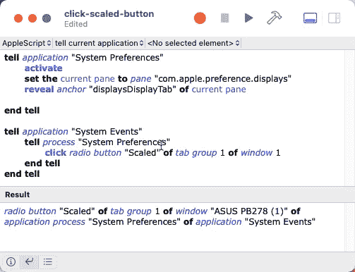
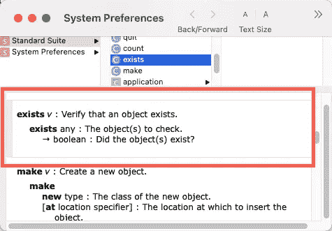
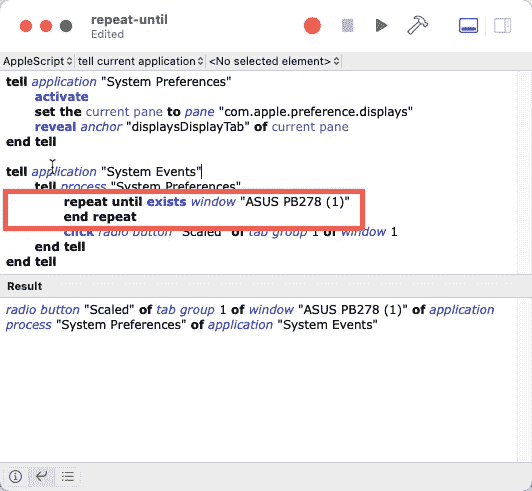
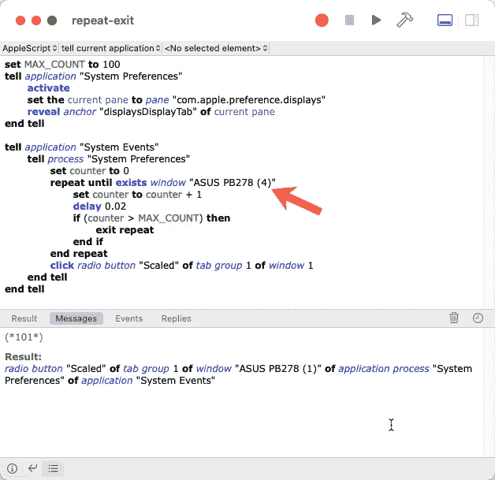
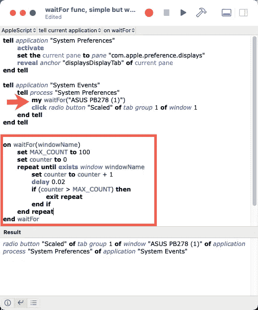
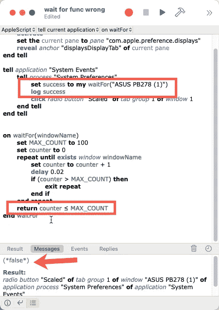
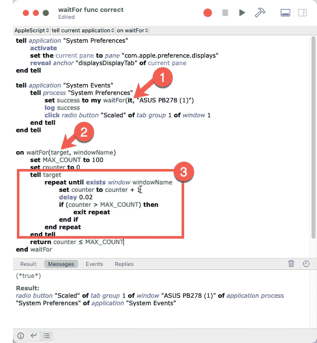
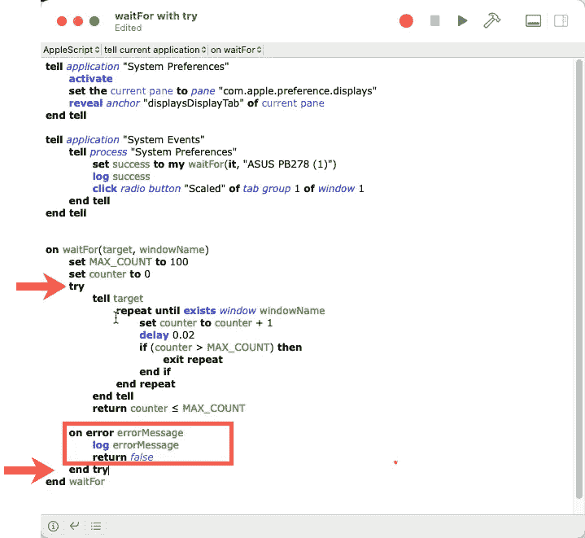

# 探索 AppleScript —第 4 部分

> 原文：<https://levelup.gitconnected.com/exploring-applescript-part-4-4cefee82935c>

## [AppleScript 课程](https://gentille.us/applescript-articles-7f82c319d46?sk=0ad4bf43fb9356f9e647c970cb12c31f)

## 使脚本可读、可靠和可重用

如果我们等待操作完成，脚本变得更加可靠，如果我们使用函数，它们变得更加可重用和可读。当我们这样做时，有一些意想不到的陷阱我们想要避免。

*本文中显示的所有代码都可以通过* [*关联的 GitHub repo 获得。*](https://github.com/Rolias/discover-applescript/tree/main/04-Exploring)

# 前情提要…

在前面的[部分](https://gentille.us/applescript-articles-7f82c319d46?sk=0ad4bf43fb9356f9e647c970cb12c31f)中，我们专注于构建可以用作工具的简短脚本，并学习一些可以帮助我们探索 AppleScript 的附带工具。在这一集里，我们将重点写一个更可靠、可重用和可读的脚本。

我们之前构建了这个脚本:

第 3 部分中构建的脚本

# 可靠性

我想做的第一件事是让这个更可靠。如前所述，这个脚本可能会在正确的`Systems Preferences`窗格和选项卡显示之前尝试单击`Scaled`单选按钮。如果我们检查预期的 UI 元素是否存在，效果会更好。在`System Preferences`的`Standard Suite`中定义的`exists`动词就是这么做的。

“exists”动词的字典条目

问题是我们需要反复调用`exists`直到窗口存在。最简单的方法之一是使用如下所示的`[repeat until](https://developer.apple.com/library/archive/documentation/AppleScript/Conceptual/AppleScriptLangGuide/reference/ASLR_control_statements.html#//apple_ref/doc/uid/TP40000983-CH6g-128014)`语句:

如果需要，永远等待

我在这里使用了我的窗口名。如果你不想永远等下去，你需要替换你的窗口名。如果你厌倦了永远等待，请记住工具栏中的`Stop`按钮。这种方法可能是可以接受的，但是根据脚本的执行方式，永远等待可能不太方便。我们也可以使用`[delay](https://developer.apple.com/library/archive/documentation/AppleScript/Conceptual/AppleScriptLangGuide/reference/ASLR_cmds.html#//apple_ref/doc/uid/TP40000983-CH216-SW10)`命令等待一段特定的时间。我们可以把这两种方法结合起来，等一会儿再放弃。除了比永远等待更快之外，我们还学会了使用`[exit](https://developer.apple.com/library/archive/documentation/AppleScript/Conceptual/AppleScriptLangGuide/reference/ASLR_control_statements.html#//apple_ref/doc/uid/TP40000983-CH6g-128843)`语句。下面我们在每个重复循环中延迟，但在一组尝试次数后放弃。*请注意，我确实将我正在等待的窗口的名称改为了一个在我的系统上不存在的窗口，以验证退出代码是否有效。我将在后续脚本中把它改回来。*

延迟 0.02 秒尝试 100 次

# 通过处理程序(也称为函数)获得可重用性

内联添加了所有这些代码后，我们开始混淆脚本的主要逻辑。让我们稍微重构一下我们的代码，使它更易读，更容易维护。

我将采用一种简单的方法，将等待代码直接移入一个函数，也称为`[handler](https://developer.apple.com/library/archive/documentation/AppleScript/Conceptual/AppleScriptLangGuide/conceptual/ASLR_about_handlers.html#//apple_ref/doc/uid/TP40000983-CH206-CJBIDBJH).`，我将特别使用一个带有位置参数的[处理程序。在下图中，我创建了一个名为`waitFor()`的处理程序，它接受等待的窗口的名称。](https://developer.apple.com/library/archive/documentation/AppleScript/Conceptual/AppleScriptLangGuide/conceptual/ASLR_about_handlers.html#//apple_ref/doc/uid/TP40000983-CH206-SW13)

使用函数——但会引入错误

注意，在主脚本中，我在 tell 块中调用我的[处理程序。我在处理程序的名字前使用了关键字`my`，否则脚本会认为我试图在`System Preferences`上调用一个(不存在的)`waitFor()`，它是我的内部 tell 块的目标。](https://developer.apple.com/library/archive/documentation/AppleScript/Conceptual/AppleScriptLangGuide/conceptual/ASLR_about_handlers.html#//apple_ref/doc/uid/TP40000983-CH206-SW1)

# 添加返回值

这段代码似乎可以点击`Scaled`按钮，但是它并没有像我们期望的那样找到窗口。我们可以向处理程序添加一个返回值来证明这一点。在下面的代码中，我突出显示了所做的更改，以表明如果达到计数器极限，我将返回`false`，否则返回`true`。在主脚本中，我捕获了`waitFor`的结果并记录下来。我们可以在`Messages`窗格中看到返回了 false。

waitFor()函数返回一个指示成功或失败的值

# 发生了什么事？

为什么这段代码在主脚本中可以工作，但是当我们将它移到处理程序中时却失败了？问题源于 or 主脚本的`tell`块目标。`waitFor`实际上已经忘记了它正在使用`System Preferences`的事实。幸运的是，AppleScript 同时拥有 [it 和 me 关键字](https://developer.apple.com/library/archive/documentation/AppleScript/Conceptual/AppleScriptLangGuide/conceptual/ASLR_fundamentals.html#//apple_ref/doc/uid/TP40000983-CH218-DontLinkElementID_360)。我们可以将`it`传递给我们的函数来跟踪当前目标。在下面的代码中，我们现在传递`it,`并将其作为名为`target`的参数接收。(步骤 1 和 2)。添加了使用新的`target`参数的 tell 块(步骤 3)。`tell target/end tell`块内的代码没有改变。

工作函数

# Try 控制语句

AppleScript 提供了一个 [try 控制语句](https://developer.apple.com/library/archive/documentation/AppleScript/Conceptual/AppleScriptLangGuide/reference/ASLR_control_statements.html#//apple_ref/doc/uid/TP40000983-CH6g-DontLinkElementID_889)来处理意外错误，我们可以添加它来使我们的最终函数更加健壮。我们需要将感兴趣的代码包装在一个 `try/end try`块中(如箭头所示)，并添加一个 on error 部分来处理任何出错的情况(如方框所示)。

带有 try 控制语句的 waitFor()函数

# 下一个

我开始这个 AppleScript 之旅是因为我试图解决一个特定的问题。在下一篇文章中，我们将最终创建一个完整的脚本来解决这个问题，并使用到目前为止我们所学的许多技术。

参见本系列(目前)所有文章的[概述。](https://gentille.us/7f82c319d46?sk=0ad4bf43fb9356f9e647c970cb12c31f)

感谢阅读，和平编码。