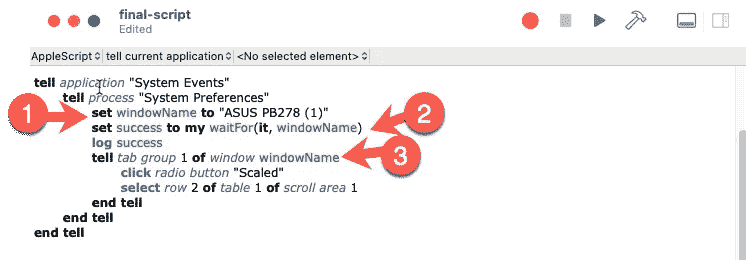

# 探索 AppleScript —第 5 部分

> 原文：<https://levelup.gitconnected.com/exploring-applescript-part-5-7e790314263>

## [AppleScript 课程](https://gentille.us/applescript-articles-7f82c319d46?sk=0ad4bf43fb9356f9e647c970cb12c31f)

## 将我们学到的所有知识放到一个有用的脚本中，避免一些扼杀脚本的陷阱。


将碎片拼在一起

# 前情提要…

[前几期](https://gentille.us/applescript-articles-7f82c319d46?sk=0ad4bf43fb9356f9e647c970cb12c31f)探索了 AppleScript 中的各种工具和技术，并多次引用了[源文档](https://developer.apple.com/library/archive/documentation/AppleScript/Conceptual/AppleScriptLangGuide/introduction/ASLR_intro.html)。我们现在准备利用我们所学的知识编写一个功能完整的脚本。这是我们之前结束的脚本。


上一篇文章的最后一个脚本

# 对脚本和路线图的需求

我已经经历了一段时间的间歇性 macOS 故障。当我的笔记本电脑从睡眠中醒来时，可见的窗口有时会隐藏起来，让它们显示出来是有问题的。我开发了一个多步骤手动解决方法。正如您可能已经从本系列的前几部分中猜到的，它涉及到与`System Preferences`应用程序的`Displays`面板共舞。下面是使我的窗口再次出现的解决方法。

1.  打开系统偏好设置
2.  打开显示器对话框
3.  找到一个外部监视器窗口，并选择显示选项卡
4.  单击“缩放”单选按钮
5.  选择默认分辨率以外的分辨率
6.  等待屏幕刷新
7.  将分辨率设置回默认值
8.  退出显示器偏好设置
9.  退出系统偏好设置。

如果你一直在跟随，前四个步骤应该看起来很熟悉。我们需要自动化最后五个。

# 选择新的分辨率

我的外接显示器上的`Displays`面板如下所示:


选择了“缩放”的外部监视器显示选项卡

点击文本`2048 x 1152` 将改变分辨率。听起来很简单，但是没有一种明显的方法来引用这段文本。这时我们可以利用我们在第 3 部分中学到的知识，打开`Accessibility Inspector`应用程序，使用定位工具点击分辨率区域的左下角。


左侧显示目标区域，右侧显示层次结构

层次结构显示我们的窗口名有一个包含一个包含一个包含一个集合的`table`的`tab group`。我们可以猜测我们想要的行是`row 2`，这意味着我们可以将层次结构(从底部开始)构建为`row 2 of table 1 of scroll area 1 of tab group 1 of window "ASUS PB278 (1)"`——因为在您的机器上窗口名称总是不同的。我们可以在`Scaled`按钮的`click`之后的`select`文本项，如下图所示。*(注:我用的是* `*System Events*` *字典中* `*Processes Suite*` *的* `*select*` *动词，而不是* `*click*` *。)*


# 重构时间第 1 部分

我想清理一些东西。在下面的步骤 1 中，我添加了一行代码来将窗口名存储在一个变量中，然后在步骤 2 中使用该变量。我在步骤 3 中再次使用该变量，但我也添加了一个`tell`块来重用窗口的`tab group 1`。这允许我们缩短`click`和`select`的命令。



# 把事情恢复原样

该脚本现在已经完成了恢复所有窗口的所有工作，但是我的显示器没有达到期望的分辨率。点击`Default for display`按钮即可。但是，在缩放分辨率的点击完成之前，我们无法做到这一点。不幸的是，这并不像想象的那么容易。原来，当我们选择第 2 行时，我们在首选项窗格中的对象层次结构发生了变化。稍后我们将在[中更详细地讨论](#58cb)，但是现在只知道我们的`tab group`被放入了一个新的`group`中。

重用我们的`waitFor()`处理程序来完成测试，并不像我希望的那么简单。我打算用`repeat until`选择一种新方法。AppleScript 有一个`[with timeout](https://developer.apple.com/library/archive/documentation/AppleScript/Conceptual/AppleScriptLangGuide/reference/ASLR_control_statements.html#//apple_ref/doc/uid/TP40000983-CH6g-130992)`控制语句，我们可以用它来指定超时，我选择了 5 秒。我们可以包装`repeat until`来等待新的`group 1`的存在，但是如果等待时间超过 5 秒，就报错。新的等待循环如下所示。


# 重构时间第 2 部分

既然重用`waitFor()`没有效果，我们不妨用一个类似的等待块来代替它。嘿，这对于学习处理程序还是很有用的！我们的新等待如下所示，并且已经删除了`waitFor()`代码。


# 已经点击了织补按钮

我们终于准备好恢复原来的分辨率了。专注于正确层次的直接 `click radio button`现在可以工作了。


# 退出并关闭

倒数第二步是退出`Displays`偏好设置面板。我可以再次使用`Accessibility Inspector`，点击工具栏中的`Back`按钮。


在我们的窗口中有一个带`group`的`toolbar`，它有另一个带后退按钮的`group`。我们需要的路径是`button 1 of group 1 of group 1 of toolbar 1.`这不是打字错误，我们有两个`group 1`选择器。同样，我们应该首先等待持有按钮的`toolbar`存在，然后单击它。


等待并单击后退按钮

在最后一步，我们告诉系统偏好设置退出。幸运的是，这不包含惊喜或等待。这是我们完整的剧本。


完整脚本

## 🔥小费

当你开发脚本时，总是从相同的起点测试它们。在这种情况下，我手动将分辨率设置回默认值，退出`Displays`首选项选项卡，并在每次运行之间退出`Systems Preferences`应用程序。很痛苦，但是必要的。我希望从这个起始条件运行这个脚本，所以这就是我测试的方式，它最大化了代码的可预测性。

# 重温变化中的等级制度

让我们重温一下我之前提到的不断变化的等级制度。我没有很好的解释为什么会这样，但是在新的分辨率上做一个`select`会导致对象的层次结构发生变化。即使当我们返回到`Default for display`分辨率并退出`Displays`窗格时，层次结构仍然保持不变。退出`System Preferences`应用程序会恢复我们原来的层次结构。`Accessibility Inspector`又有用了。在我点击新的分辨率之前和之后，我捕捉了一个层次结构的快照。


不断变化的等级制度

注意现在在`window`和 `tab group`之间有一个`group`对象。这就是为什么在不退出`System Preferences`的情况下，脚本不会连续两次正确运行。如果我们需要我们的脚本在任一条件下工作，我们**可以**做到。它将涉及使用 try 块来捕获我们的超时错误，然后测试替代层次结构，并修改我们的代码以使用任何存在的层次结构。我对这个脚本的需求不需要那种程度的健壮性。然而，这是一个脆弱点，也是一个可能在 macOS 更新中被打破的领域。

# 💉临别赠言💉

当我学习 AppleScript 时，令人沮丧的一个方面是找到合适的文档。*(等级的意外变化又是一个！)*你不可能轻易搜索到所有的文档。主文档确实有一个[索引页](https://developer.apple.com/library/archive/documentation/AppleScript/Conceptual/AppleScriptLangGuide/Index/index_of_book.html#//apple_ref/doc/uid/TP40000983-Index)。你可以在那一页做 CMD-F 或者点击顶部的字母。我发现我必须在一个字母上点击两次才能跳到索引的那个部分。另一种方法是用谷歌搜索特定的网站。例如，如果您想要在 AppleScript 文档中搜索单词`tell`，您可以在 Google 搜索栏中输入以下内容。

```
site:[https://developer.apple.com/library/archive/documentation/AppleScript](https://developer.apple.com/library/archive/documentation/AppleScript) tell
```

如果您没有找到您正在寻找的文档，请记住您可能需要打开您正在控制的对象的字典并在那里查找。

最后， [Mac 脚本指南](https://developer.apple.com/library/archive/documentation/LanguagesUtilities/Conceptual/MacAutomationScriptingGuide/)也有很多有用的信息。

# 下集预告…

我一直在想这些文章中的每一篇都是最后一篇，然后我就有了“还有一件事……”的哥伦布时刻。在本系列的下一篇文章中，我们将看看如何编译这个脚本，并把它放到 Mac 的菜单栏中。

在那之前，平静地编码。