# 探索 AppleScript —第 6 部分

> 原文：<https://levelup.gitconnected.com/exploring-applescript-part-6-83202543346d>

## [AppleScript 课程](https://gentille.us/applescript-articles-7f82c319d46?sk=0ad4bf43fb9356f9e647c970cb12c31f)

## 我们将达到我们的最终目标，将我们的脚本保存到正确的位置，并赋予它所需的权限。这将让我们方便地从 macOS 菜单栏运行它。

让剧本通过球门柱

# 前情提要…

[前几期](https://gentille.us/applescript-articles-7f82c319d46?sk=0ad4bf43fb9356f9e647c970cb12c31f)探索了 AppleScript 中的各种工具和技术，并多次引用了[源文档](https://developer.apple.com/library/archive/documentation/AppleScript/Conceptual/AppleScriptLangGuide/introduction/ASLR_intro.html)。我们已经写了一个完整而有用的脚本。现在我们需要一种更方便的方式来运行它。这是我们结束时的脚本。

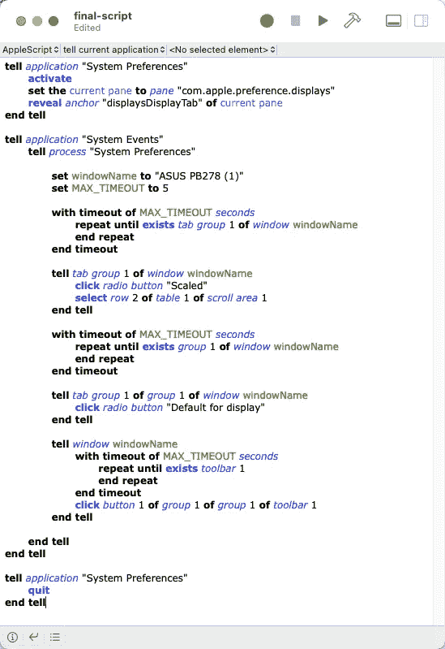

完整脚本

# 保存脚本

我假设你已经保存了这个脚本，因为我们一直在开发它；因此，使用脚本编辑器的`File→Save`菜单不会给我们任何选项。让我们用`File→Export… menu`来代替。

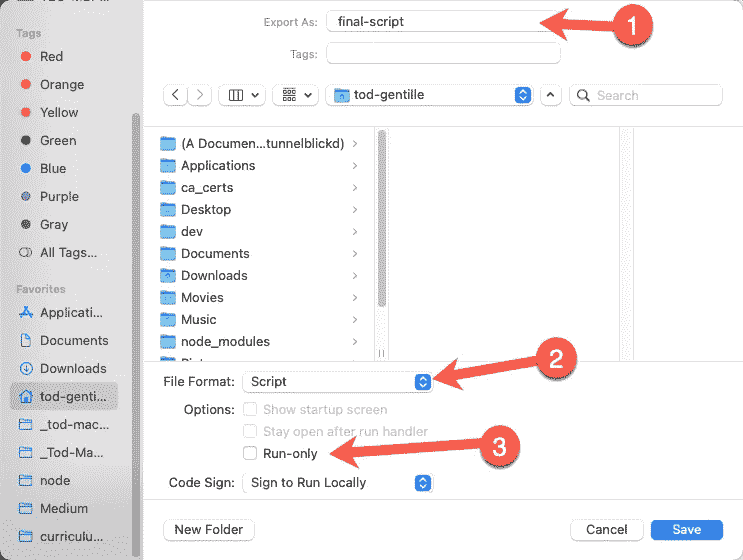

导出菜单

1.  把名字改成有意义的，在这个例子的后面你会看到我用了`display-fixer-app`。
2.  选择文件格式。你可以在 Mac 自动化脚本指南中了解不同的[脚本类型。我们没有任何资源，因此我们不需要一个脚本包。我正在用下拉菜单中的`Application`项创建一个脚本小程序。](https://developer.apple.com/library/archive/documentation/LanguagesUtilities/Conceptual/MacAutomationScriptingGuide/TypesofScripts.html)
3.  如果你不想保存你的源脚本，你可以启用`Run-only`复选框来只保存你的脚本的编译版本。

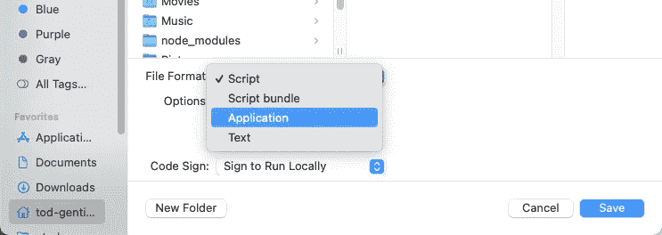

应用程序文件格式

# 挑选地点

您可以在任何地方保存一个脚本小程序，然后双击它来运行它。我喜欢让我的脚本出现在 macOS 菜单栏的脚本菜单栏项中。这需要将脚本保存到特定的位置。

如果您导航到`Users`文件夹下的个人文件夹，它看起来应该如下所示:

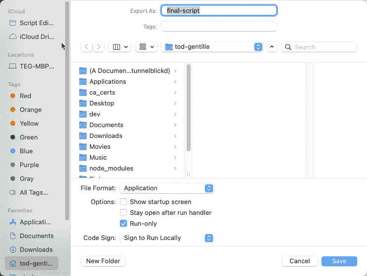

主目录的普通视图

如果您现在按住 Command，并按住 Shift 键和句点键(⌘-⇧-.)在你的键盘上，会出现隐藏的文件和文件夹。我们这样做是为了获得对`Library`文件夹的访问权。

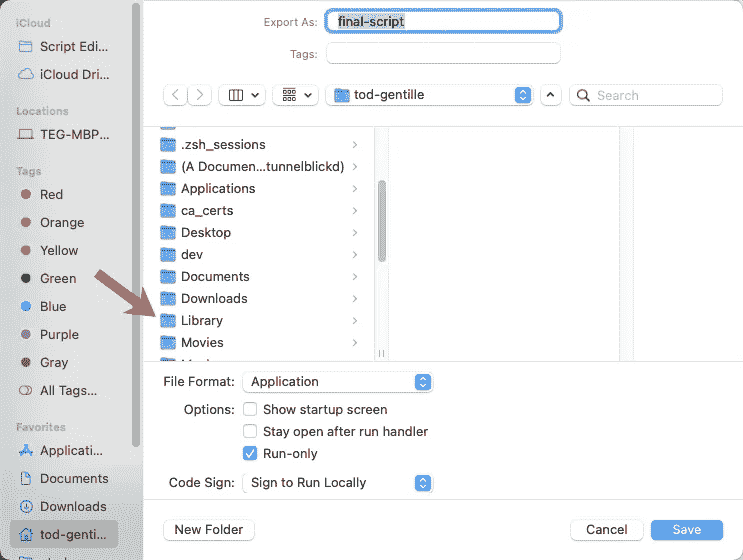

如果您有许多隐藏的文件和文件夹，您可能需要向下滚动来查看`Library`文件夹。选择`Library`文件夹，然后选择`Scripts`文件夹，如图所示

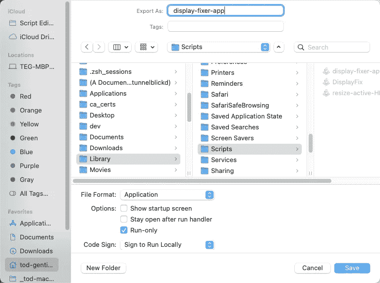

导航到用户的“资源库/脚本”文件夹

为您的小程序命名，然后单击保存。

# 脚本菜单栏

使用`Script Editor→Preferences`菜单项并选择`General`选项卡。

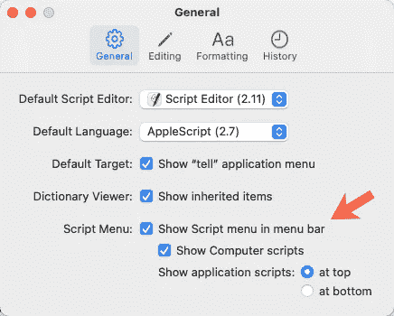

一般偏好

启用`Show Script menu in menu bar`复选框。完成后，您将在 macOS 菜单栏中看到一个脚本菜单栏项目。

菜单栏中的脚本菜单

# 许可之舞

当您单击 script 菜单项时，您应该会在下拉列表中看到您的新脚本。继续点击它，但是不要期望它运行(还没有)。

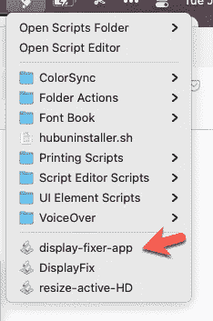

脚本菜单已展开

在其中一台显示器上，您会看到以下对话框:

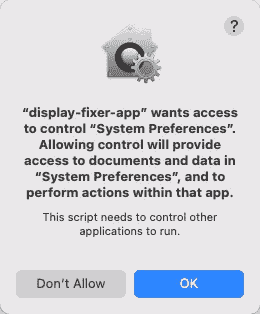

单击 OK，脚本将进入第一步，并可能显示另外两个对话框:

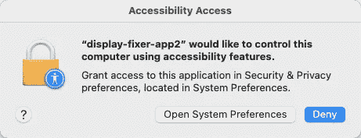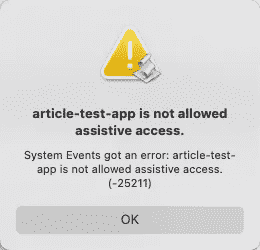

您可以点击确定关闭第二个对话框，然后点击`Open System Preferences`按钮。如果由于某种原因`Accessibility Access`对话框没有出现，但是你的脚本没有运行，不要惊慌。打开`System Preferences`对话框，手动选择`Security and Privacy`窗格。

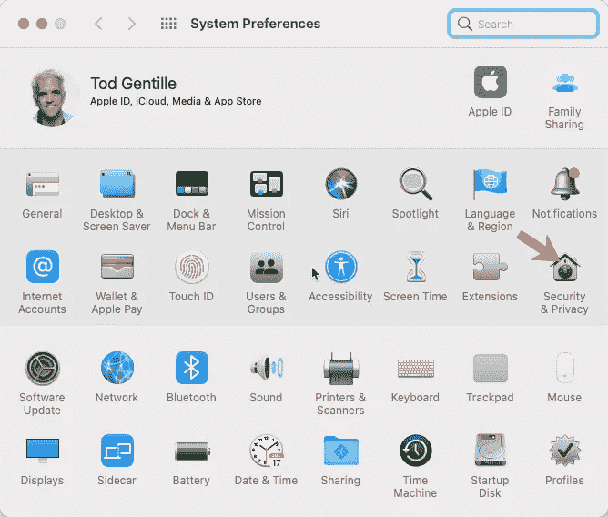

手动选择“安全性与隐私”面板

点按锁图标并输入您的密码

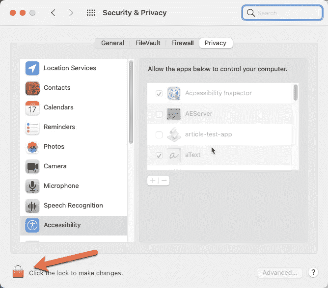

向下滚动找到脚本并启用复选框。

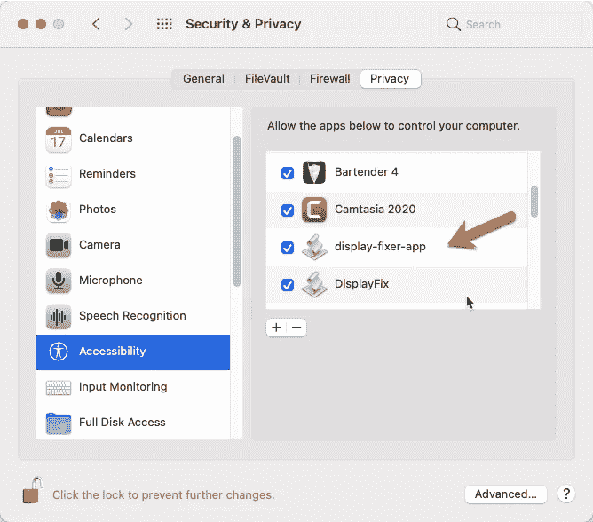

# 最后一支舞

此时，您的脚本已经放弃了您，是时候尝试再次运行它了。它不会立即生效，相反，您会看到以下对话框:

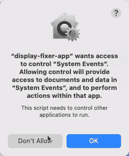

点击`OK`，您的脚本应该会运行。

# 恭喜你！

您已经创建并部署了您的第一个脚本。只要你不做需要重新保存你的脚本的修改，它将总是在脚本菜单中一键点击。

感谢您阅读本系列，我希望您喜欢了解 AppleScript。我知道写这些文章让我学到了很多。玩得开心。

平静地编码。