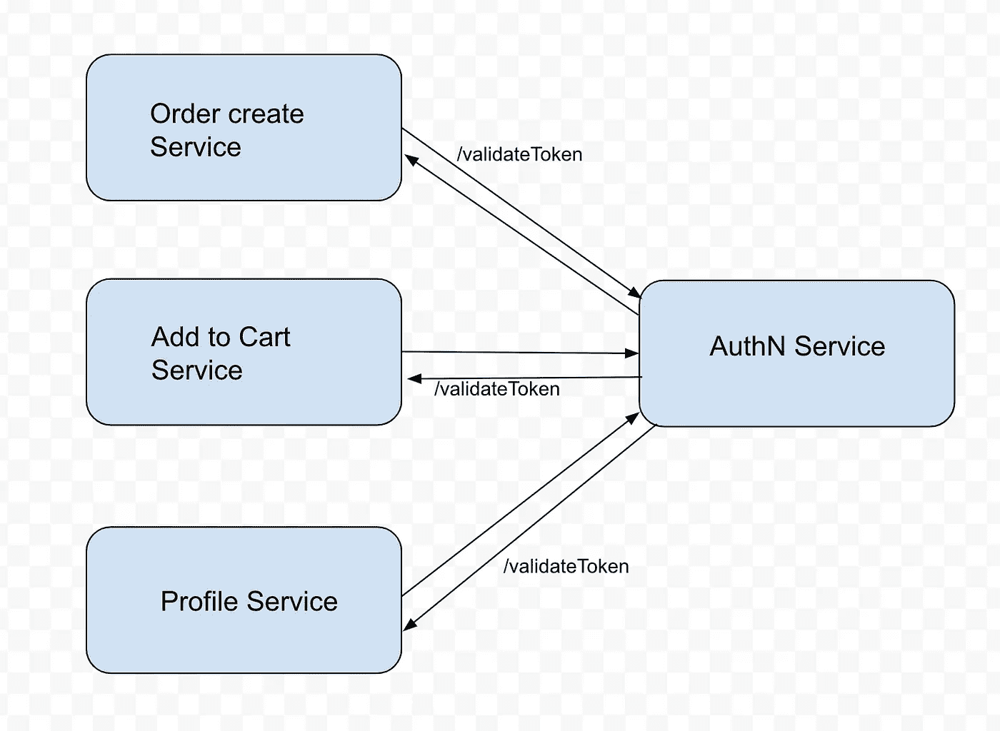
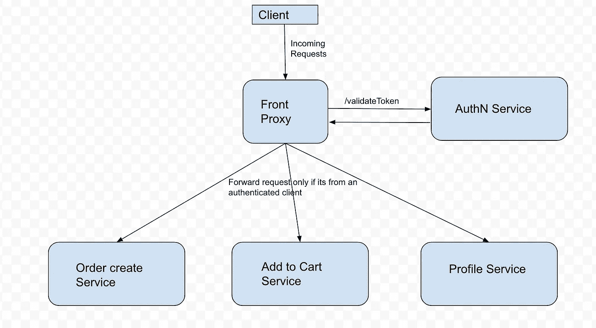

# 使用 Envoy 探索外部认证—第一部分

> 原文：<https://levelup.gitconnected.com/exploring-external-authorisation-with-envoy-part-i-dd0b5fd83d8f>

资料来源:联合国人类住区规划署

在微服务架构中，会出现许多服务服务于来自经过身份验证的用户的请求的用例。例如，假设电子商务网站中的 order create API 要求用户身份验证(简称为 authN)令牌出现在请求中。下单 API 或添加到购物车 API 也是如此。它们都只期望来自经过身份验证的用户的请求。

大多数互联网后端服务都已经有一个 authN 服务来验证用户，它在用户登录时向经过验证的用户发放令牌。来自同一用户帐户的任何后续 API 调用都将包含用户令牌。我们可以通过从每个其他服务调用相同的 authN 服务来非常简单地处理上面的用例。该架构的框图如下所示。

虽然，上面的架构没有任何问题(就像生活中的其他事情一样，不完全是二进制的:p)，但我们需要添加相同的代码来调用 authN 服务，以验证来自每个服务的令牌。

有一个更好的方法从一个前端代理来处理这个问题。嗯，前端代理是一个只将有效的(读取认证的)请求传递给服务的代理。特使非常适合做这个前台代理。所以我们的架构现在看起来是这样的。现在看起来简单多了。

在我们博客的下一部分[中，我们将会看到如何用 Envoy 处理外部认证。](/exploring-external-authorisation-with-envoy-part-ii-573c35f64c78)