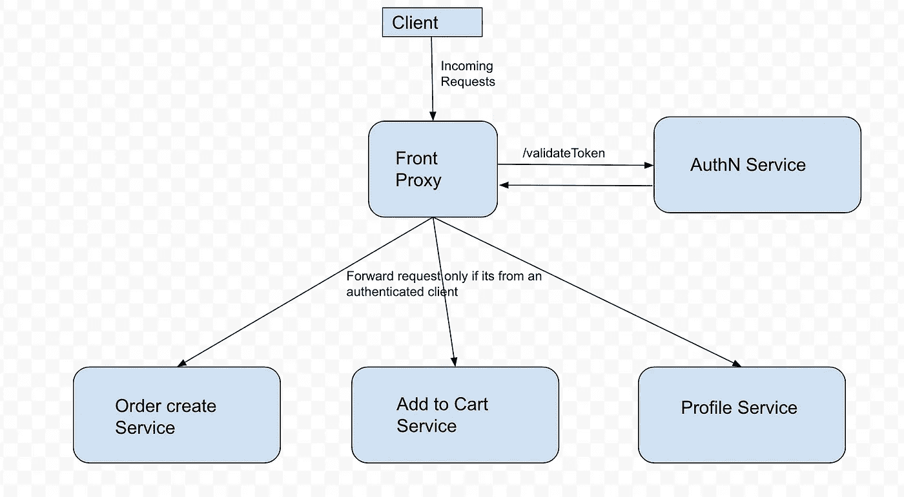

# 使用 Envoy 探索外部认证—第二部分

> 原文：<https://levelup.gitconnected.com/exploring-external-authorisation-with-envoy-part-ii-573c35f64c78>

这是关于使用 Envoy 处理外部认证的[博客](/exploring-external-authorisation-with-envoy-part-i-dd0b5fd83d8f)的延续。我们将实现上述架构，其中[特使](https://www.envoyproxy.io/)将充当前台代理。

首先，让我们克隆下面的存储库(【https://github.com/envoyproxy/envoy.git】T4)。我们需要去 *examples/front-proxy* 文件夹，在那里 Envoy 提供了一个完美的例子，我们可以从这里开始。docker-compose 文件提供了两个相同的 flask 服务器以及一个 Envoy 代理实例。没有任何延迟，让我们构建 docker 映像并运行服务(使用以下命令)。

> $ git 克隆[https://github.com/envoyproxy/envoy.git](https://github.com/envoyproxy/envoy.git)
> $ CD 特使/范例/前台代理
> $ docker-撰写 up -d

这将打开如下所示的 3 个容器。其中两个将是 flask 服务器，一个将是特使本身。我们也可以尝试通过 curl 向特使请求。请注意，在端口 8080 上请求，将请求到特使，然后请求将被转发到 flask 服务。我们可以看到 8080 端口在 *docker-compose* 文件中被 Envoy 公开。

> $ curl localhost:8080/service/1
> 特使背后的你好(服务 1)！主机名:0cd25dcc1c9d 已解析主机名:172.18.0.2
> 
> $ curl localhost:8080/service/2
> 特使背后的你好(服务 2)！主机名:2c8b3ed74e7d 已解析主机名:172.18.0.3

到目前为止，还没有认证服务出现，每个到达特使的请求都将被转发到服务。

现在，让我们构建一个虚拟身份验证服务，它将验证请求中出现的用户令牌。只有在请求头中存在有效的用户令牌时，authN 服务才应该返回 200，否则应该返回 4XX(在我们的例子中是 403)。

我们可以克隆下面的存储库([https://github.com/samanway1996/dummy-auth-service](https://github.com/samanway1996/dummy-auth-service))。这包括一个用于上述 authN 用例的 Julia 程序，以及 docker 文件。我们可以继续构建 docker 映像并从中运行容器(使用下面的命令)。

> $ git 克隆[https://github.com/samanway1996/](https://github.com/samanway1996/dummy-auth-service)[虚拟授权服务](https://github.com/samanway1996/dummy-auth-service)
> $ cd [虚拟授权服务](https://github.com/samanway1996/dummy-auth-service)
> $ docker build-t dummy _ auth。
> $ docker run-p 8083:8088-it dummy _ auth

最后一个命令应该将服务作为容器运行，并将监听端口暴露给主机的端口号 8083。在这一点上，列出所有的容器(使用 *docker ps* 命令)也应该显示我们新的 authN 服务容器。

我们可以尝试使用 curl 请求 authN 服务。如果报头中存在无效标记或者根本不存在报头，它应该返回 403。

现在，我们希望我们的特使将点击 authN 服务来验证令牌，而不应该将请求转发给 flask 服务，如果头部中的令牌无效的话。为此，我们需要修改 Envoy 配置文件，让它在转发每个请求之前验证来自 authN 服务的令牌。

下面我们把 front-envoy.yaml 的内容替换成。(是的，我们会解释我们所做的改变！)现在我们需要构建特使容器并再次运行它。(使用这些命令)

> $ CD envoy/examples/front-proxy
> #现在需要用下面的代码替换 front-envoy.yaml 并重新构建
> $ docker-compose build
> $ docker-compose up-d

一旦特使集装箱再次上升，让我们尝试击中。又是同样的卷发。

> $ curl localhost:8080/service/1
> 无效令牌:$ curl localhost:8080/service/2
> 无效令牌:

瞧啊。！我们的前台代理这次没有让我们到达 flask 服务器。只有当我们在请求头中包含正确的令牌时，才会出现这种情况。

> $ curl localhost:8080/service/1-H ' Token:abcde '
> 无效令牌:abcde
> $ curl localhost:8080/service/2-H ' Token:abcdef '
> 特使(service 2)背后的你好！主机名:2c8b3ed74e7d 已解析主机名:172.18.0.3

虽然这看起来像魔术，但这都是逻辑。Envoy 支持 http 过滤器，这有助于过滤请求。我们必须添加一个 http 过滤器，通过点击 authN 服务进行过滤。下面是我们在配置中添加的 http 过滤器。

server-uri 中的 uri 参数告诉 Envoy 确切的 authN 服务 URI(*http://host . docker . internal:8083/auth*对于我们的例子，请记住，我们在端口号 *8083* 上运行我们的虚拟 authN 服务，用于访问外部 authN 服务。

还有一点需要注意的是，我们是如何提到在向外部 authN 服务发送请求时使用哪个报头的。由于我们的 authN 服务需要请求中的*令牌*报头，因此特使必须发送报头中的*令牌*。

**参考文献** :
1。[https://github.com/envoyproxy/envoy](https://github.com/envoyproxy/envoy)2
。[特使 HTTP 过滤器](https://www.envoyproxy.io/docs/envoy/latest/api-v3/extensions/filters/http/ext_authz/v3/ext_authz.proto#envoy-v3-api-msg-extensions-filters-http-ext-authz-v3-httpservice)
3。[特使类型匹配](https://www.envoyproxy.io/docs/envoy/latest/api-v3/type/matcher/v3/string.proto#envoy-v3-api-msg-type-matcher-v3-stringmatcher)