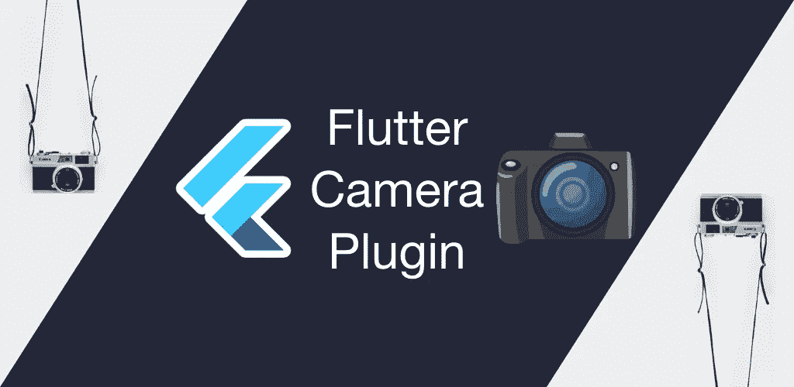
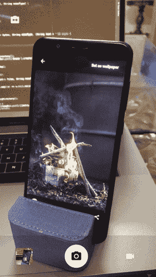

# 探索 Flutter 相机插件

> 原文：<https://levelup.gitconnected.com/exploring-flutter-camera-plugin-d2c54ac95f05>

## 在 Flutter 中构建相机应用程序。



如果你曾经开发或使用过任何大型移动应用程序，那么这个应用程序很有可能会使用相机功能。如果你看看 PlayStore 中的[排行榜，你会发现许多应用程序使用相机来执行各种任务。Flutter 有一个](https://play.google.com/store/apps/top?hl=en)[摄像头插件](https://pub.dev/packages/camera)，可以在 Android 和 iOS 上访问设备的摄像头。在这篇文章中，我们将探索 Flutter 相机插件，我们将建立一个小的相机应用程序，看看这个插件能做什么，不能做什么。

在我们前进之前，让我们看看我们要建立什么。这个应用程序将能够拍照和录制视频。你可以在前后摄像头之间切换。和一个图库，您可以在这里看到捕获的图像和录制的视频，并与其他应用程序共享或从设备中删除它们。



# 入门指南

该应用程序使用以下 5 个依赖项。您需要将这些依赖项添加到您的`pubspec.yaml`中。

*   [摄像头](https://pub.dev/packages/camera):提供工具与设备上的摄像头配合工作。
*   [path_provider](https://pub.dev/packages/path_provider) :查找存储媒体的正确路径。
*   [video_player](https://pub.dev/packages/video_player) :播放录制的视频。
*   [esys_flutter_share](https://pub.dev/packages/esys_flutter_share) :用于与其他应用共享媒体文件。
*   [缩略图](https://github.com/divyanshub024/Flutter_Thumbnails):用于从视频生成缩略图。

```
dependencies:
  camera:
  path_provider:
  thumbnails:
    git:
      url: https://github.com/divyanshub024/Flutter_Thumbnails.git
  video_player:
  esys_flutter_share:
```

接下来，在您的`android/app/build.gradle`文件中将您的最低 Android SDK 版本更新为 21(或更高)。

在你的`ios/Runner/Info.plist`中添加以下几行:

```
<key>NSCameraUsageDescription</key>
<string>Can I use the camera please?</string>
<key>NSMicrophoneUsageDescription</key>
<string>Can I use the mic please?</string>
<key>NSAppTransportSecurity</key>
<dict>
  <key>NSAllowsArbitraryLoads</key>
  <true/>
</dict>
```

# 获取可用摄像机的列表

首先，我们将使用相机插件获取相机列表。

```
List*<*CameraDescription*>* _cameras;@override
void initState*() {* _initCamera*()*;
  super.initState*()*;
*}*Future*<*void*>* _initCamera*()* async *{* _cameras = await availableCameras*()*;
*}*
```

# 初始化摄像机控制器

现在我们有了可用摄像机的列表。接下来，我们将初始化摄像机控制器。摄像机控制器用于控制设备摄像机。`CameraController`取两个值`CameraDescription`和`ResolutionPreset`。最初，我们给了一个相机描述为`_camera[0]`，这是我们的背部相机。

> 注意:这里我们给出了`ResolutionPreset`作为媒介。如果它冻结你的照相机，试着避免去一个更高的分辨率。更多细节请看本期[刊](https://github.com/flutter/flutter/issues/40519)。

```
CameraController _controller;Future*<*void*>* _initCamera*()* async {  _controller = CameraController*(*_cameras*[*0*]*, ResolutionPreset.medium*)*;
  _controller.initialize*()*.then*((*_*) {* if *(*!mounted*) {* return;
    *}* setState*(() {})*;
  *})*;
*}* @override
void dispose*() {* _controller?.dispose*()*;
  super.dispose*()*;
*}*
```

# 相机预览

一旦我们的相机都设置好了，我们将使用`CameraPreview`小工具显示预览。在我们显示摄像机预览之前，我们必须等待摄像机控制器初始化。

```
@override
Widget build*(*BuildContext context*) {* if *(*_controller != null*) {* if *(*!_controller.value.isInitialized*) {* return Container*()*;
    *}
  }* else *{* return const Center*(* child: SizedBox*(* width: 32,
        height: 32,
        child: CircularProgressIndicator*()*,
      *)*,
    *)*;
  *}
}*
```

一旦相机初始化，我们将显示相机预览。

```
return Scaffold*(* backgroundColor: Theme.*of(*context*)*.backgroundColor,
  key: _scaffoldKey,
  extendBody: true,
  body: Stack*(* children: *<*Widget*>[* _buildCameraPreview*()*,
    *]*,
  *)*,
*)*;
```

在`_buildCameraPreview()`中，我们将相机预览缩放到屏幕大小，使其看起来全屏。

```
Widget _buildCameraPreview*() {* final size = MediaQuery.*of(*context*)*.size;
  return ClipRect*(* child: Container*(* child: Transform.scale*(* scale: _controller.value.aspectRatio / size.aspectRatio,
        child: Center*(* child: AspectRatio*(* aspectRatio: _controller.value.aspectRatio,
            child: CameraPreview*(*_controller*)*,
          *)*,
        *)*,
      *)*,
    *)*,
  *)*;
*}*
```

# 切换摄像机

下一步是能够在前后摄像头之间切换。为此，我们首先将图标按钮添加到堆栈小部件中。

```
body: Stack*(* children: *<*Widget*>[* _buildCameraPreview*()*,
  **  Positioned*(* top: 24.0,
      left: 12.0,
      child: IconButton*(* icon: Icon*(* Icons.*switch_camera*,
          color: Colors.*white*,
        *)*,
        onPressed: _onCameraSwitch,
      *)*,
    *)*,** *]*,
*)*,
```

该图标按钮被按下时调用方法`_onCameraSwitch`。在这个方法中，我们将首先处理掉`CameraController`，然后用新的`CameraDescription`初始化新的`CameraController`。

```
Future*<*void*>* _onCameraSwitch*()* async *{* final CameraDescription cameraDescription =
      *(*_controller.description == _cameras*[*0*])* ? _cameras*[*1*]* : _cameras*[*0*]*;
  if *(*_controller != null*) {* await _controller.dispose*()*;
  *}* _controller = CameraController*(*cameraDescription, ResolutionPreset.medium*)*;
  _controller.addListener*(() {* if *(*mounted*)* setState*(() {})*;
    if *(*_controller.value.hasError*) {* showInSnackBar*(*'Camera error *${*_controller.value.errorDescription*}*'*)*;
    *}
  })*;

  try *{* await _controller.initialize*()*;
  *}* on CameraException catch *(*e*) {* _showCameraException*(*e*)*;
  *}* if *(*mounted*) {* setState*(() {})*;
  *}
}*
```

# 摄像机控制视图

在屏幕的底部，我们将有一个控制视图，基本上包含 3 个按钮。首先是进入画廊，其次是拍摄图像或录制视频，第三是在图像拍摄和视频录制之间切换。

```
return Scaffold*(* backgroundColor: Theme.*of(*context*)*.backgroundColor,
  key: _scaffoldKey,
  **extendBody: true,**
  body: ...
  **bottomNavigationBar: _buildBottomNavigationBar*()*,**
*)*;
```

该视图将显示在底部导航栏中。别忘了加上`extendBody: true.`

```
Widget _buildBottomNavigationBar*() {* return Container*(* color: Theme.*of(*context*)*.bottomAppBarColor,
    height: 100.0,
    width: double.*infinity*,
    child: Row*(* mainAxisAlignment: MainAxisAlignment.spaceAround,
      children: *<*Widget*>[* FutureBuilder*(* future: getLastImage*()*,
          builder: *(*context, snapshot*) {* if *(*snapshot.data == null*) {* return Container*(* width: 40.0,
                height: 40.0,
              *)*;
            *}* return GestureDetector*(* onTap: *()* => Navigator.*push(* context,
                MaterialPageRoute*(* builder: *(*context*)* => Gallery*()*,
                *)*,
              *)*,
              child: Container*(* width: 40.0,
                height: 40.0,
                child: ClipRRect*(* borderRadius: BorderRadius.circular*(*4.0*)*,
                  child: Image.file*(* snapshot.data,
                    fit: BoxFit.cover,
                  *)*,
                *)*,
              *)*,
            *)*;
          *}*,
        *)*,
        CircleAvatar*(* backgroundColor: Colors.*white*,
          radius: 28.0,
          child: IconButton*(* icon: Icon*(
              (*_isRecordingMode*)* ? *(*_isRecording*)* ? Icons.*stop* : Icons.*videocam* : Icons.*camera_alt*,
              size: 28.0,
              color: *(*_isRecording*)* ? Colors.*red* : Colors.*black*,
            *)*,
            onPressed: *() {* if *(*!_isRecordingMode*) {* _captureImage*()*;
              *}* else *{* if *(*_isRecording*) {* stopVideoRecording*()*;
                *}* else *{* startVideoRecording*()*;
                *}
              }
            }*,
          *)*,
        *)*,
        IconButton*(* icon: Icon*(
            (*_isRecordingMode*)* ? Icons.*camera_alt* : Icons.*videocam*,
            color: Colors.*white*,
          *)*,
          onPressed: *() {* setState*(() {* _isRecordingMode = !_isRecordingMode;
            *})*;
          *}*,
        *)*,
      *]*,
    *)*,
  *)*;
*}*
```

# 捕捉图像

用相机控制器捕捉图像非常容易。

1.  检查相机控制器是否已初始化。
2.  构建一个目录并定义路径。
3.  使用 CameraController 捕获图像，并将其保存到给定的路径。

```
void _captureImage*()* async *{* if *(*_controller.value.isInitialized*) {* final Directory extDir = await getApplicationDocumentsDirectory*()*;
    final String dirPath = '*${*extDir.path*}*/media';
    await Directory*(*dirPath*)*.create*(*recursive: true*)*;
    final String filePath = '$dirPath/*${*_timestamp*()}*.jpeg';
    await _controller.takePicture*(*filePath*)*;
    setState*(() {})*;
  *}
}*
```

# 录制视频

我们可以将录制视频的过程分为两个部分:

**开始录像:**

1.  检查相机控制器是否已初始化。
2.  启动计时器，显示录制的视频时间。(可选)
3.  构建一个目录并定义路径。
4.  使用摄像机控制器开始录制，并将视频保存在定义的路径上。

```
Future*<*String*>* startVideoRecording*()* async *{* print*(*'startVideoRecording'*)*;
  if *(*!_controller.value.isInitialized*) {* return null;
  *}* setState*(() {* _isRecording = true;
  *})*;
  _timerKey.currentState.startTimer*()*;

  final Directory extDir = await getApplicationDocumentsDirectory*()*;
  final String dirPath = '*${*extDir.path*}*/media';
  await Directory*(*dirPath*)*.create*(*recursive: true*)*;
  final String filePath = '$dirPath/*${*_timestamp*()}*.mp4';

  if *(*_controller.value.isRecordingVideo*) {* // A recording is already started, do nothing.
    return null;
  *}* try *{* await _controller.startVideoRecording*(*filePath*)*;
  *}* on CameraException catch *(*e*) {* _showCameraException*(*e*)*;
    return null;
  *}* return filePath;
*}*
```

**停止录像:**

1.  检查相机控制器是否已初始化。
2.  停止计时器。
3.  使用相机控制器停止视频录制。

```
Future*<*void*>* stopVideoRecording*()* async *{* if *(*!_controller.value.isRecordingVideo*) {* return null;
  *}* _timerKey.currentState.stopTimer*()*;
  setState*(() {* _isRecording = false;
  *})*;

  try *{* await _controller.stopVideoRecording*()*;
  *}* on CameraException catch *(*e*) {* _showCameraException*(*e*)*;
    return null;
  *}
}*
```

这是相机屏幕的完整代码。

# 图库视图

我们的相机已经完成，随时可以使用。但是我们如何看到我们拍摄的图像和录制的视频呢？我们将创建一个图库视图。它将包括一个水平的浏览量和底部的应用程序栏，一个共享按钮和一个删除按钮。

我们正在检查文件的扩展名。如果文件扩展名是`jpeg`，我们将它显示为图像，否则我们将使用`VideoPreview`小部件显示视频。

```
String currentFilePath;
@override
Widget build*(*BuildContext context*) {* return Scaffold*(* backgroundColor: Theme.*of(*context*)*.backgroundColor,
    appBar: AppBar*(* backgroundColor: Colors.*black*,
    *)*,
    body: FutureBuilder*(* future: _getAllImages*()*,
      builder: *(*context, AsyncSnapshot*<*List*<*FileSystemEntity*>>* snapshot*) {* if *(*!snapshot.hasData || snapshot.data.isEmpty*) {* return Container*()*;
        *}* print*(*'*${*snapshot.data.length*} ${*snapshot.data*}*'*)*;
        if *(*snapshot.data.length == 0*) {* return Center*(* child: Text*(*'No images found.'*)*,
          *)*;
        *}* return PageView.builder*(* itemCount: snapshot.data.length,
          itemBuilder: *(*context, index*) {* currentFilePath = snapshot.data*[*index*]*.path;
            var extension = path.extension*(*snapshot.data*[*index*]*.path*)*;
            if *(*extension == '.jpeg'*) {* return Container*(* height: 300,
                padding: const EdgeInsets.only*(*bottom: 8.0*)*,
                child: Image.file*(* File*(*snapshot.data*[*index*]*.path*)*,
                *)*,
              *)*;
            *}* else *{* return VideoPreview*(* videoPath: snapshot.data*[*index*]*.path,
              *)*;
            *}
          }*,
        *)*;
      *}*,
    *)*,
    bottomNavigationBar: BottomAppBar*(* child: Container*(* height: 56.0,
        child: Row*(* mainAxisAlignment: MainAxisAlignment.spaceEvenly,
          children: *<*Widget*>[* IconButton*(* icon: Icon*(*Icons.*share)*,
              onPressed: *()* => _shareFile*()*,
            *)*,
            IconButton*(* icon: Icon*(*Icons.*delete)*,
              onPressed: _deleteFile,
            *)*,
          *]*,
        *)*,
      *)*,
    *)*,
  *)*;
*}*
```

## **从设备中获取媒体文件**

```
Future*<*List*<*FileSystemEntity*>>* _getAllImages*()* async *{* final Directory extDir = await getApplicationDocumentsDirectory*()*;
  final String dirPath = '*${*extDir.path*}*/media';
  final myDir = Directory*(*dirPath*)*;
  List*<*FileSystemEntity*>* _images;
  _images = myDir.listSync*(*recursive: true, followLinks: false*)*;
  _images.sort*((*a, b*) {* return b.path.compareTo*(*a.path*)*;
  *})*;
  return _images;
*}*
```

## 删除媒体文件

删除文件相当容易。只需将目录指向文件路径，并使用`deleteSync`功能将其删除。

```
_deleteFile*() {* final dir = Directory*(*currentFilePath*)*;
  dir.deleteSync*(*recursive: true*)*;
  setState*(() {})*;
*}*
```

## 共享媒体文件

为了共享文件，我们使用`esys_flutter_share`插件。您可以使用`Share.file()`方法轻松共享文件，该方法将 String `title`、String `name`、List*<*int*>*`bytes`、String `mimeType`作为强制参数。您可以使用`readAsBytesSync`方法从文件中获取字节。

```
_shareFile*()* async *{* var extension = path.extension*(*currentFilePath*)*;
  await Share.*file(* 'image',
    *(*extension == '.jpeg'*)* ? 'image.jpeg' : '  video.mp4',
    File*(*currentFilePath*)*.readAsBytesSync*()*,
    *(*extension == '.jpeg'*)* ? 'image/jpeg' : '  video/mp4',
  *)*;
*}*
```

# 我对相机插件的看法

在我们得出结论之前，我们应该知道 Flutter 相机插件仍在开发中。这个插件很适合制作任何像样的相机应用程序，但它有一点点问题，缺少许多高级功能，如自动曝光和闪光灯支持。如果你想了解相机插件即将到来的变化，请关注相机插件的未来。本期讨论一些即将在相机插件中出现的很酷的特性。

**这里** **可以看到项目** [**的完整源代码。**](https://github.com/divyanshub024/flutter_camera)

[](https://github.com/divyanshub024/flutter_camera) [## divyanshu 024/flutter _ camera

### 新的颤振应用。这个项目是颤振应用的起点。一些资源让你…

github.com](https://github.com/divyanshub024/flutter_camera) 

如果你喜欢这篇文章，请务必👏下面，就和我连线上的[**Twitter**](https://twitter.com/divyanshub024)**[**Github**](https://github.com/divyanshub024)**和**[**LinkedIn**](https://www.linkedin.com/in/divyanshub024/)**。****