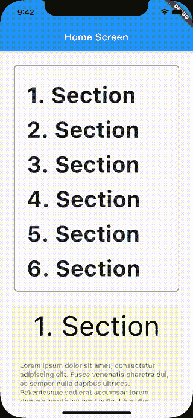

# 探索 Flutter 的 Scrollable.ensureVisible

> 原文：<https://levelup.gitconnected.com/exploring-flutters-scrollable-ensurevisible-f4d1ef8c51d3>

照片由 [Aaron Burden](https://unsplash.com/@aaronburden?utm_source=medium&utm_medium=referral) 在 [Unsplash](https://unsplash.com?utm_source=medium&utm_medium=referral) 上拍摄

您是否曾经不得不构建一个具有多个不同高度的小部件的滚动视图的应用程序，并且您想要添加一个链接，以便用户可以自动从一个小部件滚动到另一个小部件？一个这样的例子可以是文章或菜单的目录。

在这篇文章中，我将展示我们如何实现这一点，为了做到这一点，我将使用一个包含几个部分的屏幕，并在屏幕顶部显示一个目录，其中包含指向相应部分的链接。

让我们看看如何！

> *本帖基于* `*Flutter 2.5.2*` *和* `*Dart SDK 2.14.3*`

# 解决办法

为此，我们将在带有`Column`子部件的`SingleChildScrollView`小部件中使用`[Scrollable.ensureVisible](https://api.flutter.dev/flutter/widgets/Scrollable/ensureVisible.html)`。

简而言之，我们将为每个部分创建一个`GlobalKey()`。然后我们将使用这个键作为链接指向的小部件的键。最后，当我们点击目录中的链接时，我们将使用这个键，如下面的代码片段所示:

因此，目标小部件将在 400 毫秒后可见。

在下一节中，我将尝试给出一个更详细的实现演示！

# 履行

## 准备工作

首先，让我们创建一个表示该部分的数据结构。它将有一个键、一个标题和一个主体。

标题将用于目录中，而键将用于滚动到目标部分。

然后，我们将使用这个类为我们的示例生成一些虚拟数据。我们可以使用一些 lorem ipsum 来表示一些长文本。

## 小工具

接下来，让我们为`Section`创建一个小部件，在这里我们将显示每个部分的标题和主体。

之后，让我们为一个部分的链接创建一个小部件。我们将它命名为`SectionLink`，我们将传递一个 section 和对`InkWell`的`onTap`事件的回调。

接下来，我们将添加一个`TableOfContents`小部件，在这里我们基本上迭代各个部分，并且为每个部分创建一个`SectionLink`。

最后，让我们创建`ArticlePage`,在这里我们将把所有东西联系在一起。在这个小部件中，我们将创建一个包含`TableOfContents`的`SingleChildScrollView`和一个包含部分的`Column`小部件。

对于`TableOfContents`，我们将把部分和点击部分时的回调作为参数传递。这个回调包含滚动到目标小部件的逻辑。首先，我们通过确保`currentContext`的值不为空来验证树中是否存在带有这个键的小部件。然后，我们将把这个上下文传递给`Scrollable.ensureVisible`以滚动到目标小部件。

对于`ListView`，我们迭代各个部分，对于每个部分，我们使用部分中的键作为小部件的键来创建一个新的`SectionWidget`。

如果您现在构建并运行该应用程序，当您点击内容列表中的链接时，您将看到以下视频行为。

> *你也可以使用*[*dartpad . dev*](https://dartpad.dev/?id=33c44d2f905cf23d4e0f825b45d79d91&null_safety=true)*来查找并运行本帖的代码。*

# 更多选项

现在我们已经看到了如何使用`Scrollable.ensureVisible`，让我们探索更多的选项，我们可以使用这些选项来定制到目标小部件的过渡。

其中两个是`duration`和`curve`，我们在前面的例子中已经见过。`duration`可用于设置从链接到目标部件的动画所需的持续时间。

使用`curve`参数，我们可以定义过渡将遵循的动画曲线。基本上，我们可以为`curve`参数设置一个值，通过在特定的时间帧加速或减速来改变动画，而不是以恒定的速率进行过渡。可以取`Curves.bounceInOut`、`Curves.easeInOut`等值。例如，使用`Curves.easeInOut`，动画将缓慢开始，然后加速，然后缓慢结束。

> *注意:不同选项的可视化可以在*[*API . flutter . dev*](https://api.flutter.dev/flutter/animation/Curves-class.html)*中找到。*

`Scrollable.ensureVisible`的另一个参数是`alignment`，可以用来设置目标 widget 的位置。如果该值为 0.0，子对象将靠近视口的前沿，0.5 靠近中心，1.0 靠近后沿。

最后，最后一个参数是`alignmentPolicy`，可以在应用`alignment`参数时用来决定策略。该参数属于`ScrollPositionAlignmentPolicy`类型，是一个带有以下选项的枚举:`explicit`、`keepVisibleAtEnd`或`keepVisibleAtStart`。

当它被设置为`explicit`时，它将使用`alignment`属性来决定目标对象的对齐位置。如果它被设置为`keepVisibleAtEnd`，它将确保如果目标项目的下边缘低于滚动容器的下边缘，则目标项目的底部刚好可见。相反，`keepVisibleAtStart`将确保如果目标对象的上边缘高于滚动容器的上边缘，则目标对象的顶部刚好可见。

# 结论

这就是了！我希望这篇文章对你有用，它让你对如何使用`Scrollable.ensureVisible`和它的所有选项在滚动视图上滚动到特定的小部件有了一些了解。

如果你对这篇文章有任何问题或评论，请随时在[推特](https://twitter.com/diamantidis_io)上联系我！

下次见！

*原载于 2021 年 10 月 10 日*[*https://diamantidis . github . io*](https://diamantidis.github.io/2021/10/10/exploring-flutter-scrollable-ensurevisible)*。*