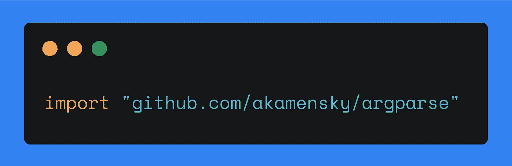

# 探索 Go 包:Argparse

> 原文：<https://levelup.gitconnected.com/exploring-go-packages-argparse-4b2e0a5349af>

## 在本教程中，我们将介绍 Argparse 是什么以及如何用这个包构建一个命令行界面。



我的一张照片

# 简要介绍 Argparse

Argparse 是一个用于 Go 的命令行解析器。软件包会自动生成帮助消息，无需预先定义。您可能听说过 Python 的 Argparse。它为 Go 的 Argparse 包带来了一些特性。

# 开始之前

将软件包安装到您的计算机上:

```
go get -u -v github.com/akamensky/argparse
```

*-u 标志指示* `*go get*` *使用网络来更新已命名的包及其依赖项。默认情况下，get 使用网络来检查丢失的包，但不使用它来查找现有包的更新。*

*-v 标志启用详细进度和调试输出。*

*参见本* [*资源*](https://golang.org/pkg/cmd/go/internal/get/) *了解更多关于* `*go get*` *命令的信息。*

将软件包导入您的*。按如下方式转到文件:

```
import “github.com/akamensky/argparse”
```

# 撰写帮助信息

帮助消息(或*用法消息*，或*文档*)是用户在

*   调用程序，
*   打一个类似`--h`或者`-h`的旗子，
*   键入无效的参数。

该消息包括程序的名称、用途和选项。如果您使用命令行，您已经熟悉帮助消息或用法消息。在 Linux 中，你通常可以输入`program --help`来获得程序可接受的参数列表。

在本教程中，我们为一个程序编写了一条帮助消息，它输出:

*   指定数量和范围的随机数列表，或
*   特定数量和语言的随机字母列表。

这是我们的使用信息:

让我们分析前面消息中的命令 numbers:

`randx numbers --count <count> [--range <range>...]`

*   `randx` —程序的名称，
*   `numbers` —一个命令，
*   `--count` —命令的一个选项，
*   `<count>` —选项的一个值—计数，
*   `[--range <range>…]`**——需要一个或多个值的可选参数。**
*   **`[--verbose]` —可选标志。**

**我们有两个命令，`numbers` 和`letters` ( *布尔*)，分别启用数字或字母模式。如果其中一个是*真*，另一个是*假*。**

**`numbers`和`letters`命令都需要`— count` *(int)* 选项。该程序输出一个指定计数的数字或字母列表。**

**`$ randx numbers --count 1`**

**`$ randx letters --count 1`**

**声明可选参数`--range` *(【字符串】)*我们用方括号。方括号中的三个点表示您可以向命令提示符传递几个参数。举个例子，**

**`- — range 1,10 --range 1,11`或
或`--range 1-10 --range 1-11`或
或`--range 1:10 --range 1:11`**

**此选项设置随机数的范围。如果有两个参数，程序将输出两个具有指定范围的列表。**

**可选参数`--lang` 、*(字符串)、*也在方括号*中。*选项接受一种语言。因此，程序输出指定语言的字母。**

**当未设置必需选项和/或参数无效时，程序必须返回帮助消息。`--range`和`--lang`选项都可以省略。**

**同样，我们有三个选项(或者只有*标志*)在用法消息中没有操作数:**

*   **`-h / --help` —输出使用信息，**
*   **`--verbose`*——*输出一个程序做什么的细节；该标志用于通知用户程序实际做了什么，包括执行所需操作时的错误。这有助于解决问题。**
*   **`--version` —输出您使用的程序版本。**

# **编写代码**

**我们将只使用包的方法对前面的用法消息进行编码。Argparse 根据调用的方法和给定的信息自动生成您的文档。**

**不需要在代码中定义帮助消息。但我建议把它放在眼前。我建议在 a *开头创建一个变量`usage`。go 文件，并将帮助消息存储在那里，以消除编码过程中的混乱和错误。**

**用`main()`中的方法`argparse.NewParser()`创建一个解析器。该方法中有两个参数:程序的名称及其描述。它们都将显示在使用信息中。**

```
parser := argparse.NewParser("randx", "Returns random numbers or letters")
```

**用一个`parser.NewCommand()`方法声明命令`letters`和`numbers`。该方法接受命令和描述的名称。此信息也将显示在帮助消息中。**

```
commandNumbers := parser.NewCommand("numbers", "Returns random numbers")commandLetters := parser.NewCommand("letters", "Returns random letters")
```

**对于所有命令，`--verbose`标志( *bool* )必须可用。因此，我们需要让`letters`和`numbers`可以访问它。为此，用`parser.Flag()`方法创建一个
`--verbose` 标志。**

```
verbose := parser.Flag(
    "", "verbose", &argparse.Options{
        Help: "Verbose mode",
    },
)
```

**`--version`标志( *bool* )的声明方式与`--verbose`相同:**

```
version := parser.Flag(
    "v", "version", &argparse.Options{
        Help: "Current version",
    },
)
```

**然后，我们创建必需选项和非必需选项。所有这些都以一种通用模式声明:**

```
option := command.Type_of_option(
  “short_name”, ”long_name”, &argparse.Options{
      Required: true/false,
      Help: “description_of_an_option”,
  },
}
```

**为`numbers`命令声明`--count`选项:**

```
countNumbers := commandNumbers.Int(
    "c", "count", &argparse.Options{
        Required: true,
        Help: "Count of random numbers",
    },
)
```

**为`numbers`命令声明`--range`选项:**

```
rangeNumbers := commandNumbers.List(
    "r", "range", &argparse.Options{
        Help: "Gives numbers of specific range",
    },
)
```

**为`letters`命令声明`--count`选项:**

```
countLetters := commandLetters.Int(
    "c", "count", &argparse.Options{
        Required: true,
        Help: "Count of random letters",
    },
)
```

**将`--lang` 选项声明为`letters`命令:**

```
langLetters := commandLetters.String(
    "l", "lang", &argparse.Options{
        Help: "Specifies a language",
    },
)
```

**解析所有给定的参数:**

```
err := parser.Parse(os.Args)
if err != nil {
    log.Fatalln(parser.Usage(err))
    return
}
```

**要打印不同命令的值，使用`switch`和`fmt.Println()`:**

```
switch {
case commandNumbers.Happened():
    fmt.Println("numbers:", commandNumbers.Happened())
    fmt.Println("--count:", *countNumbers)
    fmt.Println("--range:", *rangeNumbers)
    fmt.Println("--verbose:", *verbose)case commandLetters.Happened():
    fmt.Println("letters:", commandLetters.Happened())
    fmt.Println("--count:", *countLetters)
    fmt.Println("--lang:", *langLetters)
    fmt.Println("--verbose:", *verbose)
...
```

**我们已经声明了标志`--version.`,但是，要在该标志为真时显示一个版本，请使用以下代码:**

```
...
case *version:
    fmt.Println("version_is_here")
}
```

# **用法**

**在本节中，您可以找到如何在命令行中使用 Argparse 的几种情况。**

## **字母模式**

```
$ go run main.go letters --count 9 
$ go run main.go letters -c 9
letters: true
--count: 9
--lang:
--verbose: false$ go run main.go letters --count 9 --lang en 
$ go run main.go letters -c 9 -l en
letters: true
--count: 9
--lang: en
--verbose: false
```

## **数字模式**

```
$ go run main.go numbers --count 9 
$ go run main.go numbers -c 9 
numbers: true
--count: 9
--range: []
--verbose: false$ go run main.go numbers --count 10 --range 9,10 
$ go run main.go numbers -c 10 -r 9,10
numbers: true
--count: 10
--range: [9,10]
--verbose: false$ go run main.go numbers --count 10 --range 9,10 --range 0,15
numbers: true
--count: 10
--range: [9,10 0,15]
--verbose: false
```

## **冗长**

```
$ go run main.go numbers --count 18 --range 9,19 --verbose 
$ go run main.go numbers -c 18 -r 9,19 --verbose
numbers: true
--count: 18
--range: [9,19]
--verbose: true
```

# **关于作者**

**Jane 是一名围棋程序员和软件工程方面的技术作家。她已经用英语和俄语写了 5 年的技术资料。她从新西伯利亚国立技术大学获得了信息安全专业学位，专攻自动化系统的信息安全。你可以在 [*推特*](https://twitter.com/enthusiastic_io) *上关注她，在*[*publications . excellent . io*](https://publications.enthusiastic.io/)*看她其他写的作品。***