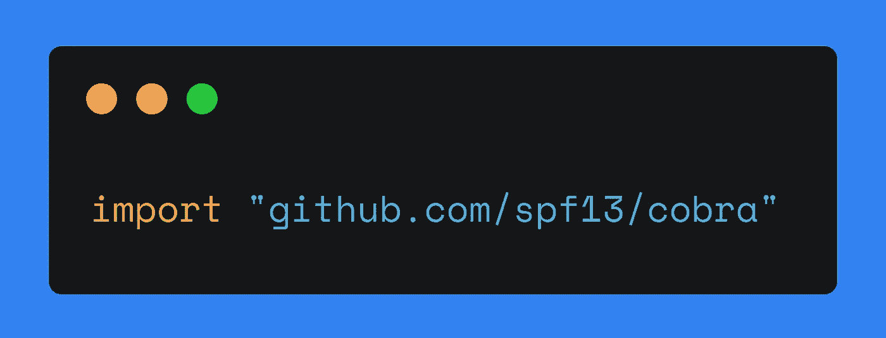

# 探索 Go 包:Cobra

> 原文：<https://levelup.gitconnected.com/exploring-go-packages-cobra-fce6c4e331d6>

## 在本教程中，我们将讨论如何使用 Cobra 包编写帮助消息。



我的一张照片

# 简要介绍 Cobra

[Cobra](https://github.com/spf13/cobra) 是 Golang 强大的命令行包。什么项目使用 Cobra 的完整列表在这里。

# 开始之前

在您的机器上安装 Cobra:

```
go get -u -v github.com/spf13/cobra
```

然而，你不需要创建我们的应用程序的文件。有一个[生成器](https://github.com/spf13/cobra/blob/master/cobra/README.md)，它有助于非常容易地创建一个工作目录。

要安装生成器，请使用以下命令:

```
go get -u -v github.com/spf13/cobra/cobra
```

在我们开始编码之前，让我们回顾一下我们将要用 Cobra 包创建的帮助消息。

# 撰写帮助信息

帮助消息(或*用法消息*，或*文档*)是用户在

*   调用程序，
*   键入类似于`--h`或`-h`的标志，
*   键入无效的参数。

该消息包括程序的名称、用途和选项。如果您使用命令行，您已经熟悉帮助消息或用法消息。在 Linux 中，你通常可以输入`program --help`来获得程序可接受的参数列表。

在本教程中，我们为一个程序编写了一条帮助消息，它输出:

*   指定数量和范围的随机数列表，或
*   特定数量和语言的随机字母列表。

这是我们的使用信息:

让我们分析前面消息中的命令 numbers:

`randx numbers --count <count> [--range <range>...]`

*   `randx` —一个程序的名字，
*   `numbers` —一个命令，
*   `--count` —该命令的一个选项，
*   `<count>` —选项的一个值—计数，
*   `[--range <range>…]` —可选参数，需要一个或多个值。
*   `[--verbose]` —可选标志。

我们有两个命令，`numbers` 和`letters` ( *bool* )，分别启用数字或字母模式。如果其中一个是*真*，另一个是*假*。

`numbers`和`letters`命令都需要`— count` *(int)* 选项。该程序输出一个指定计数的数字或字母列表。

`$ randx numbers --count 1`

`$ randx letters --count 1`

声明可选参数`--range` *(【字符串】)*我们用方括号。方括号中的三个点表示您可以向命令提示符传递几个参数。举个例子，

`--range 1,10 --range 1,11`或
`--range 1-10 --range 1-11`或
或`--range 1:10 --range 1:11`

此选项设置随机数的范围。如果有两个参数，程序将输出两个具有指定范围的列表。

可选参数，`--lang` *(字符串)，*也在方括号*中。*选项接受一种语言。因此，程序输出指定语言的字母。

当未设置必需选项和/或参数无效时，程序必须返回帮助消息。`--range`和`--lang`选项都可以省略。

同样，我们有三个选项(或者只有*标志*)在用法消息中没有操作数:

*   `-h / --help` —输出使用信息，
*   `--verbose` *—* 输出一个程序做什么的细节；该标志用于通知用户程序实际做了什么，包括执行所需操作时的错误。这有助于解决问题。
*   `--version` —输出您使用的程序版本。

# 生成项目结构

1.  创建并转到一个目录:

```
mkdir -p ~/go/src/github.com/your_username/app && 
cd ~/go/src/github.com/your_username/app
```

2.用`cobra init`生成项目结构:

```
cobra init --pkg-name ~/go/src/github.com/your_username/app
```

之后，我们有以下项目结构:

```
— — cmd
— — — root.go
— — LICENSE
— — main.go
```

*root.go* 文件包含`rootCmd`命令，该命令初始化所有命令和标志(或选项)。

# 创建命令

要添加新命令，只需在项目目录中使用`cobra add commandName`。对于我们的帮助消息，我们需要创建两个命令`numbers`和`letters`:

```
$ cobra add numbers
$ cobra add letters
```

之后，cobra 包在 *cmd* 目录下生成两个文件，分别是 *numbers.go* 和 *letters.go* 。现在我们有了以下项目结构:

```
 — — cmd
 — — — root.go
 — — — numbers.go
 — — — letters.go
 — — LICENSE
 — — main.go
```

# main.go 是什么样子的

在 *main.go* 文件中，我们用`cmd.Execute()`执行命令。完整的代码如下所示:

```
package mainimport “github.com/your_user_name/app/cmd”func main() {
    cmd.Execute()
}
```

这里不需要添加额外的代码。让我们在 *numbers.go* 和 *letters.go* 文件中创建子命令和选项。

# 数字命令

Cobra 生成了下面的一些代码。我们声明了`countFlagNumbers`和`rangeFlagNumbers`变量来分别存储来自
`--count`和`--range`标志的值。此外，我们在`init()`函数中初始化了所需的标志(`--count`和`--range`)。

```
// beginning of numbers.gopackage cmdimport (
    "fmt"
    "github.com/spf13/cobra" 
)var (
    countFlagNumbers int
    rangeFlagNumbers []string
)var numbersCmd = &cobra.Command{
    Use:   "numbers",
    Short: "Returns random numbers",
    Run: func(cmd *cobra.Command, args []string) {
        fmt.Println("numbers mode")
        fmt.Println("--count:", countFlagNumbers)
        fmt.Println("--range:", rangeFlagNumbers)
        fmt.Println("--verbose:", verbose)
    },
}// here is init()
```

我们调用一个`rootCmd.AddCommand()`方法来初始化`numbers`命令。

```
//beginning of init()func init() {
    rootCmd.AddCommand(numbersCmd)...
```

每个标志的声明都有以下模式:

```
*commandName.Flags().TypeOfValuesP(
    where to store, long flag name,
    short flag name, default value,
    explanation,
)*
```

宣布`--count`标志:

```
... numbersCmd.Flags().IntVarP(
        &countFlag, "count", "c", 0,
        "A count of random numbers",
    )... 
```

并使此标志成为必需的:

```
...     numbersCmd.MarkFlagRequired("count")...
```

当我们设置一个标志为 required 时，意味着用户不能在没有设置这个标志的情况下执行程序。会有一个错误。

声明`--range`标志:

```
...
    numbersCmd.Flags().StringSliceVarP(
        &rangeFlag, "range", "r", []string{"1:100"}, 
        "Range of numbers. Optional",
    )
}// end of init()
// end of numbers.go
```

# 字母命令

与在 *numbers.go* 中相同，生成了下面的一些代码。这里我们声明了`countFlagLetters`和`langFlagLetters`变量来分别存储从`--count`和`--lang`标志接收的值。

```
// beginning of letters.gopackage cmdimport (
    “fmt”
    “github.com/spf13/cobra”
)var (
    countFlagLetters int
    langFlagLetters  string
)
```

`lettersCmd`命令的结构与`numbersCmd`相同。所有标志的初始化方式与 *numbers.go* 文件中的相同。

```
var lettersCmd = &cobra.Command{
    Use:   "letters",
    Short: "Returns random letters",
    Run: func(cmd *cobra.Command, args []string) {
        fmt.Println("letters mode")
        fmt.Println("--count:", countFlagLetters)
        fmt.Println("--lang:", langFlagLetters)
        fmt.Println("--verbose:", verbose)
    },
}func init() {
    rootCmd.AddCommand(lettersCmd) lettersCmd.Flags().IntVarP(
        &Count, "count", "c", 0,
        "A count of random letters",
    ) lettersCmd.MarkFlagRequired("count")

    lettersCmd.Flags().StringVarP(
        &Lang, "lang", "l", "en", 
        "A language. Optional",
     )
}// end of letters.go
```

# 添加版本和详细标志

在 *root.go* 中，我们更新了我们程序的用法，添加了`--version`和
`--verbose`标志。

```
package cmdimport (
    "fmt"
    "os" "github.com/spf13/cobra"
)
```

声明一个详细变量。它有一个布尔类型。

```
var (
    verbose bool
)
```

为了显示我们程序的版本，添加一个`Version`参数并在引号中指定一个当前版本。

```
var rootCmd = &cobra.Command{
    Use:     "randx",
    Version: "1.0.1",
    Short:   "Returns random numbers or letters.",
}func Execute() {
    if err := rootCmd.Execute(); 
    err != nil {
        fmt.Println(err)
        os.Exit(1)
    }
}
```

`--verbose`标志是持久的和全局的。这意味着您可以告诉程序显示任何命令和标志集的程序执行细节。

```
func init() {
    rootCmd.PersistentFlags().BoolVarP(
        &verbose, "verbose", "v", false,
        "Verbose output",
    )
}
```

# 用法

在本节中，您可以找到在命令行中使用 Cobra 的几种情况。

# 字母模式

```
$ go run main.go letters --count 9 
$ go run main.go letters -c 9
letters mode
--count: 9
--lang: en // this is a default value
--verbose: false$ go run main.go letters --count 9 --lang en 
$ go run main.go letters -c 9 -l en
letters mode
--count: 9
--lang: en
--verbose: false
```

# 数字模式

```
$ go run main.go numbers --count 9 
$ go run main.go numbers -c 9 
numbers mode
--count: 9
--range: [1:100] // this is a default value
--verbose: false$ go run main.go numbers --count 10 --range 9,10 
$ go run main.go numbers -c 10 -r 9,10
numbers mode
--count: 10
--range: [9 10]
--verbose: false$ go run main.go numbers --count 10 --range 9,10 --range 0,15
numbers: true
--count: 10
--range: [9 10 0 15]
--verbose: false
```

关于分隔符的一些注释。如果你在
`--range`标志中使用逗号作为分隔符，你得到的只是一列数字。如前所述，您可以使用冒号`:`来分隔这些数字。例如:

```
$ go run main.go numbers --count 10 --range 9:10 --range 10:11
numbers mode
--count: 10
--range: [9:10 10:11]
--verbose: false
```

# 冗长

```
$ go run main.go numbers --count 18 --range 9,19 --verbose 
$ go run main.go numbers -c 18 -r 9,19 --verbose
numbers mode
--count: 18
--range: [9 19]
--verbose: true
```

# 关于作者

Jane 是一名围棋程序员和软件工程方面的技术作家。她已经用英语和俄语写了 5 年的技术资料。她从新西伯利亚国立技术大学获得了信息安全专业学位，专攻自动化系统的信息安全。你可以在 [*推特*](https://twitter.com/enthusiastic_io) *上关注她，在*[*publications . excellent . io*](https://publications.enthusiastic.io/)*上看她的其他文字作品。*