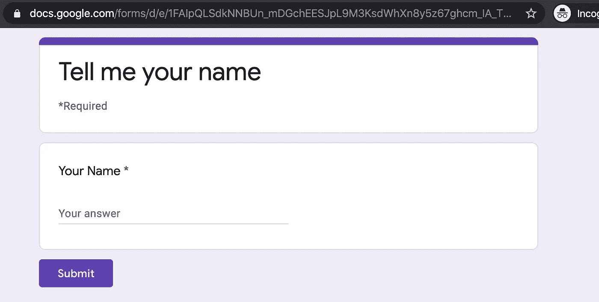

# 使用 Node.js 探索 Google Sheets API 进行测试

> 原文：<https://levelup.gitconnected.com/exploring-google-sheets-api-with-node-js-going-on-a-test-drive-1a7a339005ed>

谷歌 shhhhhheeeeets！—原图，来源: [pixabay](https://pixabay.com/illustrations/accounting-statistics-excel-finance-1928237/) ，作者: [Tumisu](https://pixabay.com/users/Tumisu-148124/)

> 使用 Google 的 Google Sheets API，以及…你能使用谷歌工作表作为数据存储吗😱？！

Google Sheets 与 Google Docs 和 Google Slides 一起构成了 GSuite 的三大基本工具，改变了在线生产力工具的面貌。这些工具不仅可以作为流行的 Microsoft Office 的免费替代品，而且在展示它们如何成为高度协作的工具，能够由多方同时更新时，它们也成为了人们关注的焦点。

之前，我探索过如何将[谷歌脚本与谷歌文档和 Gmail](https://medium.com/@weiyuan.liu/collaborative-email-templates-with-google-drive-and-gmail-c6cceb1b1ea7) 结合使用，以实现从谷歌文档发送电子邮件的模板化和自动化。探索表明，通过将您自己的脚本定制为附加组件来改进应用程序，您可以获得更高的生产率。

今天，我想讨论一下使用 Google Sheets 及其相关的 API。一个链接到 Google Sheets 的工具——Google Forms——允许创建用户调查表。每种形式可以包含大量的问题。当用户回答这些问题时，他们的答案可以被写入到一个 Google 工作表中，其中列代表每个问题，行代表每组用户提交的答案。

一个简单的谷歌表单，回答一个问题

我在这里的动机是探索是否有可能捕获其中一些包含姓名的答案，并将姓名列表同步到一个幸运抽奖应用程序。这让我想到，是否有可能用谷歌的 Sheets API 来实现这一点。

当我在探索 API 时，我开始考虑使用 Google Sheets 作为数据存储。如果您可以通过 API 端点读取和写入条目到 Google Sheet，那么是什么阻止了我们围绕这些端点创建“选择”和“插入”逻辑，使其像数据库一样工作呢？

> 数据库是由数据库管理系统(DBMS)管理的一系列字节
> 
> —维基百科

然而，这可能超出了探索 Google Sheets API 的目标。让我们首先简单地看一下如何使用 Google Sheets API 从表单中检索信息。

下面是我们在探索使用 Google Sheets API 来阅读信息时，想要依次解决的一系列问题:

1.  授予访问公共和私有表的权限。需要这种授权的实体也是我们的脚本或服务器所代表的实体。
2.  从工作表中读取一些数据。这是专门针对从工作表中获取一系列数据的。如何做到这一点？

注意，对于上述内容，我们将使用 Node.js(在 JavaScript 中)来创建一个 HTTP 服务器，用于从 Google Sheet 中读取信息。

# 1.授予访问公共和私有表的权限。

让我们迈出第一步，也是公认的更容易的一步。

我们可以从[在 Google Cloud 控制台上创建一个项目](https://console.cloud.google.com/projectcreate)开始，然后启用 Google Sheets API(从 GCP 控制台，选择`API & Services > Dashboard > Library`，搜索“Google Sheets API”)。然后点击“启用”，如下图所示)。

为了授权应用程序使用启用的 API，我们还应该创建一个服务帐户。我们可以再次使用谷歌云控制台来做到这一点。使用之前创建的同一个项目，从侧边栏中选择`IAM & admin > Service accounts`并点击`+ Create Service Account`。

填写如上所示的选项。完成后，选择“创建”。当提示进行第二步角色分配时，您可以选择跳过这一步(角色包括其他 GCP 工具，此处不需要)。

第三步，如上所述选择`+ Create Key`。选择 JSON 选项，并将`credentials.json`保存在你的机器中。

简要解释为什么需要这个服务帐户——这个服务帐户属于我们新创建的项目。因此，通过关系，我们可以使用这个服务帐户来利用以前启用的 Google Sheets API。

然而，从上述工作流中检索到的凭证只包括启用的 API 的使用，不允许访问私有的 Google 工作表。为了访问私人谷歌表，我们需要满足一个以上的标准。

从 GCP 控制台的[服务账户列表](https://console.cloud.google.com/iam-admin/serviceaccounts)中，你应该看到每个服务账户都有一个自己的“电子邮件”。如果你以前和其他用户合作过一个私人的谷歌表单，你会知道你可以通过他们的谷歌账户的电子邮件邀请这些用户。事实证明，你可以用一个服务帐户的电子邮件地址做同样的事情，让你的应用程序直接读写你的私人表单。

# 2.从 Google Sheet 读取数据。

太好了，我们已经成功授权我们的服务帐户访问私有表。让我们继续下一步，创建一个应用程序，它将使用这个服务帐户来读取和显示私有表中的数据。

这个目标相对简单。有一些指南指出要使用哪些 API 端点，如下所示:

谷歌工作表样本— [链接](https://developers.google.com/sheets/api/samples/reading)

然而，如果我们使用以下任何一种语言，我们可以转向使用开源库来加速我们的开发过程。

因为我的意图是使用 Node.js 服务器构建这个应用程序，所以我决定查看可用的开源库，并找到了这个名为 [google-api-nodejs-client](https://github.com/googleapis/google-api-nodejs-client) 的库。

在对这个库进行了一些实验之后，我设法创建了一个简单的端点来从一个私有的 Google 工作表中获取数据。这是通过指示 Google Sheets id、单个工作表名称(我们可以把它想象成一个数据库表)和要检索的信息范围来完成的。

哦，是的，在运行上面的程序之前，我们需要使用我们之前创建的服务帐户来授权我们的节点应用程序。为了将凭证加载到我们的节点应用程序中，我们必须添加一个名为`GOOGLE_APPLICATION_CREDENTIALS`的环境变量，该变量应该引用前面步骤中保存的`credentials.json`文件的路径。

正如从 [Google Authentication](https://cloud.google.com/docs/authentication/getting-started) 文档中看到的——使用环境变量向服务器应用程序添加凭证。

在本地运行服务器，我们可以从 Google Sheets 中检索信息:

既然我们已经完成了简单的信息读取，让我们来尝试更高级的问题——写入或删除信息。可以用 Google Sheets 作为数据库吗？

# 数据存储时间！

为了演示 Google Sheets 可以用作数据存储，我想构建一个简单的应用程序来演示如何实现这一点。该应用程序计划能够管理多个用户实体，通过插入，选择和删除谷歌表中的用户实体数据。

既然我们已经解决了读取数据的问题，让我们从实现它开始。

基于以前的知识，我决定将工作表视为一个数据库表，并指出要使用的列。A 列是用户的电子邮件，而 B 列是用户的姓名。

有了我们的假设，实现读是小菜一碟。

写在纸上怎么样？

对于编写，我们必须指出数据到列的映射，以确保新用户信息被正确保存。我们再次使用之前的配置，将列“A”和“B”分别作为电子邮件和名称。这就是上面的`values`数组，索引直接映射到工作表中的列。

创建新用户的逻辑完成后，让我们处理最后一个预期的特性，用于删除现有用户。

对于删除，我们必须指出要删除的行的范围。因为 delete 方法只表示要删除的一行，所以我们可以只为该行指定目标范围的起始和结束索引。

将所有先前的内容拼凑在一起，并运行它们，我们设法得到以下内容:

耶，它可以在某种程度上为数据库工作！如果您对演示上述内容的代码感兴趣，请看这里的。

# 最后的想法

在实现上面的简单用户应用程序时，我们设法使用 Google Sheets 作为数据库。然而，它也不是没有陷阱。其中一个问题是谷歌表单“只是一张表单”。我们必须在代码中设置每个表的所有引用，例如“表名”(表 id)和“列名和类型”(来自 Google Sheets，它只是 A、B、C …)。有其他方法可以解决这个问题，比如使用像 [google-spreadsheet](https://www.npmjs.com/package/google-spreadsheet) 这样的库来创建列名引用的标题。

作为实验的一部分，使用 Google Sheets 作为数据库很有趣。我期待将谷歌表单数据库的这种读取行为整合到我的幸运抽奖应用程序中。

再见