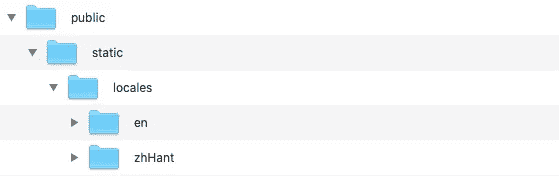
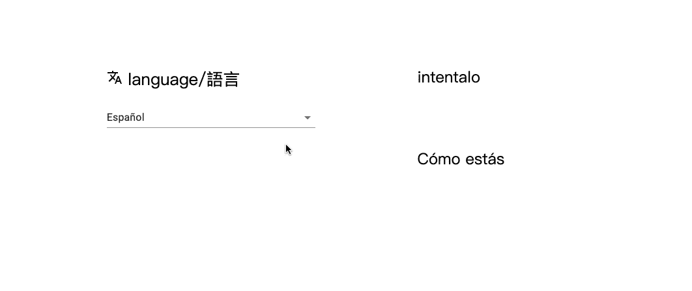
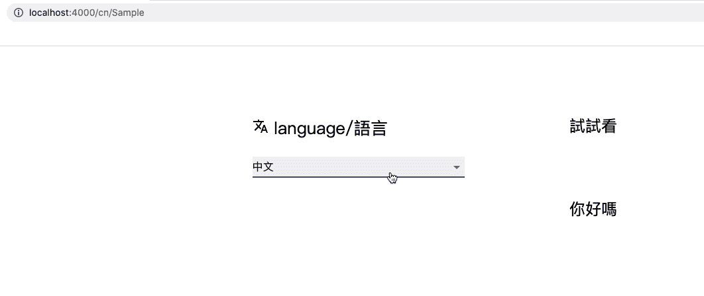

# 探索 next . js:next-i18 next 的多语言支持

> 原文：<https://levelup.gitconnected.com/exploring-next-js-multi-lingual-support-with-next-i18next-f4275d63c0e9>


凯尔·格伦在 [Unsplash](https://unsplash.com?utm_source=medium&utm_medium=referral) 上的照片

如今多语言支持变得越来越重要。它已经成为现代网站的标准。实现的方法有很多。但是在项目的早期做这件事是非常重要的。对现有网站应用多语言支持可能会很痛苦，因为你必须拔掉项目中的所有弦。有很多工作是你绝对不想做的。

幸运的是，react community 有很多方便的库。如果您在 react 项目中使用 Next.js，next-i18next 是一个不错的选择。我将提供一个使用 next-i18next 支持多语言功能的简单示例。我们开始吧！

# 建立项目

首先设置您的 Next.js 项目。并安装 next-i18next。

在 npm 上检查它:

[](https://www.npmjs.com/package/next-i18next) [## 下一个-i18 下一个

### 翻译 NextJs 应用程序的最简单方法。如果您在生产中使用 next-i18next，请考虑赞助…

www.npmjs.com](https://www.npmjs.com/package/next-i18next) 

```
npm install — save next-i18next
```

或者

```
yarn add next-i18next
```

然后在下创建一个静态文件夹。/public 及其下的 locales 文件夹。在 locales 文件夹中，我们必须为项目中将要支持的每种语言创建文件夹，并用语言代码命名它们。即英语、汉语、法语和西班牙语。我们所有的内容都应该按照语言的顺序放在这些文件夹下。结构应该如下所示:



项目结构

在根目录下创建一个文件:i18n.js，这是为了导出我们将在 next-i18next 中使用的所有方法。LocalePath 是必需的，我们必须向它传递一个绝对路径。为了保持简单，我只是使用这个项目的结构。

我们还应该在这里设置 defaultLanguage、otherLanguages 和 localeSubpaths。我们稍后将讨论 localeSubpaths。我们的默认语言是英语，所以只需将其语言代码传递给 default language，即' en '。我们还支持三种语言，即中文、法语和西班牙语。我们将这三种语言的数组传递给其他语言。总是把一个数组传递给其他语言，即使你只有一种其他语言。

i18n.js

打开 our _app.js，如果还没有，就在 pages 文件夹下创建。导入 appWithTranslation 并用它包装组件。显然，appWithTranslation 是一个高阶组件(HOC)。如果使用类组件，记得扩展 App。如果你像我一样使用功能组件，只需如下所示:

_app.js

现在它应该可以测试了，让我们转到我们在下面创建的 locales 文件夹。/public，然后将内容放入每种语言文件夹下的 json 文件中。

让我们构建一个页面，在。/pages 和一个 Sample.js。/组件。为了将具有翻译功能的函数传递给我们的组件，我们必须用 withTranslation HOC 包装组件，并将名称空间传递给它。我们还需要一个通过 getInitialProps 命名空间所需的数组。记住这些步骤是所有页面级组件所必需的。

index.js(页面级组件)

在我们的组件中，我们还用 withTranslation HOC 包装组件，并将名称空间传递给它。然后我们得到 t 函数作为道具，它可以帮助我们从本地获取内容。一个小提示:如果你有更多的属性要传入，就使用析构赋值语法，就像这样:

```
const Sample = ({t,...props}) => {}
```

我们改变语言的方法是使用 i18n 中的 change language 函数。我在 handleChange 函数中调用它。检查下面的代码:

样本组件

我创建了一个下拉菜单使用选择组件从材料-用户界面。理想情况下，每次我从下拉菜单中选择一种语言时，页面上的语言应该会变成我刚才选择的语言。让我们看看会发生什么！



# 区域路径

起作用了！但是坚持住。如果你想要根据不同语言的动态 url，还有一件事要做。

打开 i18n.js，将一个对象传递给 NextI18Next 中的 localeSubpaths。名称空间作为键，子路径作为值(没有斜杠)。例如:

```
localeSubpaths:{    
  zhHant:'cn',    
  fr: 'fr',    
  es: 'es'  
}
```

然后打开你的 next.config.js，如果你还没有的话，就在根目录下创建它。导入 localSubpaths 并通过 nextI18NextRewriters 传递它。

next.config.js

让我们看看会发生什么！



检查网址

搞定了！现在你知道如何用这个棒极了的库支持多语言了。去让你的网站更酷吧，你还在等什么！