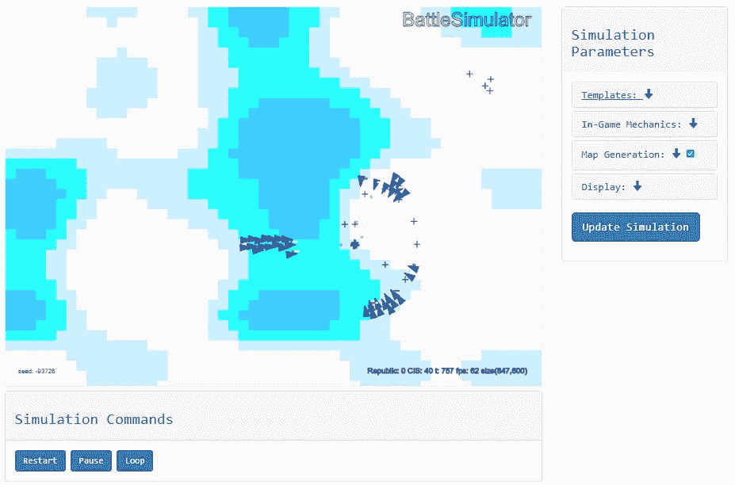
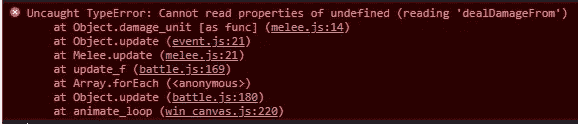
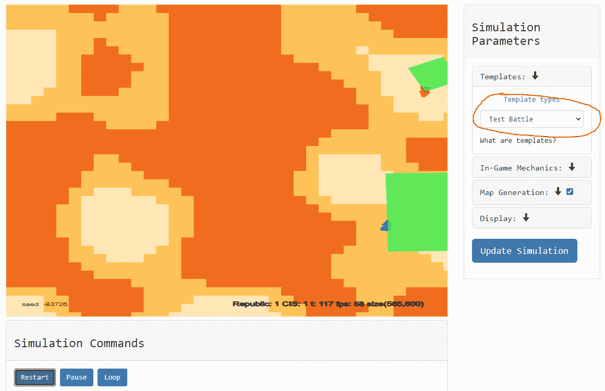

# 探索网络战斗模拟器的代码

> 原文：<https://levelup.gitconnected.com/exploring-the-code-for-the-web-battle-simulator-a9ff7ff1e64c>

## 使用 JavaScript 或 Python 来模拟战斗


彼得·维尔克在 [Unsplash](https://unsplash.com?utm_source=medium&utm_medium=referral) 上拍摄的照片

# 对战斗的渴望

整个周末我都在探索一些模拟战斗的方法，作为平衡我正在创作的游戏中的单位的一种手段。我碰到了战斗模拟器(Python)和网络战斗模拟器(JavaScript)，两者都是由[格雷戈里·巴夏礼](https://github.com/gregparkes/WebBattleSim)创建的。他的灵感来自 Steam 上的[完全精确的战斗模拟器。随着对 Python 越来越熟悉，我开始复习和摆弄代码。Greg 有一些很棒的 Jupyter 笔记本，它们很好地完成了遍历 Python 代码的工作。](https://steamcommunity.com/app/508440)

**如果使用 PYTHON** : [如果想使用 PYTHON 代码，克隆 git repo](https://github.com/gregparkes/BattleSimulator) 。使用 pip 安装包会给你一个有错误的过时的代码库。这两个模拟器都受 GNU 许可证的保护。

**在这篇文章中，我将带您浏览 JavaScript 中的以下内容**:

*   修复代码中的一个错误
*   在中创建新单位
*   创建新的战斗

# 查找 Bug

在回顾了 Python 代码之后，我决定挑战自己，尝试理解 JavaScript 版本。我读 JS 是我日常工作的一部分，所以我想我会没事的。我克隆了 repo 并打开 HTML 文件以在本地显示模拟器:



网络战斗模拟器(图片由作者提供)

在模拟参数下，我将模板设置为场景压倒性赔率，点击*更新模拟*，然后*重启*。单位出现在屏幕上，并开始向对方移动。然后，突然模拟冻结了。

我检查了浏览器控制台，发现了一个错误:



浏览器控制台错误(图片由作者提供)

近战战斗被窃听！这对我来说有点毁灭性，因为我的一个用例需要近战伤害。我必须修好它！我开始检查所有的代码，看是否能发现问题。在花了我不愿意承认的时间(~4h)盯着代码之后，我终于找到了解决方案。

更新在 ***Sim/Attack*** 文件夹中找到的**混战. js** 文件中的以下行:

```
this.e = EventDelay(this.damage_unit(), 0.5, 1);
```

***this.damage_unit*** 后缺少初始代码 **()** ，导致伤害的目标不明确，导致错误。我也在 GitHub 回购上举报了。

# 探索单元和单元类

在解决了 bug 之后，是时候创建一个新的测试单元了。一个**单位**有属性，并且是一个可以移动、攻击和防御的物体。单位统计的灵感来自龙与地下城。[查看文档，深入了解每个 stat](https://gregparkes.github.io/WebBattleSim/content/unit.html) 。

展开 ***Sim/Units*** 查看可用单元类型对应的文件。格雷格一定是《星球大战》的粉丝，因为所有的单位都是由它衍生出来的。注意以一个 ***jedi.js*** 文件为例。

打开 ***unit.js*** ，查看构造函数的参数:

```
class Unit extends Combative {constructor(x, y, atk, dex, con, mvs, range, team, fire_rate, dflr, ai) {
...
```

注意有几个参数会影响单位的战斗能力和移动。 ***ai*** 参数影响机组的行为。人工智能选项如下:

*   有进取心的
*   打了就跑
*   站立

检查 [ai.js 文件](https://github.com/gregparkes/WebBattleSim/blob/master/sim/ai.js)以深入了解每个选项。我将对测试单元使用**主动**选项。

## 创建单位

创建一个单元相当简单。首先在 unit_template.js 中设计一个单元，然后为这个单元创建一个新文件。以下步骤描述了我如何创建一个测试单元:

打开***unit _ template . js***注意这个文件存储了每个单位的统计数据。

```
// constants for base unit values.
const UNIT = {
    CloneTrooper: {
        NAME: "Clone Trooper", DESC: "The standard infantry of the Grand Army of the Republic.",
        TEAM: "Republic",
        ATK: 2, DEX: 3, CON: 2, MVS: 1.2, RANGE: 115.,
        FIRERATE: 1.0, DEFLECT: 0, OBJ: CloneTrooper
    },
    B1Battledroid: {
        NAME: "B1 Battledroid",
        DESC: "These droids are awfully chatty.",
        TEAM: "CIS",
        ATK: 2, DEX: 2, CON: 1, MVS: 1., RANGE: 100.,
        FIRERATE: 1.1, DEFLECT: 0, OBJ: B1Battledroid
    },
    B2Battledroid: {
        NAME: "B2 Battledroid",
        DESC: "An upgrade to the B1's.",
        TEAM: "CIS",
        ATK: 4, DEX: 2, CON: 4, MVS: .9, RANGE: 120.,
        FIRERATE: 0.9, DEFLECT: 2, OBJ: B2Battledroid
    },
    CloneSharpshooter: {
        NAME: "Clone Sharpshooter",
        DESC: "Extra-precise and long-range clones.",
        TEAM: "Republic",
        ATK: 5, DEX: 1, CON: 0, MVS: .9, RANGE: 400.,
        FIRERATE: 3.0, DEFLECT: 0, OBJ: CloneSharpshooter
    },
    Jedi: {
        NAME: "Jedi Knight",
        DESC: "Guardians of peace and justice throughout the galaxy.",
        TEAM: "Republic",
        ATK: 7, DEX: 3, CON: 6, MVS: 1.4, RANGE: 18.,
        FIRERATE: 0.2, DEFLECT: 12, OBJ: Jedi
     },
}
```

在绝地之后为你的测试单位添加一个新的方块，然后按照你认为合适的方式填写数据。作为一个例子，我用粗体字添加了**测试单元**。

```
Jedi: {
        NAME: "Jedi Knight",
        DESC: "Guardians of peace and justice throughout the galaxy.",
        TEAM: "Republic",
        ATK: 7, DEX: 3, CON: 6, MVS: 1.4, RANGE: 18.,
        FIRERATE: 0.2, DEFLECT: 12, OBJ: Jedi
     },
 **TestUnit: {
        NAME: "Test Unit",
        DESC: "this unit is a test.",
        TEAM: "CIS",
        ATK: 10, DEX: 5, CON: 6, MVS: 1.4, RANGE: 18.,
        FIRERATE: 0.2, DEFLECT: 15, OBJ: TestUnit
     },**
}
```

保存并创建一个名为 ***testunit.js*** 的新文件。将 ***jedi.js*** 中的数据复制粘贴到***test unit . js****中。*

把这个职业的名字从绝地改为测试单位。请注意，该文件包含渲染光剑的代码，作为单元精灵的一部分。为了好玩，我们可以通过调整这行中的数字来调整光剑的大小:

```
ctx.fillRect(0, -3, 15, 2.5);
```

进行所需的调整后保存文件。恭喜你！你刚刚创造了一个新单位。现在是战斗的时候了。

# 创建新的战斗模板

很容易给模拟器添加新的战斗模板。我将保持这个例子相对简单。

打开文件***interactive/battle _ template . js***

```
const BATTLE_TEMPLATE = {
    // default templates
    **OPPOSITE_AGGRESSIVE**: function(canvas, level) {
        let g1 = unit_group.random_tile_spawn(CloneTrooper, 2, level, AI.aggressive),
            g2 = unit_group.random_tile_spawn(B1Battledroid, 4, level, AI.aggressive),
            // now concat to form units
            units = g1.concat(g2);
        return battle(canvas, units, level);
    },
    **SNIPERS_NEST**: function(canvas, level) {let w = canvas.width,
...
```

你会看到三个可用的战斗。注意这是你设置单位 AI 的地方。复制**对立 _ 攻击性**并粘贴在 BATTLE_TEMPLATE 内的末尾。更改参数以包含新的测试单元。

```
**TEST_BATTLE**: function(canvas, level) {
        let g1 = unit_group.random_tile_spawn(TestUnit, 1, level, 
AI.aggressive),
            g2 = unit_group.random_tile_spawn(Jedi, 1, level, AI.aggressive),
            // now concat to form units
            units = g1.concat(g2);
        return battle(canvas, units, level);
    },
```

注意，我一次只能产出一个单位。设置好参数后保存文件。

接下来打开 ***win_glob.js*** 。

将战斗添加到 **btemplate_map** 中，完成后保存。它应该是这样的:

```
const btemplate_map = {
    "Opposite Aggressive": BATTLE_TEMPLATE.OPPOSITE_AGGRESSIVE,
    "Snipers' Nest": BATTLE_TEMPLATE.SNIPERS_NEST,
    "Overwhelming Odds": BATTLE_TEMPLATE.OVERWHELMING_ODDS,
    "Test Battle": BATTLE_TEMPLATE.TEST_BATTLE,
};
```

接下来打开 ***win_unit.js*** 。

绝地之后添加新单位到函数 **drawLiveUnit** 中。

```
function drawLiveUnit(uname, cw, ch) {
    if (uname === "CloneTrooper") {
        return new CloneTrooper(cw / 2, ch / 2, null);
    } else if (uname === "B1Battledroid") {
        return new B1Battledroid(cw / 2, ch / 2, null);
    } else if (uname === "B2Battledroid") {
        return new B2Battledroid(cw / 2, ch / 2, null);
    } else if (uname === "CloneSharpshooter") {
        return new CloneSharpshooter(cw / 2, ch / 2, null);
    } else if (uname === "Jedi") {
        return new Jedi(cw / 2, ch / 2, null);
    } **else if (uname === "TestUnit") {
        return new TestUnit(cw / 2, ch / 2, null);**
    }
}
```

在我们可以看到我们光荣的新单位在模拟中战斗之前，保存并编辑最终文件。JavaScript 文件需要添加到 html 文件中。

打开***index.html***

为新单元文件添加脚本。

```
<script type="text/javascript" src="sim/units/testunit.js"></script>
```

保存并准备战斗！

运行 index.html 的 ***，这样仿真在浏览器中打开。选择测试战，观看测试单位用巨大的光剑与绝地战斗***



与测试单元战斗(图片由作者提供)

# 最后的想法

现在你已经增加了一个单位并与之战斗，你对网络战斗模拟器有什么看法？

虽然有一个小问题需要修复，但总的来说，我非常高兴我找到了网络战斗模拟器。我将继续探索代码的各个方面，以便更好地理解 tile 的生成。最终，我认为这将是一个完美的工具来帮助我平衡我正在创建的游戏的单位。Greg 做得很好，Python 版本与 JavaScript 版本共存的事实给了用户大量代码。

# 谢谢大家！

*   *如果你喜欢这个，* [*跟我上媒*](https://medium.com/@erickleppen) *了解更多*
*   [*通过订阅*](https://erickleppen.medium.com/membership) 获得对我的内容的完全访问和帮助支持
*   *我们来连线上*[*LinkedIn*](https://www.linkedin.com/in/erickleppen01/)
*   *用 Python 分析数据？查看我的* [*网站*](https://pythondashboards.com/)

[**—埃里克·克莱本**](http://pythondashboards.com/)

# [埃里克文章的终极指南](https://erickleppen.medium.com/the-ultimate-guide-to-erics-articles-d32df8241353)